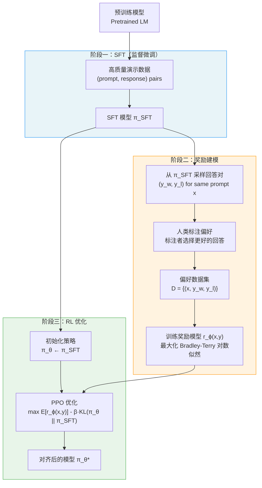
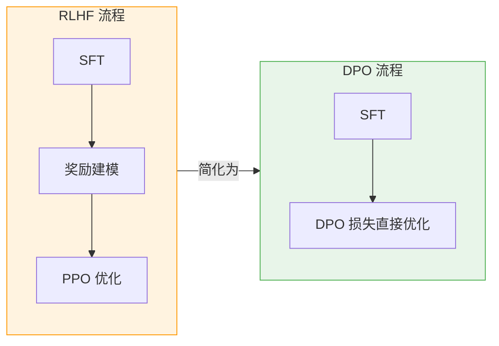
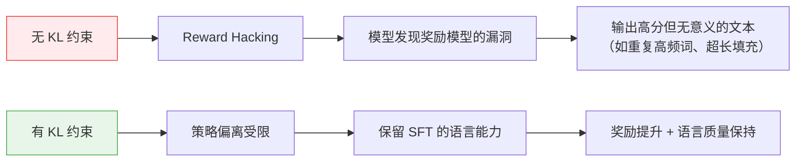
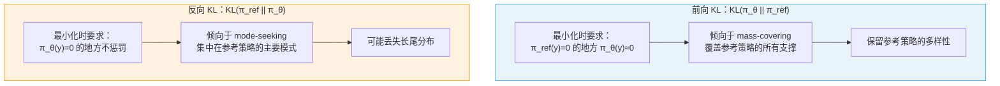
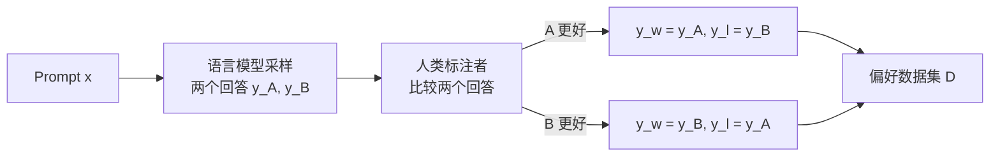
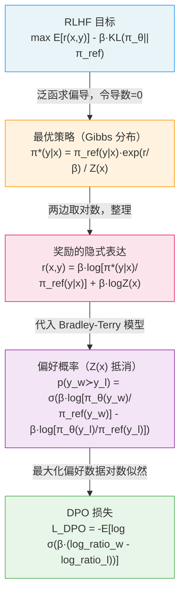
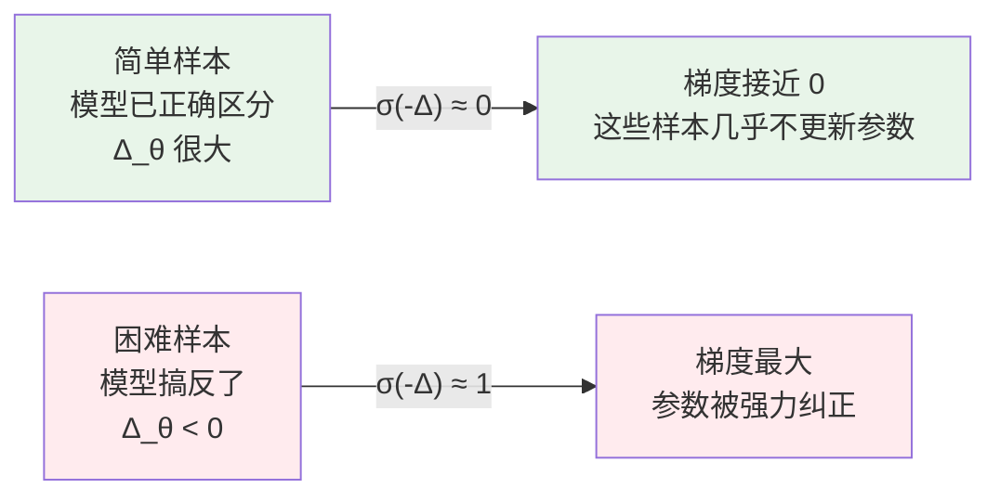
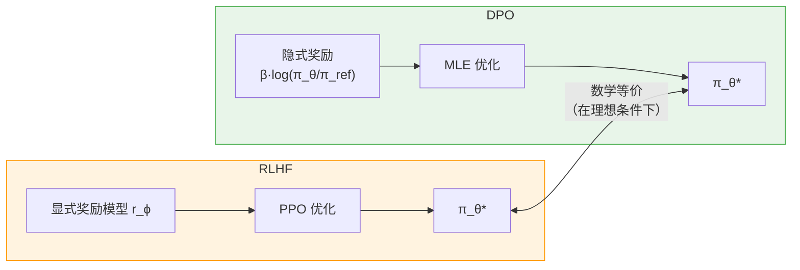
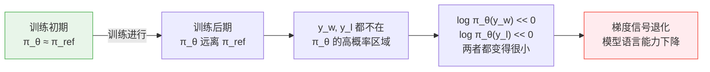
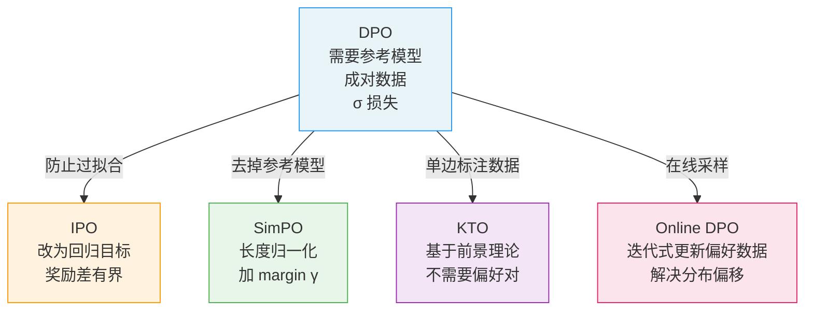

2023 年，Rafailov 等人提出的 **DPO（Direct Preference Optimization）** 在 LLM 对齐领域引发了广泛关注。它把原本需要训练奖励模型、再跑 PPO 的复杂流程，压缩成一个简单的分类损失——而且数学上等价于 RLHF 的最优解。

本文从 RLHF 的目标函数出发，完整推导 DPO，然后深入分析其梯度信号、隐式奖励、理论局限与后续改进。

---

## 一、背景：对齐问题

### 1.1 语言模型预训练的局限

语言模型预训练的目标是最大化语料库的对数似然：

$$\mathcal{L}_{\text{PT}}(\theta) = \mathbb{E}_{x \sim \mathcal{D}} \left[ \log p_\theta(x) \right]$$

这个目标只优化"拟合数据分布"，并不保证模型输出**有帮助、无害、诚实**。一个在互联网数据上训练的模型同样会"忠实地"生成有害内容——因为这些内容在训练数据中大量存在。

### 1.2 RLHF 的三阶段流程

**RLHF（Reinforcement Learning from Human Feedback）** 是目前主流的对齐方法：



**三个阶段的核心问题：**

- 阶段一：需要高质量演示数据，成本高
- 阶段二：奖励模型本身可能不准，且训练独立于主模型
- 阶段三：PPO 超参数多，训练不稳定，reward hacking 风险高

### 1.3 DPO 的简化

DPO 的核心发现是：**阶段二和阶段三可以合并**，直接从偏好数据端到端训练语言模型：



---

## 二、RLHF 的数学框架

### 2.1 RLHF 的优化目标

给定提示 $x$，语言模型生成回答 $y$。RLHF 求解以下带 KL 约束的优化问题：

$$\max_{\pi_\theta} \; \mathbb{E}_{x \sim \mathcal{D},\, y \sim \pi_\theta(\cdot \mid x)} \left[ r(x, y) \right] - \beta \, \mathbb{D}_{\text{KL}} \left[ \pi_\theta(\cdot \mid x) \;\|\; \pi_{\text{ref}}(\cdot \mid x) \right]$$

其中：

| 符号 | 含义 |
|------|------|
| $r(x, y)$ | 奖励函数（代表人类偏好） |
| $\pi_{\text{ref}}$ | 参考策略（通常是 SFT 模型） |
| $\beta > 0$ | KL 惩罚系数 |
| $\mathbb{D}_{\text{KL}}[\pi \| \pi_{\text{ref}}]$ | $\mathbb{E}_{y \sim \pi}\left[\log \frac{\pi(y \mid x)}{\pi_{\text{ref}}(y \mid x)}\right]$ |

**为什么需要 KL 约束？**

KL 散度惩罚将策略锚定在参考策略附近，防止两类问题：



展开 KL 项，目标函数等价于：

$$\max_{\pi_\theta} \; \mathbb{E}_{x \sim \mathcal{D},\, y \sim \pi_\theta} \left[ r(x, y) - \beta \log \frac{\pi_\theta(y \mid x)}{\pi_{\text{ref}}(y \mid x)} \right]$$

### 2.2 KL 散度的对称性与方向选择

这里用的是 $\text{KL}(\pi_\theta \| \pi_{\text{ref}})$（前向 KL / exclusive KL），而非 $\text{KL}(\pi_{\text{ref}} \| \pi_\theta)$（反向 KL）。

两种方向的行为差异显著：



RLHF 选择前向 KL，因为希望策略在参考策略有概率的地方都保持非零概率，避免模型丢失生成多样性。

---

## 三、最优策略的闭合解

**这是 DPO 推导最关键的一步**：RLHF 目标存在解析形式的最优解。

### 3.1 泛函优化

固定 $x$，对 $y$ 上的概率分布求最优。这是无限维泛函优化：

$$\max_{\pi} \; \sum_y \pi(y \mid x) \left[ r(x, y) - \beta \log \frac{\pi(y \mid x)}{\pi_{\text{ref}}(y \mid x)} \right]$$

约束：$\sum_y \pi(y \mid x) = 1$，$\pi(y \mid x) \geq 0$。

写成 Lagrangian：

$$\mathcal{L}[\pi] = \sum_y \pi(y) \left[ r(x,y) - \beta \log \frac{\pi(y)}{\pi_{\text{ref}}(y)} \right] - \lambda \left(\sum_y \pi(y) - 1\right)$$

对 $\pi(y)$ 求变分导数并令其为零：

$$\frac{\partial \mathcal{L}}{\partial \pi(y)} = r(x,y) - \beta \log \frac{\pi(y)}{\pi_{\text{ref}}(y)} - \beta - \lambda = 0$$

解出 $\pi(y)$：

$$\log \frac{\pi^*(y \mid x)}{\pi_{\text{ref}}(y \mid x)} = \frac{r(x, y)}{\beta} - \frac{\lambda + \beta}{\beta}$$

$$\pi^*(y \mid x) = \pi_{\text{ref}}(y \mid x) \cdot \exp\left(\frac{r(x, y)}{\beta}\right) \cdot C$$

其中 $C = e^{-(\lambda + \beta)/\beta}$ 是归一化常数。利用 $\sum_y \pi^*(y \mid x) = 1$，定义**配分函数**：

$$Z(x) = \sum_y \pi_{\text{ref}}(y \mid x) \exp\left(\frac{r(x, y)}{\beta}\right)$$

则最优策略为：

$$\boxed{\pi^*(y \mid x) = \frac{1}{Z(x)} \pi_{\text{ref}}(y \mid x) \exp\left(\frac{r(x, y)}{\beta}\right)}$$

### 3.2 Gibbs 分布的直觉

这是一个经典的 **Boltzmann/Gibbs 分布**，$\beta$ 扮演"温度倒数"的角色：

```
奖励 r(x,y) 高的回答  →  exp(r/β) 大  →  π*(y|x) 大

β → 0（低温）：集中在奖励最高的回答（近似 argmax）
β → ∞（高温）：退化为参考策略 π_ref（完全忽略奖励）
β = 适中：在奖励提升和多样性之间平衡
```

可以验证这确实是最大值点（而非鞍点）：目标函数关于 $\pi(y)$ 是严格凹的（因为 $-\log \pi$ 是凸函数），所以驻点唯一且是全局最大值。

---

## 四、从最优策略反解奖励函数

### 4.1 反解奖励

对最优策略公式两边取对数：

$$\log \pi^*(y \mid x) = \log \pi_{\text{ref}}(y \mid x) + \frac{r(x, y)}{\beta} - \log Z(x)$$

整理得：

$$r(x, y) = \beta \log \frac{\pi^*(y \mid x)}{\pi_{\text{ref}}(y \mid x)} + \beta \log Z(x)$$

用参数化策略 $\pi_\theta$ 近似 $\pi^*$，定义**隐式奖励**：

$$\boxed{r_\theta(x, y) = \beta \log \frac{\pi_\theta(y \mid x)}{\pi_{\text{ref}}(y \mid x)} + \underbrace{\beta \log Z(x)}_{\text{与 } y \text{ 无关}}}$$

### 4.2 隐式奖励的结构

隐式奖励由两部分组成，可以用图示理解：

```
r_θ(x, y)
    │
    ├── β · log[π_θ(y|x) / π_ref(y|x)]   ← 策略相对参考的对数比
    │       │
    │       ├── > 0：策略比参考更倾向于生成 y（被"偏好"的方向）
    │       └── < 0：策略比参考更不倾向于生成 y（被"回避"的方向）
    │
    └── β · log Z(x)                       ← 归一化常数，只依赖 x
            │
            └── 在比较同一 x 下不同 y 时，这项会消掉
```

这个结构的关键洞察：**配分函数 $Z(x)$ 虽然理论上存在，但在计算奖励差时会恰好抵消**，这正是 DPO 能绕过 $Z(x)$ 的原因。

---

## 五、Bradley-Terry 偏好模型

### 5.1 偏好数据的结构

人类偏好数据集 $\mathcal{D}$ 中的每条数据是一个三元组：

```
(x, y_w, y_l)
 │    │     └── rejected response（落败的回答）
 │    └──────── chosen response（胜出的回答）
 └──────────── prompt（提示词）
```

偏好的生成过程：



### 5.2 Bradley-Terry 模型

**Bradley-Terry 模型**（1952）假设人类偏好可以用潜在的奖励函数来解释：

$$p^*(y_w \succ y_l \mid x) = \frac{\exp(r^*(x, y_w))}{\exp(r^*(x, y_w)) + \exp(r^*(x, y_l))} = \sigma\left(r^*(x, y_w) - r^*(x, y_l)\right)$$

其中 $\sigma(z) = \frac{1}{1 + e^{-z}}$ 是 sigmoid 函数。

这个模型有几个很好的性质：

- **归一化**：$p(y_w \succ y_l) + p(y_l \succ y_w) = 1$
- **对称性**：奖励差越大，偏好概率越高
- **回退性**：奖励相等时，偏好概率为 $0.5$（随机猜测）

### 5.3 奖励模型训练（RLHF 阶段二）

RLHF 用最大似然估计训练奖励模型：

$$\mathcal{L}_{\text{RM}}(\phi) = -\mathbb{E}_{(x, y_w, y_l) \sim \mathcal{D}} \left[ \log \sigma\left(r_\phi(x, y_w) - r_\phi(x, y_l)\right) \right]$$

直觉：对每对偏好数据，最大化"正确预测人类偏好方向"的对数概率。

---

## 六、DPO 损失函数的完整推导

现在把所有组件拼接在一起。

### 6.1 代入隐式奖励

将隐式奖励 $r_\theta$ 代入 Bradley-Terry 的偏好概率：

$$p_\theta(y_w \succ y_l \mid x) = \sigma\left(r_\theta(x, y_w) - r_\theta(x, y_l)\right)$$

展开：

$$= \sigma\!\left(\!\left[\beta \log \frac{\pi_\theta(y_w|x)}{\pi_{\text{ref}}(y_w|x)} + \cancel{\beta \log Z(x)}\right] - \left[\beta \log \frac{\pi_\theta(y_l|x)}{\pi_{\text{ref}}(y_l|x)} + \cancel{\beta \log Z(x)}\right]\!\right)$$

$\log Z(x)$ 在差中精确抵消（因为 $Z(x)$ 只依赖 $x$，与 $y$ 无关）：

$$p_\theta(y_w \succ y_l \mid x) = \sigma\!\left(\beta \log \frac{\pi_\theta(y_w \mid x)}{\pi_{\text{ref}}(y_w \mid x)} - \beta \log \frac{\pi_\theta(y_l \mid x)}{\pi_{\text{ref}}(y_l \mid x)}\right)$$

### 6.2 最大似然 → DPO 损失

对偏好数据集做最大似然估计，最小化负对数似然：

$$\boxed{\mathcal{L}_{\text{DPO}}(\theta) = -\mathbb{E}_{(x, y_w, y_l) \sim \mathcal{D}} \left[ \log \sigma\!\left( \beta \log \frac{\pi_\theta(y_w \mid x)}{\pi_{\text{ref}}(y_w \mid x)} - \beta \log \frac{\pi_\theta(y_l \mid x)}{\pi_{\text{ref}}(y_l \mid x)} \right) \right]}$$

**这就是 DPO 的全部**。一个 sigmoid 交叉熵损失，不需要奖励模型，不需要 RL。

### 6.3 推导的完整路径图



---

## 七、梯度深度分析

### 7.1 梯度的形式

对 $\mathcal{L}_{\text{DPO}}$ 求关于 $\theta$ 的梯度，记：

$$\Delta_\theta = \beta \log \frac{\pi_\theta(y_w \mid x)}{\pi_{\text{ref}}(y_w \mid x)} - \beta \log \frac{\pi_\theta(y_l \mid x)}{\pi_{\text{ref}}(y_l \mid x)}$$

利用 $\frac{d}{dz}\log\sigma(z) = \sigma(-z)$：

$$\nabla_\theta \mathcal{L}_{\text{DPO}} = -\mathbb{E} \left[ \underbrace{\sigma(-\Delta_\theta)}_{\text{自适应权重}} \cdot \beta \left( \underbrace{\nabla_\theta \log \pi_\theta(y_w \mid x)}_{\text{增大 } y_w \text{ 的概率}} - \underbrace{\nabla_\theta \log \pi_\theta(y_l \mid x)}_{\text{减小 } y_l \text{ 的概率}} \right) \right]$$

### 7.2 自适应权重的行为

权重 $\sigma(-\Delta_\theta)$ 的行为取决于模型当前对偏好对的分辨能力：

```
奖励差 Δ_θ 的值  →  权重 σ(-Δ_θ)  →  梯度强度

Δ_θ >> 0（模型已能正确区分）  →  σ(-Δ_θ) → 0  →  梯度小（样本被"遗忘"）
Δ_θ ≈ 0（模型无法区分）       →  σ(-Δ_θ) ≈ 0.5 →  梯度中等
Δ_θ << 0（模型搞反了！）       →  σ(-Δ_θ) → 1  →  梯度大（强烈纠正）
```

这个机制类似于 Focal Loss，**训练自动聚焦于困难样本**：



### 7.3 梯度的语义

梯度方向分析：

$$-\nabla_\theta \mathcal{L}_{\text{DPO}} \propto \beta \cdot \sigma(-\Delta_\theta) \cdot \left[\nabla_\theta \log \pi_\theta(y_w \mid x) - \nabla_\theta \log \pi_\theta(y_l \mid x)\right]$$

**参考策略的约束体现在哪里？**

注意损失中用的是 $\log \frac{\pi_\theta(y \mid x)}{\pi_{\text{ref}}(y \mid x)}$，而非直接 $\log \pi_\theta(y \mid x)$。

假设 $\pi_\theta$ 已经远离 $\pi_{\text{ref}}$：
- 对于 $y_w$：若 $\pi_\theta(y_w) \gg \pi_{\text{ref}}(y_w)$，log ratio 很大，继续增大的边际收益递减
- 对于 $y_l$：若 $\pi_\theta(y_l) \ll \pi_{\text{ref}}(y_l)$，log ratio 很小（负数），继续压低的代价递增

这形成了隐式的"弹簧约束"，与显式 KL 惩罚在方向上等价。

---

## 八、DPO 与 RLHF 的等价性证明

### 8.1 定理陈述

**定理**：设参数空间足够大，$\pi_\theta^*$ 是 $\mathcal{L}_{\text{DPO}}$ 的全局最小值点，则 $\pi_\theta^*$ 也是 RLHF 目标的最优解（使用真实奖励 $r^*$ 时）。

### 8.2 证明

**方向一：RLHF 最优 → DPO 最优**

RLHF 最优解 $\pi^*$ 满足：

$$\pi^*(y \mid x) = \frac{1}{Z(x)} \pi_{\text{ref}}(y \mid x) \exp\left(\frac{r^*(x,y)}{\beta}\right)$$

对应的隐式奖励为：

$$\hat{r}^*(x, y) = \beta \log \frac{\pi^*(y \mid x)}{\pi_{\text{ref}}(y \mid x)} = r^*(x, y) - \beta \log Z(x)$$

将 $\hat{r}^*$ 代入 Bradley-Terry：

$$p^*(y_w \succ y_l \mid x) = \sigma(\hat{r}^*(x, y_w) - \hat{r}^*(x, y_l)) = \sigma(r^*(x, y_w) - r^*(x, y_l))$$

这正好等于真实偏好概率，所以 DPO 损失在 $\pi_\theta = \pi^*$ 时取到最小值（与真实分布完全一致）。

**方向二：DPO 最优 → 同 RLHF 最优**

DPO 最优解 $\pi_\theta^*$ 使得隐式奖励 $\hat{r}_\theta = \beta \log \frac{\pi_\theta^*}{\pi_{\text{ref}}}$ 最大化 Bradley-Terry 对数似然，等价于 $\hat{r}_\theta \approx r^*$（加常数）。

将 $\hat{r}_\theta$ 代回 Gibbs 分布：

$$\pi_\theta^*(y \mid x) = \pi_{\text{ref}}(y \mid x) \exp\left(\frac{\hat{r}_\theta(x,y)}{\beta}\right) / Z(x) \approx \pi^*(y \mid x) \quad \square$$

### 8.3 等价性的意义



DPO 是 RLHF 的**隐式求解器**：不显式建模奖励，而是把语言模型本身当成奖励模型，在一步内完成了奖励建模与 RL 优化。

---

## 九、隐式奖励的监控与解释

### 9.1 训练过程中的监控指标

DPO 训练时应当监控以下四个量：

$$\text{reward}_w = \beta \log \frac{\pi_\theta(y_w \mid x)}{\pi_{\text{ref}}(y_w \mid x)}$$

$$\text{reward}_l = \beta \log \frac{\pi_\theta(y_l \mid x)}{\pi_{\text{ref}}(y_l \mid x)}$$

$$\text{reward\_margin} = \text{reward}_w - \text{reward}_l$$

$$\text{reward\_accuracy} = \mathbb{1}[\text{reward}_w > \text{reward}_l]$$

**健康的训练曲线**应该是：

```
reward_w      ↑（上升，策略更倾向于 y_w）
reward_l      ↓（下降，策略更不倾向于 y_l）
reward_margin ↑（差距扩大）
reward_acc    ↑（越来越多的偏好对被正确排序）
```

### 9.2 过拟合的信号

当训练过久时，可能出现：

```
reward_margin → +∞（无界增大）
loss → 0（对训练集完美分类，但泛化差）
π_θ 远离 π_ref → 语言流畅性下降
```

这是 DPO 没有显式正则化 KL 散度的代价（相对于 PPO）。

---

## 十、PyTorch 完整实现

### 10.1 核心损失函数

```python
import torch
import torch.nn.functional as F
from dataclasses import dataclass
from typing import Optional

@dataclass
class DPOOutput:
    loss: torch.Tensor
    chosen_rewards: torch.Tensor
    rejected_rewards: torch.Tensor
    reward_margin: torch.Tensor
    reward_accuracy: torch.Tensor


def dpo_loss(
    policy_chosen_logps: torch.Tensor,      # log π_θ(y_w | x)
    policy_rejected_logps: torch.Tensor,    # log π_θ(y_l | x)
    reference_chosen_logps: torch.Tensor,   # log π_ref(y_w | x)
    reference_rejected_logps: torch.Tensor, # log π_ref(y_l | x)
    beta: float = 0.1,
    label_smoothing: float = 0.0,
) -> DPOOutput:
    """
    DPO 损失函数。

    L_DPO = -E[log σ(β·(log_ratio_w - log_ratio_l))]

    其中 log_ratio = log π_θ(y|x) - log π_ref(y|x)

    Args:
        policy_chosen_logps:   形状 (batch,)，策略模型对 y_w 的序列对数概率
        policy_rejected_logps: 形状 (batch,)，策略模型对 y_l 的序列对数概率
        reference_chosen_logps:   形状 (batch,)，参考模型对 y_w 的序列对数概率
        reference_rejected_logps: 形状 (batch,)，参考模型对 y_l 的序列对数概率
        beta: KL 惩罚系数，论文中取 0.1
        label_smoothing: 标签平滑，缓解过拟合
    """
    # log ratio = log π_θ(y|x) - log π_ref(y|x)
    chosen_log_ratios  = policy_chosen_logps  - reference_chosen_logps
    rejected_log_ratios = policy_rejected_logps - reference_rejected_logps

    # 隐式奖励：r̂(x,y) = β · log[π_θ(y|x) / π_ref(y|x)]
    chosen_rewards  = beta * chosen_log_ratios.detach()
    rejected_rewards = beta * rejected_log_ratios.detach()

    # logits for sigmoid：β · (log_ratio_w - log_ratio_l)
    logits = beta * (chosen_log_ratios - rejected_log_ratios)

    if label_smoothing > 0:
        # 标签平滑版：-[(1-ε)log σ(Δ) + ε·log σ(-Δ)]
        loss = (
            -F.logsigmoid(logits) * (1 - label_smoothing)
            - F.logsigmoid(-logits) * label_smoothing
        ).mean()
    else:
        loss = -F.logsigmoid(logits).mean()

    return DPOOutput(
        loss=loss,
        chosen_rewards=chosen_rewards,
        rejected_rewards=rejected_rewards,
        reward_margin=(chosen_rewards - rejected_rewards).mean(),
        reward_accuracy=(chosen_rewards > rejected_rewards).float().mean(),
    )
```

### 10.2 序列对数概率计算

```python
def get_batch_logps(
    logits: torch.Tensor,   # (batch, seq_len, vocab_size)，模型输出
    labels: torch.Tensor,   # (batch, seq_len)，-100 表示忽略（prompt 部分）
    average_log_prob: bool = False,
) -> torch.Tensor:
    """
    计算序列对数概率：log π(y | x) = Σ_t log π(y_t | x, y_{<t})

    Args:
        logits: 语言模型输出（未归一化）
        labels: 目标 token ids，prompt 部分应设为 -100
        average_log_prob: 是否用长度归一化（SimPO 风格）
    Returns:
        shape (batch,)
    """
    assert logits.shape[:-1] == labels.shape, \
        f"logits {logits.shape} 与 labels {labels.shape} 不匹配"

    # 移位：logits[t] 预测 labels[t+1]
    # 即 log π(y_t | y_{<t}, x) 由 logits[:, t-1, :] 给出
    shift_logits = logits[:, :-1, :].contiguous()
    shift_labels = labels[:, 1:].contiguous()

    # 计算每个 token 的 log prob
    log_probs = F.log_softmax(shift_logits, dim=-1)

    # 取出真实 token 对应的 log prob
    # gather 操作：对每个位置，取 label 对应的 log prob
    per_token_logps = torch.gather(
        log_probs,
        dim=2,
        index=shift_labels.clamp(min=0).unsqueeze(2)  # clamp 避免 -100 索引越界
    ).squeeze(2)  # (batch, seq_len-1)

    # mask：-100 的位置（prompt 或 padding）不计入
    loss_mask = (shift_labels != -100)

    if average_log_prob:
        # 长度归一化版：(1/|y|) Σ_t log π(y_t)
        return (per_token_logps * loss_mask).sum(-1) / loss_mask.sum(-1)
    else:
        # 标准版：Σ_t log π(y_t)
        return (per_token_logps * loss_mask).sum(-1)
```

### 10.3 完整训练步骤

```python
def dpo_train_step(
    batch: dict,
    policy_model: torch.nn.Module,
    reference_model: torch.nn.Module,
    optimizer: torch.optim.Optimizer,
    beta: float = 0.1,
) -> dict:
    """
    单步 DPO 训练。

    batch 结构：
        chosen_input_ids:   (batch, seq_len)  prompt + y_w
        chosen_labels:      (batch, seq_len)  prompt 部分为 -100
        rejected_input_ids: (batch, seq_len)  prompt + y_l
        rejected_labels:    (batch, seq_len)  prompt 部分为 -100
        attention_mask:     (batch, seq_len)
    """
    policy_model.train()
    reference_model.eval()

    # 策略模型的 logits（需要梯度）
    policy_chosen_logits = policy_model(
        input_ids=batch["chosen_input_ids"],
        attention_mask=batch["chosen_attention_mask"],
    ).logits

    policy_rejected_logits = policy_model(
        input_ids=batch["rejected_input_ids"],
        attention_mask=batch["rejected_attention_mask"],
    ).logits

    # 参考模型（不需要梯度）
    with torch.no_grad():
        ref_chosen_logits = reference_model(
            input_ids=batch["chosen_input_ids"],
            attention_mask=batch["chosen_attention_mask"],
        ).logits

        ref_rejected_logits = reference_model(
            input_ids=batch["rejected_input_ids"],
            attention_mask=batch["rejected_attention_mask"],
        ).logits

    # 计算序列对数概率
    policy_chosen_logps  = get_batch_logps(policy_chosen_logits,  batch["chosen_labels"])
    policy_rejected_logps = get_batch_logps(policy_rejected_logits, batch["rejected_labels"])
    ref_chosen_logps     = get_batch_logps(ref_chosen_logits,     batch["chosen_labels"])
    ref_rejected_logps   = get_batch_logps(ref_rejected_logits,   batch["rejected_labels"])

    # DPO 损失
    output = dpo_loss(
        policy_chosen_logps,
        policy_rejected_logps,
        ref_chosen_logps,
        ref_rejected_logps,
        beta=beta,
    )

    optimizer.zero_grad()
    output.loss.backward()
    torch.nn.utils.clip_grad_norm_(policy_model.parameters(), max_norm=1.0)
    optimizer.step()

    return {
        "loss": output.loss.item(),
        "reward_accuracy": output.reward_accuracy.item(),
        "reward_margin": output.reward_margin.item(),
        "chosen_rewards": output.chosen_rewards.mean().item(),
        "rejected_rewards": output.rejected_rewards.mean().item(),
    }
```

---

## 十一、DPO 的局限性

### 11.1 分布偏移

DPO 使用**离线**偏好数据，而 PPO 是**在线**的。随着 $\pi_\theta$ 训练过程中偏离 $\pi_{\text{ref}}$：



**缓解方法**：迭代 DPO（Iterative DPO）——定期用当前策略采样新回答，重新收集偏好数据，更新参考策略。

### 11.2 长度偏置

序列对数概率 $\sum_t \log \pi(y_t)$ 是各 token 负对数概率的累加，**更长的序列天然有更低（更负）的值**。

设两个回答长度分别为 $|y_w|$ 和 $|y_l|$，若 $|y_w| > |y_l|$，即便每个 token 的平均概率相同，$\log \pi(y_w)$ 也会更小，导致 $\log \frac{\pi_\theta(y_w)}{\pi_{\text{ref}}(y_w)}$ 在训练中更难增大，**模型可能通过缩短回答来规避这个劣势**。

**修复**：用长度归一化，在 `get_batch_logps` 中设 `average_log_prob=True`。

### 11.3 无法处理非传递偏好

Bradley-Terry 模型假设偏好是可以被单一标量奖励解释的（传递性），但真实人类偏好可能是：

```
y_A 在"帮助性"上优于 y_B
y_B 在"安全性"上优于 y_A
→ 偏好结果取决于评判维度，不满足传递性
```

多维度偏好建模（如 Pareto-optimal alignment）是当前研究前沿。

---

## 十二、DPO 的后续改进

### 12.1 IPO（Identity Preference Optimization）

DPO 没有显式防止奖励差 $\Delta_\theta \to \infty$（无上界），会导致过拟合。IPO 把损失改为回归目标：

$$\mathcal{L}_{\text{IPO}} = \mathbb{E} \left[ \left( \underbrace{\log \frac{\pi_\theta(y_w \mid x)}{\pi_{\text{ref}}(y_w \mid x)} - \log \frac{\pi_\theta(y_l \mid x)}{\pi_{\text{ref}}(y_l \mid x)}}_{\text{归一化奖励差}} - \frac{1}{2\beta} \right)^2 \right]$$

目标是让归一化奖励差收敛到 $\frac{1}{2\beta}$（有界），而非无限增大。

### 12.2 KTO（Kahneman-Tversky Optimization）

DPO 需要成对的 $(y_w, y_l)$ 数据，而很多实际场景只有单边标注（"这个回答好"或"这个回答差"）。KTO 基于前景理论（Prospect Theory）：

$$\mathcal{L}_{\text{KTO}} = \mathbb{E} \left[ \lambda_D \cdot \sigma\left(r_\theta(x, y_\text{desirable}) - z_{\text{ref}}\right) + \lambda_U \cdot \sigma\left(z_{\text{ref}} - r_\theta(x, y_\text{undesirable})\right) \right]$$

其中 $z_{\text{ref}} = \mathbb{E}[\beta \log \frac{\pi_\theta(y \mid x)}{\pi_{\text{ref}}(y \mid x)}]$ 是参考点。

### 12.3 SimPO（Simple Preference Optimization）

去掉参考模型，降低 50% 的内存和计算开销：

$$r_{\text{SimPO}}(x, y) = \frac{\beta}{|y|} \log \pi_\theta(y \mid x)$$

$$\mathcal{L}_{\text{SimPO}} = -\mathbb{E} \left[ \log \sigma\!\left( \frac{\beta}{|y_w|} \log \pi_\theta(y_w \mid x) - \frac{\beta}{|y_l|} \log \pi_\theta(y_l \mid x) - \gamma \right) \right]$$

加入 margin $\gamma > 0$ 确保胜出回答的奖励显著高于落败回答，而非仅仅高一点点。

### 12.4 各方法对比



---

## 十三、完整对比总结

| | PPO (RLHF) | DPO | IPO | SimPO |
|---|---|---|---|---|
| **需要奖励模型** | 是 | 否 | 否 | 否 |
| **需要参考模型** | 是 | 是 | 是 | **否** |
| **数据格式** | 在线采样 | $(x, y_w, y_l)$ | $(x, y_w, y_l)$ | $(x, y_w, y_l)$ |
| **过拟合风险** | 低（在线） | 高 | 低 | 中 |
| **训练稳定性** | 难 | 易 | 易 | 易 |
| **分布偏移** | 无（在线） | 有 | 有 | 有 |
| **长度偏置** | 无 | 有 | 有 | **无**（归一化）|
| **内存占用** | 最高 | 中 | 中 | **最低** |

---

## 十四、推导总链条

$$\underbrace{\max_{\pi_\theta} \mathbb{E}[r(x,y)] - \beta \mathbb{D}_{\text{KL}}[\pi_\theta \| \pi_{\text{ref}}]}_{\text{带 KL 约束的 RLHF 目标}}$$

$$\xrightarrow{\text{泛函 Lagrangian，令变分导数} = 0} \pi^*(y|x) = \frac{\pi_{\text{ref}}(y|x) e^{r(x,y)/\beta}}{Z(x)}$$

$$\xrightarrow{\log \text{ 两边}} r(x,y) = \beta\log\frac{\pi^*(y|x)}{\pi_{\text{ref}}(y|x)} + \beta\log Z(x)$$

$$\xrightarrow{\text{代入 Bradley-Terry，}Z(x)\text{ 抵消}} p_\theta(y_w \succ y_l \mid x) = \sigma\!\left(\beta\log\frac{\pi_\theta(y_w|x)}{\pi_{\text{ref}}(y_w|x)} - \beta\log\frac{\pi_\theta(y_l|x)}{\pi_{\text{ref}}(y_l|x)}\right)$$

$$\xrightarrow{\text{最大化偏好对数似然}} \mathcal{L}_{\text{DPO}} = -\mathbb{E}\!\left[\log\sigma\!\left(\beta\log\frac{\pi_\theta(y_w|x)}{\pi_{\text{ref}}(y_w|x)} - \beta\log\frac{\pi_\theta(y_l|x)}{\pi_{\text{ref}}(y_l|x)}\right)\right]$$

链条的每一步都有清晰的数学动机，没有任何启发式假设。DPO 的简洁不是偶然的——它是 RLHF 目标在 Bradley-Terry 假设下的**精确重参数化**。

---

*参考：*
- *Rafailov et al., Direct Preference Optimization: Your Language Model is Secretly a Reward Model, NeurIPS 2023*
- *Ouyang et al., Training language models to follow instructions with human feedback (InstructGPT), NeurIPS 2022*
- *Azar et al., A General Theoretical Paradigm to Understand Learning from Human Feedback (IPO), 2024*
- *Meng et al., SimPO: Simple Preference Optimization with a Reference-Free Reward, NeurIPS 2024*
- *Ethayarajh et al., KTO: Model Alignment as Prospect Theoretic Optimization, ICML 2024*
- *Bradley & Terry, Rank Analysis of Incomplete Block Designs, Biometrika 1952*
