2024 年 2 月，DeepSeek 团队在 DeepSeekMath 论文中提出 **GRPO（Group Relative Policy Optimization）**。2025 年 1 月，它作为 DeepSeek-R1 的核心训练算法，将大模型的数学推理能力推到了新高度，并引发了 AI 社区对"纯 RL 涌现推理"的广泛讨论。

GRPO 的核心思想非常简洁：**PPO 需要 Critic 网络来估计状态价值，GRPO 用同一问题的一组采样输出之间的相对奖励来代替它**。这一改变让训练内存占用减半，同时在有明确可验证奖励（数学、代码）的场景下效果显著提升。

---

## 一、为什么要去掉 Critic

### 1.1 PPO 的四模型负担

在 LLM 的 RLHF 场景中，标准 PPO 训练需要同时维护四个模型：

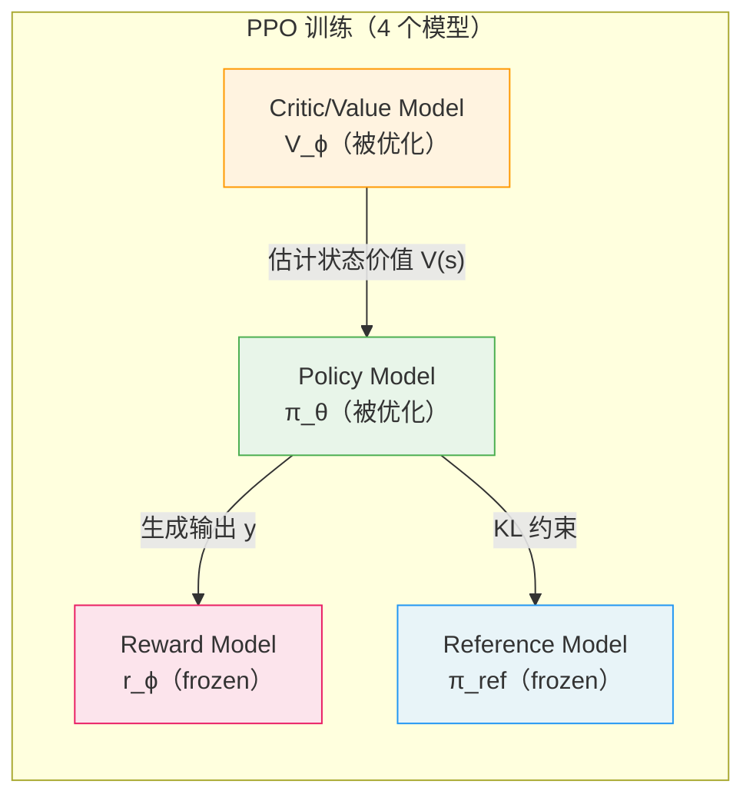

Critic 模型与 Policy 模型通常等大（同为几十亿参数的 LLM），这意味着：
- 内存占用几乎翻倍
- 优化器状态（Adam 的一/二阶矩）同样翻倍
- 两个模型交替更新，训练逻辑复杂

### 1.2 Critic 在 LLM 场景中的根本矛盾

PPO 中 Critic 网络的作用是估计 **token-level 状态价值** $V(s_t)$，用于 GAE 计算优势：

$$\hat{A}_t^{\text{GAE}} = \sum_{k=0}^{T-t-1}(\gamma\lambda)^k\delta_{t+k}, \quad \delta_t = r_t + \gamma V(s_{t+1}) - V(s_t)$$

然而 LLM 对齐场景中，奖励信号是 **sequence-level** 的（整条回复打一个分），只有在最后一个 token 时才有非零奖励：

$$r_t = \begin{cases} r(x, y) & t = T \\ 0 & t < T \end{cases}$$

这导致 Critic 需要从稀疏的末端信号中反向传播价值估计，训练困难，估计偏差大。

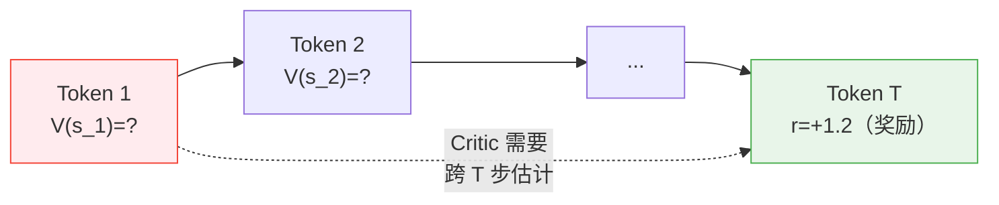

**GRPO 的解决方案**：既然奖励本来就是 sequence-level 的，那就直接用 sequence-level 的相对排名作为优势估计，完全绕过 token-level 的价值网络。

---

## 二、GRPO 的核心机制：组采样

### 2.1 Group Sampling

对于每个输入问题 $q$，GRPO 从**旧策略** $\pi_{\theta_{\text{old}}}$ 中采样 $G$ 条输出：

$$\{o_1, o_2, \ldots, o_G\} \sim \pi_{\theta_{\text{old}}}(\cdot \mid q)$$

然后用奖励函数（rule-based 验证器或奖励模型）对每条输出打分：

$$\{R_1, R_2, \ldots, R_G\} = \{R(q, o_1), R(q, o_2), \ldots, R(q, o_G)\}$$

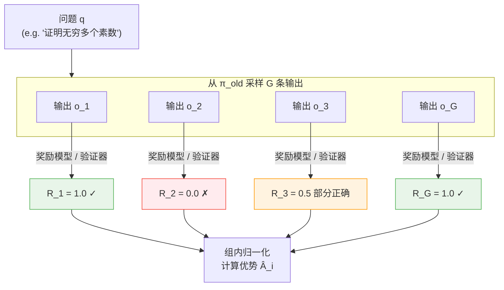

### 2.2 组内归一化优势估计

GRPO 的优势估计完全基于组内的相对排名，**无需 Critic 网络**：

$$\hat{A}_{i} = \frac{R_i - \text{mean}(\{R_1, \ldots, R_G\})}{\text{std}(\{R_1, \ldots, R_G\})}$$

展开写：

$$\hat{A}_{i} = \frac{R_i - \frac{1}{G}\sum_{j=1}^{G}R_j}{\sqrt{\frac{1}{G}\sum_{j=1}^{G}\left(R_j - \frac{1}{G}\sum_{k=1}^{G}R_k\right)^2}}$$

**关键设计**：同一条输出 $o_i$ 的**所有 token 共享同一个优势值** $\hat{A}_i$。

这与 PPO 的 token-level 优势形成鲜明对比：

```
PPO:  每个 token 有自己的 Â_t（依赖 Critic 的 V(s_t)）
GRPO: 同一输出的所有 token 共享同一个 Â_i（依赖组内相对排名）
```

### 2.3 直觉理解

组内归一化有清晰的语义：

```
R_i > 组内均值  →  Â_i > 0  →  这条输出比平均好，应该增大概率
R_i < 组内均值  →  Â_i < 0  →  这条输出比平均差，应该减小概率
R_i = 组内均值  →  Â_i = 0  →  这条输出平平，不做更新
```

std 归一化保证了优势的尺度在不同 batch 之间一致，防止因奖励函数尺度变化导致梯度剧烈波动。

---

## 三、GRPO 的完整目标函数

### 3.1 目标函数

$$\boxed{\mathcal{J}_{\text{GRPO}}(\theta) = \mathbb{E}_{q,\,\{o_i\}}\!\left[\frac{1}{G}\sum_{i=1}^{G}\frac{1}{|o_i|}\sum_{t=1}^{|o_i|}\!\left(\min\!\left(r_{i,t}\hat{A}_i,\,\text{clip}(r_{i,t}, 1{-}\varepsilon, 1{+}\varepsilon)\hat{A}_i\right) - \beta\,\mathbb{D}_{\text{KL}}(\pi_\theta \| \pi_{\text{ref}})\right)\right]}$$

其中 token-level policy ratio：

$$r_{i,t} = \frac{\pi_\theta(o_{i,t} \mid q,\, o_{i,<t})}{\pi_{\theta_{\text{old}}}(o_{i,t} \mid q,\, o_{i,<t})}$$

**各项含义**：

| 项 | 公式 | 含义 |
|----|------|------|
| Clipped surrogate | $\min(r_{i,t}\hat{A}_i,\ \text{clip}(\cdot)\hat{A}_i)$ | 防止策略更新步子过大（PPO 风格） |
| 优势 | $\hat{A}_i$（sequence-level） | 组内归一化的相对奖励，替代 Critic |
| KL 惩罚 | $\beta\,\mathbb{D}_{\text{KL}}(\pi_\theta \| \pi_{\text{ref}})$ | 防止策略偏离参考模型过远 |
| 长度归一化 | $\frac{1}{\lvert o_i \rvert}$ | 对每条输出的所有 token 取均值 |

### 3.2 Clip 机制

GRPO 的 clip 与 PPO 完全一致，通过 $\min$ 操作形成悲观下界：

$$L_{\text{clip}}(r, \hat{A}) = \min\!\left(r\hat{A},\; \text{clip}(r, 1-\varepsilon, 1+\varepsilon)\hat{A}\right)$$

当 $\hat{A} > 0$（好动作）：
- 若 $r > 1+\varepsilon$（新策略大幅提高该 token 的概率），截断为 $(1+\varepsilon)\hat{A}$，防止过激
- 若 $r \in [1-\varepsilon, 1+\varepsilon]$，正常更新
- 若 $r < 1-\varepsilon$，不截断（在好动作上降概率是允许的）

当 $\hat{A} < 0$（坏动作）：方向对称。

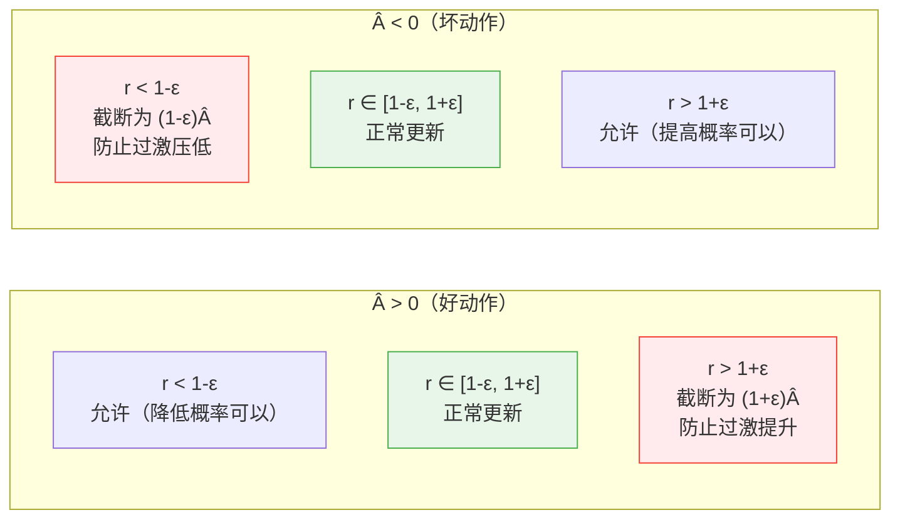

---

## 四、KL 惩罚：k3 无偏估计量

### 4.1 PPO 与 GRPO 的 KL 处理方式

两者的 KL 惩罚有根本性的位置差异：

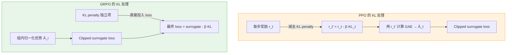

GRPO 把 KL 从奖励中剥离出来，直接作为 loss 的正则项，设计更清晰：KL 约束不污染优势估计。

### 4.2 k3 估计量

精确计算 KL 散度需要对整个词表求和（代价极高）。GRPO 使用 **k3 单样本估计量**：

$$\mathbb{D}_{\text{KL}}[\pi_\theta \| \pi_{\text{ref}}] \approx k_3 = \frac{\pi_{\text{ref}}(o_t \mid \cdot)}{\pi_\theta(o_t \mid \cdot)} - \log\frac{\pi_{\text{ref}}(o_t \mid \cdot)}{\pi_\theta(o_t \mid \cdot)} - 1$$

令 $\rho = \frac{\pi_{\text{ref}}}{\pi_\theta}$，则 $k_3 = \rho - \log \rho - 1$。

**k3 的三个良好性质**：

**性质一：无偏性**

$$\mathbb{E}_{o \sim \pi_\theta}[k_3] = \mathbb{E}_{o \sim \pi_\theta}\left[\frac{\pi_{\text{ref}}}{\pi_\theta} - \log\frac{\pi_{\text{ref}}}{\pi_\theta} - 1\right]$$

$$= \underbrace{\mathbb{E}_{o \sim \pi_\theta}\left[\frac{\pi_{\text{ref}}}{\pi_\theta}\right]}_{=\sum_o \pi_{\text{ref}}(o) = 1} - \underbrace{\mathbb{E}_{o \sim \pi_\theta}\left[\log\frac{\pi_{\text{ref}}}{\pi_\theta}\right]}_{= -\mathbb{D}_{\text{KL}}[\pi_\theta\|\pi_{\text{ref}}]} - 1 = \mathbb{D}_{\text{KL}}[\pi_\theta\|\pi_{\text{ref}}]$$

**性质二：非负性**

由 $\ln x \leq x - 1$（对 $\forall x > 0$ 成立），令 $x = \rho$：

$$\log \rho \leq \rho - 1 \implies 0 \leq \rho - \log\rho - 1 = k_3$$

KL 散度的估计值恒非负，与真实 KL 的性质一致。

**性质三：低方差**

k3 相当于 $k_1 = -\log\rho$（高方差无偏估计）加上控制变量 $(\rho - 1)$（期望为 0）：

$$k_3 = \underbrace{-\log\rho}_{k_1} + \underbrace{(\rho - 1)}_{\text{控制变量，期望为 0}}$$

控制变量与 $k_1$ 负相关，叠加后方差降低。

**三种估计量对比**：

| 估计量 | 公式 | 无偏 | 方差 | 非负 |
|--------|------|------|------|------|
| $k_1$ | $-\log(\pi_{\text{ref}}/\pi_\theta)$ | ✓ | 高 | ✗ |
| $k_2$ | $\frac{1}{2}(\log(\pi_{\text{ref}}/\pi_\theta))^2$ | ✗（有偏）| 低 | ✓ |
| $k_3$ | $\rho - \log\rho - 1$ | **✓** | **低** | **✓** |

---

## 五、GRPO 与相关算法的对比

### 5.1 与 PPO 的对比

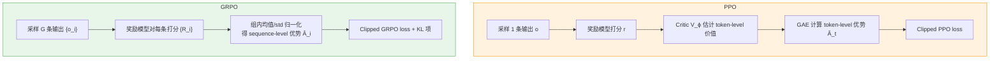

核心差异总结：

| 维度 | PPO | GRPO |
|------|-----|------|
| 模型数 | 4（policy + ref + critic + RM）| 3（policy + ref + RM）|
| 优势估计 | GAE（token-level，需要 Critic）| 组内归一化（sequence-level，无需 Critic）|
| 每个 prompt 的采样数 | 1 | G（论文中 G=16~64）|
| KL 位置 | 折入奖励（影响优势）| 独立 loss 项 |
| 奖励信号 | token-level TD | sequence-level |
| 内存开销 | 高（Critic 与 Policy 等大）| 低（省去 Critic）|

### 5.2 与 REINFORCE 的对比

REINFORCE 用全局 baseline 减方差：$\hat{A}_i = R_i - b$，其中 $b$ 是全局均值（跨 batch、跨 prompt）。

GRPO 用**组内 baseline**：$\hat{A}_i = (R_i - \bar{R}_{\text{group}}) / \sigma_{\text{group}}$。

组内 baseline 对同一 prompt 下不同输出的相对质量更敏感——因为同一问题的不同答案之间可比性更强，而跨问题的奖励均值缺乏语义意义。

### 5.3 与 RLOO 的关系

RLOO（REINFORCE Leave-One-Out）的 baseline：

$$\hat{A}_i^{\text{RLOO}} = R_i - \frac{1}{G-1}\sum_{j \neq i} R_j$$

GRPO 的 baseline：

$$\hat{A}_i^{\text{GRPO}} = \frac{R_i - \frac{1}{G}\sum_{j=1}^{G}R_j}{\text{std}}$$

两者的关键差异：
- RLOO 用 leave-one-out 均值（更精确的 baseline，但需要额外计算）
- GRPO 多了 std 归一化（Dr. GRPO 指出这可能引入偏差，见第七节）
- GRPO 有 PPO-style clip，RLOO 没有

### 5.4 与 DPO 的对比

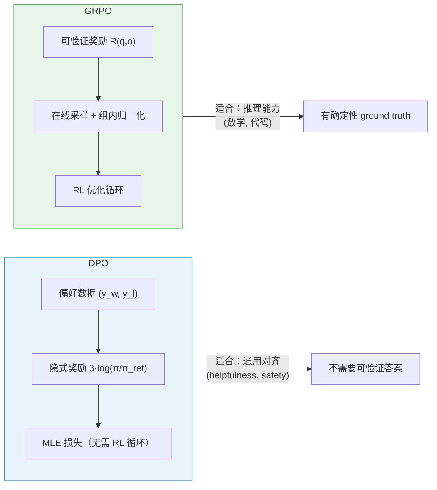

---

## 六、DeepSeek-R1 中的 GRPO 实践

### 6.1 R1-Zero：纯 RL 涌现推理

DeepSeek-R1-Zero 是 GRPO 最令人惊艳的应用：**直接在预训练 base 模型上做 RL，不经过任何 SFT，涌现出长链推理能力**。

**训练配置**：
- 基座：DeepSeek-V3-Base
- 超参数：$G = 16$，$\beta = 0.001$，$\varepsilon = 0.2$，最大序列长度 = 32,768
- 奖励：纯 rule-based（无神经奖励模型）

**Rule-Based 奖励设计**：

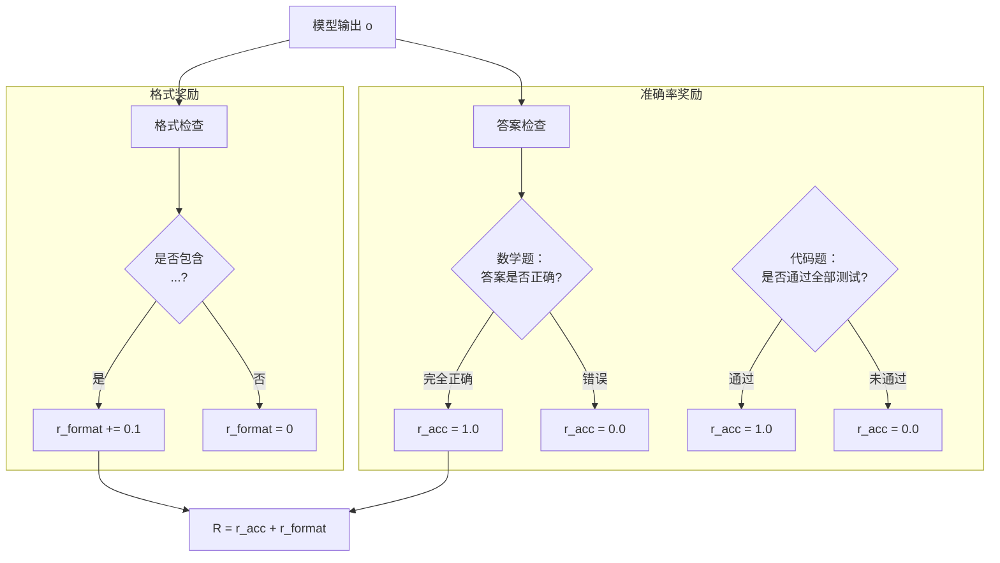

纯 rule-based 奖励的好处：**无法被 hack**。模型无法通过找到奖励模型的漏洞来刷高分——数学题答案对就是对，不对就是不对。

**R1-Zero 的涌现现象**：

随着训练进行，模型自发出现了：
- **自我反思**：输出中出现"Wait, let me reconsider..."
- **验证步骤**：主动检查自己的计算
- **"Aha Moment"**：发现错误时的突然转折
- 平均输出长度从几百 token 增长到几千 token

这些都是**自发涌现**的，没有在奖励设计中显式鼓励这些行为。

### 6.2 DeepSeek-R1 的四阶段训练

R1-Zero 虽然推理能力强，但存在可读性差、语言混用等问题。DeepSeek-R1 通过四阶段训练解决：

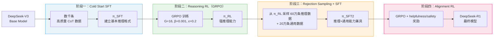

**Cold Start 的作用**：直接从 base 模型做 GRPO（R1-Zero 做法）会导致早期训练不稳定，输出格式混乱。用少量 SFT 建立基本格式后再做 RL，收敛更快、效果更好。

### 6.3 关键实验结果

| 模型 | AIME 2024 (Pass@1) | MATH-500 |
|------|-------------------|----------|
| DeepSeek-V3（SFT only）| 39.2% | 90.2% |
| DeepSeek-R1-Zero | 71.0% | 95.9% |
| DeepSeek-R1 | **79.8%** | **97.3%** |
| OpenAI o1-1217 | 79.2% | 96.4% |

GRPO 驱动 R1-Zero 的推理准确率从 39.2% 直接跳到 71.0%，仅靠 RL 训练提升了 32 个百分点。

---

## 七、Dr. GRPO：修复两个偏差

2025 年 3 月，Liu et al. 在论文 *Understanding R1-Zero-Like Training: A Critical Perspective* 中指出，vanilla GRPO 存在两个训练偏差。

### 7.1 长度偏差（Length Bias）

GRPO 目标中有 $\frac{1}{|o_i|}$ 的长度归一化项——对每条输出的 token 取均值。

看似合理，实则引入了偏差：设第 $i$ 条输出是**错误的**（$\hat{A}_i < 0$），其损失为：

$$L_i \propto \frac{1}{|o_i|} \sum_{t=1}^{|o_i|} \text{clip}(r_{i,t}, \cdot) \cdot \hat{A}_i$$

$|o_i|$ 越大，$\frac{1}{|o_i|}$ 越小，**错误输出受到的梯度惩罚越弱**。结果：模型倾向于生成**冗长的错误答案**来减小惩罚，产生 verbose 和 padding 行为。

**Dr. GRPO 的修复**：去掉 $\frac{1}{|o_i|}$，改为对所有 token 统一平均（跨 group）：

$$\mathcal{J}_{\text{Dr.GRPO}} \propto \frac{1}{\sum_i |o_i|} \sum_{i=1}^{G}\sum_{t=1}^{|o_i|} \left(\min(r_{i,t}\hat{A}_i, \text{clip}(\cdot)\hat{A}_i) - \beta\, k_{3,i,t}\right)$$

### 7.2 Std 归一化偏差

当 $G$ 条输出中**所有回答的奖励都相同**时（例如全对或全错），$\text{std} = 0$，导致除零问题，通常加小常数 $\epsilon$ 避免：

$$\hat{A}_i = \frac{R_i - \bar{R}}{\text{std} + \epsilon}$$

但更深的问题是：std 归一化对**奖励噪声**非常敏感——如果奖励模型对同等质量的回答打分略有差异，std 很小，归一化后优势被放大，引入噪声。

**Dr. GRPO 的修复**：去掉 std 归一化。去掉 std 后，优势估计等价于 RLOO（Leave-One-Out）的 baseline（差一个常数因子）。

**GRPO vs Dr. GRPO 对比**：

| | GRPO | Dr. GRPO |
|--|------|---------|
| 长度归一化 | 每条输出内部 $\frac{1}{\lvert o_i \rvert}$ | 跨 group 统一 |
| std 归一化 | 有 | 无 |
| 等价关系 | 接近 PPO（有 clip）| 等价于 RLOO + clip |

---

## 八、PyTorch 实现

### 8.1 核心损失函数

```python
import torch
import torch.nn.functional as F
from dataclasses import dataclass


@dataclass
class GRPOOutput:
    loss: torch.Tensor
    pg_loss: torch.Tensor        # policy gradient 部分
    kl_loss: torch.Tensor        # KL 惩罚部分
    clip_fraction: torch.Tensor  # 被 clip 的 token 比例（监控指标）


def compute_advantages(rewards: torch.Tensor, eps: float = 1e-8) -> torch.Tensor:
    """
    GRPO 的组内归一化优势估计。

    Args:
        rewards: 形状 (G,)，G 条输出的奖励
    Returns:
        advantages: 形状 (G,)，归一化后的优势
    """
    mean = rewards.mean()
    std = rewards.std()
    advantages = (rewards - mean) / (std + eps)
    return advantages


def k3_kl_estimate(
    log_policy: torch.Tensor,     # log π_θ(o_t | ...)，形状 (N,)
    log_reference: torch.Tensor,  # log π_ref(o_t | ...)，形状 (N,)
) -> torch.Tensor:
    """
    k3 无偏 KL 估计量：ρ - log(ρ) - 1，其中 ρ = π_ref / π_θ

    注：GRPO 用的是 KL(π_θ || π_ref)，即 E_{π_θ}[log(π_θ/π_ref)]
    k3 估计的是这个方向的 KL，使用 ρ = π_ref/π_θ
    """
    # log ρ = log π_ref - log π_θ
    log_rho = log_reference - log_policy
    rho = log_rho.exp()
    # k3 = ρ - log(ρ) - 1
    return rho - log_rho - 1


def grpo_loss(
    log_probs_policy: torch.Tensor,     # (G, T)，策略模型的 token-level log prob
    log_probs_old: torch.Tensor,        # (G, T)，旧策略的 token-level log prob
    log_probs_reference: torch.Tensor,  # (G, T)，参考模型的 token-level log prob
    rewards: torch.Tensor,              # (G,)，每条输出的奖励
    attention_mask: torch.Tensor,       # (G, T)，0 表示 padding 或 prompt
    beta: float = 0.001,
    eps: float = 0.2,
    dr_grpo: bool = False,             # 是否使用 Dr. GRPO（去掉 std 和 per-seq 归一化）
) -> GRPOOutput:
    """
    GRPO 损失函数。

    Args:
        log_probs_policy:    当前策略的 token log prob，形状 (G, T)
        log_probs_old:       采样时的旧策略 log prob，形状 (G, T)
        log_probs_reference: 参考模型 log prob，形状 (G, T)
        rewards:             每条输出的 scalar 奖励，形状 (G,)
        attention_mask:      有效 token 的 mask（response 部分为 1），形状 (G, T)
        beta:                KL 惩罚系数（DeepSeek-R1 中取 0.001）
        eps:                 clip 超参数（通常取 0.2）
        dr_grpo:             是否使用 Dr. GRPO 的改进（去掉 std 和 per-seq 归一化）
    """
    G, T = log_probs_policy.shape

    # ── 1. 计算 token-level policy ratio ────────────────────────────
    # r_{i,t} = π_θ(o_{i,t}) / π_θ_old(o_{i,t})
    log_ratios = log_probs_policy - log_probs_old  # (G, T)
    ratios = log_ratios.exp()                       # (G, T)

    # ── 2. 优势估计 ────────────────────────────────────────────────
    if dr_grpo:
        # Dr. GRPO：只减均值，不除以 std
        advantages = rewards - rewards.mean()   # (G,)
    else:
        # vanilla GRPO：组内 z-score 归一化
        advantages = compute_advantages(rewards) # (G,)

    # 广播到 token 维度：同一条输出的所有 token 共享同一优势
    # (G,) → (G, 1) → (G, T)
    advantages = advantages.unsqueeze(1).expand_as(log_probs_policy)

    # ── 3. Clipped surrogate loss ───────────────────────────────────
    pg_loss_unclipped = ratios * advantages                               # (G, T)
    pg_loss_clipped = ratios.clamp(1 - eps, 1 + eps) * advantages         # (G, T)
    pg_loss_per_token = -torch.min(pg_loss_unclipped, pg_loss_clipped)    # (G, T)

    # 监控 clip 比例
    clip_fraction = ((ratios < 1 - eps) | (ratios > 1 + eps)).float()
    clip_fraction = (clip_fraction * attention_mask).sum() / attention_mask.sum()

    # ── 4. k3 KL 估计 ──────────────────────────────────────────────
    kl_per_token = k3_kl_estimate(log_probs_policy, log_probs_reference)  # (G, T)

    # ── 5. 合并 loss ────────────────────────────────────────────────
    loss_per_token = pg_loss_per_token + beta * kl_per_token  # (G, T)

    # 用 attention_mask 屏蔽 prompt 和 padding
    loss_per_token = loss_per_token * attention_mask

    if dr_grpo:
        # Dr. GRPO：所有有效 token 统一平均
        loss = loss_per_token.sum() / attention_mask.sum()
        pg = pg_loss_per_token.mul(attention_mask).sum() / attention_mask.sum()
        kl = kl_per_token.mul(attention_mask).sum() / attention_mask.sum()
    else:
        # vanilla GRPO：先在序列内平均，再在 group 内平均
        seq_lengths = attention_mask.sum(dim=-1).clamp(min=1)  # (G,)
        loss = (loss_per_token.sum(dim=-1) / seq_lengths).mean()
        pg   = (pg_loss_per_token.mul(attention_mask).sum(dim=-1) / seq_lengths).mean()
        kl   = (kl_per_token.mul(attention_mask).sum(dim=-1) / seq_lengths).mean()

    return GRPOOutput(
        loss=loss,
        pg_loss=pg,
        kl_loss=kl * beta,
        clip_fraction=clip_fraction,
    )
```

### 8.2 训练循环

```python
def grpo_train_step(
    batch_questions: list[str],
    policy_model,
    reference_model,
    tokenizer,
    reward_fn,
    optimizer,
    G: int = 16,
    beta: float = 0.001,
    eps: float = 0.2,
    max_new_tokens: int = 2048,
) -> dict:
    """
    单个 GRPO 训练步骤。

    reward_fn(question, output) -> float
        对于数学题：解析 <answer>...</answer>，与 ground truth 比较
        对于代码题：编译运行，检查测试用例
    """
    all_log_probs_old = []
    all_log_probs_ref = []
    all_rewards = []
    all_input_ids = []
    all_masks = []

    # ── 采样阶段（不计算梯度）─────────────────────────────────────
    policy_model.eval()
    with torch.no_grad():
        for question in batch_questions:
            inputs = tokenizer(question, return_tensors="pt").to(policy_model.device)

            # 采样 G 条输出（do_sample=True，temperature=1.0）
            outputs = policy_model.generate(
                **inputs,
                num_return_sequences=G,
                do_sample=True,
                temperature=1.0,
                max_new_tokens=max_new_tokens,
            )

            for i in range(G):
                output_text = tokenizer.decode(outputs[i], skip_special_tokens=True)

                # 奖励函数打分（rule-based 或奖励模型）
                reward = reward_fn(question, output_text)
                all_rewards.append(reward)

                # 记录 token ids 和 mask（response 部分）
                response_ids = outputs[i][inputs.input_ids.shape[-1]:]
                all_input_ids.append(response_ids)

    rewards = torch.tensor(all_rewards).view(len(batch_questions), G)

    # ── 更新阶段 ─────────────────────────────────────────────────
    policy_model.train()

    for q_idx, question in enumerate(batch_questions):
        q_rewards = rewards[q_idx]  # (G,)

        # 跳过全对或全错的 group（优势全为 0，无梯度信号）
        if q_rewards.max() == q_rewards.min():
            continue

        # 计算 policy 和 reference 的 log probs
        # （此处省略 tokenization 和前向传播的细节）
        # ...

        output = grpo_loss(
            log_probs_policy=log_probs_policy,
            log_probs_old=log_probs_old,
            log_probs_reference=log_probs_reference,
            rewards=q_rewards,
            attention_mask=response_mask,
            beta=beta,
            eps=eps,
        )

        optimizer.zero_grad()
        output.loss.backward()
        torch.nn.utils.clip_grad_norm_(policy_model.parameters(), max_norm=1.0)
        optimizer.step()

    return {
        "loss": output.loss.item(),
        "pg_loss": output.pg_loss.item(),
        "kl_loss": output.kl_loss.item(),
        "clip_fraction": output.clip_fraction.item(),
        "mean_reward": rewards.mean().item(),
        "reward_std": rewards.std().item(),
    }
```

---

## 九、GRPO 全算法对比

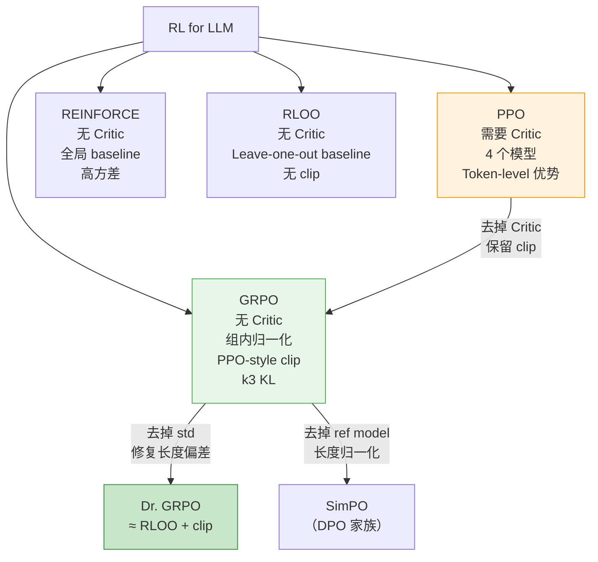

---

## 十、完整算法流程图

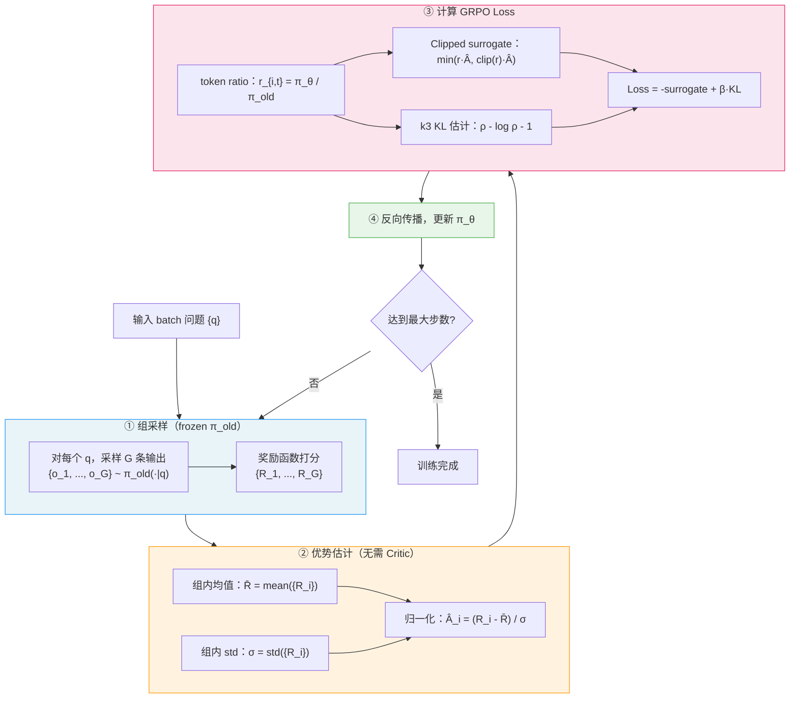

---

## 十一、小结

GRPO 的核心贡献可以用一句话概括：**用同一问题的多条采样输出的相对奖励，替代 Critic 网络的绝对价值估计**。

这个替换是合理的，因为：

1. LLM 对齐的奖励本来就是 sequence-level 的，Critic 估计 token-level 价值本身就是一种不自然的强行适配
2. 同一问题下不同回答的相对排名，比跨问题的全局价值估计更有语义含义
3. 去掉 Critic 节省了约 50% 的内存，让在单机 GPU 集群上训练数十亿参数的推理模型成为可能

加上 rule-based 的可验证奖励，GRPO 在 DeepSeek-R1-Zero 中实现了一个令人印象深刻的结论：**不需要人类标注的监督信号，仅靠 RL 和确定性奖励，语言模型就能自发涌现出结构化的长链推理能力**。

---

*参考：*
- *Shao et al., DeepSeekMath: Pushing the Limits of Mathematical Reasoning in Open Language Models, 2024*
- *DeepSeek-AI, DeepSeek-R1: Incentivizing Reasoning Capability in LLMs via Reinforcement Learning, 2025*
- *Liu et al., Understanding R1-Zero-Like Training: A Critical Perspective (Dr. GRPO), 2025*
- *Schulman, Approximating KL Divergence, 2020 (blog post)*
- *Ahmadian et al., Back to Basics: Revisiting REINFORCE Style Optimization for Learning from Human Feedback (RLOO), 2024*
