LLM 从"对话机器"进化为"自主行动者"——这是过去两年 AI 工程领域最重要的范式转移。本文从第一原理出发，回答三个问题：**Agent 是什么、为什么需要它、它如何工作**，并深入剖析 ReAct、MRKL、AutoGPT 等奠基性框架的设计原理。

---

## 目录

1. [什么是 AI Agent](#1-什么是-ai-agent)
2. [Agent vs 普通 LLM Chat](#2-agent-vs-普通-llm-chat)
3. [Agent 的核心组件](#3-agent-的核心组件)
4. [发展脉络](#4-发展脉络)
5. [ReAct：思考与行动的统一](#5-react思考与行动的统一)
6. [MRKL：模块化推理](#6-mrkl模块化推理)
7. [AutoGPT 与自主 Agent](#7-autogpt-与自主-agent)
8. [Agent 的感知-规划-执行循环](#8-agent-的感知-规划-执行循环)
9. [失败模式与局限性](#9-失败模式与局限性)
10. [从 Agent 到 Agentic AI](#10-从-agent-到-agentic-ai)

---

## 1. 什么是 AI Agent

### 1.1 定义

**AI Agent** 是一个以 LLM 为核心推理引擎，能够**感知环境、制定计划、调用工具、执行动作**，并在反馈中持续迭代，最终完成复杂目标的自主系统。

一句话区分：

> 普通 LLM：**输入 → 输出**，一次性问答。
>
> AI Agent：**目标 → 循环（感知 → 思考 → 行动 → 观察）→ 结果**，多步自主执行。

### 1.2 Agent 的本质能力

Agent 在普通 LLM 之上新增了四种能力：

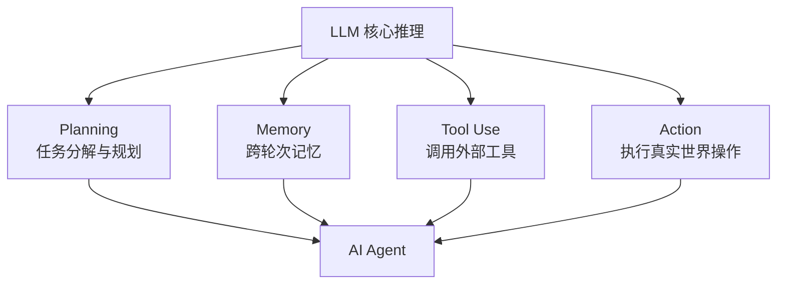

**Planning**：将复杂任务拆解为子步骤，动态调整执行顺序。

**Memory**：跨对话轮次保持上下文，不受 context window 限制。

**Tool Use**：调用搜索引擎、代码解释器、数据库、API 等外部资源。

**Action**：不只是输出文字，还能操作文件、发送请求、控制浏览器等。

---

## 2. Agent vs 普通 LLM Chat

### 2.1 核心差异

| 维度 | LLM Chat | AI Agent |
|------|---------|---------|
| 交互模式 | 单轮问答 | 多步自主循环 |
| 上下文 | 受 context window 限制 | 外部记忆突破限制 |
| 工具访问 | 仅靠参数知识 | 实时调用外部工具 |
| 动作范围 | 文字输出 | 真实世界操作 |
| 错误处理 | 无法自我纠错 | 观察反馈后重试 |
| 任务复杂度 | 单跳问答 | 多跳、多依赖、长时任务 |
| 知识时效 | 训练截止日期 | 实时检索 |

### 2.2 一个具体例子

**任务**：「帮我分析 Tesla 最新季度财报，和上季度对比，画出营收趋势图并保存」

**LLM Chat**：
- 只能用训练数据中的历史数据（已过时）
- 无法访问网络获取最新财报
- 无法生成并执行代码画图
- 无法保存文件
- ❌ 无法完成

**AI Agent**：
```
1. [工具调用] 搜索 "Tesla Q4 2025 earnings report"
2. [工具调用] 下载财报 PDF，提取关键数字
3. [工具调用] 搜索上季度数据
4. [思考] 对比两季度数据，识别趋势
5. [工具调用] 执行 Python 代码，用 matplotlib 画图
6. [工具调用] 保存图片到指定路径
7. [输出] 分析报告 + 图表路径
```
✅ 完成

### 2.3 为什么不直接扩大 Context Window？

一个常见的误解：「把 context 做到 100 万 token，是不是就不需要 Agent 了？」

**不能替代的原因**：

1. **实时信息**：再长的 context 也无法包含今天的新闻、股价、代码运行结果
2. **动作执行**：context 是被动接收信息，Agent 主动改变世界
3. **成本**：100 万 token 的 prefill 成本极高，每次对话都重新处理不现实
4. **注意力稀释**：超长 context 中 LLM 对中间信息的注意力显著下降（Lost in the Middle）

---

## 3. Agent 的核心组件

### 3.1 架构全景

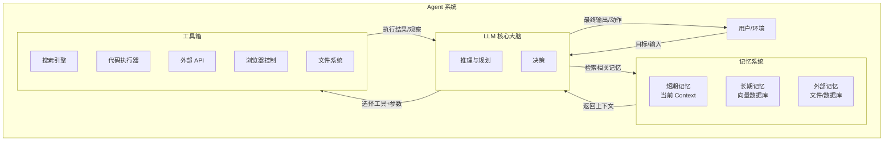

### 3.2 组件详解

**大脑（LLM）**：负责理解任务、分解步骤、选择工具、解析结果、生成回复。是整个系统的控制器。

**记忆系统**：
- **短期记忆**：当前 Prompt 中的对话历史，受 context window 限制
- **长期记忆**：向量数据库存储的过去经验，按需检索
- **外部记忆**：文件、关系数据库，用于持久化结构化信息

**工具系统**：赋予 Agent 超越文字的能力，包括信息获取（搜索、爬虫）、计算（代码执行器）、通信（API 调用）、存储操作（文件读写）。

**行动执行器**：将 LLM 的决策转化为真实操作，管理工具调用的生命周期（超时、重试、权限控制）。

---

## 4. 发展脉络

### 4.1 历史时间线

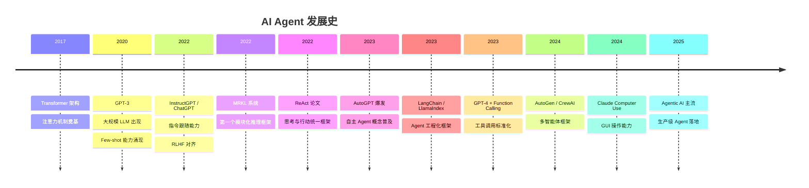

### 4.2 三个发展阶段

**第一阶段（2020-2022）：提示工程时代**

用 Few-shot Prompting 让 LLM 模拟工具使用，本质是靠 LLM 的参数知识"假装"调用工具，没有真实执行。

```
Prompt: 使用搜索引擎查询"特斯拉股价"
Search("特斯拉股价") → [假设搜索结果]
Answer: 特斯拉股价是...
```

**第二阶段（2022-2023）：框架涌现**

ReAct、MRKL、AutoGPT 等框架出现，LLM 开始真正调用外部工具，出现真实的感知-行动循环。Function Calling API 的标准化使工具调用更可靠。

**第三阶段（2024-至今）：工程化与多 Agent**

从单 Agent 玩具到多 Agent 生产系统。关注点从"能不能用"转向"可靠性、成本、可观测性"。出现垂直领域 Agent（代码 Agent、数据分析 Agent、客服 Agent）。

---

## 5. ReAct：思考与行动的统一

### 5.1 核心思想

**ReAct**（Reasoning + Acting）由 Yao et al. 2022 提出，是现代 Agent 框架最重要的理论基础。

核心洞察：**将"思考（Thought）"和"行动（Action）"交织在同一个序列中**，使 LLM 的推理过程可以实时影响动作选择，动作的观察结果又反过来指导下一步推理。

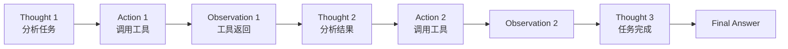

### 5.2 Thought-Action-Observation 循环

**格式**（ReAct 的 Prompt 模板）：

```
Question: 苹果公司的市值是多少？和谷歌相比谁更大？

Thought: 我需要查询苹果和谷歌的当前市值，然后进行比较。
Action: Search("Apple market cap 2025")
Observation: 苹果公司市值约为 3.5 万亿美元（截至2025年3月）

Thought: 已获得苹果市值，现在查询谷歌市值。
Action: Search("Google Alphabet market cap 2025")
Observation: Alphabet（谷歌母公司）市值约为 2.3 万亿美元

Thought: 苹果市值 3.5T，谷歌市值 2.3T，苹果更大，差距约 1.2 万亿美元。
Action: Finish("苹果公司市值约 3.5 万亿美元，谷歌约 2.3 万亿美元，苹果更大，领先约 1.2 万亿美元。")
```

### 5.3 ReAct vs 单纯 CoT vs 单纯 Act

| 方法 | 有推理 | 有行动 | 优点 | 缺点 |
|------|-------|-------|------|------|
| Chain-of-Thought | ✅ | ❌ | 推理清晰 | 信息来自参数，可能过时 |
| Act-only | ❌ | ✅ | 快速执行 | 无推理，错误难以诊断 |
| **ReAct** | ✅ | ✅ | 两者兼顾，可解释 | 步骤多，延迟高 |

**实验结果**（原论文，HotpotQA）：
- Act-only：29.4% 准确率
- CoT：33.5%
- ReAct：40.4%（提升约 7 个百分点）

### 5.4 ReAct 的实现

```python
from anthropic import Anthropic

client = Anthropic()

REACT_SYSTEM_PROMPT = """你是一个能够使用工具的智能助手。

每一步必须严格按照以下格式输出：
Thought: [你的推理过程]
Action: [工具名称]([参数])

或者当任务完成时：
Thought: [最终分析]
Answer: [最终回答]

可用工具：
- Search(query): 搜索互联网
- Calculator(expression): 计算数学表达式
- GetWeather(city): 获取城市天气

严格按格式输出，不要有额外内容。"""

def parse_react_output(text):
    """解析 LLM 输出，提取 Thought 和 Action"""
    lines = text.strip().split('\n')
    thought, action, answer = '', '', ''

    for line in lines:
        if line.startswith('Thought:'):
            thought = line[len('Thought:'):].strip()
        elif line.startswith('Action:'):
            action = line[len('Action:'):].strip()
        elif line.startswith('Answer:'):
            answer = line[len('Answer:'):].strip()

    return thought, action, answer

def execute_action(action_str):
    """执行工具调用，返回观察结果"""
    # 解析 ToolName(args)
    if '(' not in action_str:
        return "Error: Invalid action format"

    tool_name = action_str[:action_str.index('(')]
    args = action_str[action_str.index('(')+1:action_str.rindex(')')]

    if tool_name == 'Search':
        return mock_search(args)
    elif tool_name == 'Calculator':
        try:
            return str(eval(args))  # 实际中应用沙箱
        except Exception as e:
            return f"Error: {e}"
    elif tool_name == 'GetWeather':
        return mock_weather(args)
    else:
        return f"Error: Unknown tool {tool_name}"

def mock_search(query):
    # 实际中调用搜索 API
    return f"[搜索结果] 关于 '{query}' 的相关信息..."

def mock_weather(city):
    return f"[天气] {city}: 晴，22°C，湿度 65%"

def react_agent(question, max_steps=10):
    """ReAct Agent 主循环"""
    messages = [{'role': 'user', 'content': question}]
    trajectory = []

    for step in range(max_steps):
        # LLM 推理
        response = client.messages.create(
            model='claude-opus-4-6',
            max_tokens=500,
            system=REACT_SYSTEM_PROMPT,
            messages=messages,
        )
        output = response.content[0].text
        thought, action, answer = parse_react_output(output)

        trajectory.append({'step': step+1, 'thought': thought,
                           'action': action, 'answer': answer})

        # 任务完成
        if answer:
            print(f"\n=== 完成（{step+1} 步）===")
            print(f"Answer: {answer}")
            return answer, trajectory

        # 执行工具
        if action:
            observation = execute_action(action)
            print(f"Step {step+1}:")
            print(f"  Thought: {thought}")
            print(f"  Action:  {action}")
            print(f"  Obs:     {observation}")

            # 将观察结果加入对话
            messages.append({'role': 'assistant', 'content': output})
            messages.append({'role': 'user',
                           'content': f"Observation: {observation}"})
        else:
            print("Warning: No action parsed, stopping.")
            break

    return None, trajectory
```

---

## 6. MRKL：模块化推理

### 6.1 MRKL 系统

**MRKL**（Modular Reasoning, Knowledge and Language，Karpas et al. 2022）比 ReAct 更早提出了模块化 Agent 架构：

- **Neural Router**：LLM 作为路由器，判断每个子问题应该交给哪个模块
- **Expert Modules**：专用计算模块（计算器、数据库、搜索引擎、领域知识库）
- **结果综合**：将各模块结果汇总，LLM 生成最终回答

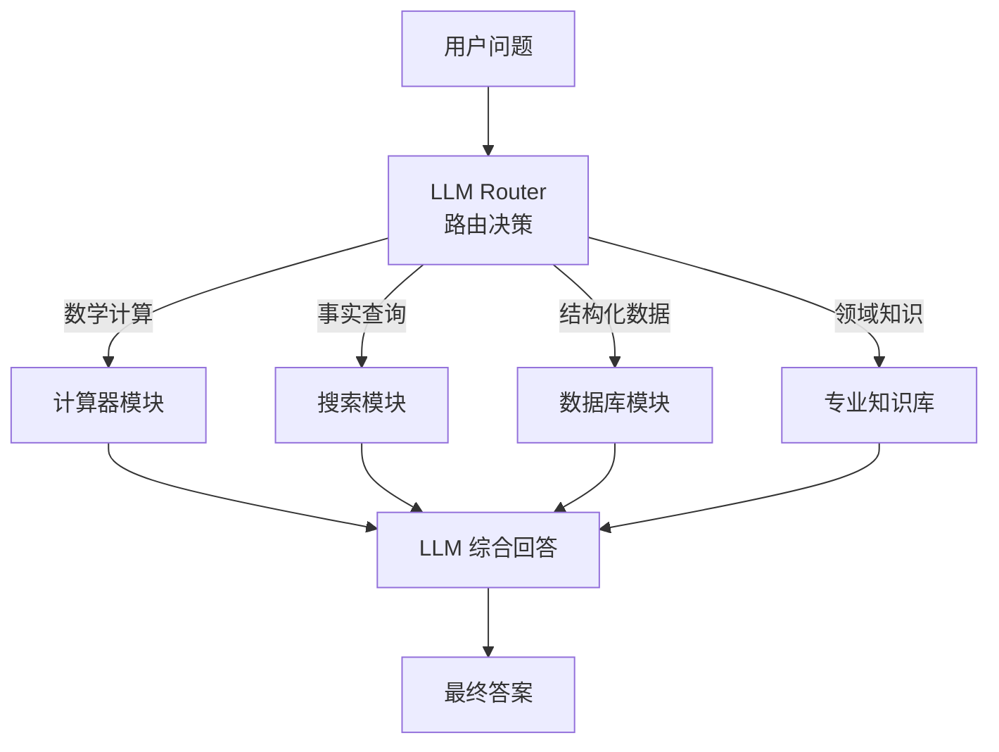

**MRKL 与 ReAct 的区别**：
- MRKL 是**单次路由**：先分析，再选模块，模块结果直接汇总
- ReAct 是**迭代循环**：思考-行动-观察-思考，多轮动态决策

MRKL 更适合问题可以清晰分解为独立子问题的场景；ReAct 更适合需要根据中间结果动态调整的复杂任务。

---

## 7. AutoGPT 与自主 Agent

### 7.1 AutoGPT 的意义

2023 年 4 月，AutoGPT 在 GitHub 爆炸式流行（数天获得 50K+ star），将 Agent 的概念带入大众视野。

**核心设计**：给 LLM 一个**自然语言目标**，让它完全自主地规划和执行，无需人工干预。

```
目标：
"建一个能够自动分析竞争对手产品的工具，
 每周发送分析报告到我的邮箱"

AutoGPT 自主完成：
→ 分解任务为子目标
→ 搜索竞争对手信息
→ 编写爬虫代码并执行
→ 分析对比报告
→ 调用邮件 API 发送
→ 设置定时任务
→ ...（完全自主）
```

### 7.2 AutoGPT 的架构

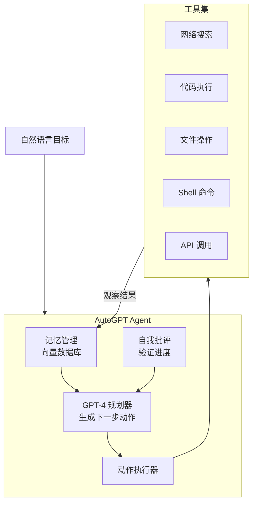

### 7.3 AutoGPT 的核心 Prompt 设计

```
You are {AI Name}, {AI Role}.

Your decisions must always be made independently without seeking
user assistance. Play to your strengths as an LLM and pursue
simple strategies with no legal complications.

GOALS:
1. {Goal 1}
2. {Goal 2}

CONSTRAINTS:
- 4000 word limit for short term memory.
  Your short term memory is short, so immediately save important
  information to files.
- No user assistance

COMMANDS:
1. Google Search: "google", args: "input": "<search>"
2. Write to file: "write_to_file", args: "file": "<file>", "text": "<text>"
3. Execute Python File: "execute_python_file", args: "file": "<file>"
...

PERFORMANCE EVALUATION:
1. Continuously review and analyze your actions to ensure you are
   performing to the best of your abilities.
2. Constructively self-criticize your big-picture behavior constantly.
3. Reflect on past decisions and strategies to refine your approach.

You should only respond in JSON format as described below:
{
  "thoughts": {
    "text": "thought",
    "reasoning": "reasoning",
    "plan": "- short bulleted\n- list that conveys\n- long-term plan",
    "criticism": "constructive self-criticism",
    "speak": "thoughts summary to say to user"
  },
  "command": {
    "name": "command name",
    "args": {"arg name": "value"}
  }
}
```

### 7.4 AutoGPT 的问题

AutoGPT 带来了对 Agent 能力的极度热情，但也暴露了自主 Agent 的根本性挑战：

| 问题 | 描述 |
|------|------|
| **任务漂移** | Agent 容易偏离原始目标，自顾自执行不相关任务 |
| **错误累积** | 单步错误在多步执行中指数级放大 |
| **无限循环** | 找不到解法时反复重试相同操作 |
| **资源消耗** | 无约束执行消耗大量 API token 和时间 |
| **不可预测** | 自主决策难以预测，生产环境风险高 |
| **缺乏验证** | 无法判断中间步骤的正确性 |

AutoGPT 是重要的概念验证，但它的架构并不适合生产环境。

---

## 8. Agent 的感知-规划-执行循环

### 8.1 完整循环

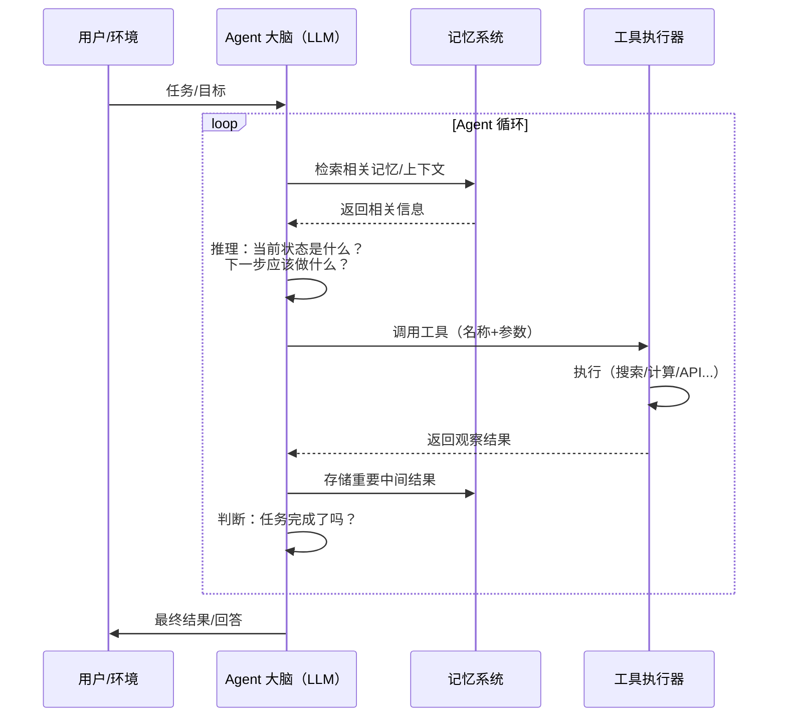

### 8.2 循环的关键决策点

**决策 1：下一步做什么？**

LLM 需要根据当前状态选择：
- 继续执行计划中的下一步
- 根据新观察调整计划
- 请求用户澄清
- 声明任务完成（或失败）

**决策 2：调用哪个工具？参数是什么？**

这是工具选择问题，需要 LLM 理解每个工具的能力边界和适用场景，并正确格式化调用参数。

**决策 3：何时停止？**

循环终止条件：
- 任务成功完成
- 达到最大步数限制
- 遇到无法处理的错误
- 主动判断无法完成

### 8.3 Agent 的状态管理

Agent 在执行过程中需要维护**状态（State）**：

```python
from dataclasses import dataclass, field
from typing import List, Dict, Any, Optional
from enum import Enum

class AgentStatus(Enum):
    IDLE = "idle"
    RUNNING = "running"
    WAITING_TOOL = "waiting_tool"
    COMPLETED = "completed"
    FAILED = "failed"

@dataclass
class AgentState:
    """Agent 的完整状态"""
    # 任务信息
    task: str = ""
    status: AgentStatus = AgentStatus.IDLE

    # 执行历史
    steps: List[Dict] = field(default_factory=list)
    # steps 中每个元素: {'thought': ..., 'action': ..., 'observation': ...}

    # 当前上下文（送给 LLM 的消息列表）
    messages: List[Dict] = field(default_factory=list)

    # 中间结果
    scratchpad: Dict[str, Any] = field(default_factory=dict)

    # 控制参数
    step_count: int = 0
    max_steps: int = 20
    total_tokens: int = 0

    def add_step(self, thought: str, action: str, observation: str):
        self.steps.append({
            'step': self.step_count,
            'thought': thought,
            'action': action,
            'observation': observation,
        })
        self.step_count += 1

    def is_terminated(self) -> bool:
        return (
            self.status in [AgentStatus.COMPLETED, AgentStatus.FAILED]
            or self.step_count >= self.max_steps
        )

    def summary(self) -> str:
        return (
            f"Task: {self.task}\n"
            f"Status: {self.status.value}\n"
            f"Steps: {self.step_count}/{self.max_steps}\n"
            f"Tokens: {self.total_tokens}"
        )
```

---

## 9. 失败模式与局限性

### 9.1 常见失败模式

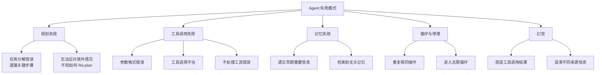

### 9.2 失败模式详解

**规划失败**：LLM 对复杂任务的分解能力有限，特别是存在隐含依赖关系时（必须先 A 才能做 B，但 LLM 没有意识到）。

**工具幻觉**：LLM 可能"假装"调用了工具，直接编造返回结果，而不是真正执行。这在任务链的早期很难察觉，但会导致后续所有步骤基于错误信息。

**错误传播**：

$$P(\text{成功}) = \prod_{i=1}^{n} P(\text{步骤}_i \text{ 成功}) \approx (1-\epsilon)^n$$

若每步成功率 95%，10 步任务的成功率约为 $0.95^{10} \approx 60\%$。这是 Agent 可靠性的核心挑战。

**上下文溢出**：长时间运行后，历史步骤填满 context window，LLM 开始遗忘早期的任务目标和约束。

### 9.3 缓解方法

| 失败类型 | 缓解方法 |
|---------|---------|
| 规划失败 | Plan-and-Execute 架构，事先完整规划再执行 |
| 工具幻觉 | 强制要求 Function Calling 格式，禁止纯文本工具调用 |
| 错误传播 | 每步验证、校验点（Checkpoint）、人工介入 |
| 上下文溢出 | 摘要压缩历史，关键信息存外部记忆 |
| 无限循环 | 最大步数限制、重复检测、失败快速退出 |

---

## 10. 从 Agent 到 Agentic AI

### 10.1 Human-in-the-loop 的谱系

Agent 的自主程度不是二值的，而是一个连续谱：

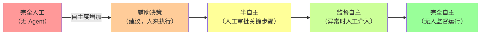

**当前生产环境的最佳实践**：停在"半自主"到"监督自主"之间，关键操作（发送邮件、提交代码、支付、删除数据）必须经人工确认。

### 10.2 Agentic AI 的定义

**Agentic AI** 不只是"能用工具的 LLM"，而是一套**以 LLM 为核心的自主软件系统**，具备：

1. **目标导向**：不靠人下每一步指令，自主将高层目标分解为行动
2. **持久运行**：超越单次对话，在时间尺度上持续执行（数分钟到数天）
3. **环境适应**：根据外部反馈动态调整策略
4. **多工具协作**：灵活组合多种工具完成复杂任务
5. **可监督性**：执行过程可追溯、可审计、可干预

### 10.3 现实中的 Agent 形态

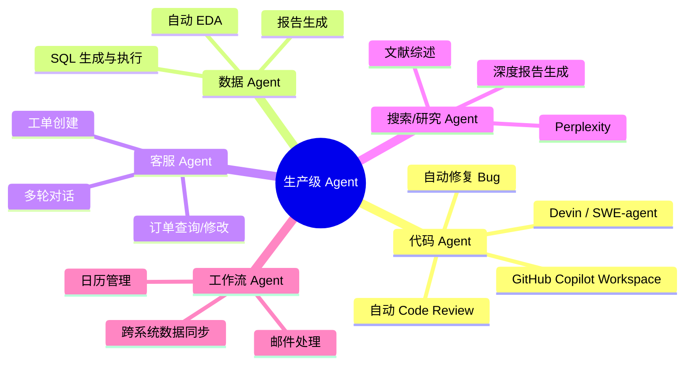

### 10.4 系列文章路线图

本文是 AI Agent 系列的第一篇，后续将深入每个核心组件：

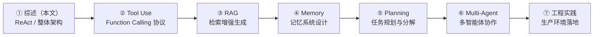

---

## 总结

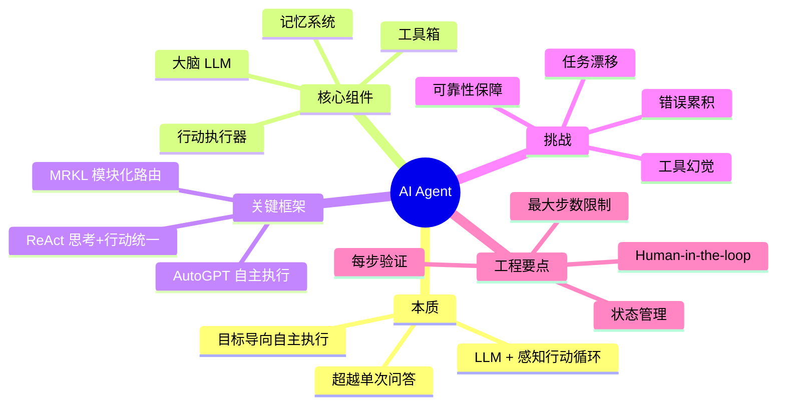

**三句话总结 AI Agent**：

1. Agent 是 LLM + 记忆 + 工具 + 行动的自主闭环系统，核心是**感知-思考-行动**的迭代循环
2. ReAct 框架将"思考"和"行动"交织在同一序列，是现代 Agent 的理论基础
3. 生产环境中 Agent 的核心挑战是**可靠性**而非能力——单步 95% 的成功率，10 步后只有 60%
