检索增强生成（RAG）是解决 LLM 知识局限性最务实的方案。本文从最朴素的 Naive RAG 出发，深入剖析每个环节的工程细节，覆盖 Advanced RAG 的全部优化手段，以及 Self-RAG、GraphRAG、HyDE 等前沿变体，最终给出生产级 RAG 系统的完整实现。

---

## 目录

1. [为什么需要 RAG](#1-为什么需要-rag)
2. [RAG 的整体架构演进](#2-rag-的整体架构演进)
3. [文档处理与分块策略](#3-文档处理与分块策略)
4. [Embedding 模型选型](#4-embedding-模型选型)
5. [向量数据库](#5-向量数据库)
6. [检索策略](#6-检索策略)
7. [后处理：重排序与过滤](#7-后处理重排序与过滤)
8. [生成阶段优化](#8-生成阶段优化)
9. [Advanced RAG 技术全集](#9-advanced-rag-技术全集)
10. [Self-RAG](#10-self-rag)
11. [GraphRAG](#11-graphrag)
12. [RAG 评测体系](#12-rag-评测体系)
13. [生产级实现](#13-生产级实现)

---

## 1. 为什么需要 RAG

### 1.1 LLM 的知识局限

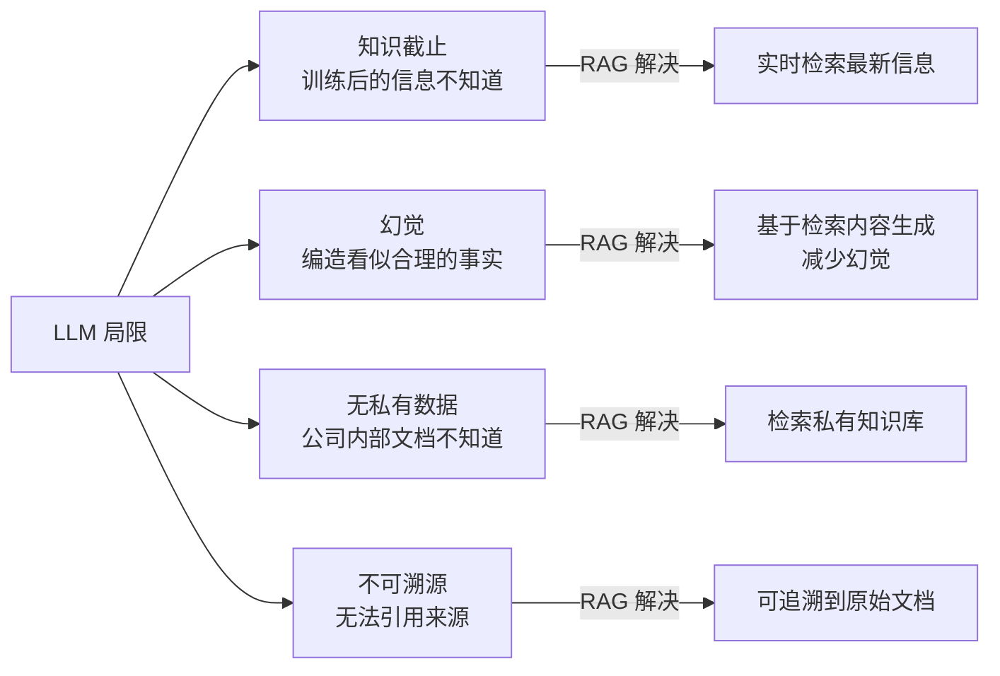

### 1.2 RAG vs 微调 vs 长上下文

三种方案的本质区别：

| 维度 | RAG | 微调（Fine-tuning）| 长上下文（Long Context）|
|------|-----|-------------------|----------------------|
| 知识更新 | 实时（更新索引即可）| 需重新训练 | 每次请求实时注入 |
| 知识规模 | 无限（TB 级文档库）| 受限于训练数据量 | 受限于 context window |
| 推理成本 | 低（只检索相关片段）| 低（参数已融合）| 高（百万 token 的 prefill）|
| 可解释性 | 高（可追溯来源）| 低（知识融入参数）| 高（来源在 context 中）|
| 适用场景 | 问答、搜索、知识库 | 风格、格式、领域适应 | 长文档处理、代码库分析 |
| 幻觉风险 | 低（有检索依据）| 中（可能过拟合）| 低（有原文依据）|

**RAG 的核心优势**：知识与模型解耦，知识库更新无需重训练，成本可控。

### 1.3 RAG 的适用场景

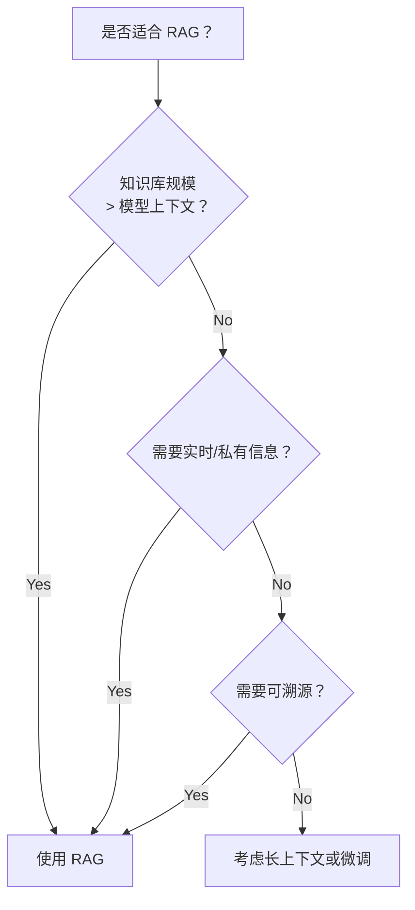

---

## 2. RAG 的整体架构演进

### 2.1 三代 RAG 架构

```mermaid
graph TD
    subgraph Naive RAG
        NQ[查询] --> NE[Embedding]
        NE --> NR[向量检索 Top-K]
        NR --> NG[拼接到 Prompt 生成]
    end

    subgraph Advanced RAG
        AQ[查询] --> AQO[查询优化<br/>重写/扩展/分解]
        AQO --> AH[混合检索<br/>向量+BM25]
        AH --> ARR[重排序 Rerank]
        ARR --> AF[过滤与压缩]
        AF --> AG[生成 + 引用]
    end

    subgraph Modular RAG
        MQ[查询] --> MSEARCH[搜索模块]
        MSEARCH --> MMEM[记忆模块]
        MMEM --> MFUSE[融合模块]
        MFUSE --> MROUTE[路由模块]
        MROUTE --> MGEN[生成模块]
        MGEN --> MITER[迭代反馈]
        MITER --> MSEARCH
    end
```

### 2.2 RAG 全流程

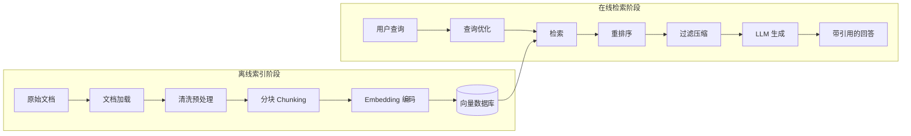

---

## 3. 文档处理与分块策略

### 3.1 文档加载

不同格式的文档需要不同的解析器：

```python
from pathlib import Path
from typing import List, Dict
import re

class DocumentLoader:
    """多格式文档加载器"""

    def load(self, path: str) -> List[Dict]:
        """
        返回: [{"content": str, "metadata": dict}, ...]
        """
        suffix = Path(path).suffix.lower()
        loaders = {
            ".pdf":  self._load_pdf,
            ".docx": self._load_docx,
            ".md":   self._load_markdown,
            ".txt":  self._load_text,
            ".html": self._load_html,
            ".csv":  self._load_csv,
        }
        loader = loaders.get(suffix)
        if not loader:
            raise ValueError(f"不支持的文件格式: {suffix}")
        return loader(path)

    def _load_pdf(self, path: str) -> List[Dict]:
        import pdfplumber
        docs = []
        with pdfplumber.open(path) as pdf:
            for i, page in enumerate(pdf.pages):
                text = page.extract_text() or ""
                # 提取表格
                tables = page.extract_tables()
                table_text = ""
                for table in tables:
                    table_text += "\n" + "\n".join(
                        " | ".join(str(cell or "") for cell in row)
                        for row in table
                    )
                docs.append({
                    "content": text + table_text,
                    "metadata": {
                        "source": path,
                        "page": i + 1,
                        "total_pages": len(pdf.pages),
                        "type": "pdf"
                    }
                })
        return docs

    def _load_markdown(self, path: str) -> List[Dict]:
        """按标题层级分割 Markdown"""
        with open(path, "r", encoding="utf-8") as f:
            content = f.read()

        # 按 ## 级标题分割
        sections = re.split(r'\n(?=#{1,3} )', content)
        docs = []
        for i, section in enumerate(sections):
            if section.strip():
                # 提取标题
                title_match = re.match(r'^(#{1,3}) (.+)', section)
                title = title_match.group(2) if title_match else ""
                docs.append({
                    "content": section,
                    "metadata": {
                        "source": path,
                        "section": i,
                        "title": title,
                        "type": "markdown"
                    }
                })
        return docs

    def _load_html(self, path: str) -> List[Dict]:
        from bs4 import BeautifulSoup
        with open(path, "r", encoding="utf-8") as f:
            soup = BeautifulSoup(f.read(), "html.parser")

        # 去掉脚本和样式
        for tag in soup(["script", "style", "nav", "footer"]):
            tag.decompose()

        text = soup.get_text(separator="\n", strip=True)
        # 清理多余空行
        text = re.sub(r'\n{3,}', '\n\n', text)

        return [{"content": text, "metadata": {"source": path, "type": "html"}}]

    def _load_text(self, path: str) -> List[Dict]:
        with open(path, "r", encoding="utf-8") as f:
            return [{"content": f.read(), "metadata": {"source": path, "type": "text"}}]

    def _load_csv(self, path: str) -> List[Dict]:
        import csv
        rows = []
        with open(path, newline="", encoding="utf-8") as f:
            reader = csv.DictReader(f)
            headers = reader.fieldnames
            for i, row in enumerate(reader):
                # 每行转为自然语言描述
                content = " | ".join(f"{k}: {v}" for k, v in row.items())
                rows.append({
                    "content": content,
                    "metadata": {"source": path, "row": i, "type": "csv", "columns": headers}
                })
        return rows
```

### 3.2 分块策略对比

**分块是 RAG 系统中最影响性能的环节之一**，没有银弹，需根据文档类型和查询模式选择。

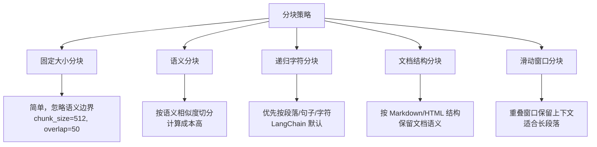

```python
from typing import List, Optional
import re

class TextSplitter:
    """递归字符分块器（生产推荐）"""

    DEFAULT_SEPARATORS = ["\n\n", "\n", "。", "！", "？", ".", "!", "?", " ", ""]

    def __init__(
        self,
        chunk_size: int = 512,
        chunk_overlap: int = 64,
        separators: List[str] = None,
        length_function=len,
    ):
        self.chunk_size = chunk_size
        self.chunk_overlap = chunk_overlap
        self.separators = separators or self.DEFAULT_SEPARATORS
        self.length_fn = length_function

    def split(self, text: str) -> List[str]:
        """递归分块：优先按大分隔符，不够再用小分隔符"""
        return self._split_text(text, self.separators)

    def _split_text(self, text: str, separators: List[str]) -> List[str]:
        final_chunks = []
        separator = separators[-1]  # 默认用最小分隔符

        # 找到第一个有效的分隔符
        for sep in separators:
            if sep == "":
                separator = sep
                break
            if sep in text:
                separator = sep
                break

        # 用分隔符切分
        splits = text.split(separator) if separator else list(text)
        splits = [s for s in splits if s.strip()]

        # 合并小块，分割大块
        current_chunks: List[str] = []
        current_len = 0

        for split in splits:
            split_len = self.length_fn(split)

            # 单个 split 超过 chunk_size，递归用更小的分隔符
            if split_len > self.chunk_size:
                if current_chunks:
                    merged = separator.join(current_chunks)
                    final_chunks.append(merged)
                    current_chunks = []
                    current_len = 0

                next_separators = separators[separators.index(separator)+1:]
                if next_separators:
                    sub_chunks = self._split_text(split, next_separators)
                    final_chunks.extend(sub_chunks)
                else:
                    final_chunks.append(split)
                continue

            # 当前批次加上这个 split 超过 chunk_size，先输出
            if current_len + split_len + len(separator) > self.chunk_size and current_chunks:
                merged = separator.join(current_chunks)
                final_chunks.append(merged)

                # 保留 overlap：把末尾几个 chunk 保留到下一批
                overlap_chunks = []
                overlap_len = 0
                for c in reversed(current_chunks):
                    if overlap_len + self.length_fn(c) <= self.chunk_overlap:
                        overlap_chunks.insert(0, c)
                        overlap_len += self.length_fn(c)
                    else:
                        break
                current_chunks = overlap_chunks
                current_len = overlap_len

            current_chunks.append(split)
            current_len += split_len

        if current_chunks:
            final_chunks.append(separator.join(current_chunks))

        return [c for c in final_chunks if c.strip()]


class SemanticSplitter:
    """
    语义分块：用 embedding 相似度找语义边界
    相邻句子 embedding 相似度低 → 语义边界
    """

    def __init__(self, embed_fn, threshold: float = 0.7, min_chunk_size: int = 100):
        self.embed_fn = embed_fn
        self.threshold = threshold
        self.min_chunk_size = min_chunk_size

    def split(self, text: str) -> List[str]:
        # 先按句子切分
        sentences = re.split(r'(?<=[。！？.!?])\s*', text)
        sentences = [s.strip() for s in sentences if len(s.strip()) > 10]

        if len(sentences) <= 1:
            return sentences

        # 计算相邻句子的 embedding 相似度
        embeddings = self.embed_fn(sentences)
        similarities = []
        for i in range(len(embeddings) - 1):
            sim = self._cosine_similarity(embeddings[i], embeddings[i+1])
            similarities.append(sim)

        # 相似度低于阈值处断开
        chunks, current = [], [sentences[0]]
        for i, sim in enumerate(similarities):
            if sim < self.threshold and len(" ".join(current)) >= self.min_chunk_size:
                chunks.append(" ".join(current))
                current = [sentences[i+1]]
            else:
                current.append(sentences[i+1])

        if current:
            chunks.append(" ".join(current))
        return chunks

    @staticmethod
    def _cosine_similarity(a, b) -> float:
        import numpy as np
        a, b = np.array(a), np.array(b)
        return float(np.dot(a, b) / (np.linalg.norm(a) * np.linalg.norm(b) + 1e-8))
```

### 3.3 分块大小的选择

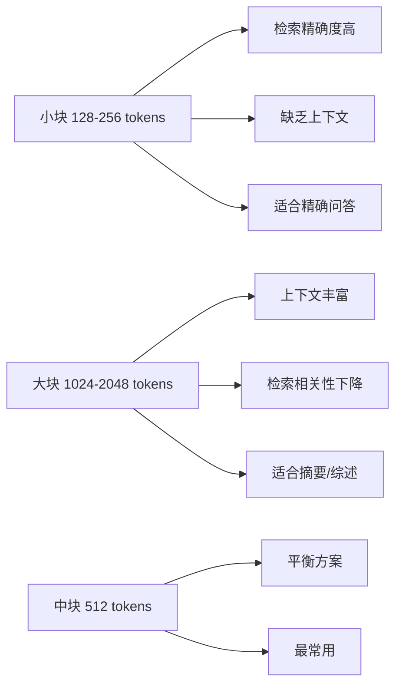

**经验法则**：

- 问答类：`chunk_size=512, overlap=64`
- 摘要类：`chunk_size=1024, overlap=128`
- 代码：`chunk_size=按函数/类切分`
- 表格数据：每行或每几行一个 chunk

### 3.4 Chunk 元数据设计

好的元数据是实现过滤检索、结果追溯的基础：

```python
@dataclass
class Chunk:
    id: str                    # 唯一 ID（用于去重和更新）
    content: str               # 文本内容
    embedding: List[float]     # 向量
    metadata: Dict = field(default_factory=dict)
    # 元数据建议包含：
    # source: 来源文件路径
    # page / section: 位置信息
    # doc_type: pdf/markdown/html
    # created_at: 文档创建时间
    # updated_at: 最后更新时间
    # title: 所在章节标题
    # chunk_index: 在文档中的顺序
    # total_chunks: 文档总块数
    # keywords: 关键词列表（用于稀疏检索）
    # language: 语言
    # author: 作者
```

---

## 4. Embedding 模型选型

### 4.1 主流 Embedding 模型对比

| 模型 | 维度 | 最大长度 | 语言 | 特点 |
|------|------|---------|------|------|
| `text-embedding-3-large` | 3072 | 8191 tokens | 多语言 | OpenAI，质量最高 |
| `text-embedding-3-small` | 1536 | 8191 tokens | 多语言 | OpenAI，性价比高 |
| `BAAI/bge-m3` | 1024 | 8192 tokens | 100+ 语言 | 开源最强，混合检索 |
| `BAAI/bge-large-zh-v1.5` | 1024 | 512 tokens | 中文 | 中文专用，效果好 |
| `sentence-transformers/all-MiniLM-L6-v2` | 384 | 256 tokens | 英文 | 轻量快速 |
| `Cohere/embed-multilingual-v3.0` | 1024 | 512 tokens | 多语言 | Cohere，商用 |

**选型建议**：
- 纯中文场景：`bge-large-zh-v1.5` 或 `bge-m3`
- 中英混合：`bge-m3` 或 `text-embedding-3-large`
- 离线/自托管：`bge-m3`
- 快速原型：`text-embedding-3-small`

### 4.2 Embedding 的工程实现

```python
import numpy as np
from typing import List, Union
import asyncio
import time

class EmbeddingModel:
    """Embedding 模型封装，支持批处理和缓存"""

    def __init__(
        self,
        model_name: str = "BAAI/bge-m3",
        batch_size: int = 32,
        use_cache: bool = True,
    ):
        self.model_name = model_name
        self.batch_size = batch_size
        self._cache = {} if use_cache else None
        self._init_model()

    def _init_model(self):
        if self.model_name.startswith("text-embedding"):
            # OpenAI
            from openai import OpenAI
            self._client = OpenAI()
            self._backend = "openai"
        else:
            # 本地模型
            from sentence_transformers import SentenceTransformer
            self._model = SentenceTransformer(self.model_name)
            self._backend = "local"

    def encode(self, texts: Union[str, List[str]], prefix: str = "") -> np.ndarray:
        """
        编码文本为向量
        prefix: BGE 系列需要区分查询/文档前缀
                查询："Represent this sentence for searching relevant passages: "
                文档：""（空，无需前缀）
        """
        if isinstance(texts, str):
            texts = [texts]

        # 添加前缀（BGE 系列专用）
        if prefix:
            texts = [prefix + t for t in texts]

        # 检查缓存
        if self._cache is not None:
            cache_keys = [f"{self.model_name}:{t}" for t in texts]
            results = [None] * len(texts)
            uncached_indices = []
            uncached_texts = []

            for i, key in enumerate(cache_keys):
                if key in self._cache:
                    results[i] = self._cache[key]
                else:
                    uncached_indices.append(i)
                    uncached_texts.append(texts[i])

            if uncached_texts:
                new_embeddings = self._encode_batch(uncached_texts)
                for idx, emb in zip(uncached_indices, new_embeddings):
                    results[idx] = emb
                    self._cache[cache_keys[idx]] = emb

            return np.array(results)

        return self._encode_batch(texts)

    def _encode_batch(self, texts: List[str]) -> np.ndarray:
        """分批编码"""
        all_embeddings = []
        for i in range(0, len(texts), self.batch_size):
            batch = texts[i:i + self.batch_size]
            if self._backend == "openai":
                response = self._client.embeddings.create(
                    input=batch, model=self.model_name
                )
                embs = [r.embedding for r in response.data]
            else:
                embs = self._model.encode(
                    batch, normalize_embeddings=True, show_progress_bar=False
                ).tolist()
            all_embeddings.extend(embs)
        return np.array(all_embeddings)

    def encode_query(self, query: str) -> np.ndarray:
        """编码查询（BGE 系列需要特殊前缀）"""
        prefix = ""
        if "bge" in self.model_name.lower():
            prefix = "Represent this sentence for searching relevant passages: "
        return self.encode(query, prefix=prefix)[0]

    def encode_documents(self, docs: List[str]) -> np.ndarray:
        """编码文档（无前缀）"""
        return self.encode(docs)
```

### 4.3 Embedding 维度压缩

高维 embedding（3072 维）的存储和检索成本高，可以用 Matryoshka Representation Learning（MRL）降维：

```python
def truncate_embedding(embedding: np.ndarray, dim: int) -> np.ndarray:
    """
    Matryoshka 风格：截断到低维后重新归一化
    OpenAI text-embedding-3 系列支持此特性
    """
    truncated = embedding[:dim]
    norm = np.linalg.norm(truncated)
    return truncated / (norm + 1e-8)

# 3072 → 256 维，存储减少 12x，性能损失约 3-5%
small_emb = truncate_embedding(large_emb, 256)
```

---

## 5. 向量数据库

### 5.1 主流向量数据库对比

| 数据库 | 类型 | 特点 | 适用场景 |
|--------|------|------|---------|
| **Chroma** | 开源，内嵌 | 零配置，Python 原生 | 原型开发 |
| **FAISS** | 开源，库 | Facebook 出品，极速 | 离线批量检索 |
| **Qdrant** | 开源，服务 | 强过滤，Rust 实现 | 生产推荐 |
| **Weaviate** | 开源，服务 | GraphQL API，多模态 | 复杂查询 |
| **Pinecone** | 托管 SaaS | 全托管，易用 | 快速上线 |
| **Milvus** | 开源，分布式 | 高吞吐，水平扩展 | 超大规模 |
| **pgvector** | PostgreSQL 插件 | 与现有 PG 集成 | 已有 PG 用户 |

### 5.2 ANN 索引算法

向量检索的核心是近似最近邻搜索（ANN），主流算法：

**HNSW（Hierarchical Navigable Small World）**：

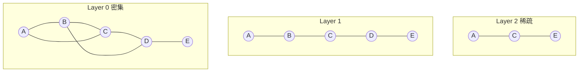

- **构建**：每个向量在多层图中建立连接，高层稀疏（用于快速定位），低层密集（用于精确搜索）
- **查询**：从顶层贪心导航，逐层下降到底层精确邻居
- **时间复杂度**：$O(\log N)$ 查询，$O(N \log N)$ 构建
- **参数**：`M`（每个节点最大连接数，影响精度和内存），`ef_construction`（构建时搜索范围）

**IVF（Inverted File Index）+ PQ（Product Quantization）**：

- IVF：将向量空间聚类为 $K$ 个桶，查询时只搜索最近的几个桶
- PQ：将向量切成 $M$ 段，每段独立量化，大幅压缩存储
- 适合超大规模（亿级）向量，内存占用低但精度稍差

### 5.3 Qdrant 完整使用示例

```python
from qdrant_client import QdrantClient
from qdrant_client.models import (
    Distance, VectorParams, PointStruct,
    Filter, FieldCondition, MatchValue, Range,
    SearchRequest, ScoredPoint
)
from typing import List, Dict, Optional
import uuid

class VectorStore:
    """基于 Qdrant 的向量存储"""

    def __init__(
        self,
        collection_name: str,
        embedding_dim: int = 1024,
        url: str = "http://localhost:6333",
    ):
        self.client = QdrantClient(url=url)
        self.collection_name = collection_name
        self.embedding_dim = embedding_dim
        self._ensure_collection()

    def _ensure_collection(self):
        """确保 collection 存在"""
        existing = [c.name for c in self.client.get_collections().collections]
        if self.collection_name not in existing:
            self.client.create_collection(
                collection_name=self.collection_name,
                vectors_config=VectorParams(
                    size=self.embedding_dim,
                    distance=Distance.COSINE,
                ),
                # 稀疏向量配置（用于混合检索）
                sparse_vectors_config={
                    "bm25": SparseVectorParams()
                }
            )
            print(f"创建 collection: {self.collection_name}")

    def upsert(self, chunks: List[Dict]) -> int:
        """
        批量插入/更新文档块

        chunks: [{"id": str, "content": str, "embedding": list, "metadata": dict}]
        """
        points = []
        for chunk in chunks:
            point_id = chunk.get("id") or str(uuid.uuid4())
            points.append(PointStruct(
                id=point_id,
                vector=chunk["embedding"],
                payload={
                    "content": chunk["content"],
                    **chunk.get("metadata", {})
                }
            ))

        # 批量上传（自动分批）
        self.client.upsert(
            collection_name=self.collection_name,
            points=points,
            wait=True  # 等待索引完成
        )
        return len(points)

    def search(
        self,
        query_embedding: List[float],
        top_k: int = 10,
        score_threshold: float = 0.5,
        filters: Optional[Dict] = None,
    ) -> List[Dict]:
        """
        向量相似度搜索

        filters 示例：
        {"doc_type": "pdf", "created_at_gte": "2024-01-01"}
        """
        qdrant_filter = self._build_filter(filters) if filters else None

        results = self.client.search(
            collection_name=self.collection_name,
            query_vector=query_embedding,
            limit=top_k,
            score_threshold=score_threshold,
            query_filter=qdrant_filter,
            with_payload=True,
        )

        return [
            {
                "content": r.payload.get("content", ""),
                "score": r.score,
                "metadata": {k: v for k, v in r.payload.items() if k != "content"},
                "id": r.id,
            }
            for r in results
        ]

    def _build_filter(self, filters: Dict) -> Filter:
        """将字典过滤条件转为 Qdrant Filter"""
        conditions = []
        for key, value in filters.items():
            if key.endswith("_gte"):
                conditions.append(FieldCondition(
                    key=key[:-4], range=Range(gte=value)
                ))
            elif key.endswith("_lte"):
                conditions.append(FieldCondition(
                    key=key[:-4], range=Range(lte=value)
                ))
            else:
                conditions.append(FieldCondition(
                    key=key, match=MatchValue(value=value)
                ))
        return Filter(must=conditions)

    def delete_by_source(self, source: str):
        """删除来自特定来源的所有 chunk"""
        self.client.delete(
            collection_name=self.collection_name,
            points_selector=Filter(
                must=[FieldCondition(key="source", match=MatchValue(value=source))]
            )
        )

    def get_stats(self) -> Dict:
        info = self.client.get_collection(self.collection_name)
        return {
            "vectors_count": info.vectors_count,
            "indexed_vectors_count": info.indexed_vectors_count,
            "status": info.status,
        }
```

---

## 6. 检索策略

### 6.1 稠密检索 vs 稀疏检索

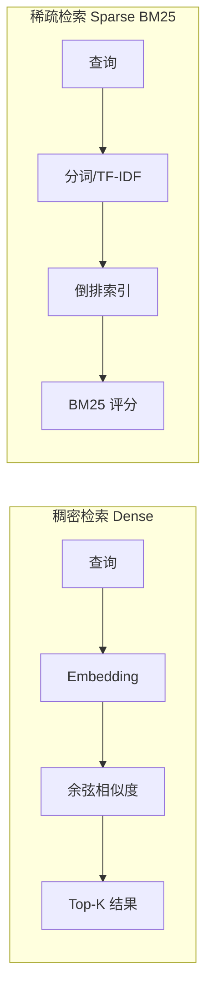

**BM25 评分公式**：

$$\text{BM25}(q, d) = \sum_{t \in q} \text{IDF}(t) \cdot \frac{f(t,d) \cdot (k_1 + 1)}{f(t,d) + k_1 \cdot (1 - b + b \cdot \frac{|d|}{\text{avgdl}})}$$

其中：
- $f(t,d)$：词 $t$ 在文档 $d$ 中的频率
- $|d|$：文档长度，$\text{avgdl}$：平均文档长度
- $k_1 \in [1.2, 2.0]$：词频饱和参数，$b = 0.75$：长度归一化参数

**两种方法的互补性**：
- 稠密检索：理解语义，能处理同义词、释义；弱于精确关键词匹配
- 稀疏检索：精确关键词匹配，对专有名词（人名、产品名、代码）效果好

### 6.2 混合检索（Hybrid Search）

```python
import numpy as np
from rank_bm25 import BM25Okapi
import jieba

class HybridRetriever:
    """
    混合检索：稠密向量 + BM25 稀疏检索
    使用 RRF（Reciprocal Rank Fusion）融合排名
    """

    def __init__(
        self,
        vector_store: VectorStore,
        embed_model: EmbeddingModel,
        bm25_weight: float = 0.3,
        dense_weight: float = 0.7,
        rrf_k: int = 60,
    ):
        self.vector_store = vector_store
        self.embed_model = embed_model
        self.bm25_weight = bm25_weight
        self.dense_weight = dense_weight
        self.rrf_k = rrf_k

        # BM25 索引（内存）
        self._chunks: List[Dict] = []
        self._bm25: Optional[BM25Okapi] = None

    def build_bm25_index(self, chunks: List[Dict]):
        """构建 BM25 索引"""
        self._chunks = chunks
        tokenized = [
            list(jieba.cut(c["content"]))  # 中文分词
            for c in chunks
        ]
        self._bm25 = BM25Okapi(tokenized)
        print(f"BM25 索引构建完成，共 {len(chunks)} 个文档块")

    def search(
        self,
        query: str,
        top_k: int = 10,
        filters: Optional[Dict] = None
    ) -> List[Dict]:
        """混合检索"""

        # 1. 稠密检索
        query_emb = self.embed_model.encode_query(query)
        dense_results = self.vector_store.search(
            query_embedding=query_emb.tolist(),
            top_k=top_k * 2,  # 多取一些用于融合
            filters=filters
        )

        # 2. BM25 稀疏检索
        if self._bm25:
            query_tokens = list(jieba.cut(query))
            bm25_scores = self._bm25.get_scores(query_tokens)
            bm25_top_indices = np.argsort(bm25_scores)[::-1][:top_k * 2]
            bm25_results = [
                {**self._chunks[i], "bm25_score": bm25_scores[i]}
                for i in bm25_top_indices
                if bm25_scores[i] > 0
            ]
        else:
            bm25_results = []

        # 3. RRF 融合
        return self._rrf_fusion(dense_results, bm25_results, top_k)

    def _rrf_fusion(
        self,
        dense_results: List[Dict],
        sparse_results: List[Dict],
        top_k: int
    ) -> List[Dict]:
        """
        Reciprocal Rank Fusion（倒数排名融合）

        RRF(d) = Σ 1/(k + rank_i(d))

        相比线性加权，RRF 对排名更鲁棒，无需归一化分数
        """
        scores: Dict[str, float] = {}
        doc_map: Dict[str, Dict] = {}

        # 稠密检索排名贡献
        for rank, doc in enumerate(dense_results):
            doc_id = doc.get("id") or doc["content"][:50]
            scores[doc_id] = scores.get(doc_id, 0) + self.dense_weight / (self.rrf_k + rank + 1)
            doc_map[doc_id] = doc

        # 稀疏检索排名贡献
        for rank, doc in enumerate(sparse_results):
            doc_id = doc.get("id") or doc["content"][:50]
            scores[doc_id] = scores.get(doc_id, 0) + self.bm25_weight / (self.rrf_k + rank + 1)
            doc_map[doc_id] = doc

        # 按融合分数排序
        sorted_ids = sorted(scores.keys(), key=lambda x: scores[x], reverse=True)
        results = []
        for doc_id in sorted_ids[:top_k]:
            doc = doc_map[doc_id].copy()
            doc["rrf_score"] = scores[doc_id]
            results.append(doc)

        return results
```

### 6.3 查询优化

**问题**：用户查询往往简短、模糊、含口语化表达，与文档中的规范表述不匹配。

#### 查询重写

```python
async def rewrite_query(query: str, llm_client) -> List[str]:
    """
    用 LLM 将用户查询重写为多个更精确的搜索词
    返回原始查询 + N 个重写版本
    """
    prompt = f"""将以下用户查询改写为 3 个不同角度的搜索词，以提高检索召回率。
要求：保持语义，但换不同的表达方式（同义词替换、换角度描述、更具体化等）。
以 JSON 数组格式输出，只输出数组，不要其他内容。

用户查询：{query}

示例输出：["查询变体1", "查询变体2", "查询变体3"]"""

    response = await llm_client.messages.create(
        model="claude-haiku-4-5-20251001",  # 用小模型降成本
        max_tokens=200,
        messages=[{"role": "user", "content": prompt}]
    )

    import json
    try:
        variants = json.loads(response.content[0].text)
        return [query] + variants  # 原始 + 重写版本
    except:
        return [query]


async def multi_query_retrieve(
    query: str,
    retriever: HybridRetriever,
    llm_client,
    top_k: int = 5
) -> List[Dict]:
    """多查询检索：用多个查询变体检索，结果去重合并"""

    queries = await rewrite_query(query, llm_client)
    print(f"查询变体: {queries}")

    all_results = []
    seen_ids = set()

    for q in queries:
        results = retriever.search(q, top_k=top_k)
        for r in results:
            doc_id = r.get("id") or r["content"][:50]
            if doc_id not in seen_ids:
                seen_ids.add(doc_id)
                all_results.append(r)

    # 按分数重排
    all_results.sort(key=lambda x: x.get("rrf_score", x.get("score", 0)), reverse=True)
    return all_results[:top_k]
```

#### 查询分解（Decomposition）

```python
async def decompose_query(query: str, llm_client) -> List[str]:
    """
    将复杂查询分解为多个简单子查询
    适用于多跳问答（需要多步推理的问题）
    """
    prompt = f"""分析以下问题，判断是否需要分步回答。
如果需要，将其分解为 2-4 个更简单的子问题（按依赖顺序排列）。
如果不需要，直接返回原问题。
以 JSON 数组输出。

问题：{query}

示例：
问题："特斯拉CEO的母校的排名如何？"
输出：["特斯拉的CEO是谁？", "他在哪所大学读书？", "该大学的最新排名是多少？"]"""

    response = await llm_client.messages.create(
        model="claude-haiku-4-5-20251001",
        max_tokens=300,
        messages=[{"role": "user", "content": prompt}]
    )

    import json
    try:
        sub_queries = json.loads(response.content[0].text)
        return sub_queries if isinstance(sub_queries, list) else [query]
    except:
        return [query]
```

---

## 7. 后处理：重排序与过滤

### 7.1 为什么需要重排序

向量检索的排序基于 embedding 相似度，但 embedding 是压缩表示，可能遗失细粒度语义信息。**Reranker（交叉编码器）** 将查询和文档对拼接后重新打分，准确率更高但计算量大（因此先粗检索再精排）：

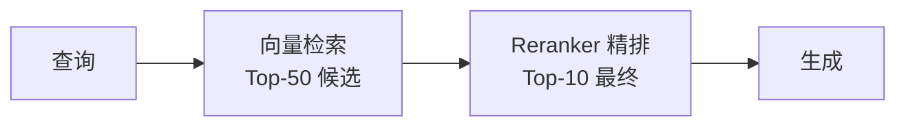

### 7.2 Reranker 实现

```python
from sentence_transformers import CrossEncoder
from typing import List, Dict

class Reranker:
    """Cross-Encoder 重排序器"""

    MODELS = {
        "bge-reranker-v2-m3": "BAAI/bge-reranker-v2-m3",   # 多语言，推荐
        "bge-reranker-large": "BAAI/bge-reranker-large",     # 中文强
        "cohere-rerank": "cohere",                            # 托管 API
    }

    def __init__(self, model_name: str = "BAAI/bge-reranker-v2-m3"):
        self.model_name = model_name
        if model_name == "cohere":
            import cohere
            self._client = cohere.Client()
            self._backend = "cohere"
        else:
            self._model = CrossEncoder(model_name, max_length=512)
            self._backend = "local"

    def rerank(
        self,
        query: str,
        documents: List[Dict],
        top_k: int = 5,
        return_scores: bool = True,
    ) -> List[Dict]:
        """
        重排序文档列表

        原理：CrossEncoder 将 (query, doc) 拼接后过完整 BERT，
        比双塔 Embedding 准确但慢（O(n) 次完整前向，而非一次）
        """
        if not documents:
            return []

        contents = [d["content"] for d in documents]

        if self._backend == "cohere":
            response = self._client.rerank(
                query=query,
                documents=contents,
                model="rerank-multilingual-v3.0",
                top_n=top_k
            )
            reranked = []
            for r in response.results:
                doc = documents[r.index].copy()
                doc["rerank_score"] = r.relevance_score
                reranked.append(doc)
            return reranked

        # 本地模型
        pairs = [(query, content) for content in contents]
        scores = self._model.predict(pairs, show_progress_bar=False)

        # 按分数排序
        scored_docs = list(zip(documents, scores))
        scored_docs.sort(key=lambda x: x[1], reverse=True)

        result = []
        for doc, score in scored_docs[:top_k]:
            doc = doc.copy()
            if return_scores:
                doc["rerank_score"] = float(score)
            result.append(doc)
        return result
```

### 7.3 上下文压缩

检索到的文档块可能包含大量与问题无关的内容，上下文压缩（Context Compression）只保留相关片段：

```python
async def compress_documents(
    query: str,
    documents: List[Dict],
    llm_client,
    max_tokens_per_doc: int = 200
) -> List[Dict]:
    """
    用 LLM 从每个文档中提取与查询相关的片段
    大幅减少最终 Prompt 的 token 数
    """
    compressed = []
    for doc in documents:
        if len(doc["content"]) < max_tokens_per_doc * 4:
            # 文档较短，不需要压缩
            compressed.append(doc)
            continue

        prompt = f"""从以下文档中提取与问题最相关的内容片段（最多{max_tokens_per_doc}字）。
如果文档与问题完全无关，输出"无关"。

问题：{query}

文档：
{doc["content"]}

只输出提取的内容，不要解释。"""

        response = await llm_client.messages.create(
            model="claude-haiku-4-5-20251001",
            max_tokens=max_tokens_per_doc,
            messages=[{"role": "user", "content": prompt}]
        )

        extracted = response.content[0].text.strip()
        if extracted != "无关" and len(extracted) > 20:
            compressed_doc = doc.copy()
            compressed_doc["content"] = extracted
            compressed_doc["compressed"] = True
            compressed.append(compressed_doc)

    return compressed
```

---

## 8. 生成阶段优化

### 8.1 Prompt 模板设计

```python
RAG_PROMPT_TEMPLATE = """你是一个准确、可靠的问答助手。请基于以下检索到的上下文回答用户问题。

## 规则
1. 只使用提供的上下文中的信息回答，不要添加上下文以外的知识
2. 如果上下文不包含足够信息，明确说明"根据现有信息，无法回答此问题"
3. 回答时引用来源（用 [来源X] 标注）
4. 回答要简洁准确，避免冗余

## 上下文
{context}

## 问题
{question}

## 回答（附带来源引用）"""

def build_rag_prompt(question: str, documents: List[Dict]) -> str:
    """构建 RAG Prompt"""
    context_parts = []
    for i, doc in enumerate(documents, 1):
        source = doc.get("metadata", {}).get("source", "未知来源")
        page = doc.get("metadata", {}).get("page", "")
        source_ref = f"{source}" + (f" 第{page}页" if page else "")
        context_parts.append(
            f"[来源{i}] {source_ref}\n{doc['content']}"
        )

    context = "\n\n---\n\n".join(context_parts)
    return RAG_PROMPT_TEMPLATE.format(context=context, question=question)
```

### 8.2 引用溯源

```python
async def generate_with_citations(
    question: str,
    documents: List[Dict],
    llm_client
) -> Dict:
    """生成带有可验证引用的回答"""

    prompt = build_rag_prompt(question, documents)
    response = await llm_client.messages.create(
        model="claude-sonnet-4-6",
        max_tokens=1000,
        messages=[{"role": "user", "content": prompt}]
    )

    answer = response.content[0].text

    # 解析引用，映射到原始文档
    import re
    citations = re.findall(r'\[来源(\d+)\]', answer)
    cited_docs = []
    for num in set(citations):
        idx = int(num) - 1
        if 0 <= idx < len(documents):
            cited_docs.append({
                "reference_number": int(num),
                "source": documents[idx].get("metadata", {}).get("source"),
                "content": documents[idx]["content"][:200] + "...",
            })

    return {
        "answer": answer,
        "citations": cited_docs,
        "documents_used": len(documents),
        "documents_cited": len(set(citations))
    }
```

---

## 9. Advanced RAG 技术全集

### 9.1 HyDE（Hypothetical Document Embeddings）

**核心思想**：查询和文档的 embedding 分布不同（查询短、问句式；文档长、陈述式），用 LLM 先生成一个**假设性文档**，再用文档 embedding 做检索，对齐分布差异。

$$\text{HyDE}: q \xrightarrow{\text{LLM}} \hat{d} \xrightarrow{\text{embed}} \mathbf{v}_{\hat{d}} \xrightarrow{\text{ANN}} \text{Top-K 真实文档}$$

```python
async def hyde_retrieve(
    query: str,
    retriever: HybridRetriever,
    embed_model: EmbeddingModel,
    llm_client,
    top_k: int = 5
) -> List[Dict]:
    """HyDE 检索：先生成假设文档再检索"""

    # 1. 生成假设性文档
    hyde_prompt = f"""请写一段简短的文档（2-3句话），假设这段文字能够完整回答以下问题。
不需要准确，只需要风格和形式接近真实文档。

问题：{query}
假设文档："""

    response = await llm_client.messages.create(
        model="claude-haiku-4-5-20251001",
        max_tokens=200,
        messages=[{"role": "user", "content": hyde_prompt}]
    )
    hypothetical_doc = response.content[0].text.strip()
    print(f"假设文档: {hypothetical_doc[:100]}...")

    # 2. 用假设文档的 embedding 检索
    hyp_embedding = embed_model.encode_documents([hypothetical_doc])[0]
    results = retriever.vector_store.search(
        query_embedding=hyp_embedding.tolist(),
        top_k=top_k
    )
    return results
```

### 9.2 Parent-Child 分块（小到大检索）

**问题**：小块（256 tokens）检索精度高，但上下文不足；大块（1024 tokens）上下文丰富，但检索精度低。

**解法**：建立父子关系。**检索用小块**（精确定位），**生成用父块**（完整上下文）。

```python
class ParentChildChunker:
    """父子分块：小块检索，大块生成"""

    def __init__(
        self,
        parent_chunk_size: int = 1024,
        child_chunk_size: int = 256,
        overlap: int = 32,
    ):
        self.parent_splitter = TextSplitter(parent_chunk_size, overlap)
        self.child_splitter = TextSplitter(child_chunk_size, overlap // 2)

    def split(self, document: Dict) -> tuple[List[Dict], List[Dict]]:
        """
        返回 (parent_chunks, child_chunks)
        child_chunks 中包含 parent_id 指向对应父块
        """
        content = document["content"]
        parents = []
        children = []

        parent_texts = self.parent_splitter.split(content)
        for p_idx, p_text in enumerate(parent_texts):
            p_id = f"{document.get('id', 'doc')}__parent_{p_idx}"
            parents.append({
                "id": p_id,
                "content": p_text,
                "metadata": {**document.get("metadata", {}), "chunk_type": "parent"}
            })

            child_texts = self.child_splitter.split(p_text)
            for c_idx, c_text in enumerate(child_texts):
                children.append({
                    "id": f"{p_id}__child_{c_idx}",
                    "content": c_text,
                    "parent_id": p_id,
                    "metadata": {**document.get("metadata", {}), "chunk_type": "child"}
                })

        return parents, children


class ParentChildRetriever:
    """使用父子关系的检索器"""

    def __init__(self, child_store: VectorStore, parent_store: Dict[str, Dict]):
        self.child_store = child_store
        self.parent_store = parent_store  # id -> parent chunk

    def search(self, query_embedding: List[float], top_k: int = 5) -> List[Dict]:
        """检索小块，返回对应父块"""
        child_results = self.child_store.search(
            query_embedding=query_embedding,
            top_k=top_k * 3  # 多取，因为多个子块可能属于同一父块
        )

        # 去重：多个子块可能属于同一父块
        seen_parents = set()
        parent_results = []
        for child in child_results:
            parent_id = child.get("metadata", {}).get("parent_id")
            if parent_id and parent_id not in seen_parents:
                seen_parents.add(parent_id)
                if parent_id in self.parent_store:
                    parent = self.parent_store[parent_id].copy()
                    parent["retrieval_score"] = child.get("score", 0)
                    parent_results.append(parent)

        return parent_results[:top_k]
```

### 9.3 RAPTOR（递归树状摘要）

**核心思想**：对文档块进行层次化聚类和摘要，构建树状结构。不同层次的节点回答不同粒度的问题。

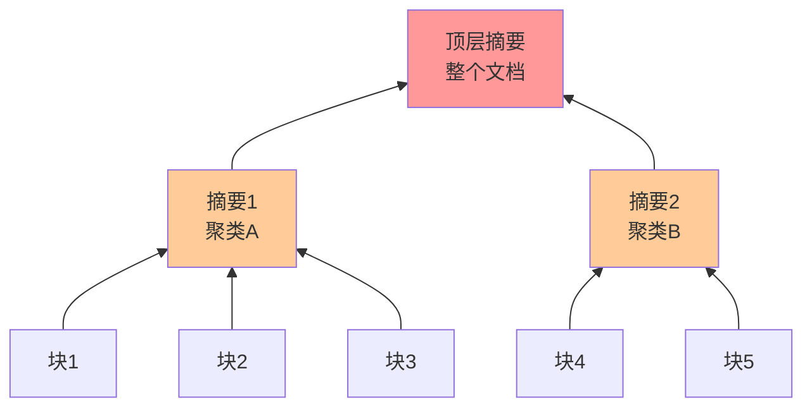

```python
async def build_raptor_tree(
    chunks: List[Dict],
    embed_model: EmbeddingModel,
    llm_client,
    max_levels: int = 3,
    cluster_size: int = 5
) -> List[Dict]:
    """构建 RAPTOR 树状摘要索引"""
    from sklearn.cluster import KMeans
    import numpy as np

    all_nodes = list(chunks)
    current_level = chunks

    for level in range(max_levels):
        if len(current_level) <= cluster_size:
            break

        # 对当前层节点聚类
        contents = [n["content"] for n in current_level]
        embeddings = embed_model.encode_documents(contents)

        n_clusters = max(2, len(current_level) // cluster_size)
        kmeans = KMeans(n_clusters=n_clusters, random_state=42, n_init=10)
        labels = kmeans.fit_predict(embeddings)

        # 对每个簇生成摘要
        summary_nodes = []
        for cluster_id in range(n_clusters):
            cluster_docs = [
                current_level[i] for i, l in enumerate(labels) if l == cluster_id
            ]
            cluster_text = "\n\n".join(d["content"] for d in cluster_docs)

            # 生成摘要
            response = await llm_client.messages.create(
                model="claude-haiku-4-5-20251001",
                max_tokens=300,
                messages=[{
                    "role": "user",
                    "content": f"请对以下内容生成一段简洁的摘要（100-200字）：\n\n{cluster_text[:3000]}"
                }]
            )
            summary = response.content[0].text

            summary_node = {
                "content": summary,
                "metadata": {
                    "level": level + 1,
                    "cluster_id": cluster_id,
                    "child_ids": [d.get("id") for d in cluster_docs],
                    "type": "summary"
                }
            }
            summary_nodes.append(summary_node)
            all_nodes.append(summary_node)

        current_level = summary_nodes
        print(f"Level {level+1}: {len(summary_nodes)} 个摘要节点")

    return all_nodes  # 原始块 + 所有摘要节点，全部加入向量索引
```

### 9.4 Corrective RAG（CRAG）

**核心思想**：对检索结果进行**质量评估**，根据评估结果决定是使用检索内容、抛弃并重新搜索、还是补充搜索。

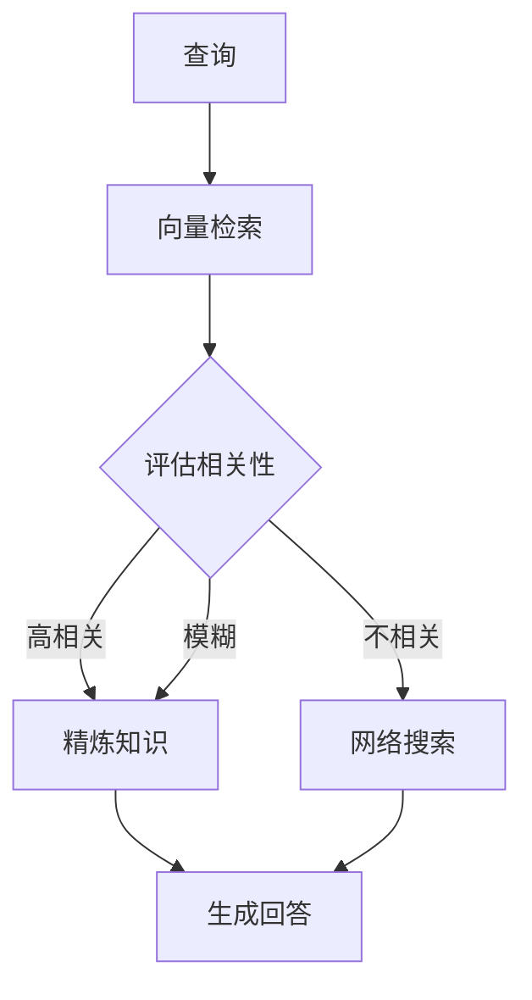

```python
async def crag_retrieve(
    query: str,
    vector_retriever,
    web_search_tool,
    llm_client,
    relevance_threshold: float = 0.5
) -> Dict:
    """Corrective RAG：检索 + 质量评估 + 纠正"""

    # 1. 向量检索
    docs = vector_retriever.search(query, top_k=5)

    # 2. 评估相关性
    eval_prompt = f"""评估以下文档与问题的相关性，输出 JSON：
{{"score": 0-1之间的小数, "reason": "理由"}}

问题：{query}
文档：{docs[0]["content"] if docs else "无"}"""

    eval_response = await llm_client.messages.create(
        model="claude-haiku-4-5-20251001",
        max_tokens=100,
        messages=[{"role": "user", "content": eval_prompt}]
    )

    import json
    try:
        eval_result = json.loads(eval_response.content[0].text)
        relevance_score = eval_result.get("score", 0)
    except:
        relevance_score = 0.5

    print(f"检索相关性评分: {relevance_score:.2f}")

    # 3. 根据评分决策
    if relevance_score >= relevance_threshold:
        # 高相关：直接使用检索结果
        return {"docs": docs, "source": "vector_store", "score": relevance_score}
    elif relevance_score >= 0.2:
        # 中等：向量检索 + 网络搜索补充
        web_results = await web_search_tool(query)
        combined = docs + web_results
        return {"docs": combined, "source": "hybrid", "score": relevance_score}
    else:
        # 低相关：放弃向量检索，直接网络搜索
        web_results = await web_search_tool(query)
        return {"docs": web_results, "source": "web_search", "score": relevance_score}
```

---

## 10. Self-RAG

### 10.1 Self-RAG 框架

Self-RAG（Asai et al. 2023）训练 LLM 自主决定**何时检索、检索内容是否相关、生成是否有依据**，通过在训练数据中插入特殊 reflection token 实现。

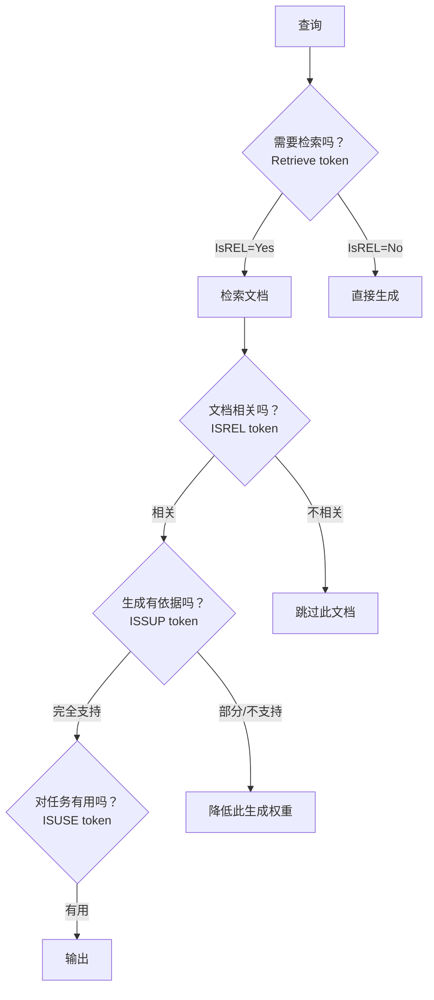

**四种 Reflection Token**：

| Token | 位置 | 含义 |
|-------|------|------|
| `[Retrieve]` / `[No Retrieve]` | 生成前 | 是否需要检索 |
| `[Relevant]` / `[Irrelevant]` | 看到文档后 | 文档是否相关 |
| `[Fully Supported]` / `[Partially Supported]` / `[No Support]` | 生成后 | 生成内容是否有文档支持 |
| `[Utility=1-5]` | 生成后 | 对任务的有用程度 |

```python
# Self-RAG 的推理阶段实现（使用已训练好的 Self-RAG 模型）
# 实际中需要用 Self-RAG 官方模型，这里展示逻辑框架

async def self_rag_inference(query: str, retriever, self_rag_model) -> str:
    """Self-RAG 推理框架"""

    # 1. 判断是否需要检索
    retrieve_decision = await self_rag_model.predict_token(
        f"## Question\n{query}\n## Response\n",
        candidate_tokens=["[Retrieve]", "[No Retrieve]"]
    )

    if retrieve_decision == "[No Retrieve]":
        return await self_rag_model.generate(query)

    # 2. 检索文档
    docs = retriever.search(query, top_k=5)

    # 3. 对每个文档生成候选回答，并用 reflection token 评分
    candidates = []
    for doc in docs:
        # 判断文档相关性
        rel_token = await self_rag_model.predict_token(
            f"[Retrieve]\n{doc['content']}\n{query}",
            candidate_tokens=["[Relevant]", "[Irrelevant]"]
        )
        if rel_token == "[Irrelevant]":
            continue

        # 生成回答
        answer = await self_rag_model.generate(
            f"[Retrieve]\n[Relevant]\n{doc['content']}\n{query}"
        )

        # 评估支持度
        sup_token = await self_rag_model.predict_token(
            f"...\n{answer}",
            candidate_tokens=["[Fully Supported]", "[Partially Supported]", "[No Support]"]
        )

        # 评估有用性
        use_token = await self_rag_model.predict_token(
            f"...\n{answer}",
            candidate_tokens=["[Utility=5]", "[Utility=4]", "[Utility=3]", "[Utility=2]", "[Utility=1]"]
        )

        score = {"[Fully Supported]": 1.0, "[Partially Supported]": 0.5, "[No Support]": 0.0}[sup_token]
        utility = int(use_token[-2]) / 5.0
        candidates.append({"answer": answer, "score": score * 0.7 + utility * 0.3})

    # 4. 选择最高分候选
    if not candidates:
        return "无法找到相关信息。"

    return max(candidates, key=lambda x: x["score"])["answer"]
```

---

## 11. GraphRAG

### 11.1 传统 RAG 的局限

传统 RAG 以文档块为单位，**无法理解跨文档的实体关系和全局主题**。

```
查询：「A公司和B公司的竞争关系对C行业有什么影响？」

传统 RAG 问题：
- A公司、B公司可能在不同文档块中
- 块与块之间的关系（竞争、合作、上下游）丢失
- 无法回答涉及全局视角的问题
```

### 11.2 GraphRAG 架构

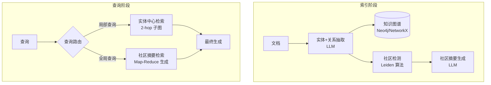

```python
import networkx as nx
from collections import defaultdict

class KnowledgeGraph:
    """简化版知识图谱"""

    def __init__(self):
        self.graph = nx.DiGraph()
        self.entity_texts = {}  # entity_id -> 相关文本

    def add_entities_and_relations(self, entities: List[Dict], relations: List[Dict]):
        """
        entities: [{"id": str, "name": str, "type": str, "description": str}]
        relations: [{"source": str, "target": str, "relation": str, "weight": float}]
        """
        for entity in entities:
            self.graph.add_node(
                entity["id"],
                name=entity["name"],
                type=entity["type"],
                description=entity.get("description", "")
            )

        for rel in relations:
            self.graph.add_edge(
                rel["source"],
                rel["target"],
                relation=rel["relation"],
                weight=rel.get("weight", 1.0)
            )

    def get_subgraph(self, entity_id: str, hops: int = 2) -> nx.DiGraph:
        """获取以实体为中心的 N-hop 子图"""
        nodes = {entity_id}
        for _ in range(hops):
            neighbors = set()
            for n in nodes:
                neighbors.update(self.graph.predecessors(n))
                neighbors.update(self.graph.successors(n))
            nodes.update(neighbors)
        return self.graph.subgraph(nodes)

    def subgraph_to_text(self, subgraph: nx.DiGraph) -> str:
        """将子图转为文本描述"""
        lines = []
        for u, v, data in subgraph.edges(data=True):
            u_name = self.graph.nodes[u].get("name", u)
            v_name = self.graph.nodes[v].get("name", v)
            relation = data.get("relation", "相关")
            lines.append(f"{u_name} --[{relation}]--> {v_name}")
        return "\n".join(lines)


async def extract_entities_and_relations(
    text: str,
    llm_client
) -> tuple[List[Dict], List[Dict]]:
    """用 LLM 抽取文本中的实体和关系"""

    prompt = f"""从以下文本中抽取实体和关系，以 JSON 格式输出：
{{
  "entities": [
    {{"id": "唯一标识", "name": "实体名称", "type": "人物/公司/产品/地点/概念", "description": "简短描述"}}
  ],
  "relations": [
    {{"source": "实体ID", "target": "实体ID", "relation": "关系描述", "weight": 0-1}}
  ]
}}

文本：
{text}"""

    response = await llm_client.messages.create(
        model="claude-sonnet-4-6",
        max_tokens=1000,
        messages=[{"role": "user", "content": prompt}]
    )

    import json, re
    # 提取 JSON
    json_match = re.search(r'\{.*\}', response.content[0].text, re.DOTALL)
    if json_match:
        data = json.loads(json_match.group())
        return data.get("entities", []), data.get("relations", [])
    return [], []
```

---

## 12. RAG 评测体系

### 12.1 RAG Triad（三角评测）

RAGAS 框架提出了三个核心指标：

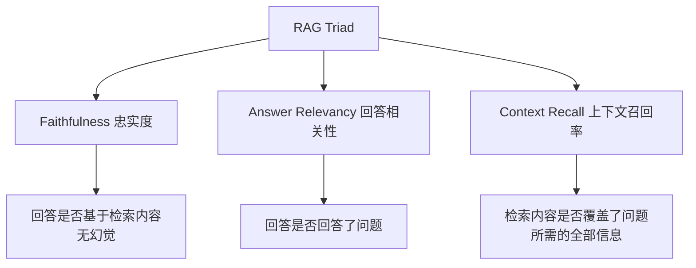

**忠实度（Faithfulness）**：回答中的每个陈述都能在检索内容中找到支持。

$$\text{Faithfulness} = \frac{\text{回答中有依据的陈述数}}{\text{回答中陈述总数}}$$

**回答相关性（Answer Relevancy）**：用 LLM 从回答中生成多个问题，计算这些问题与原始问题的 embedding 相似度。

$$\text{Answer Relevancy} = \frac{1}{N}\sum_{i=1}^N \cos(\mathbf{v}_{q_i}, \mathbf{v}_q)$$

**上下文召回率（Context Recall）**：检索内容中有多少 ground truth 中的信息点被覆盖。

```python
# RAGAS 自动化评测
from ragas import evaluate
from ragas.metrics import faithfulness, answer_relevancy, context_recall
from datasets import Dataset

def evaluate_rag_system(
    questions: List[str],
    answers: List[str],
    contexts: List[List[str]],
    ground_truths: List[str]
) -> Dict:
    """
    使用 RAGAS 评测 RAG 系统

    questions:     用户问题
    answers:       RAG 系统生成的回答
    contexts:      检索到的文档内容（每个问题对应多个）
    ground_truths: 参考答案
    """
    dataset = Dataset.from_dict({
        "question": questions,
        "answer": answers,
        "contexts": contexts,
        "ground_truth": ground_truths,
    })

    result = evaluate(
        dataset,
        metrics=[faithfulness, answer_relevancy, context_recall],
    )
    return result
```

### 12.2 检索阶段评测

```python
def evaluate_retrieval(
    queries: List[str],
    relevant_doc_ids: List[List[str]],  # ground truth
    retrieved_doc_ids: List[List[str]], # 检索结果
    k: int = 5
) -> Dict:
    """评测检索阶段的精确率、召回率和 MRR"""

    precisions, recalls, mrrs, ndcgs = [], [], [], []

    for relevant, retrieved in zip(relevant_doc_ids, retrieved_doc_ids):
        relevant_set = set(relevant)
        retrieved_k = retrieved[:k]

        # Precision@K
        hits = sum(1 for d in retrieved_k if d in relevant_set)
        precisions.append(hits / k)

        # Recall@K
        recalls.append(hits / len(relevant_set) if relevant_set else 0)

        # MRR（Mean Reciprocal Rank）
        mrr = 0
        for rank, doc_id in enumerate(retrieved_k, 1):
            if doc_id in relevant_set:
                mrr = 1 / rank
                break
        mrrs.append(mrr)

        # NDCG@K
        import math
        dcg = sum(
            1 / math.log2(rank + 1)
            for rank, doc_id in enumerate(retrieved_k, 1)
            if doc_id in relevant_set
        )
        ideal_dcg = sum(1 / math.log2(i + 1) for i in range(1, min(len(relevant_set), k) + 1))
        ndcgs.append(dcg / ideal_dcg if ideal_dcg > 0 else 0)

    return {
        f"Precision@{k}": sum(precisions) / len(precisions),
        f"Recall@{k}":    sum(recalls) / len(recalls),
        "MRR":            sum(mrrs) / len(mrrs),
        f"NDCG@{k}":      sum(ndcgs) / len(ndcgs),
    }
```

---

## 13. 生产级实现

### 13.1 完整 RAG Pipeline

```python
import asyncio
import hashlib
from typing import List, Dict, Optional

class ProductionRAG:
    """
    生产级 RAG 系统
    集成：文档处理 / 混合检索 / 重排序 / 引用生成
    """

    def __init__(
        self,
        embed_model: EmbeddingModel,
        vector_store: VectorStore,
        reranker: Reranker,
        llm_client,
        use_hyde: bool = False,
        use_query_rewrite: bool = True,
        compress_context: bool = True,
    ):
        self.embed = embed_model
        self.vs = vector_store
        self.reranker = reranker
        self.llm = llm_client
        self.use_hyde = use_hyde
        self.use_query_rewrite = use_query_rewrite
        self.compress_context = compress_context

        # BM25 检索器（与向量检索混合）
        self.hybrid = HybridRetriever(vector_store, embed_model)

    # ========== 索引 ==========

    async def index_documents(self, file_paths: List[str]) -> Dict:
        """批量索引文档"""
        loader = DocumentLoader()
        splitter = TextSplitter(chunk_size=512, chunk_overlap=64)
        stats = {"files": 0, "chunks": 0, "errors": []}

        all_chunks = []
        for path in file_paths:
            try:
                docs = loader.load(path)
                for doc in docs:
                    texts = splitter.split(doc["content"])
                    for i, text in enumerate(texts):
                        chunk_id = hashlib.md5(
                            f"{path}_{i}_{text[:50]}".encode()
                        ).hexdigest()
                        all_chunks.append({
                            "id": chunk_id,
                            "content": text,
                            "metadata": {**doc["metadata"], "chunk_index": i}
                        })
                stats["files"] += 1
            except Exception as e:
                stats["errors"].append({"file": path, "error": str(e)})

        # 批量 embedding
        contents = [c["content"] for c in all_chunks]
        embeddings = self.embed.encode_documents(contents)
        for chunk, emb in zip(all_chunks, embeddings):
            chunk["embedding"] = emb.tolist()

        # 插入向量数据库
        self.vs.upsert(all_chunks)

        # 构建 BM25 索引
        self.hybrid.build_bm25_index(all_chunks)

        stats["chunks"] = len(all_chunks)
        return stats

    # ========== 检索 ==========

    async def retrieve(
        self,
        query: str,
        top_k: int = 5,
        filters: Optional[Dict] = None,
    ) -> List[Dict]:
        """完整检索流程"""

        # 1. 查询优化
        if self.use_query_rewrite:
            queries = await rewrite_query(query, self.llm)
        else:
            queries = [query]

        # 2. 多查询混合检索
        all_results = []
        seen_ids = set()
        for q in queries:
            if self.use_hyde:
                results = await hyde_retrieve(q, self.hybrid, self.embed, self.llm)
            else:
                results = self.hybrid.search(q, top_k=top_k * 2, filters=filters)

            for r in results:
                rid = r.get("id") or r["content"][:50]
                if rid not in seen_ids:
                    seen_ids.add(rid)
                    all_results.append(r)

        # 3. 重排序
        reranked = self.reranker.rerank(query, all_results, top_k=top_k * 2)

        # 4. 上下文压缩
        if self.compress_context:
            reranked = await compress_documents(query, reranked, self.llm)

        return reranked[:top_k]

    # ========== 生成 ==========

    async def query(
        self,
        question: str,
        top_k: int = 5,
        filters: Optional[Dict] = None,
        stream: bool = False,
    ) -> Dict:
        """完整 RAG 问答"""

        # 检索
        docs = await self.retrieve(question, top_k=top_k, filters=filters)

        if not docs:
            return {
                "answer": "抱歉，知识库中没有找到与您问题相关的信息。",
                "documents": [],
                "citations": []
            }

        # 生成
        result = await generate_with_citations(question, docs, self.llm)
        result["documents"] = [
            {"content": d["content"][:200], "source": d.get("metadata", {}).get("source")}
            for d in docs
        ]
        return result


# ========== 使用示例 ==========

async def main():
    embed_model = EmbeddingModel("BAAI/bge-m3")
    vector_store = VectorStore("my_knowledge_base", embedding_dim=1024)
    reranker = Reranker("BAAI/bge-reranker-v2-m3")

    import anthropic
    llm_client = anthropic.AsyncAnthropic()

    rag = ProductionRAG(
        embed_model=embed_model,
        vector_store=vector_store,
        reranker=reranker,
        llm_client=llm_client,
        use_hyde=False,
        use_query_rewrite=True,
        compress_context=True,
    )

    # 索引文档
    stats = await rag.index_documents(["docs/manual.pdf", "docs/faq.md"])
    print(f"索引完成: {stats}")

    # 查询
    result = await rag.query("如何配置系统？")
    print(f"回答: {result['answer']}")
    for cite in result["citations"]:
        print(f"  来源[{cite['reference_number']}]: {cite['source']}")

if __name__ == "__main__":
    asyncio.run(main())
```

### 13.2 生产环境 RAG 架构

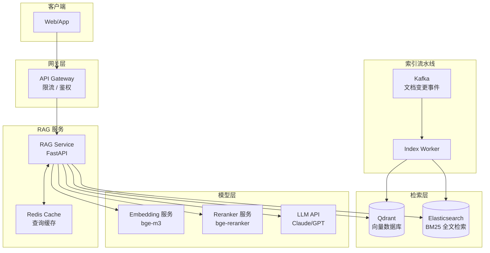

---

## 总结

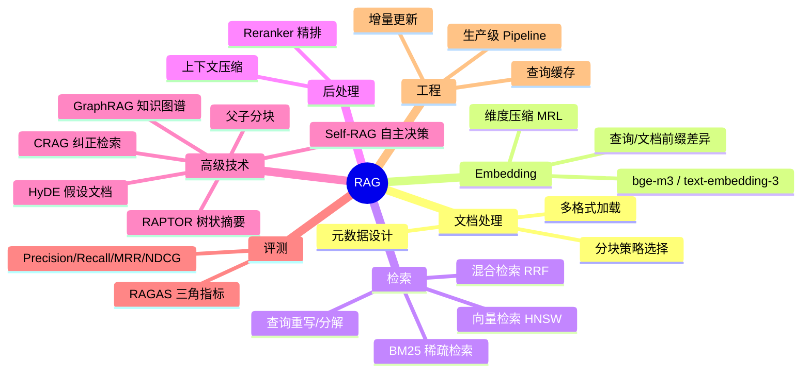

**RAG 系统最关键的三个设计决策**：

1. **分块策略**：块太小失去上下文，块太大检索精度下降。推荐 Parent-Child 分块，小块检索大块生成
2. **混合检索**：单纯向量检索对精确关键词不友好，单纯 BM25 不理解语义。RRF 融合是目前最稳健的方案
3. **重排序**：Reranker 是最高性价比的检索质量提升手段，几乎是生产环境的标配
