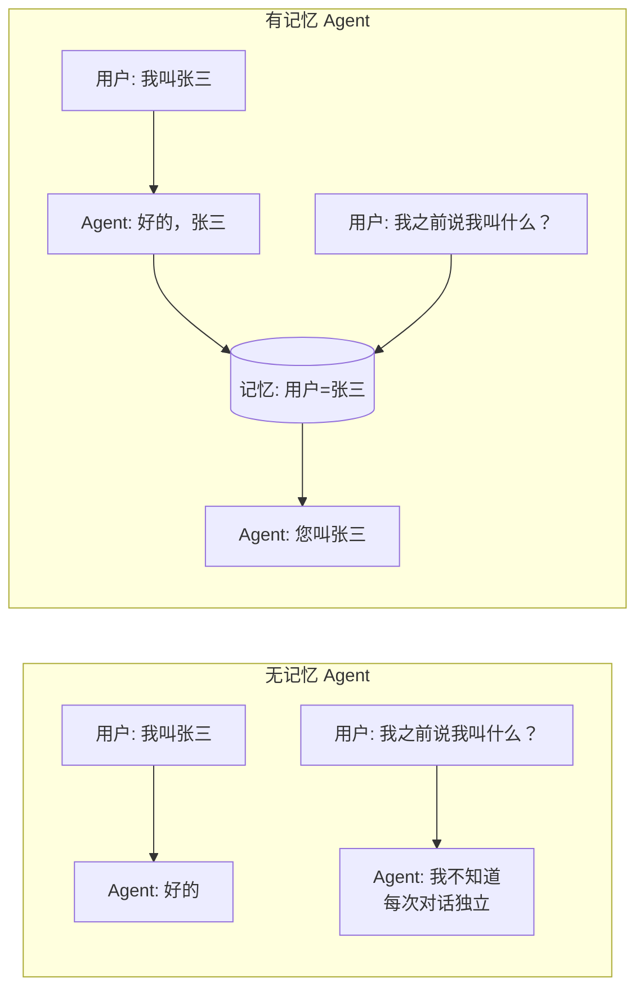
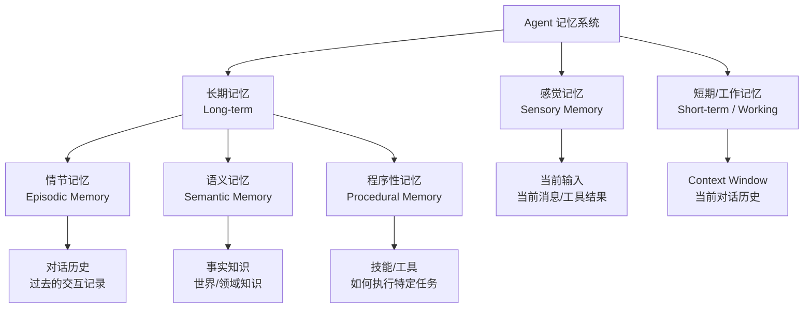
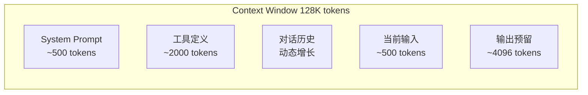
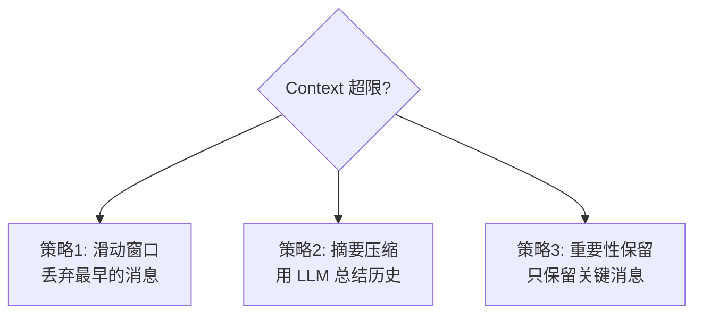
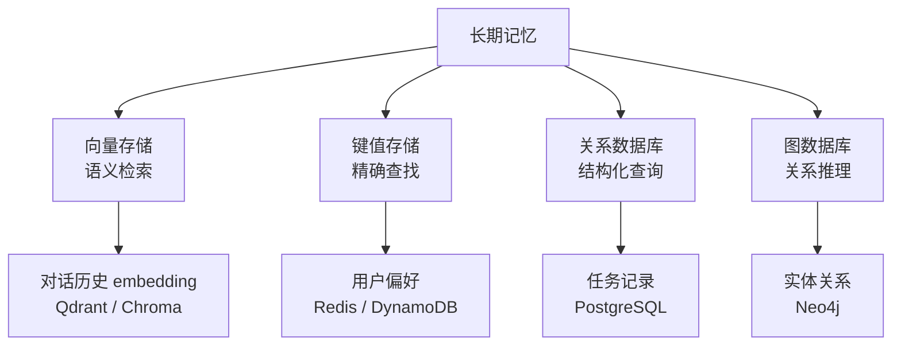
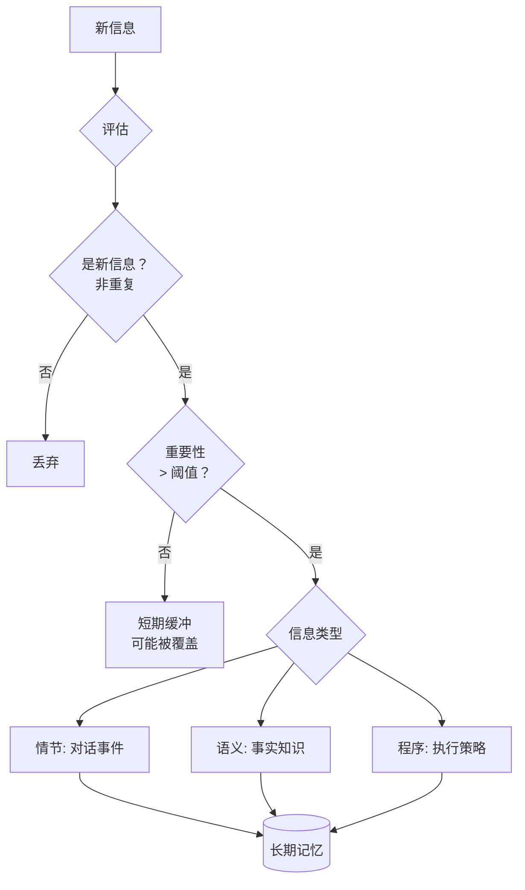
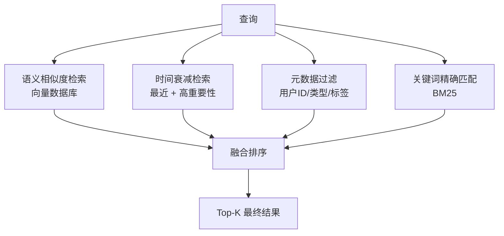
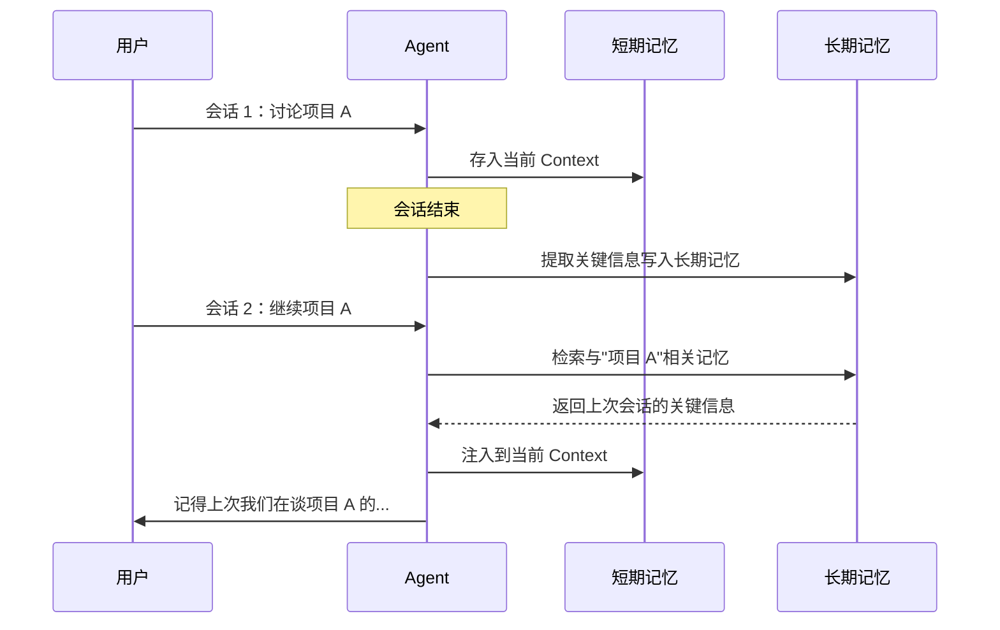
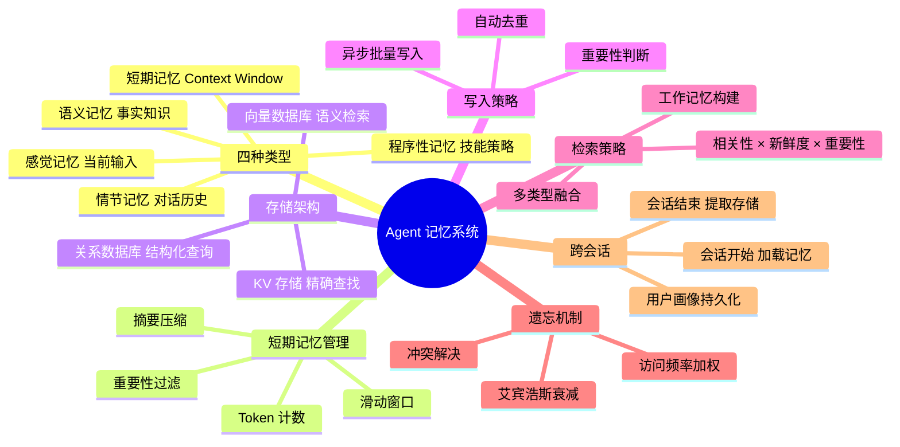

人类的智能很大程度上依赖记忆——不只是当下的感知，还有过去的经验、长期积累的知识、以及对未来的预期。AI Agent 也一样：没有记忆系统的 Agent 每次对话都从零开始，无法积累经验，无法跨会话保持状态。本文系统拆解 Agent 记忆系统的四种类型、存储架构、检索策略、遗忘机制，以及生产环境中的完整实现。

---

## 目录

1. [为什么 Agent 需要记忆](#1-为什么-agent-需要记忆)
2. [记忆的四种类型](#2-记忆的四种类型)
3. [短期记忆：Context Window 管理](#3-短期记忆context-window-管理)
4. [长期记忆：存储架构](#4-长期记忆存储架构)
5. [情节记忆：对话历史管理](#5-情节记忆对话历史管理)
6. [语义记忆：知识库](#6-语义记忆知识库)
7. [程序性记忆：技能与工具](#7-程序性记忆技能与工具)
8. [记忆写入策略](#8-记忆写入策略)
9. [记忆检索策略](#9-记忆检索策略)
10. [遗忘与更新机制](#10-遗忘与更新机制)
11. [跨会话记忆](#11-跨会话记忆)
12. [完整记忆系统实现](#12-完整记忆系统实现)

---

## 1. 为什么 Agent 需要记忆

### 1.1 无记忆 Agent 的困境



无记忆 Agent 的核心问题：
- **每次重新介绍**：用户每轮对话都要重新提供上下文
- **无法积累经验**：每次错误都重蹈覆辙，无法从历史中学习
- **无法执行长期任务**：跨越多个会话的任务无法完成
- **个性化缺失**：无法记住用户偏好，每次都是陌生人

### 1.2 记忆对 Agent 能力的影响

$$\text{Agent 能力} = f(\underbrace{\text{LLM 能力}}_{\text{参数知识}} + \underbrace{\text{工具}}_{\text{实时能力}} + \underbrace{\text{记忆}}_{\text{历史经验}})$$

记忆系统解锁的能力：

| 能力 | 无记忆 | 有记忆 |
|------|-------|-------|
| 多轮对话 | ❌ 靠 context window | ✅ 跨会话持久 |
| 用户个性化 | ❌ | ✅ 记住偏好、习惯 |
| 长期任务 | ❌ | ✅ 跨天/跨周执行 |
| 经验积累 | ❌ | ✅ 从错误中学习 |
| 知识库 | ❌ | ✅ 私有领域知识 |

---

## 2. 记忆的四种类型

认知科学将人类记忆分为四类，AI Agent 的记忆系统与此高度对应：



| 类型 | 人类类比 | Agent 实现 | 时效 | 容量 |
|------|---------|-----------|------|------|
| **感觉记忆** | 感官输入 | 当前消息 | 毫秒级 | 极小 |
| **短期记忆** | 工作记忆 | Context Window | 会话内 | ~128K tokens |
| **情节记忆** | 自传式记忆 | 对话历史数据库 | 永久 | 无限 |
| **语义记忆** | 常识/知识 | 向量知识库 | 永久 | 无限 |
| **程序性记忆** | 技能/习惯 | 工具定义/Prompt | 永久 | 无限 |

---

## 3. 短期记忆：Context Window 管理

### 3.1 Context Window 的本质限制

Context Window 是 LLM 能够"看到"的所有信息的上限，是 Agent 最直接的工作记忆空间。



**可用于对话历史的空间**：

$$T_\text{history} = T_\text{total} - T_\text{system} - T_\text{tools} - T_\text{input} - T_\text{output}$$

以 128K context，20 个工具为例：

$$T_\text{history} = 128000 - 500 - 2000 - 500 - 4096 \approx 120000 \text{ tokens}$$

听起来很多，但多步 Agent 执行中，每步的工具结果可能很长（搜索结果、代码输出），很快填满。

### 3.2 Token 计数

精确的 token 计数是 context 管理的基础：

```python
import tiktoken
from typing import List, Dict, Union

class TokenCounter:
    """多模型 Token 计数器"""

    # 不同模型的编码器
    ENCODERS = {
        "gpt-4o": "o200k_base",
        "gpt-4": "cl100k_base",
        "gpt-3.5-turbo": "cl100k_base",
        # Claude 使用近似计数（Anthropic 未开放 tokenizer）
        "claude": "cl100k_base",  # 近似
    }

    def __init__(self, model: str = "gpt-4o"):
        encoder_name = self.ENCODERS.get(model, "cl100k_base")
        self.enc = tiktoken.get_encoding(encoder_name)
        self.model = model

    def count(self, text: str) -> int:
        """计算文本的 token 数"""
        return len(self.enc.encode(text))

    def count_messages(self, messages: List[Dict]) -> int:
        """计算消息列表的总 token 数（含格式开销）"""
        total = 0
        for msg in messages:
            # 每条消息有 4 token 的格式开销
            total += 4
            for key, value in msg.items():
                if isinstance(value, str):
                    total += self.count(value)
                elif isinstance(value, list):
                    # content blocks
                    for block in value:
                        if isinstance(block, dict):
                            total += self.count(str(block.get("text", "")))
        total += 2  # 回复前缀
        return total

    def truncate_to_limit(
        self, text: str, max_tokens: int, from_end: bool = False
    ) -> str:
        """截断文本到 token 限制"""
        tokens = self.enc.encode(text)
        if len(tokens) <= max_tokens:
            return text
        if from_end:
            tokens = tokens[-max_tokens:]
        else:
            tokens = tokens[:max_tokens]
        return self.enc.decode(tokens)
```

### 3.3 Context 压缩策略

当 context 接近限制时，有三种处理策略：



```python
import asyncio
from dataclasses import dataclass, field
from typing import List, Dict, Optional

@dataclass
class ContextManager:
    """
    Context Window 管理器
    自动处理 token 超限问题
    """
    max_tokens: int = 100000
    reserve_tokens: int = 8000    # 为输出预留
    summary_threshold: float = 0.8  # 超过 80% 时触发压缩
    token_counter: TokenCounter = field(default_factory=TokenCounter)

    async def manage(
        self,
        messages: List[Dict],
        system: str = "",
        llm_client = None,
        strategy: str = "summary"  # "sliding" | "summary" | "importance"
    ) -> List[Dict]:
        """
        检查并管理 context，超限时自动压缩
        """
        system_tokens = self.token_counter.count(system)
        msg_tokens = self.token_counter.count_messages(messages)
        total = system_tokens + msg_tokens

        available = self.max_tokens - self.reserve_tokens
        threshold = available * self.summary_threshold

        if total <= threshold:
            return messages  # 无需压缩

        print(f"Context 接近限制 ({total}/{available} tokens)，触发压缩策略: {strategy}")

        if strategy == "sliding":
            return self._sliding_window(messages, available - system_tokens)
        elif strategy == "summary":
            return await self._summary_compress(messages, available - system_tokens, llm_client)
        elif strategy == "importance":
            return self._importance_filter(messages, available - system_tokens)
        else:
            return self._sliding_window(messages, available - system_tokens)

    def _sliding_window(self, messages: List[Dict], token_budget: int) -> List[Dict]:
        """
        滑动窗口：从最新消息向前保留，直到填满预算
        始终保留第一条 user 消息（任务目标）
        """
        # 保留最初的任务消息
        first_user = next((m for m in messages if m["role"] == "user"), None)
        recent = list(reversed(messages))

        kept = []
        used_tokens = 0

        for msg in recent:
            msg_tokens = self.token_counter.count_messages([msg])
            if used_tokens + msg_tokens > token_budget:
                break
            kept.insert(0, msg)
            used_tokens += msg_tokens

        # 确保第一条任务消息存在
        if first_user and kept and kept[0] != first_user:
            kept.insert(0, first_user)

        return kept

    async def _summary_compress(
        self,
        messages: List[Dict],
        token_budget: int,
        llm_client
    ) -> List[Dict]:
        """
        摘要压缩：将早期对话压缩为摘要，保留近期完整对话
        """
        # 确定保留多少最近消息（预留 50% 给最近消息）
        recent_budget = token_budget // 2
        recent_messages = self._sliding_window(messages, recent_budget)

        # 需要压缩的早期消息
        split_idx = messages.index(recent_messages[0]) if recent_messages else len(messages)
        early_messages = messages[:split_idx]

        if not early_messages:
            return messages

        # 生成摘要
        history_text = "\n".join([
            f"{m['role'].upper()}: {m.get('content', '') or '[工具调用]'}"
            for m in early_messages
        ])

        summary_response = await llm_client.messages.create(
            model="claude-haiku-4-5-20251001",
            max_tokens=500,
            messages=[{
                "role": "user",
                "content": (
                    "请将以下对话历史压缩为简洁摘要，"
                    "保留：用户目标、关键决策、重要发现、已完成的步骤：\n\n"
                    f"{history_text}"
                )
            }]
        )
        summary = summary_response.content[0].text

        # 构建压缩后的消息列表
        summary_message = {
            "role": "user",
            "content": f"[早期对话摘要]\n{summary}"
        }
        ack_message = {
            "role": "assistant",
            "content": "已理解早期对话历史，继续执行任务。"
        }

        return [summary_message, ack_message] + recent_messages

    def _importance_filter(
        self,
        messages: List[Dict],
        token_budget: int
    ) -> List[Dict]:
        """
        重要性过滤：保留标记为重要的消息
        需要在写入消息时附带重要性标记
        """
        # 始终保留的消息类型
        important = [
            m for m in messages
            if (
                m.get("important", False) or
                m["role"] == "system" or
                # 保留最后 N 条
                messages.index(m) >= len(messages) - 6
            )
        ]

        used = self.token_counter.count_messages(important)
        if used <= token_budget:
            return important

        return self._sliding_window(important, token_budget)
```

---

## 4. 长期记忆：存储架构

### 4.1 长期记忆的存储层次



不同存储的适用场景：

| 存储类型 | 查询方式 | 适合存储 | 代表工具 |
|---------|---------|---------|---------|
| 向量数据库 | 语义相似度 | 对话片段、文档、经验 | Qdrant, Chroma |
| KV 存储 | 精确 key 查找 | 用户配置、会话状态 | Redis |
| 关系数据库 | SQL 结构化查询 | 任务历史、元数据 | PostgreSQL |
| 图数据库 | 图遍历/路径 | 实体关系、知识图谱 | Neo4j |

### 4.2 统一记忆接口

```python
from abc import ABC, abstractmethod
from typing import List, Dict, Any, Optional
from dataclasses import dataclass, field
from datetime import datetime
import uuid

@dataclass
class MemoryItem:
    """记忆条目的统一数据结构"""
    id: str = field(default_factory=lambda: str(uuid.uuid4()))
    content: str = ""
    memory_type: str = "episodic"   # episodic | semantic | procedural
    importance: float = 0.5         # 0-1，越高越重要
    embedding: Optional[List[float]] = None
    metadata: Dict[str, Any] = field(default_factory=dict)
    created_at: datetime = field(default_factory=datetime.utcnow)
    accessed_at: datetime = field(default_factory=datetime.utcnow)
    access_count: int = 0
    decay_factor: float = 1.0       # 遗忘衰减因子

    @property
    def effective_importance(self) -> float:
        """考虑时间衰减的有效重要性"""
        age_hours = (datetime.utcnow() - self.created_at).total_seconds() / 3600
        # 指数衰减，半衰期约 168 小时（1 周）
        decay = self.decay_factor ** (age_hours / 168)
        return self.importance * decay


class MemoryStore(ABC):
    """记忆存储的统一抽象接口"""

    @abstractmethod
    async def save(self, item: MemoryItem) -> str:
        """保存记忆条目，返回 ID"""
        pass

    @abstractmethod
    async def search(
        self,
        query: str,
        top_k: int = 5,
        memory_type: Optional[str] = None,
        filters: Optional[Dict] = None,
    ) -> List[MemoryItem]:
        """语义搜索记忆"""
        pass

    @abstractmethod
    async def get(self, memory_id: str) -> Optional[MemoryItem]:
        """按 ID 获取记忆"""
        pass

    @abstractmethod
    async def update(self, memory_id: str, updates: Dict) -> bool:
        """更新记忆条目"""
        pass

    @abstractmethod
    async def delete(self, memory_id: str) -> bool:
        """删除记忆条目"""
        pass

    @abstractmethod
    async def list_recent(
        self, limit: int = 20, memory_type: Optional[str] = None
    ) -> List[MemoryItem]:
        """获取最近的记忆"""
        pass
```

### 4.3 向量记忆存储实现

```python
import asyncio
import json
import numpy as np
from qdrant_client import AsyncQdrantClient
from qdrant_client.models import (
    Distance, VectorParams, PointStruct,
    Filter, FieldCondition, MatchValue, Range,
    UpdateStatus
)

class VectorMemoryStore(MemoryStore):
    """
    基于 Qdrant 的向量记忆存储
    支持语义检索 + 结构化过滤
    """

    def __init__(
        self,
        collection_name: str,
        embed_model: EmbeddingModel,
        url: str = "http://localhost:6333",
        embedding_dim: int = 1024,
    ):
        self.client = AsyncQdrantClient(url=url)
        self.collection = collection_name
        self.embed = embed_model
        self.embedding_dim = embedding_dim

    async def initialize(self):
        """初始化 collection"""
        collections = await self.client.get_collections()
        names = [c.name for c in collections.collections]
        if self.collection not in names:
            await self.client.create_collection(
                collection_name=self.collection,
                vectors_config=VectorParams(
                    size=self.embedding_dim,
                    distance=Distance.COSINE,
                )
            )

    async def save(self, item: MemoryItem) -> str:
        """保存记忆，自动计算 embedding"""
        if item.embedding is None:
            item.embedding = self.embed.encode_documents([item.content])[0].tolist()

        payload = {
            "content": item.content,
            "memory_type": item.memory_type,
            "importance": item.importance,
            "created_at": item.created_at.isoformat(),
            "accessed_at": item.accessed_at.isoformat(),
            "access_count": item.access_count,
            "decay_factor": item.decay_factor,
            **item.metadata,
        }

        await self.client.upsert(
            collection_name=self.collection,
            points=[PointStruct(
                id=item.id,
                vector=item.embedding,
                payload=payload,
            )],
            wait=True,
        )
        return item.id

    async def search(
        self,
        query: str,
        top_k: int = 5,
        memory_type: Optional[str] = None,
        filters: Optional[Dict] = None,
        score_threshold: float = 0.3,
    ) -> List[MemoryItem]:
        """语义搜索记忆"""
        query_emb = self.embed.encode_query(query).tolist()

        # 构建过滤条件
        conditions = []
        if memory_type:
            conditions.append(FieldCondition(
                key="memory_type", match=MatchValue(value=memory_type)
            ))
        if filters:
            for k, v in filters.items():
                conditions.append(FieldCondition(
                    key=k, match=MatchValue(value=v)
                ))
        qdrant_filter = Filter(must=conditions) if conditions else None

        results = await self.client.search(
            collection_name=self.collection,
            query_vector=query_emb,
            limit=top_k,
            score_threshold=score_threshold,
            query_filter=qdrant_filter,
            with_payload=True,
        )

        items = []
        for r in results:
            p = r.payload
            item = MemoryItem(
                id=str(r.id),
                content=p.get("content", ""),
                memory_type=p.get("memory_type", "episodic"),
                importance=p.get("importance", 0.5),
                embedding=None,  # 不返回 embedding 节省内存
                metadata={k: v for k, v in p.items()
                          if k not in ("content", "memory_type", "importance",
                                       "created_at", "accessed_at", "access_count",
                                       "decay_factor")},
                access_count=p.get("access_count", 0),
            )
            items.append(item)

            # 更新访问记录（异步，不阻塞）
            asyncio.create_task(self._update_access(str(r.id)))

        return items

    async def _update_access(self, memory_id: str):
        """更新访问时间和次数（遗忘算法使用）"""
        try:
            result = await self.client.retrieve(
                collection_name=self.collection,
                ids=[memory_id],
                with_payload=True,
            )
            if result:
                old = result[0].payload
                await self.client.set_payload(
                    collection_name=self.collection,
                    payload={
                        "accessed_at": datetime.utcnow().isoformat(),
                        "access_count": old.get("access_count", 0) + 1,
                    },
                    points=[memory_id],
                )
        except Exception:
            pass  # 访问记录更新失败不影响主流程

    async def get(self, memory_id: str) -> Optional[MemoryItem]:
        result = await self.client.retrieve(
            collection_name=self.collection,
            ids=[memory_id],
            with_payload=True,
        )
        if not result:
            return None
        p = result[0].payload
        return MemoryItem(
            id=memory_id,
            content=p.get("content", ""),
            memory_type=p.get("memory_type", "episodic"),
            importance=p.get("importance", 0.5),
        )

    async def update(self, memory_id: str, updates: Dict) -> bool:
        await self.client.set_payload(
            collection_name=self.collection,
            payload=updates,
            points=[memory_id],
        )
        return True

    async def delete(self, memory_id: str) -> bool:
        await self.client.delete(
            collection_name=self.collection,
            points_selector=[memory_id],
        )
        return True

    async def list_recent(
        self,
        limit: int = 20,
        memory_type: Optional[str] = None
    ) -> List[MemoryItem]:
        """获取最近创建的记忆"""
        conditions = []
        if memory_type:
            conditions.append(FieldCondition(
                key="memory_type", match=MatchValue(value=memory_type)
            ))

        results, _ = await self.client.scroll(
            collection_name=self.collection,
            scroll_filter=Filter(must=conditions) if conditions else None,
            limit=limit,
            with_payload=True,
            order_by="created_at",
        )

        return [
            MemoryItem(
                id=str(r.id),
                content=r.payload.get("content", ""),
                memory_type=r.payload.get("memory_type", "episodic"),
                importance=r.payload.get("importance", 0.5),
            )
            for r in results
        ]
```

---

## 5. 情节记忆：对话历史管理

### 5.1 情节记忆的结构

情节记忆（Episodic Memory）存储具体的"事件"——什么时候、谁说了什么、发生了什么：

```python
@dataclass
class Episode:
    """一次对话/交互的情节记录"""
    id: str = field(default_factory=lambda: str(uuid.uuid4()))
    session_id: str = ""
    user_id: str = ""

    # 对话内容
    user_message: str = ""
    agent_response: str = ""
    tool_calls: List[Dict] = field(default_factory=list)

    # 上下文
    task: str = ""                     # 本次对话的任务
    outcome: str = ""                  # 结果：success | failure | partial
    key_findings: List[str] = field(default_factory=list)  # 关键发现

    # 时间
    started_at: datetime = field(default_factory=datetime.utcnow)
    duration_seconds: float = 0

    # 标签（用于过滤检索）
    tags: List[str] = field(default_factory=list)
    importance: float = 0.5

    def to_memory_text(self) -> str:
        """转为可嵌入的文本表示"""
        parts = [f"任务: {self.task}"] if self.task else []
        if self.user_message:
            parts.append(f"用户: {self.user_message}")
        if self.agent_response:
            parts.append(f"Agent: {self.agent_response[:200]}")
        if self.key_findings:
            parts.append(f"关键发现: {'; '.join(self.key_findings)}")
        if self.outcome:
            parts.append(f"结果: {self.outcome}")
        return "\n".join(parts)


class EpisodicMemory:
    """情节记忆管理器"""

    def __init__(self, store: VectorMemoryStore, db_conn=None):
        self.store = store
        self.db = db_conn  # 关系数据库，用于精确查询

    async def record_episode(self, episode: Episode) -> str:
        """记录一次对话情节"""
        # 1. 存入向量数据库（用于语义检索）
        item = MemoryItem(
            id=episode.id,
            content=episode.to_memory_text(),
            memory_type="episodic",
            importance=episode.importance,
            metadata={
                "session_id": episode.session_id,
                "user_id": episode.user_id,
                "outcome": episode.outcome,
                "tags": episode.tags,
                "started_at": episode.started_at.isoformat(),
            }
        )
        await self.store.save(item)

        # 2. 存入关系数据库（用于精确查询：按时间范围、用户ID等）
        if self.db:
            await self.db.execute(
                """INSERT INTO episodes
                   (id, session_id, user_id, task, outcome, importance, started_at)
                   VALUES ($1,$2,$3,$4,$5,$6,$7)
                   ON CONFLICT (id) DO UPDATE SET
                   outcome=EXCLUDED.outcome, importance=EXCLUDED.importance""",
                episode.id, episode.session_id, episode.user_id,
                episode.task, episode.outcome, episode.importance,
                episode.started_at
            )
        return episode.id

    async def recall_similar(
        self,
        query: str,
        user_id: str = "",
        top_k: int = 5,
    ) -> List[Episode]:
        """检索语义相似的历史情节"""
        filters = {}
        if user_id:
            filters["user_id"] = user_id

        items = await self.store.search(
            query=query,
            top_k=top_k,
            memory_type="episodic",
            filters=filters,
        )
        return items

    async def get_recent_context(
        self,
        session_id: str,
        limit: int = 10,
    ) -> List[MemoryItem]:
        """获取当前会话的最近情节"""
        return await self.store.list_recent(
            limit=limit,
            memory_type="episodic",
        )
```

---

## 6. 语义记忆：知识库

### 6.1 语义记忆 vs 情节记忆

| 维度 | 情节记忆 | 语义记忆 |
|------|---------|---------|
| 内容 | "我上周帮用户A查了X" | "X 的定义是..." |
| 时间性 | 有具体时间戳 | 无时间性，是通用知识 |
| 来源 | 交互过程 | 文档、学习、总结 |
| 更新方式 | 追加 | 覆盖更新 |

### 6.2 语义记忆的自动提取

Agent 在对话中可以自动提取新知识，存入语义记忆：

```python
class SemanticMemory:
    """
    语义记忆：从对话和文档中提取的事实性知识
    """

    EXTRACTION_PROMPT = """从以下对话/文本中提取值得长期记忆的事实性知识。
只提取通用、稳定的事实，不要提取具体的对话事件。

输出 JSON 数组，每项包含：
- "fact": 事实陈述（一句话）
- "category": 分类（用户信息/产品知识/领域知识/规则约束）
- "importance": 0-1 之间的重要性评分
- "confidence": 0-1 之间的置信度

如果没有值得提取的事实，返回空数组 []。

文本：
{text}"""

    def __init__(self, store: VectorMemoryStore, llm_client):
        self.store = store
        self.llm = llm_client

    async def extract_and_store(self, text: str, source: str = "") -> List[str]:
        """从文本自动提取并存储语义记忆"""
        response = await self.llm.messages.create(
            model="claude-haiku-4-5-20251001",
            max_tokens=500,
            messages=[{
                "role": "user",
                "content": self.EXTRACTION_PROMPT.format(text=text[:3000])
            }]
        )

        import json, re
        try:
            text_content = response.content[0].text
            json_match = re.search(r'\[.*\]', text_content, re.DOTALL)
            facts = json.loads(json_match.group()) if json_match else []
        except Exception:
            return []

        saved_ids = []
        for fact in facts:
            if fact.get("confidence", 0) < 0.6:
                continue  # 过滤低置信度事实

            # 检查是否已有相似记忆（去重）
            existing = await self.store.search(
                query=fact["fact"],
                top_k=1,
                memory_type="semantic",
                score_threshold=0.9,
            )

            if existing:
                # 更新已有记忆
                await self.store.update(existing[0].id, {
                    "content": fact["fact"],
                    "importance": max(
                        existing[0].importance,
                        fact.get("importance", 0.5)
                    ),
                })
                saved_ids.append(existing[0].id)
            else:
                # 创建新记忆
                item = MemoryItem(
                    content=fact["fact"],
                    memory_type="semantic",
                    importance=fact.get("importance", 0.5),
                    metadata={
                        "category": fact.get("category", ""),
                        "source": source,
                        "confidence": fact.get("confidence", 0.8),
                    }
                )
                memory_id = await self.store.save(item)
                saved_ids.append(memory_id)

        if saved_ids:
            print(f"提取并存储了 {len(saved_ids)} 条语义记忆")
        return saved_ids

    async def query_knowledge(
        self,
        query: str,
        category: Optional[str] = None,
        top_k: int = 5,
    ) -> List[MemoryItem]:
        """查询语义知识"""
        filters = {}
        if category:
            filters["category"] = category

        return await self.store.search(
            query=query,
            top_k=top_k,
            memory_type="semantic",
            filters=filters,
        )
```

---

## 7. 程序性记忆：技能与工具

### 7.1 程序性记忆的概念

程序性记忆存储"如何做某事"的知识——不是事实，而是过程和策略：

```python
@dataclass
class Skill:
    """
    程序性记忆：一个可复用的技能/策略
    从成功的执行经验中提炼
    """
    id: str = field(default_factory=lambda: str(uuid.uuid4()))
    name: str = ""
    description: str = ""

    # 触发条件：什么情况下使用这个技能
    trigger_conditions: List[str] = field(default_factory=list)

    # 执行步骤
    steps: List[str] = field(default_factory=list)

    # 需要的工具
    required_tools: List[str] = field(default_factory=list)

    # 注意事项和陷阱
    pitfalls: List[str] = field(default_factory=list)

    # 成功案例（用于 few-shot 示例）
    examples: List[Dict] = field(default_factory=list)

    # 统计
    success_count: int = 0
    failure_count: int = 0

    @property
    def success_rate(self) -> float:
        total = self.success_count + self.failure_count
        return self.success_count / total if total > 0 else 0.0

    def to_prompt_text(self) -> str:
        """转为 Prompt 可用的技能描述"""
        text = f"## 技能：{self.name}\n{self.description}\n"
        if self.trigger_conditions:
            text += f"\n适用场景：\n" + "\n".join(f"- {c}" for c in self.trigger_conditions)
        if self.steps:
            text += f"\n执行步骤：\n" + "\n".join(f"{i+1}. {s}" for i, s in enumerate(self.steps))
        if self.pitfalls:
            text += f"\n注意事项：\n" + "\n".join(f"- ⚠️ {p}" for p in self.pitfalls)
        if self.examples:
            text += f"\n成功案例：\n" + str(self.examples[0])
        return text


class ProceduralMemory:
    """程序性记忆管理器：技能学习与检索"""

    SKILL_EXTRACTION_PROMPT = """分析以下成功的 Agent 执行记录，提取可复用的技能/策略。

执行记录：
任务：{task}
步骤：{steps}
结果：{outcome}

提取为 JSON 格式：
{{
  "name": "技能名称（简短动词短语）",
  "description": "一句话描述",
  "trigger_conditions": ["触发条件1", "触发条件2"],
  "steps": ["步骤1", "步骤2", "步骤3"],
  "required_tools": ["工具名"],
  "pitfalls": ["注意事项1"]
}}

如果这次执行没有可复用的价值，返回 null。"""

    def __init__(self, store: VectorMemoryStore, llm_client):
        self.store = store
        self.llm = llm_client
        self._skills: Dict[str, Skill] = {}  # 内存缓存

    async def learn_from_execution(
        self,
        task: str,
        steps: List[Dict],
        outcome: str,
    ) -> Optional[str]:
        """从成功执行中学习技能"""
        if outcome != "success":
            return None  # 只从成功案例学习

        steps_text = "\n".join([
            f"- [{s.get('action','')}] {s.get('observation','')[:100]}"
            for s in steps
        ])

        response = await self.llm.messages.create(
            model="claude-haiku-4-5-20251001",
            max_tokens=500,
            messages=[{
                "role": "user",
                "content": self.SKILL_EXTRACTION_PROMPT.format(
                    task=task, steps=steps_text, outcome=outcome
                )
            }]
        )

        import json
        try:
            skill_data = json.loads(response.content[0].text)
            if not skill_data:
                return None
        except Exception:
            return None

        skill = Skill(**{k: v for k, v in skill_data.items() if hasattr(Skill, k)})
        skill.success_count = 1

        # 检查是否已有相似技能
        existing = await self.store.search(
            query=skill.description,
            top_k=1,
            memory_type="procedural",
            score_threshold=0.85,
        )

        if existing:
            # 更新已有技能的成功次数
            old_skill = self._skills.get(existing[0].id)
            if old_skill:
                old_skill.success_count += 1
                await self.store.update(existing[0].id, {
                    "access_count": old_skill.success_count
                })
            return existing[0].id

        # 存储新技能
        item = MemoryItem(
            id=skill.id,
            content=skill.to_prompt_text(),
            memory_type="procedural",
            importance=0.7,
            metadata={"skill_name": skill.name}
        )
        await self.store.save(item)
        self._skills[skill.id] = skill
        print(f"学习到新技能: {skill.name}")
        return skill.id

    async def retrieve_relevant_skills(
        self, task: str, top_k: int = 3
    ) -> List[Skill]:
        """检索与当前任务相关的技能"""
        items = await self.store.search(
            query=task,
            top_k=top_k,
            memory_type="procedural",
            score_threshold=0.5,
        )
        return [self._skills.get(item.id, Skill(
            name=item.metadata.get("skill_name", ""),
            description=item.content
        )) for item in items]
```

---

## 8. 记忆写入策略

### 8.1 什么值得记忆

不是所有信息都应该写入长期记忆，这是记忆系统的核心决策：



```python
class MemoryWriter:
    """
    记忆写入决策器
    决定什么信息值得写入长期记忆
    """

    IMPORTANCE_THRESHOLD = 0.4

    IMPORTANCE_SIGNALS = {
        # 高重要性信号
        "用户明确要求记住": 0.9,
        "用户个人信息": 0.8,
        "任务失败的原因": 0.8,
        "需要长期跟踪的事项": 0.8,
        "用户偏好/习惯": 0.7,
        "关键决策": 0.7,
        # 低重要性
        "闲聊": 0.1,
        "重复提问": 0.2,
    }

    def __init__(self, llm_client, store: VectorMemoryStore):
        self.llm = llm_client
        self.store = store

    async def should_remember(self, content: str, context: str = "") -> tuple[bool, float]:
        """
        判断是否值得记忆，返回 (should_store, importance_score)
        """
        # 快速规则检查
        content_lower = content.lower()

        # 明确要求记住
        if any(kw in content_lower for kw in ["记住", "记录一下", "不要忘记", "请记得"]):
            return True, 0.95

        # 太短的内容不记忆
        if len(content) < 20:
            return False, 0.0

        # 用 LLM 判断重要性
        response = await self.llm.messages.create(
            model="claude-haiku-4-5-20251001",
            max_tokens=100,
            messages=[{
                "role": "user",
                "content": f"""评估以下内容是否值得长期记忆（0-1分）。
高分（>0.7）：用户偏好、重要事实、关键决策、失败教训
低分（<0.3）：闲聊、重复内容、临时信息

内容：{content[:500]}

只输出一个 0-1 之间的数字："""
            }]
        )

        try:
            score = float(response.content[0].text.strip())
            score = max(0.0, min(1.0, score))
        except:
            score = 0.3

        return score >= self.IMPORTANCE_THRESHOLD, score

    async def write_with_dedup(
        self,
        item: MemoryItem,
        similarity_threshold: float = 0.92
    ) -> tuple[str, bool]:
        """
        写入记忆，自动去重
        返回 (memory_id, is_new)
        """
        # 检查是否已有高度相似的记忆
        existing = await self.store.search(
            query=item.content,
            top_k=1,
            memory_type=item.memory_type,
            score_threshold=similarity_threshold,
        )

        if existing:
            # 更新已有记忆的重要性（取最大值）
            new_importance = max(existing[0].importance, item.importance)
            await self.store.update(existing[0].id, {
                "importance": new_importance,
                "accessed_at": datetime.utcnow().isoformat(),
            })
            return existing[0].id, False

        # 写入新记忆
        memory_id = await self.store.save(item)
        return memory_id, True
```

### 8.2 批量写入与异步处理

记忆写入不应阻塞主要的对话流程：

```python
import asyncio
from collections import deque

class AsyncMemoryWriter:
    """异步批量记忆写入器"""

    def __init__(self, store: VectorMemoryStore, batch_size: int = 10):
        self.store = store
        self.batch_size = batch_size
        self._queue: asyncio.Queue = asyncio.Queue()
        self._running = False

    async def start(self):
        """启动后台写入任务"""
        self._running = True
        asyncio.create_task(self._process_queue())

    async def enqueue(self, item: MemoryItem):
        """将记忆加入写入队列（非阻塞）"""
        await self._queue.put(item)

    async def _process_queue(self):
        """后台处理队列，批量写入"""
        while self._running:
            batch = []
            try:
                # 等待第一个条目
                item = await asyncio.wait_for(self._queue.get(), timeout=1.0)
                batch.append(item)

                # 尽量凑满一批
                while len(batch) < self.batch_size:
                    try:
                        item = self._queue.get_nowait()
                        batch.append(item)
                    except asyncio.QueueEmpty:
                        break

                # 批量写入
                if batch:
                    await asyncio.gather(*[self.store.save(item) for item in batch])
                    print(f"批量写入 {len(batch)} 条记忆")

            except asyncio.TimeoutError:
                continue
            except Exception as e:
                print(f"记忆写入失败: {e}")

    async def stop(self):
        """停止后台写入，等待队列清空"""
        self._running = False
        await self._queue.join()
```

---

## 9. 记忆检索策略

### 9.1 多策略融合检索

单一检索策略往往不够，生产系统中需要融合多种检索方式：



```python
class MemoryRetriever:
    """
    多策略融合记忆检索器

    融合三个维度：
    1. 语义相关性 (relevance)
    2. 时间新鲜度 (recency)
    3. 重要性 (importance)
    """

    def __init__(
        self,
        store: VectorMemoryStore,
        relevance_weight: float = 0.5,
        recency_weight: float = 0.3,
        importance_weight: float = 0.2,
    ):
        self.store = store
        self.w_rel = relevance_weight
        self.w_rec = recency_weight
        self.w_imp = importance_weight

    async def retrieve(
        self,
        query: str,
        user_id: str = "",
        memory_types: List[str] = None,
        top_k: int = 5,
        time_window_hours: Optional[float] = None,
    ) -> List[MemoryItem]:
        """
        融合检索：相关性 + 时间新鲜度 + 重要性
        """
        # 1. 语义检索（多取一些候选）
        filters = {}
        if user_id:
            filters["user_id"] = user_id

        candidates = []
        if memory_types:
            for mt in memory_types:
                results = await self.store.search(
                    query=query,
                    top_k=top_k * 3,
                    memory_type=mt,
                    filters=filters,
                    score_threshold=0.2,
                )
                candidates.extend(results)
        else:
            candidates = await self.store.search(
                query=query,
                top_k=top_k * 3,
                filters=filters,
                score_threshold=0.2,
            )

        if not candidates:
            return []

        # 2. 时间过滤
        if time_window_hours:
            cutoff = datetime.utcnow().timestamp() - time_window_hours * 3600
            candidates = [
                c for c in candidates
                if datetime.fromisoformat(
                    c.metadata.get("created_at", "2020-01-01")
                ).timestamp() > cutoff
            ]

        # 3. 融合打分
        now = datetime.utcnow().timestamp()
        scored = []
        for item in candidates:
            # 语义相关性（已在 search 中计算，这里用 importance 近似）
            relevance = item.importance  # 实际应从 search 结果中取 score

            # 时间新鲜度（指数衰减）
            created_ts = datetime.fromisoformat(
                item.metadata.get("created_at", "2020-01-01")
            ).timestamp()
            age_hours = (now - created_ts) / 3600
            recency = np.exp(-age_hours / 168)  # 半衰期 1 周

            # 重要性
            importance = item.importance

            # 融合分数
            score = (
                self.w_rel * relevance +
                self.w_rec * recency +
                self.w_imp * importance
            )
            scored.append((item, score))

        # 4. 排序并返回
        scored.sort(key=lambda x: x[1], reverse=True)
        return [item for item, _ in scored[:top_k]]

    async def get_working_memory(
        self,
        current_task: str,
        user_id: str = "",
        max_tokens: int = 2000,
    ) -> str:
        """
        为当前任务构建工作记忆上下文（注入到 Prompt）
        """
        # 检索各类相关记忆
        episodic = await self.retrieve(
            current_task, user_id=user_id,
            memory_types=["episodic"], top_k=3
        )
        semantic = await self.retrieve(
            current_task, user_id=user_id,
            memory_types=["semantic"], top_k=3
        )
        procedural = await self.retrieve(
            current_task, user_id=user_id,
            memory_types=["procedural"], top_k=2
        )

        parts = []

        if semantic:
            parts.append("## 相关知识")
            for m in semantic:
                parts.append(f"- {m.content}")

        if episodic:
            parts.append("\n## 相关历史经验")
            for m in episodic:
                parts.append(f"- {m.content}")

        if procedural:
            parts.append("\n## 可用技能")
            for m in procedural:
                parts.append(m.content)

        working_memory = "\n".join(parts)

        # Token 限制截断
        counter = TokenCounter()
        if counter.count(working_memory) > max_tokens:
            working_memory = counter.truncate_to_limit(working_memory, max_tokens)

        return working_memory
```

---

## 10. 遗忘与更新机制

### 10.1 为什么需要遗忘

无限积累的记忆带来问题：
- **检索噪声**：过时或错误的信息干扰检索结果
- **存储成本**：向量数据库存储量线性增长
- **矛盾信息**：新事实与旧记忆冲突

### 10.2 艾宾浩斯遗忘曲线的工程实现

人类记忆的遗忘曲线：

$$R(t) = e^{-t/S}$$

其中 $R$ 为记忆保留率，$t$ 为时间，$S$ 为记忆强度（与重要性、复习次数有关）。

在 Agent 记忆系统中，可以用类似机制实现遗忘：

```python
class ForgettingCurve:
    """
    基于艾宾浩斯遗忘曲线的记忆衰减器

    重要性随时间衰减，衰减速率由以下因素决定：
    - 初始重要性（越重要衰减越慢）
    - 访问频率（经常访问的记忆衰减慢）
    - 记忆类型（语义记忆衰减慢于情节记忆）
    """

    # 不同类型记忆的半衰期（小时）
    HALF_LIFE = {
        "episodic":   168,   # 情节记忆：1 周
        "semantic":   8760,  # 语义记忆：1 年（几乎不衰减）
        "procedural": 4380,  # 程序性记忆：半年
    }

    def compute_retention(
        self,
        importance: float,
        memory_type: str,
        age_hours: float,
        access_count: int,
    ) -> float:
        """计算当前记忆保留率"""
        # 基础半衰期
        base_half_life = self.HALF_LIFE.get(memory_type, 168)

        # 重要性提升半衰期（重要性从 0.5→1.0 使半衰期翻倍）
        importance_boost = 1 + importance

        # 访问次数提升半衰期（每次访问+10%）
        access_boost = 1 + 0.1 * min(access_count, 20)

        effective_half_life = base_half_life * importance_boost * access_boost

        # 指数衰减
        retention = 2 ** (-age_hours / effective_half_life)
        return retention

    async def run_forgetting_pass(
        self,
        store: VectorMemoryStore,
        deletion_threshold: float = 0.05,
        batch_size: int = 1000,
    ) -> Dict[str, int]:
        """
        执行遗忘清理（定时任务，每天运行一次）
        """
        stats = {"checked": 0, "deleted": 0, "updated": 0}
        now = datetime.utcnow()

        # 分批扫描所有记忆
        offset = None
        while True:
            items, offset = await store.client.scroll(
                collection_name=store.collection,
                limit=batch_size,
                offset=offset,
                with_payload=True,
            )

            if not items:
                break

            for item in items:
                p = item.payload
                stats["checked"] += 1

                # 跳过标记为永久保留的记忆
                if p.get("permanent", False):
                    continue

                # 计算年龄
                created_at = datetime.fromisoformat(
                    p.get("created_at", now.isoformat())
                )
                age_hours = (now - created_at).total_seconds() / 3600

                retention = self.compute_retention(
                    importance=p.get("importance", 0.5),
                    memory_type=p.get("memory_type", "episodic"),
                    age_hours=age_hours,
                    access_count=p.get("access_count", 0),
                )

                if retention < deletion_threshold:
                    # 删除记忆
                    await store.delete(str(item.id))
                    stats["deleted"] += 1
                elif p.get("importance", 0.5) != p.get("importance", 0.5) * retention:
                    # 更新有效重要性
                    await store.update(str(item.id), {
                        "effective_importance": p.get("importance", 0.5) * retention
                    })
                    stats["updated"] += 1

            if offset is None:
                break

        print(f"遗忘清理完成: {stats}")
        return stats
```

### 10.3 记忆冲突解决

当新记忆与旧记忆矛盾时：

```python
async def resolve_memory_conflict(
    new_content: str,
    existing_item: MemoryItem,
    llm_client,
) -> str:
    """
    解决记忆冲突：判断新旧信息哪个更可信，或如何合并
    返回处理策略: "keep_new" | "keep_old" | "merge" | "both"
    """
    response = await llm_client.messages.create(
        model="claude-haiku-4-5-20251001",
        max_tokens=200,
        messages=[{
            "role": "user",
            "content": f"""两条记忆存在矛盾：
旧记忆（{existing_item.created_at.strftime('%Y-%m-%d')}）：{existing_item.content}
新信息（今天）：{new_content}

请判断如何处理（输出其中一个选项）：
- keep_new: 新信息覆盖旧记忆
- keep_old: 旧记忆更可靠，忽略新信息
- merge: 两者都有价值，合并表达
- both: 两者不矛盾，可以共存

只输出选项名："""
        }]
    )

    strategy = response.content[0].text.strip().lower()
    return strategy if strategy in ("keep_new", "keep_old", "merge", "both") else "both"
```

---

## 11. 跨会话记忆

### 11.1 会话边界的处理

用户关闭对话后，如何让下次对话"记得"上次？



```python
class SessionMemoryManager:
    """会话记忆管理器：处理会话开始/结束时的记忆操作"""

    def __init__(
        self,
        memory_store: VectorMemoryStore,
        episodic: EpisodicMemory,
        semantic: SemanticMemory,
        retriever: MemoryRetriever,
        llm_client,
    ):
        self.store = memory_store
        self.episodic = episodic
        self.semantic = semantic
        self.retriever = retriever
        self.llm = llm_client

    async def on_session_start(
        self,
        user_id: str,
        initial_message: str,
    ) -> str:
        """
        会话开始时：检索相关记忆，构建初始上下文
        返回注入 System Prompt 的记忆上下文
        """
        # 检索与当前任务相关的记忆
        working_mem = await self.retriever.get_working_memory(
            current_task=initial_message,
            user_id=user_id,
            max_tokens=1500,
        )

        # 获取最近几次会话的摘要
        recent_episodes = await self.episodic.get_recent_context(
            session_id=user_id,
            limit=3,
        )

        memory_context = ""
        if recent_episodes:
            recent_text = "\n".join(
                f"- {e.content[:100]}" for e in recent_episodes
            )
            memory_context += f"## 最近的交互记录\n{recent_text}\n\n"

        if working_mem:
            memory_context += working_mem

        return memory_context if memory_context else ""

    async def on_session_end(
        self,
        session_id: str,
        user_id: str,
        messages: List[Dict],
        task: str = "",
        outcome: str = "unknown",
    ):
        """
        会话结束时：提取并存储重要信息
        """
        # 1. 合并对话内容
        conversation = "\n".join([
            f"{m['role']}: {m.get('content', '') or '[工具调用]'}"
            for m in messages
            if m['role'] in ('user', 'assistant')
        ])

        # 2. 提取语义记忆（事实性知识）
        semantic_ids = await self.semantic.extract_and_store(
            text=conversation,
            source=f"session:{session_id}"
        )

        # 3. 生成会话摘要，存为情节记忆
        summary_response = await self.llm.messages.create(
            model="claude-haiku-4-5-20251001",
            max_tokens=300,
            messages=[{
                "role": "user",
                "content": f"""为以下对话生成简洁摘要（100字以内）：
任务：{task}
结果：{outcome}
对话：{conversation[:2000]}

摘要应包含：目标、主要决策、关键结果。"""
            }]
        )
        summary = summary_response.content[0].text

        # 4. 记录情节
        episode = Episode(
            session_id=session_id,
            user_id=user_id,
            task=task,
            agent_response=summary,
            outcome=outcome,
            importance=0.7 if outcome == "success" else 0.5,
        )
        await self.episodic.record_episode(episode)

        print(f"会话 {session_id} 记忆已保存："
              f"{len(semantic_ids)} 条语义记忆，1 条情节记忆")
```

---

## 12. 完整记忆系统实现

### 12.1 MemoryAgent：集成记忆的 Agent

```python
import anthropic
from typing import AsyncGenerator

class MemoryAgent:
    """
    集成完整记忆系统的 Agent
    """

    SYSTEM_PROMPT_TEMPLATE = """你是一个有记忆的智能助手。

{memory_context}

## 工作原则
- 结合历史记忆和当前对话给出个性化回答
- 主动利用你记得的用户偏好和背景信息
- 如果你记得某件事，直接使用，无需告诉用户你在查记忆
"""

    def __init__(
        self,
        user_id: str,
        embed_model: EmbeddingModel,
        llm_client,
        qdrant_url: str = "http://localhost:6333",
    ):
        self.user_id = user_id
        self.llm = llm_client

        # 初始化各记忆组件
        self.store = VectorMemoryStore(
            collection_name=f"memory_{user_id}",
            embed_model=embed_model,
            url=qdrant_url,
        )
        self.episodic = EpisodicMemory(self.store)
        self.semantic = SemanticMemory(self.store, llm_client)
        self.procedural = ProceduralMemory(self.store, llm_client)
        self.retriever = MemoryRetriever(self.store)
        self.context_mgr = ContextManager()
        self.session_mgr = SessionMemoryManager(
            self.store, self.episodic, self.semantic,
            self.retriever, llm_client
        )

        self._messages: List[Dict] = []
        self._session_id = str(uuid.uuid4())
        self._async_writer = AsyncMemoryWriter(self.store)

    async def initialize(self):
        """初始化：创建存储，启动后台写入"""
        await self.store.initialize()
        await self._async_writer.start()

    async def chat(self, user_message: str) -> str:
        """
        单轮对话，自动管理记忆
        """
        # 首次对话：加载历史记忆
        if not self._messages:
            memory_context = await self.session_mgr.on_session_start(
                user_id=self.user_id,
                initial_message=user_message,
            )
            self._system = self.SYSTEM_PROMPT_TEMPLATE.format(
                memory_context=memory_context
            )

        # 添加用户消息
        self._messages.append({
            "role": "user",
            "content": user_message,
        })

        # Context 管理
        self._messages = await self.context_mgr.manage(
            messages=self._messages,
            system=self._system,
            llm_client=self.llm,
            strategy="summary",
        )

        # LLM 推理
        response = await self.llm.messages.create(
            model="claude-sonnet-4-6",
            max_tokens=2048,
            system=self._system,
            messages=self._messages,
        )
        assistant_message = response.content[0].text

        # 添加 assistant 消息
        self._messages.append({
            "role": "assistant",
            "content": assistant_message,
        })

        # 异步写入记忆（不阻塞响应）
        should_remember, importance = await MemoryWriter(
            self.llm, self.store
        ).should_remember(user_message)

        if should_remember:
            item = MemoryItem(
                content=f"用户说: {user_message}\nAgent回答: {assistant_message[:200]}",
                memory_type="episodic",
                importance=importance,
                metadata={"user_id": self.user_id, "session_id": self._session_id}
            )
            await self._async_writer.enqueue(item)

        return assistant_message

    async def end_session(self, task: str = "", outcome: str = "completed"):
        """结束会话，保存记忆"""
        await self.session_mgr.on_session_end(
            session_id=self._session_id,
            user_id=self.user_id,
            messages=self._messages,
            task=task,
            outcome=outcome,
        )
        await self._async_writer.stop()


# ============ 使用示例 ============

async def demo():
    import anthropic

    embed = EmbeddingModel("BAAI/bge-m3")
    llm = anthropic.AsyncAnthropic()

    agent = MemoryAgent(
        user_id="user_alice",
        embed_model=embed,
        llm_client=llm,
    )
    await agent.initialize()

    # 会话 1
    print(await agent.chat("我叫 Alice，我是一名 Python 后端工程师"))
    print(await agent.chat("我在研究 FastAPI 的性能优化"))
    await agent.end_session(task="自我介绍", outcome="success")

    # 模拟新会话（实际场景中是新的 Agent 实例）
    agent2 = MemoryAgent(
        user_id="user_alice",  # 相同 user_id，会加载之前的记忆
        embed_model=embed,
        llm_client=llm,
    )
    await agent2.initialize()

    # 新会话中 Agent 应该记得 Alice 是 Python 工程师
    response = await agent2.chat("你还记得我是做什么的吗？")
    print(response)
    # 预期输出：记得，你是 Alice，Python 后端工程师，在研究 FastAPI 性能优化

if __name__ == "__main__":
    asyncio.run(demo())
```

---

## 总结



**三个设计关键**：

1. **记忆分层**：不同类型的记忆用不同存储，情节记忆追加、语义记忆去重更新、程序性记忆按成功率排序
2. **写入决策**：不是所有信息都值得记忆，重要性阈值 + LLM 判断 + 去重是生产系统的标配
3. **检索融合**：相关性 + 时间新鲜度 + 重要性三维融合，比单纯语义相似度更贴近人类记忆的检索方式
