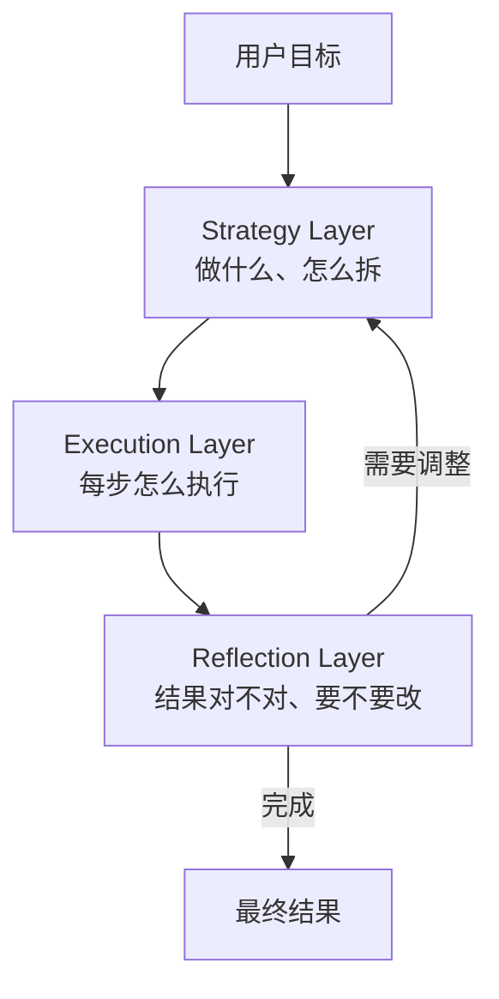
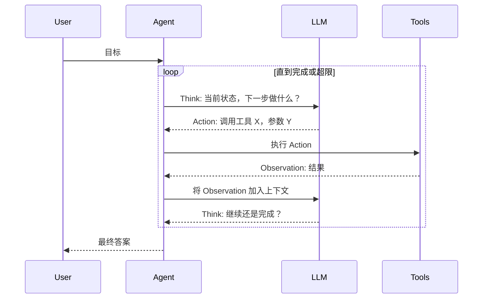
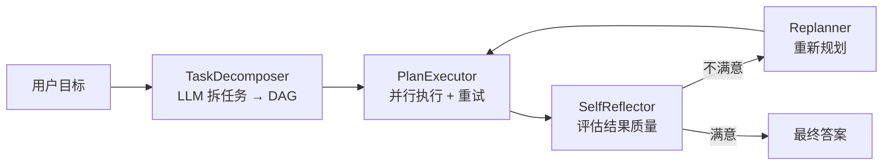

> 系列文章：
> [① Agent 概览](../ai-agent-01-overview) ·
> [② Tool Use](../ai-agent-02-tool-use) ·
> [③ RAG](../ai-agent-03-rag) ·
> [④ Memory](../ai-agent-04-memory) ·
> **⑤ Planning（本篇）** ·
> ⑥ Multi-Agent · ⑦ Agent Engineering

---

一个没有规划能力的 Agent，本质上就是一个自动补全器 —— 输入什么，接着往下写什么。
真正有用的 Agent，必须能把一个模糊的目标拆成可执行的步骤，遇到失败能回溯，遇到新信息能调整计划。

这篇文章偏工程，少讲理论，多写代码。我们从实际问题出发，把 Planning 这件事做扎实。

---

## 1. 为什么 LLM 直接做任务会失败

先看一个典型失败案例：

```python
# 直接让 LLM 完成复杂任务 —— 几乎必然失败
prompt = """
帮我分析竞品公司 A 和公司 B 的最新财报，
对比它们的毛利率、研发投入、现金流，
画一张对比表，并给出投资建议。
"""
response = llm.complete(prompt)  # 一次生成，输出质量极差
```

失败原因：
1. **上下文超限**：财报数据量大，一次塞不下
2. **步骤依赖**：得先获取数据，才能分析，才能对比
3. **无法回溯**：工具调用失败了不知道怎么处理
4. **无验证**：生成的数字可能是幻觉

解决方案：**规划 → 分解 → 执行 → 验证 → 回溯**。

---

## 2. Planning 的三个层次



| 层次 | 关键问题 | 对应技术 |
|------|---------|---------|
| Strategy | 怎么把目标拆成子任务？ | Task Decomposition, HTN |
| Execution | 每步用什么工具？怎么调？ | ReAct, Function Calling |
| Reflection | 结果是否达标？要不要重试？ | Self-Reflection, Replanning |

---

## 3. 核心数据结构

先把数据结构设计好，后面代码都基于这套：

```python
from dataclasses import dataclass, field
from typing import Optional, List, Dict, Any, Callable
from enum import Enum
import uuid
import time


class TaskStatus(Enum):
    PENDING = "pending"
    RUNNING = "running"
    DONE = "done"
    FAILED = "failed"
    SKIPPED = "skipped"


class TaskPriority(Enum):
    LOW = 1
    NORMAL = 2
    HIGH = 3
    CRITICAL = 4


@dataclass
class Task:
    """单个任务节点"""
    id: str = field(default_factory=lambda: str(uuid.uuid4())[:8])
    name: str = ""
    description: str = ""

    # 执行配置
    tool: Optional[str] = None           # 使用哪个工具
    tool_args: Dict[str, Any] = field(default_factory=dict)

    # 依赖关系
    depends_on: List[str] = field(default_factory=list)   # 前置任务 ID

    # 状态
    status: TaskStatus = TaskStatus.PENDING
    priority: TaskPriority = TaskPriority.NORMAL

    # 结果
    result: Optional[Any] = None
    error: Optional[str] = None

    # 元信息
    created_at: float = field(default_factory=time.time)
    started_at: Optional[float] = None
    finished_at: Optional[float] = None
    retry_count: int = 0
    max_retries: int = 2

    # 子任务（支持层级结构）
    subtasks: List["Task"] = field(default_factory=list)
    parent_id: Optional[str] = None

    @property
    def duration(self) -> Optional[float]:
        if self.started_at and self.finished_at:
            return self.finished_at - self.started_at
        return None

    def can_retry(self) -> bool:
        return self.status == TaskStatus.FAILED and self.retry_count < self.max_retries


@dataclass
class Plan:
    """完整执行计划"""
    id: str = field(default_factory=lambda: str(uuid.uuid4())[:8])
    goal: str = ""
    tasks: List[Task] = field(default_factory=list)
    created_at: float = field(default_factory=time.time)
    metadata: Dict[str, Any] = field(default_factory=dict)

    def get_task(self, task_id: str) -> Optional[Task]:
        for task in self.tasks:
            if task.id == task_id:
                return task
        return None

    def ready_tasks(self) -> List[Task]:
        """返回所有依赖已满足、可以立即执行的任务"""
        done_ids = {t.id for t in self.tasks if t.status == TaskStatus.DONE}
        return [
            t for t in self.tasks
            if t.status == TaskStatus.PENDING
            and all(dep in done_ids for dep in t.depends_on)
        ]

    def is_complete(self) -> bool:
        return all(t.status in (TaskStatus.DONE, TaskStatus.SKIPPED) for t in self.tasks)

    def has_failed(self) -> bool:
        return any(
            t.status == TaskStatus.FAILED and not t.can_retry()
            for t in self.tasks
        )

    def summary(self) -> Dict[str, int]:
        counts = {s: 0 for s in TaskStatus}
        for t in self.tasks:
            counts[t.status] += 1
        return {s.value: c for s, c in counts.items() if c > 0}
```

---

## 4. Task Decomposer：用 LLM 拆任务

这是 Planning 的核心：给定目标，生成结构化的任务列表。

```python
import json
import re
from typing import Optional
import anthropic


DECOMPOSE_PROMPT = """你是一个任务规划专家。将用户目标分解为可执行的子任务列表。

规则：
1. 每个任务必须是原子的（一次工具调用或一次 LLM 推理可以完成）
2. 明确指定每个任务依赖哪些前置任务（用任务 ID）
3. 能并行的任务不要设置不必要的依赖
4. 任务数量控制在 3-10 个（太多说明拆得太细）

可用工具：
{tools_description}

用户目标：
{goal}

上下文信息：
{context}

请用 JSON 格式输出，结构如下：
{{
  "tasks": [
    {{
      "id": "t1",
      "name": "简短名称",
      "description": "详细描述，说明要做什么",
      "tool": "工具名称（可选，如果是纯推理则为 null）",
      "tool_args": {{}},
      "depends_on": [],
      "priority": "normal"
    }}
  ],
  "reasoning": "为什么这样拆分"
}}"""


class TaskDecomposer:
    def __init__(self, tools: Dict[str, Any]):
        self.client = anthropic.Anthropic()
        self.tools = tools

    def _tools_description(self) -> str:
        lines = []
        for name, tool in self.tools.items():
            desc = tool.get("description", "")
            params = list(tool.get("parameters", {}).get("properties", {}).keys())
            lines.append(f"- {name}: {desc}（参数: {', '.join(params)}）")
        return "\n".join(lines)

    def decompose(self, goal: str, context: str = "") -> Plan:
        prompt = DECOMPOSE_PROMPT.format(
            tools_description=self._tools_description(),
            goal=goal,
            context=context or "无",
        )

        response = self.client.messages.create(
            model="claude-opus-4-6",
            max_tokens=2048,
            messages=[{"role": "user", "content": prompt}],
        )

        raw = response.content[0].text
        data = self._parse_json(raw)

        plan = Plan(goal=goal)
        for item in data.get("tasks", []):
            task = Task(
                id=item["id"],
                name=item["name"],
                description=item["description"],
                tool=item.get("tool"),
                tool_args=item.get("tool_args", {}),
                depends_on=item.get("depends_on", []),
                priority=TaskPriority[item.get("priority", "normal").upper()],
            )
            plan.tasks.append(task)

        plan.metadata["reasoning"] = data.get("reasoning", "")
        return plan

    def _parse_json(self, text: str) -> dict:
        # 从 LLM 输出中提取 JSON（处理 markdown 代码块）
        match = re.search(r"```(?:json)?\s*([\s\S]+?)```", text)
        if match:
            text = match.group(1)
        return json.loads(text.strip())
```

**使用示例：**

```python
tools = {
    "web_search": {
        "description": "搜索网页内容",
        "parameters": {"properties": {"query": {}, "num_results": {}}}
    },
    "read_url": {
        "description": "读取指定 URL 的页面内容",
        "parameters": {"properties": {"url": {}}}
    },
    "python_exec": {
        "description": "执行 Python 代码",
        "parameters": {"properties": {"code": {}}}
    },
    "write_file": {
        "description": "写入文件",
        "parameters": {"properties": {"path": {}, "content": {}}}
    },
}

decomposer = TaskDecomposer(tools)
plan = decomposer.decompose(
    goal="分析 OpenAI 和 Anthropic 最新的技术博客，总结它们在 Agent 方向的最新进展，输出一份对比报告"
)

# 典型输出
# t1: 搜索 OpenAI 技术博客（无依赖）
# t2: 搜索 Anthropic 技术博客（无依赖）
# t3: 读取 OpenAI 博客内容（依赖 t1）
# t4: 读取 Anthropic 博客内容（依赖 t2）
# t5: 分析对比（依赖 t3, t4）
# t6: 生成报告（依赖 t5）
```

---

## 5. Plan Executor：DAG 执行引擎

任务之间有依赖关系，本质是一个 DAG。执行引擎需要：
- 拓扑排序，保证依赖顺序
- 并行执行没有依赖关系的任务
- 失败重试 + 错误传播

```python
import asyncio
from typing import Callable, Awaitable


class PlanExecutor:
    def __init__(
        self,
        tool_registry: Dict[str, Callable],
        llm_executor: Callable,   # 处理 tool=None 的推理任务
        max_parallel: int = 4,
    ):
        self.tools = tool_registry
        self.llm_executor = llm_executor
        self.max_parallel = max_parallel
        self._semaphore = asyncio.Semaphore(max_parallel)

    async def execute(self, plan: Plan) -> Plan:
        print(f"[Executor] 开始执行计划: {plan.goal}")
        print(f"[Executor] 共 {len(plan.tasks)} 个任务")

        while not plan.is_complete() and not plan.has_failed():
            ready = plan.ready_tasks()
            if not ready:
                # 没有可执行的任务但计划未完成 → 死锁（依赖循环）
                failed_ids = [t.id for t in plan.tasks if t.status == TaskStatus.FAILED]
                if failed_ids:
                    print(f"[Executor] 任务失败导致阻塞: {failed_ids}")
                    break
                print("[Executor] 警告: 可能存在依赖循环")
                break

            print(f"[Executor] 并行执行 {len(ready)} 个就绪任务: {[t.name for t in ready]}")
            await asyncio.gather(*[self._run_task(plan, task) for task in ready])

        print(f"[Executor] 执行完成，汇总: {plan.summary()}")
        return plan

    async def _run_task(self, plan: Plan, task: Task):
        async with self._semaphore:
            task.status = TaskStatus.RUNNING
            task.started_at = time.time()

            try:
                # 把前置任务的结果注入到当前任务的上下文
                context = self._build_context(plan, task)
                result = await self._execute_single(task, context)

                task.result = result
                task.status = TaskStatus.DONE
                task.finished_at = time.time()
                print(f"[Executor] ✓ {task.name} ({task.duration:.2f}s)")

            except Exception as e:
                task.error = str(e)
                task.retry_count += 1

                if task.can_retry():
                    print(f"[Executor] ↺ {task.name} 失败，第 {task.retry_count} 次重试: {e}")
                    task.status = TaskStatus.PENDING  # 重置为待执行
                    await asyncio.sleep(2 ** task.retry_count)  # 指数退避
                else:
                    task.status = TaskStatus.FAILED
                    task.finished_at = time.time()
                    print(f"[Executor] ✗ {task.name} 最终失败: {e}")
                    # 将依赖此任务的后续任务标记为 SKIPPED
                    self._propagate_failure(plan, task)

    async def _execute_single(self, task: Task, context: Dict) -> Any:
        if task.tool and task.tool in self.tools:
            # 工具调用
            tool_fn = self.tools[task.tool]
            args = {**task.tool_args, "_context": context}
            if asyncio.iscoroutinefunction(tool_fn):
                return await tool_fn(**{k: v for k, v in args.items() if k != "_context"},
                                     context=context)
            else:
                return await asyncio.to_thread(tool_fn, **task.tool_args, context=context)
        else:
            # 纯 LLM 推理任务
            return await self.llm_executor(task, context)

    def _build_context(self, plan: Plan, task: Task) -> Dict[str, Any]:
        """将前置任务的输出注入当前任务上下文"""
        context = {"goal": plan.goal}
        for dep_id in task.depends_on:
            dep = plan.get_task(dep_id)
            if dep and dep.result is not None:
                context[f"result_{dep_id}"] = dep.result
                context[f"task_{dep_id}_name"] = dep.name
        return context

    def _propagate_failure(self, plan: Plan, failed_task: Task):
        """将依赖失败任务的后续任务标记为 SKIPPED"""
        failed_ids = {failed_task.id}
        changed = True
        while changed:
            changed = False
            for task in plan.tasks:
                if task.status == TaskStatus.PENDING:
                    if any(dep in failed_ids for dep in task.depends_on):
                        task.status = TaskStatus.SKIPPED
                        failed_ids.add(task.id)
                        changed = True
```

---

## 6. ReAct：在执行中动态推理

前面的 Decomposer 是**静态规划**——在执行前一次性生成所有任务。但很多场景需要**动态规划**：执行一步，观察结果，再决定下一步。

这就是 ReAct（Reasoning + Acting）的思路：



```python
from typing import List, Optional
import json


REACT_SYSTEM_PROMPT = """你是一个能够使用工具完成任务的 AI Agent。

每次回复必须遵循以下格式之一：

**格式 1：需要使用工具**
Thought: [推理过程，说明为什么需要这个工具]
Action: [工具名称]
Action Input: [JSON 格式的工具参数]

**格式 2：任务完成**
Thought: [最终分析]
Final Answer: [给用户的最终回答]

可用工具：
{tools}

注意：
- 每次只调用一个工具
- 基于 Observation 结果调整后续行动
- 发现错误时主动调整策略"""


@dataclass
class ReActStep:
    thought: str
    action: Optional[str] = None
    action_input: Optional[Dict] = None
    observation: Optional[str] = None
    is_final: bool = False
    final_answer: Optional[str] = None


class ReActAgent:
    def __init__(self, tools: Dict[str, Callable], max_steps: int = 15):
        self.client = anthropic.Anthropic()
        self.tools = tools
        self.max_steps = max_steps

    async def run(self, goal: str) -> str:
        tools_desc = self._format_tools()
        system = REACT_SYSTEM_PROMPT.format(tools=tools_desc)

        messages = [{"role": "user", "content": goal}]
        steps: List[ReActStep] = []

        for step_num in range(self.max_steps):
            # LLM 推理
            response = self.client.messages.create(
                model="claude-opus-4-6",
                max_tokens=1024,
                system=system,
                messages=messages,
            )

            assistant_text = response.content[0].text
            messages.append({"role": "assistant", "content": assistant_text})

            step = self._parse_response(assistant_text)
            steps.append(step)

            print(f"\n[Step {step_num + 1}]")
            print(f"Thought: {step.thought}")

            if step.is_final:
                print(f"Final Answer: {step.final_answer}")
                return step.final_answer

            # 执行工具
            print(f"Action: {step.action}({step.action_input})")
            observation = await self._execute_tool(step.action, step.action_input)
            step.observation = observation
            print(f"Observation: {observation[:200]}{'...' if len(observation) > 200 else ''}")

            # 将观察结果加入对话
            messages.append({
                "role": "user",
                "content": f"Observation: {observation}"
            })

        return f"达到最大步数限制 ({self.max_steps} 步)，未能完成任务"

    def _parse_response(self, text: str) -> ReActStep:
        thought_match = re.search(r"Thought:\s*(.+?)(?=\nAction:|\nFinal Answer:|$)", text, re.DOTALL)
        thought = thought_match.group(1).strip() if thought_match else ""

        if "Final Answer:" in text:
            answer_match = re.search(r"Final Answer:\s*(.+)", text, re.DOTALL)
            return ReActStep(
                thought=thought,
                is_final=True,
                final_answer=answer_match.group(1).strip() if answer_match else "",
            )

        action_match = re.search(r"Action:\s*(\w+)", text)
        input_match = re.search(r"Action Input:\s*(\{.+?\})", text, re.DOTALL)

        action = action_match.group(1) if action_match else None
        action_input = {}
        if input_match:
            try:
                action_input = json.loads(input_match.group(1))
            except json.JSONDecodeError:
                action_input = {"raw": input_match.group(1)}

        return ReActStep(thought=thought, action=action, action_input=action_input)

    async def _execute_tool(self, tool_name: str, args: Dict) -> str:
        if tool_name not in self.tools:
            return f"Error: 工具 '{tool_name}' 不存在。可用工具: {list(self.tools.keys())}"
        try:
            tool_fn = self.tools[tool_name]
            if asyncio.iscoroutinefunction(tool_fn):
                result = await tool_fn(**args)
            else:
                result = await asyncio.to_thread(tool_fn, **args)
            return str(result)
        except Exception as e:
            return f"Error: {e}"

    def _format_tools(self) -> str:
        lines = []
        for name, fn in self.tools.items():
            doc = fn.__doc__ or "无描述"
            lines.append(f"- {name}: {doc.strip()}")
        return "\n".join(lines)
```

---

## 7. Self-Reflection：执行后的自我评估

光执行不够，还需要验证结果是否满足目标。

```python
REFLECTION_PROMPT = """你是一个严格的任务审查员。

原始目标：
{goal}

执行结果：
{result}

请评估：
1. 结果是否完整回答了目标？（是/否）
2. 结果中有没有明显错误或遗漏？
3. 如果不满意，具体缺少什么？应该怎么补充？

以 JSON 格式回复：
{{
  "satisfied": true/false,
  "score": 0-10,
  "issues": ["问题1", "问题2"],
  "suggestions": ["建议1", "建议2"]
}}"""


class SelfReflector:
    def __init__(self):
        self.client = anthropic.Anthropic()

    def reflect(self, goal: str, result: str) -> Dict[str, Any]:
        prompt = REFLECTION_PROMPT.format(goal=goal, result=result)

        response = self.client.messages.create(
            model="claude-opus-4-6",
            max_tokens=512,
            messages=[{"role": "user", "content": prompt}],
        )

        text = response.content[0].text
        try:
            match = re.search(r"\{[\s\S]+\}", text)
            return json.loads(match.group(0)) if match else {"satisfied": True, "score": 7}
        except Exception:
            return {"satisfied": True, "score": 7, "issues": [], "suggestions": []}
```

---

## 8. Replanner：失败后重新规划

```python
REPLAN_PROMPT = """原始计划执行遇到了问题，需要重新规划。

原始目标：{goal}

已完成的任务：
{completed_tasks}

失败的任务：
{failed_tasks}

失败原因：
{failure_reasons}

反思意见：
{reflection}

请生成一个新的计划（只包含还需要执行的任务，不要重复已完成的）。
用同样的 JSON 格式输出。"""


class Replanner:
    def __init__(self, decomposer: TaskDecomposer):
        self.decomposer = decomposer
        self.client = anthropic.Anthropic()

    def replan(self, original_plan: Plan, reflection: Dict) -> Optional[Plan]:
        completed = [t for t in original_plan.tasks if t.status == TaskStatus.DONE]
        failed = [t for t in original_plan.tasks if t.status == TaskStatus.FAILED]

        if not failed and reflection.get("satisfied", True):
            return None  # 不需要重新规划

        completed_desc = "\n".join(
            f"- {t.name}: {str(t.result)[:100]}" for t in completed
        )
        failed_desc = "\n".join(
            f"- {t.name}: {t.error}" for t in failed
        )
        failure_reasons = "\n".join(
            f"- {t.name}: {t.error or '未知'}" for t in failed
        )

        context = REPLAN_PROMPT.format(
            goal=original_plan.goal,
            completed_tasks=completed_desc or "无",
            failed_tasks=failed_desc or "无",
            failure_reasons=failure_reasons or "无",
            reflection=json.dumps(reflection, ensure_ascii=False),
        )

        new_plan = self.decomposer.decompose(
            goal=original_plan.goal,
            context=context,
        )
        new_plan.metadata["is_replan"] = True
        new_plan.metadata["original_plan_id"] = original_plan.id
        return new_plan
```

---

## 9. 组合成完整的 Planning Agent

把上面的组件拼在一起：

```python
class PlanningAgent:
    """
    完整的 Planning Agent：
    1. 分解目标为任务 DAG
    2. 并行执行任务
    3. 反思结果质量
    4. 必要时重新规划
    """

    def __init__(
        self,
        tools: Dict[str, Callable],
        max_replan: int = 2,
        max_parallel: int = 4,
    ):
        self.tools = tools
        self.max_replan = max_replan

        self.decomposer = TaskDecomposer(tools)
        self.executor = PlanExecutor(
            tool_registry=tools,
            llm_executor=self._llm_task_executor,
            max_parallel=max_parallel,
        )
        self.reflector = SelfReflector()
        self.replanner = Replanner(self.decomposer)

    async def run(self, goal: str) -> str:
        print(f"\n{'='*60}")
        print(f"目标: {goal}")
        print(f"{'='*60}\n")

        # Step 1: 初始规划
        plan = self.decomposer.decompose(goal)
        print(f"[Planning] 生成计划: {len(plan.tasks)} 个任务")
        print(f"[Planning] 拆分逻辑: {plan.metadata.get('reasoning', '')[:100]}")
        self._print_plan(plan)

        replan_count = 0
        while True:
            # Step 2: 执行
            plan = await self.executor.execute(plan)

            # 收集所有有结果的任务输出
            result_summary = self._summarize_results(plan)

            # Step 3: 反思
            reflection = self.reflector.reflect(goal, result_summary)
            print(f"\n[Reflection] 评分: {reflection.get('score', '?')}/10")
            if reflection.get("issues"):
                print(f"[Reflection] 问题: {reflection['issues']}")

            # Step 4: 判断是否需要 Replan
            if reflection.get("satisfied", True) and not plan.has_failed():
                break

            if replan_count >= self.max_replan:
                print(f"[Planning] 已达最大重规划次数 ({self.max_replan})")
                break

            new_plan = self.replanner.replan(plan, reflection)
            if new_plan is None:
                break

            replan_count += 1
            print(f"\n[Replanning] 第 {replan_count} 次重规划，{len(new_plan.tasks)} 个新任务")
            plan = new_plan

        # Step 5: 生成最终答案
        return await self._synthesize_answer(goal, plan)

    async def _llm_task_executor(self, task: Task, context: Dict) -> str:
        """处理不使用工具的纯推理任务"""
        prev_results = {
            k: v for k, v in context.items()
            if k.startswith("result_")
        }

        prompt = f"""任务：{task.description}

前置任务的结果：
{json.dumps(prev_results, ensure_ascii=False, indent=2) if prev_results else '无'}

请完成这个任务，直接给出结果。"""

        response = self.client.messages.create(
            model="claude-opus-4-6",
            max_tokens=2048,
            messages=[{"role": "user", "content": prompt}],
        )
        return response.content[0].text

    def _summarize_results(self, plan: Plan) -> str:
        lines = [f"目标: {plan.goal}\n"]
        for task in plan.tasks:
            if task.status == TaskStatus.DONE and task.result:
                lines.append(f"[{task.name}]\n{str(task.result)[:500]}\n")
        return "\n".join(lines)

    async def _synthesize_answer(self, goal: str, plan: Plan) -> str:
        """将所有任务结果综合为最终答案"""
        results_text = self._summarize_results(plan)

        response = self.client.messages.create(
            model="claude-opus-4-6",
            max_tokens=4096,
            messages=[{
                "role": "user",
                "content": f"基于以下执行结果，回答原始目标：\n\n{results_text}\n\n请给出完整、清晰的最终答案。"
            }],
        )
        return response.content[0].text

    def _print_plan(self, plan: Plan):
        for task in plan.tasks:
            deps = f" (依赖: {task.depends_on})" if task.depends_on else ""
            tool = f" [{task.tool}]" if task.tool else " [LLM]"
            print(f"  {task.id}: {task.name}{tool}{deps}")
```

---

## 10. 处理常见的工程坑

### 10.1 任务结果太大，上下文溢出

前置任务输出的内容可能很大（比如爬取了一个长网页），直接传给下个任务会超 context。

```python
class ResultCompressor:
    """压缩大型任务结果，保留关键信息"""

    def __init__(self, max_chars: int = 2000):
        self.max_chars = max_chars
        self.client = anthropic.Anthropic()

    def compress(self, result: str, task_name: str, next_task_desc: str) -> str:
        if len(result) <= self.max_chars:
            return result

        prompt = f"""以下是任务"{task_name}"的执行结果（内容太长需要压缩）：

{result[:8000]}  # 截取前 8000 字符用于压缩

下一个任务需要的信息：{next_task_desc}

请提取对下一个任务最有用的关键信息，压缩到 {self.max_chars} 字以内。"""

        response = self.client.messages.create(
            model="claude-haiku-4-5-20251001",  # 用小模型做压缩，省钱
            max_tokens=self.max_chars // 2,
            messages=[{"role": "user", "content": prompt}],
        )
        return f"[已压缩] {response.content[0].text}"
```

### 10.2 工具调用超时

```python
import asyncio
from functools import wraps


def with_timeout(seconds: float):
    def decorator(fn):
        @wraps(fn)
        async def wrapper(*args, **kwargs):
            try:
                return await asyncio.wait_for(
                    asyncio.coroutine(fn)(*args, **kwargs)
                    if not asyncio.iscoroutinefunction(fn)
                    else fn(*args, **kwargs),
                    timeout=seconds
                )
            except asyncio.TimeoutError:
                raise TimeoutError(f"工具调用超时（>{seconds}s）")
        return wrapper
    return decorator


# 使用
@with_timeout(30)
async def web_search(query: str, num_results: int = 5) -> str:
    """搜索网页"""
    # ...实现
```

### 10.3 LLM 输出格式不稳定

LLM 不总是严格按 JSON 格式输出，需要鲁棒的解析：

```python
def robust_json_parse(text: str, fallback: dict = None) -> dict:
    """多策略 JSON 解析"""
    # 策略 1: 直接解析
    try:
        return json.loads(text.strip())
    except json.JSONDecodeError:
        pass

    # 策略 2: 提取代码块
    for pattern in [r"```json\s*([\s\S]+?)```", r"```\s*([\s\S]+?)```"]:
        match = re.search(pattern, text)
        if match:
            try:
                return json.loads(match.group(1).strip())
            except json.JSONDecodeError:
                continue

    # 策略 3: 提取大括号内容
    match = re.search(r"\{[\s\S]*\}", text)
    if match:
        try:
            return json.loads(match.group(0))
        except json.JSONDecodeError:
            pass

    # 策略 4: 尝试修复常见问题（末尾逗号、单引号等）
    cleaned = re.sub(r",\s*([}\]])", r"\1", text)  # 末尾逗号
    cleaned = cleaned.replace("'", '"')             # 单引号
    try:
        return json.loads(cleaned)
    except json.JSONDecodeError:
        pass

    return fallback or {}
```

### 10.4 计划执行过程的可观测性

```python
from dataclasses import dataclass
from typing import List
import time


@dataclass
class ExecutionTrace:
    plan_id: str
    goal: str
    steps: List[Dict] = field(default_factory=list)
    start_time: float = field(default_factory=time.time)

    def record(self, event: str, task_id: str, data: Dict):
        self.steps.append({
            "time": time.time() - self.start_time,
            "event": event,
            "task_id": task_id,
            **data,
        })

    def to_timeline(self) -> str:
        lines = [f"Plan: {self.goal}\n"]
        for step in self.steps:
            t = f"{step['time']:.2f}s"
            lines.append(f"[{t}] {step['event']}: {step.get('task_name', step['task_id'])}")
            if step.get("error"):
                lines.append(f"       Error: {step['error']}")
        return "\n".join(lines)
```

---

## 11. 一个完整的例子跑通

```python
import asyncio


# 定义工具
async def web_search(query: str, context=None) -> str:
    """搜索网页内容，返回摘要列表"""
    # 实际接入搜索 API，这里 mock
    return f"搜索结果 for '{query}': [结果1, 结果2, 结果3]"


async def read_url(url: str, context=None) -> str:
    """读取 URL 页面内容"""
    return f"页面内容 from {url}: [文章正文...]"


async def python_exec(code: str, context=None) -> str:
    """执行 Python 代码"""
    # 实际应在沙箱中执行
    try:
        exec_globals = {}
        exec(code, exec_globals)
        return str(exec_globals.get("result", "执行完成"))
    except Exception as e:
        return f"执行错误: {e}"


async def write_file(path: str, content: str, context=None) -> str:
    """写入文件"""
    with open(path, "w", encoding="utf-8") as f:
        f.write(content)
    return f"文件已写入: {path}"


tools = {
    "web_search": web_search,
    "read_url": read_url,
    "python_exec": python_exec,
    "write_file": write_file,
}


async def main():
    agent = PlanningAgent(tools=tools, max_replan=1, max_parallel=3)

    result = await agent.run(
        "调研 2024 年 LLM Agent 领域的三个重要进展，"
        "对比它们的核心思路，输出一份 Markdown 格式的技术报告"
    )

    print("\n" + "="*60)
    print("最终结果:")
    print(result)


asyncio.run(main())
```

执行过程大概是这样：

```
============================================================
目标: 调研 2024 年 LLM Agent 领域的三个重要进展...
============================================================

[Planning] 生成计划: 6 个任务
[Planning] 拆分逻辑: 先并行搜索三个方向，再并行读取详情...
  t1: 搜索 Agent 论文进展 [web_search]
  t2: 搜索 Agent 工程实践 [web_search]
  t3: 搜索 Agent 评测基准 [web_search]
  t4: 汇总三个进展 [LLM] (依赖: ['t1', 't2', 't3'])
  t5: 撰写对比分析 [LLM] (依赖: ['t4'])
  t6: 写入文件 [write_file] (依赖: ['t5'])

[Executor] 开始执行计划
[Executor] 并行执行 3 个就绪任务: ['搜索 Agent 论文进展', ...]

[Step] ✓ 搜索 Agent 论文进展 (0.82s)
[Step] ✓ 搜索 Agent 工程实践 (0.91s)
[Step] ✓ 搜索 Agent 评测基准 (0.77s)

[Executor] 并行执行 1 个就绪任务: ['汇总三个进展']
[Step] ✓ 汇总三个进展 (2.14s)
...

[Reflection] 评分: 8/10
```

---

## 12. 静态规划 vs 动态规划，怎么选

| 场景 | 推荐方式 | 原因 |
|------|---------|------|
| 目标清晰、步骤可预知 | 静态 DAG（PlanningAgent） | 可并行，执行效率高 |
| 结果影响下一步决策 | 动态 ReAct | 灵活，能根据观察调整 |
| 需要迭代探索 | ReAct + Reflection | 自动回溯 |
| 超长任务 / 多天运行 | 静态 DAG + Checkpoint | 支持中断恢复 |
| 不确定工具够不够用 | 先 ReAct 探索，再 DAG 固化 | 两阶段 |

实际项目里，这两种方式经常混用：用静态规划确定大方向（宏观任务），每个子任务内部用 ReAct 做动态执行。

---

## 13. 小结

本文从工程角度覆盖了 Planning 的完整链路：



关键工程点：
- **DAG 执行**：ready_tasks() 判断依赖，asyncio.gather() 并行执行
- **错误传播**：失败任务自动 SKIP 下游
- **结果压缩**：防止大输出撑爆 context
- **鲁棒解析**：多策略处理 LLM 输出格式问题
- **可观测性**：ExecutionTrace 记录完整执行链路

下一篇：**⑥ Multi-Agent —— 多个 Agent 怎么协作、通信、分工**

---

*系列文章持续更新中。*
