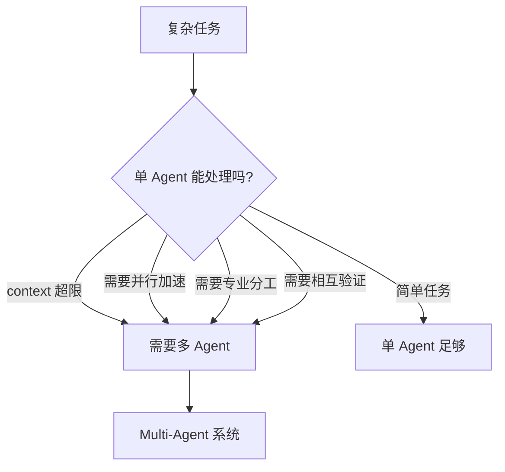
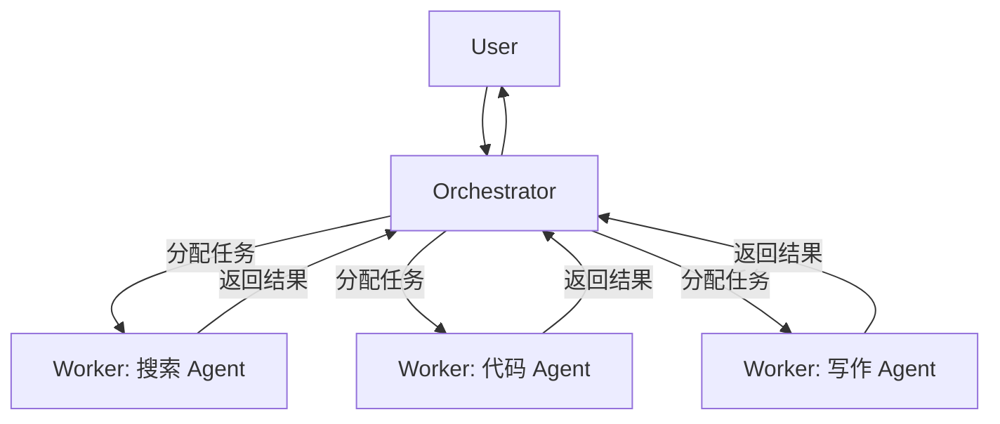
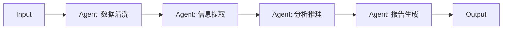
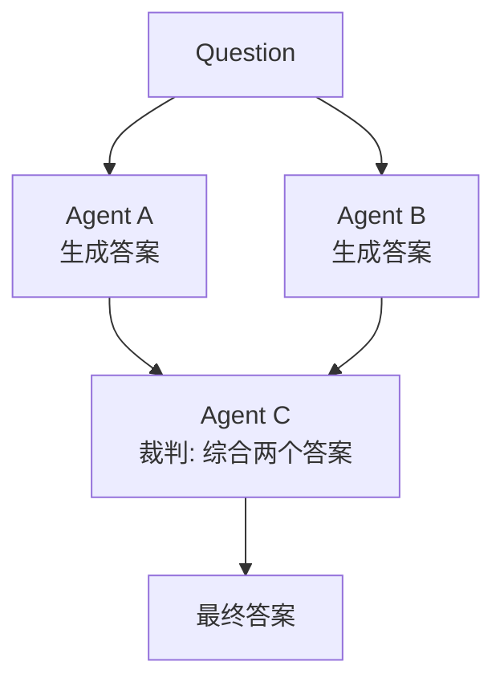
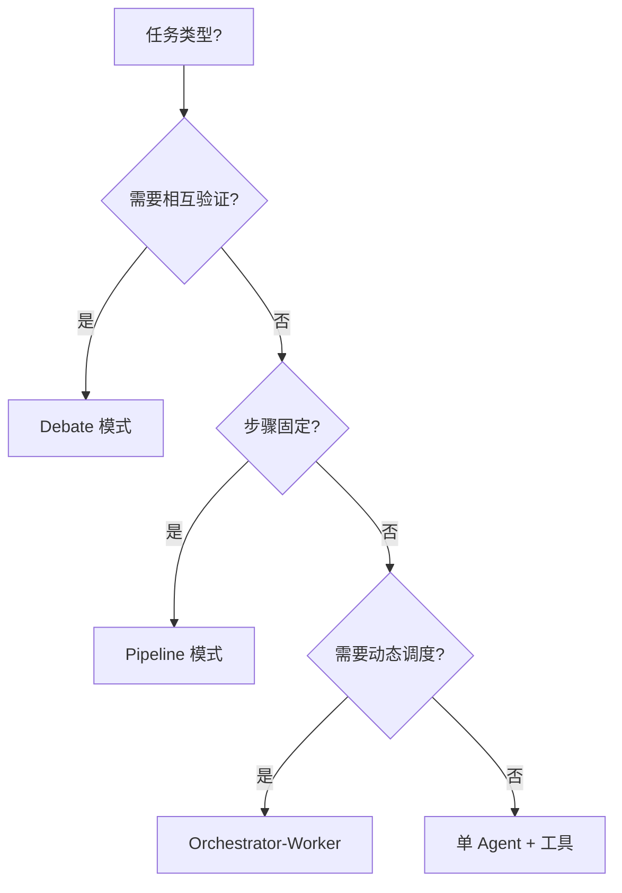

> 系列文章：
> [① Agent 概览](../ai-agent-01-overview) ·
> [② Tool Use](../ai-agent-02-tool-use) ·
> [③ RAG](../ai-agent-03-rag) ·
> [④ Memory](../ai-agent-04-memory) ·
> [⑤ Planning](../ai-agent-05-planning) ·
> **⑥ Multi-Agent（本篇）** ·
> ⑦ Agent Engineering

---

单个 Agent 的瓶颈很明显：context window 有限、单线程执行慢、一个模型很难同时擅长所有领域。

Multi-Agent 系统的出发点就是：**让多个专用 Agent 分工，然后把结果拼在一起**。

听起来很美，但工程上有一堆坑——Agent 之间怎么通信？谁负责协调？出错了谁负责重试？怎么防止循环调用？这篇文章从代码出发，把这些问题一个一个解决掉。

---

## 1. 为什么需要 Multi-Agent



典型场景：
- **代码审查**：一个 Agent 写代码，一个 Agent 审 bug，一个 Agent 审安全
- **研究报告**：多个 Agent 并行搜索不同方向，最后汇总
- **辩论验证**：两个 Agent 分别持正反方，第三个 Agent 做裁判
- **流水线处理**：数据清洗 → 分析 → 可视化，每步一个专用 Agent

---

## 2. 三种主流架构

### 2.1 Orchestrator-Worker（最常用）



Orchestrator 负责：拆任务、分发、收集结果、处理失败。Worker 只管干活，不需要感知其他 Worker 的存在。

### 2.2 Pipeline（流水线）



每个 Agent 只和相邻的打交道，结构清晰，但串行执行，速度慢。

### 2.3 Debate（辩论/验证）



用于需要高准确率的场景，两个 Agent 独立作答，第三个综合判断。

---

## 3. 基础数据结构

```python
from dataclasses import dataclass, field
from typing import Any, Dict, List, Optional, Callable, Awaitable
from enum import Enum
import uuid
import time
import asyncio


class MessageRole(Enum):
    USER = "user"
    AGENT = "agent"
    SYSTEM = "system"
    TOOL = "tool"


class MessageType(Enum):
    TASK = "task"           # 分配任务
    RESULT = "result"       # 返回结果
    ERROR = "error"         # 报告错误
    STATUS = "status"       # 状态更新
    BROADCAST = "broadcast" # 广播消息


@dataclass
class Message:
    """Agent 间通信的基本单元"""
    id: str = field(default_factory=lambda: str(uuid.uuid4())[:8])
    type: MessageType = MessageType.TASK
    sender: str = ""
    receiver: str = ""          # "" 表示广播
    content: Any = None
    metadata: Dict = field(default_factory=dict)
    timestamp: float = field(default_factory=time.time)
    reply_to: Optional[str] = None   # 关联的请求消息 ID
    ttl: int = 60                    # 消息有效期（秒）

    @property
    def is_expired(self) -> bool:
        return time.time() - self.timestamp > self.ttl


@dataclass
class AgentCapability:
    """描述 Agent 能做什么"""
    name: str
    description: str
    input_schema: Dict = field(default_factory=dict)
    output_schema: Dict = field(default_factory=dict)
    avg_latency_ms: int = 1000
    max_concurrent: int = 3


@dataclass
class AgentInfo:
    """Agent 的注册信息"""
    id: str
    name: str
    capabilities: List[AgentCapability] = field(default_factory=list)
    status: str = "idle"   # idle / busy / offline
    registered_at: float = field(default_factory=time.time)
```

---

## 4. Message Bus：Agent 间通信中枢

所有 Agent 不直接互相调用，而是通过 Message Bus 通信。好处：
- 解耦：Agent 不需要知道对方在哪
- 可观测：所有消息都过一遍总线，方便 debug
- 流控：在总线层做限流、优先级

```python
from asyncio import Queue
from collections import defaultdict
import logging

logger = logging.getLogger(__name__)


class MessageBus:
    def __init__(self):
        self._queues: Dict[str, Queue] = {}      # agent_id -> 消息队列
        self._subscribers: Dict[str, List[str]] = defaultdict(list)  # topic -> [agent_ids]
        self._history: List[Message] = []
        self._lock = asyncio.Lock()

    def register(self, agent_id: str, queue_size: int = 100):
        """注册 Agent，创建专属消息队列"""
        if agent_id not in self._queues:
            self._queues[agent_id] = Queue(maxsize=queue_size)
            logger.info(f"[Bus] Agent '{agent_id}' 已注册")

    def unregister(self, agent_id: str):
        if agent_id in self._queues:
            del self._queues[agent_id]
            logger.info(f"[Bus] Agent '{agent_id}' 已注销")

    async def send(self, message: Message) -> bool:
        """发送消息给指定 Agent"""
        async with self._lock:
            self._history.append(message)

        if message.receiver == "":
            # 广播
            return await self._broadcast(message)

        if message.receiver not in self._queues:
            logger.warning(f"[Bus] 目标 Agent '{message.receiver}' 不存在")
            return False

        try:
            await asyncio.wait_for(
                self._queues[message.receiver].put(message),
                timeout=5.0
            )
            return True
        except asyncio.TimeoutError:
            logger.error(f"[Bus] 发送到 '{message.receiver}' 超时（队列已满?）")
            return False

    async def _broadcast(self, message: Message) -> bool:
        results = await asyncio.gather(
            *[
                self._queues[aid].put(message)
                for aid in self._queues
                if aid != message.sender
            ],
            return_exceptions=True,
        )
        return all(not isinstance(r, Exception) for r in results)

    async def receive(self, agent_id: str, timeout: float = 30.0) -> Optional[Message]:
        """Agent 从队列中取消息"""
        if agent_id not in self._queues:
            raise ValueError(f"Agent '{agent_id}' 未注册")

        try:
            msg = await asyncio.wait_for(
                self._queues[agent_id].get(),
                timeout=timeout
            )
            # 丢弃过期消息
            if msg.is_expired:
                logger.debug(f"[Bus] 丢弃过期消息 {msg.id}")
                return None
            return msg
        except asyncio.TimeoutError:
            return None

    def get_history(
        self,
        sender: Optional[str] = None,
        receiver: Optional[str] = None,
        msg_type: Optional[MessageType] = None,
        limit: int = 100,
    ) -> List[Message]:
        """查询消息历史（用于 debug）"""
        msgs = self._history
        if sender:
            msgs = [m for m in msgs if m.sender == sender]
        if receiver:
            msgs = [m for m in msgs if m.receiver == receiver]
        if msg_type:
            msgs = [m for m in msgs if m.type == msg_type]
        return msgs[-limit:]

    def stats(self) -> Dict:
        return {
            "total_messages": len(self._history),
            "registered_agents": list(self._queues.keys()),
            "queue_sizes": {aid: q.qsize() for aid, q in self._queues.items()},
        }
```

---

## 5. BaseAgent：所有 Agent 的基类

```python
import anthropic


class BaseAgent:
    """
    所有 Agent 的基类，处理：
    - 消息收发
    - 生命周期管理
    - 基础 LLM 调用
    """

    def __init__(
        self,
        agent_id: str,
        name: str,
        bus: MessageBus,
        system_prompt: str = "",
        model: str = "claude-opus-4-6",
    ):
        self.id = agent_id
        self.name = name
        self.bus = bus
        self.system_prompt = system_prompt
        self.model = model
        self.client = anthropic.Anthropic()
        self._running = False
        self._task: Optional[asyncio.Task] = None

        bus.register(agent_id)

    async def start(self):
        """启动 Agent，开始监听消息"""
        self._running = True
        self._task = asyncio.create_task(self._message_loop())
        logger.info(f"[{self.name}] 已启动")

    async def stop(self):
        self._running = False
        if self._task:
            self._task.cancel()
            try:
                await self._task
            except asyncio.CancelledError:
                pass
        self.bus.unregister(self.id)
        logger.info(f"[{self.name}] 已停止")

    async def _message_loop(self):
        """主消息循环"""
        while self._running:
            msg = await self.bus.receive(self.id, timeout=1.0)
            if msg is None:
                continue
            try:
                await self._handle_message(msg)
            except Exception as e:
                logger.error(f"[{self.name}] 处理消息 {msg.id} 出错: {e}")
                # 回复错误消息
                if msg.type == MessageType.TASK:
                    await self._reply_error(msg, str(e))

    async def _handle_message(self, msg: Message):
        """子类覆盖此方法处理具体任务"""
        if msg.type == MessageType.TASK:
            result = await self.process(msg.content, msg.metadata)
            await self._reply_result(msg, result)
        elif msg.type == MessageType.STATUS:
            await self.on_status(msg)

    async def process(self, content: Any, metadata: Dict) -> Any:
        """子类实现：处理任务逻辑"""
        raise NotImplementedError

    async def on_status(self, msg: Message):
        """子类可选覆盖：处理状态消息"""
        pass

    async def _reply_result(self, request: Message, result: Any):
        reply = Message(
            type=MessageType.RESULT,
            sender=self.id,
            receiver=request.sender,
            content=result,
            reply_to=request.id,
        )
        await self.bus.send(reply)

    async def _reply_error(self, request: Message, error: str):
        reply = Message(
            type=MessageType.ERROR,
            sender=self.id,
            receiver=request.sender,
            content={"error": error},
            reply_to=request.id,
        )
        await self.bus.send(reply)

    def _llm(self, user_prompt: str, max_tokens: int = 2048) -> str:
        """同步 LLM 调用（内部用）"""
        messages = [{"role": "user", "content": user_prompt}]
        kwargs = {"model": self.model, "max_tokens": max_tokens, "messages": messages}
        if self.system_prompt:
            kwargs["system"] = self.system_prompt
        response = self.client.messages.create(**kwargs)
        return response.content[0].text

    async def _llm_async(self, user_prompt: str, max_tokens: int = 2048) -> str:
        """异步 LLM 调用"""
        return await asyncio.to_thread(self._llm, user_prompt, max_tokens)
```

---

## 6. 具体 Worker Agent 实现

### 6.1 SearchAgent

```python
class SearchAgent(BaseAgent):
    """专门负责网络搜索的 Agent"""

    def __init__(self, bus: MessageBus):
        super().__init__(
            agent_id="search_agent",
            name="SearchAgent",
            bus=bus,
            system_prompt="""你是一个网络搜索专家。
给定搜索需求，你会：
1. 生成最优的搜索关键词
2. 整理搜索结果，去除广告和无关内容
3. 提炼关键信息，返回结构化摘要""",
        )

    async def process(self, content: Any, metadata: Dict) -> Any:
        query = content.get("query", "") if isinstance(content, dict) else str(content)
        num_results = content.get("num_results", 5) if isinstance(content, dict) else 5

        print(f"  [SearchAgent] 搜索: {query}")

        # 让 LLM 生成搜索策略
        strategy_prompt = f"""搜索需求: {query}
请生成 3 个不同角度的搜索关键词，并说明为什么。
格式: JSON {{"keywords": ["kw1", "kw2", "kw3"], "rationale": "..."}}"""

        strategy_text = await self._llm_async(strategy_prompt, max_tokens=256)
        strategy = robust_json_parse(strategy_text, {"keywords": [query]})

        # 实际调用搜索 API（这里 mock）
        all_results = []
        for kw in strategy["keywords"][:2]:  # 最多用 2 个关键词
            results = await self._do_search(kw, num_results)
            all_results.extend(results)

        # 去重 + 整理
        seen_urls = set()
        unique_results = []
        for r in all_results:
            if r["url"] not in seen_urls:
                seen_urls.add(r["url"])
                unique_results.append(r)

        return {
            "query": query,
            "results": unique_results[:num_results],
            "keywords_used": strategy["keywords"],
        }

    async def _do_search(self, query: str, num: int) -> List[Dict]:
        # 实际接入 Tavily / Bing / Google Search API
        await asyncio.sleep(0.1)  # mock
        return [
            {"title": f"结果 {i}: {query}", "url": f"https://example.com/{i}", "snippet": f"关于 {query} 的内容..."}
            for i in range(num)
        ]
```

### 6.2 CodeAgent

```python
class CodeAgent(BaseAgent):
    """专门负责代码生成和执行的 Agent"""

    def __init__(self, bus: MessageBus):
        super().__init__(
            agent_id="code_agent",
            name="CodeAgent",
            bus=bus,
            system_prompt="""你是一个 Python 专家。
给定任务，你会：
1. 编写清晰、可运行的 Python 代码
2. 在沙箱中执行并返回结果
3. 如果报错，自动修复再执行""",
        )
        self._sandbox_lock = asyncio.Lock()

    async def process(self, content: Any, metadata: Dict) -> Any:
        task = content.get("task", "") if isinstance(content, dict) else str(content)
        context_data = content.get("data", "") if isinstance(content, dict) else ""

        print(f"  [CodeAgent] 任务: {task[:60]}...")

        # 生成代码
        code_prompt = f"""任务: {task}

{'输入数据:\n' + str(context_data)[:1000] if context_data else ''}

请写一段 Python 代码完成这个任务。
要求：
- 把最终结果赋值给变量 `result`
- 不要用 print，用 result 返回结果
- 代码要能直接运行，不需要额外导入"""

        code = await self._llm_async(code_prompt, max_tokens=1024)
        code = self._extract_code(code)

        # 执行（带重试）
        for attempt in range(3):
            exec_result = await self._safe_exec(code)
            if exec_result["success"]:
                return {"code": code, "result": exec_result["result"], "attempts": attempt + 1}

            # 让 LLM 修复错误
            fix_prompt = f"""代码执行出错:
```python
{code}
```
错误信息: {exec_result['error']}

请修复代码，确保能正确运行。只返回修复后的代码，不要解释。"""
            code = await self._llm_async(fix_prompt, max_tokens=1024)
            code = self._extract_code(code)

        return {"code": code, "result": None, "error": "多次重试后仍然失败", "attempts": 3}

    async def _safe_exec(self, code: str) -> Dict:
        """在受限环境中执行代码"""
        async with self._sandbox_lock:
            try:
                exec_globals = {"__builtins__": __builtins__}
                # 实际生产中应使用 Docker 沙箱（参考 Tool Use 篇）
                await asyncio.to_thread(exec, code, exec_globals)
                return {"success": True, "result": exec_globals.get("result")}
            except Exception as e:
                return {"success": False, "error": str(e)}

    def _extract_code(self, text: str) -> str:
        match = re.search(r"```python\s*([\s\S]+?)```", text)
        if match:
            return match.group(1).strip()
        match = re.search(r"```\s*([\s\S]+?)```", text)
        if match:
            return match.group(1).strip()
        return text.strip()
```

### 6.3 WriterAgent

```python
class WriterAgent(BaseAgent):
    """专门负责内容生成和整合的 Agent"""

    def __init__(self, bus: MessageBus):
        super().__init__(
            agent_id="writer_agent",
            name="WriterAgent",
            bus=bus,
            system_prompt="""你是一个专业的技术写作专家。
给定素材和要求，你会：
1. 整合多方来源的信息
2. 生成结构清晰、表达准确的文档
3. 使用 Markdown 格式""",
        )

    async def process(self, content: Any, metadata: Dict) -> Any:
        topic = content.get("topic", "") if isinstance(content, dict) else str(content)
        materials = content.get("materials", []) if isinstance(content, dict) else []
        output_format = content.get("format", "markdown") if isinstance(content, dict) else "markdown"

        print(f"  [WriterAgent] 写作: {topic[:60]}...")

        materials_text = "\n\n---\n\n".join(
            f"来源 {i+1}:\n{str(m)[:2000]}"
            for i, m in enumerate(materials)
        )

        prompt = f"""主题: {topic}

参考素材:
{materials_text}

请生成一份{output_format}格式的文档，要求：
- 内容准确，基于提供的素材
- 结构清晰，有适当的标题层级
- 长度适中，不要冗余"""

        result = await self._llm_async(prompt, max_tokens=4096)
        return {"topic": topic, "content": result, "format": output_format}
```

---

## 7. Orchestrator：协调所有 Agent

```python
ORCHESTRATE_PROMPT = """你是一个多 Agent 系统的协调者。

你管理以下 Worker Agent：
{agents_desc}

用户目标：{goal}

已完成的任务：
{completed}

请决定下一步：
1. 还需要调用哪些 Agent？每个 Agent 的具体任务是什么？
2. 哪些任务可以并行？
3. 任务完成后如何整合结果？

以 JSON 格式输出：
{{
  "next_tasks": [
    {{
      "agent_id": "agent 的 ID",
      "task": "具体任务描述",
      "input": {{}},
      "depends_on": [],
      "priority": "high/normal/low"
    }}
  ],
  "is_complete": false,
  "final_synthesis_needed": true,
  "reasoning": "决策理由"
}}

如果任务已完成，设置 "is_complete": true 并省略 next_tasks。"""


class Orchestrator(BaseAgent):
    """
    负责协调所有 Worker Agent：
    - 接收用户目标
    - 动态分配任务
    - 收集并汇总结果
    - 处理失败和重试
    """

    def __init__(
        self,
        bus: MessageBus,
        workers: Dict[str, BaseAgent],
        max_rounds: int = 10,
    ):
        super().__init__(
            agent_id="orchestrator",
            name="Orchestrator",
            bus=bus,
            system_prompt="你是一个多 Agent 系统的协调者。",
        )
        self.workers = workers
        self.max_rounds = max_rounds
        self._pending: Dict[str, asyncio.Future] = {}  # msg_id -> Future
        self._results: Dict[str, Any] = {}             # task_id -> result

    async def run(self, goal: str) -> str:
        print(f"\n[Orchestrator] 目标: {goal}")
        print(f"[Orchestrator] 可用 Agent: {list(self.workers.keys())}\n")

        completed_tasks = []

        for round_num in range(self.max_rounds):
            print(f"\n--- Round {round_num + 1} ---")

            # 让 LLM 决定下一步
            decision = await self._decide(goal, completed_tasks)

            if decision.get("is_complete"):
                print("[Orchestrator] 任务完成，开始汇总")
                break

            next_tasks = decision.get("next_tasks", [])
            if not next_tasks:
                print("[Orchestrator] 没有新任务，退出循环")
                break

            print(f"[Orchestrator] 本轮分配 {len(next_tasks)} 个任务")
            print(f"[Orchestrator] 决策: {decision.get('reasoning', '')[:80]}")

            # 处理依赖关系，分组并行执行
            task_groups = self._group_by_dependency(next_tasks)

            for group in task_groups:
                # 并行执行同一组的任务
                group_results = await asyncio.gather(
                    *[self._dispatch_task(t) for t in group],
                    return_exceptions=True,
                )

                for task, result in zip(group, group_results):
                    if isinstance(result, Exception):
                        print(f"  ✗ {task['agent_id']}: {result}")
                        completed_tasks.append({
                            "agent": task["agent_id"],
                            "task": task["task"],
                            "status": "failed",
                            "error": str(result),
                        })
                    else:
                        print(f"  ✓ {task['agent_id']}: 完成")
                        completed_tasks.append({
                            "agent": task["agent_id"],
                            "task": task["task"],
                            "status": "done",
                            "result": str(result)[:500],
                        })
                        self._results[task.get("task_id", task["agent_id"])] = result

        # 汇总最终答案
        return await self._synthesize(goal, completed_tasks)

    async def _decide(self, goal: str, completed: List[Dict]) -> Dict:
        agents_desc = "\n".join(
            f"- {aid}: {self._agent_description(aid)}"
            for aid in self.workers
        )
        completed_text = "\n".join(
            f"- [{t['status']}] {t['agent']}: {t['task'][:80]}"
            + (f"\n  结果: {t.get('result', '')[:200]}" if t.get('result') else "")
            for t in completed
        ) or "无"

        prompt = ORCHESTRATE_PROMPT.format(
            agents_desc=agents_desc,
            goal=goal,
            completed=completed_text,
        )
        response = await self._llm_async(prompt, max_tokens=1024)
        return robust_json_parse(response, {"is_complete": True})

    async def _dispatch_task(self, task_spec: Dict) -> Any:
        agent_id = task_spec["agent_id"]
        if agent_id not in self.workers:
            raise ValueError(f"Agent '{agent_id}' 不存在")

        msg = Message(
            type=MessageType.TASK,
            sender=self.id,
            receiver=agent_id,
            content=task_spec.get("input", {"task": task_spec["task"]}),
            metadata={"task_desc": task_spec["task"]},
        )

        # 创建 Future 等待响应
        future: asyncio.Future = asyncio.get_event_loop().create_future()
        self._pending[msg.id] = future

        await self.bus.send(msg)

        try:
            # 等待响应，60 秒超时
            result_msg: Message = await asyncio.wait_for(future, timeout=60.0)
            if result_msg.type == MessageType.ERROR:
                raise RuntimeError(result_msg.content.get("error", "未知错误"))
            return result_msg.content
        finally:
            self._pending.pop(msg.id, None)

    async def _handle_message(self, msg: Message):
        """覆盖：处理 Worker 的回复"""
        if msg.reply_to and msg.reply_to in self._pending:
            future = self._pending[msg.reply_to]
            if not future.done():
                future.set_result(msg)
        else:
            await super()._handle_message(msg)

    def _group_by_dependency(self, tasks: List[Dict]) -> List[List[Dict]]:
        """按依赖关系分组，同一组可以并行执行"""
        if not tasks:
            return []

        # 这里简化：没有依赖的任务为第一组，其余依次往后
        independent = [t for t in tasks if not t.get("depends_on")]
        dependent = [t for t in tasks if t.get("depends_on")]

        groups = []
        if independent:
            groups.append(independent)
        if dependent:
            groups.append(dependent)  # 简化处理，实际可做拓扑排序
        return groups

    def _agent_description(self, agent_id: str) -> str:
        descriptions = {
            "search_agent": "网络搜索，获取实时信息",
            "code_agent": "编写和执行 Python 代码，数据处理和计算",
            "writer_agent": "整合信息，生成结构化文档",
        }
        return descriptions.get(agent_id, "通用 Agent")

    async def _synthesize(self, goal: str, completed: List[Dict]) -> str:
        results_text = "\n\n".join(
            f"[{t['agent']} - {t['task'][:60]}]\n{t.get('result', t.get('error', ''))}"
            for t in completed if t["status"] == "done"
        )

        prompt = f"""根据以下执行结果，完整回答用户目标：

目标: {goal}

执行结果:
{results_text}

请给出清晰、完整的最终答案。"""

        return await self._llm_async(prompt, max_tokens=4096)
```

---

## 8. 把一切组装起来

```python
async def build_and_run_multi_agent_system(goal: str) -> str:
    # 1. 创建消息总线
    bus = MessageBus()

    # 2. 创建 Worker Agent
    workers = {
        "search_agent": SearchAgent(bus),
        "code_agent": CodeAgent(bus),
        "writer_agent": WriterAgent(bus),
    }

    # 3. 创建 Orchestrator
    orchestrator = Orchestrator(bus, workers, max_rounds=8)

    # 4. 启动所有 Agent
    await asyncio.gather(*[agent.start() for agent in workers.values()])
    await orchestrator.start()

    try:
        # 5. 执行任务
        result = await orchestrator.run(goal)
        return result
    finally:
        # 6. 关闭所有 Agent
        await asyncio.gather(*[agent.stop() for agent in workers.values()])
        await orchestrator.stop()


# 使用
async def main():
    result = await build_and_run_multi_agent_system(
        "搜索 2024 年 Python 最流行的 5 个 Web 框架，"
        "用代码统计它们的 GitHub star 数量，"
        "生成一份对比报告"
    )
    print("\n最终结果:")
    print(result)


asyncio.run(main())
```

运行流程：

```
[Orchestrator] 目标: 搜索 2024 年 Python 最流行的 5 个 Web 框架...
[Orchestrator] 可用 Agent: ['search_agent', 'code_agent', 'writer_agent']

--- Round 1 ---
[Orchestrator] 本轮分配 2 个任务
[Orchestrator] 决策: 先并行搜索框架信息和 GitHub 数据
  [SearchAgent] 搜索: Python Web框架 2024 最流行
  [SearchAgent] 搜索: FastAPI Django Flask GitHub stars 2024
  ✓ search_agent: 完成
  ✓ search_agent: 完成

--- Round 2 ---
[Orchestrator] 本轮分配 1 个任务
[Orchestrator] 决策: 有了数据，用代码做统计
  [CodeAgent] 任务: 统计 5 个框架的 star 数量并排序...
  ✓ code_agent: 完成

--- Round 3 ---
[Orchestrator] 本轮分配 1 个任务
[Orchestrator] 决策: 数据齐全，生成报告
  [WriterAgent] 写作: Python Web 框架对比报告...
  ✓ writer_agent: 完成

[Orchestrator] 任务完成，开始汇总
```

---

## 9. 辩论模式：提高准确率

对于高风险决策（比如代码安全审查、事实核查），可以让多个 Agent 独立作答然后裁判。

```python
class DebateOrchestrator:
    """
    辩论模式：
    1. 两个 Agent 独立分析同一问题
    2. 第三个 Agent 综合两方观点，得出最终结论
    """

    def __init__(self):
        self.client = anthropic.Anthropic()

    async def run(self, question: str, context: str = "") -> Dict:
        print(f"\n[Debate] 问题: {question[:80]}...")

        # 两个独立分析者并行执行
        analysis_a, analysis_b = await asyncio.gather(
            self._analyze(question, context, perspective="正向分析，关注优点和可能性"),
            self._analyze(question, context, perspective="批判性分析，关注风险和问题"),
        )

        print(f"[Debate] 分析 A 完成 ({len(analysis_a)} chars)")
        print(f"[Debate] 分析 B 完成 ({len(analysis_b)} chars)")

        # 裁判综合
        verdict = await self._judge(question, analysis_a, analysis_b)

        return {
            "question": question,
            "analysis_a": analysis_a,
            "analysis_b": analysis_b,
            "verdict": verdict,
        }

    async def _analyze(self, question: str, context: str, perspective: str) -> str:
        prompt = f"""问题: {question}

{'上下文:\n' + context if context else ''}

请从以下角度进行分析: {perspective}

要求：客观、有据、条理清晰。"""

        return await asyncio.to_thread(
            lambda: self.client.messages.create(
                model="claude-opus-4-6",
                max_tokens=1024,
                messages=[{"role": "user", "content": prompt}],
            ).content[0].text
        )

    async def _judge(self, question: str, analysis_a: str, analysis_b: str) -> str:
        prompt = f"""问题: {question}

分析方 A 的观点:
{analysis_a}

分析方 B 的观点:
{analysis_b}

请作为裁判，综合两方观点：
1. 两方都认同的核心结论是什么？
2. 两方分歧在哪里，哪方更有道理？
3. 给出最终、平衡的结论。"""

        return await asyncio.to_thread(
            lambda: self.client.messages.create(
                model="claude-opus-4-6",
                max_tokens=2048,
                messages=[{"role": "user", "content": prompt}],
            ).content[0].text
        )
```

---

## 10. 工程坑与解决方案

### 10.1 死锁：A 等 B，B 等 A

```python
class DeadlockDetector:
    """检测 Agent 间的循环依赖"""

    def __init__(self, timeout: float = 30.0):
        self.timeout = timeout
        self._waiting: Dict[str, str] = {}  # agent_id -> 等待的 agent_id

    def register_wait(self, waiter: str, waitee: str):
        self._waiting[waiter] = waitee
        if self._detect_cycle(waiter):
            self._waiting.pop(waiter, None)
            raise RuntimeError(
                f"死锁检测: {waiter} -> {waitee} 形成循环依赖"
            )

    def release_wait(self, waiter: str):
        self._waiting.pop(waiter, None)

    def _detect_cycle(self, start: str) -> bool:
        visited = set()
        current = start
        while current in self._waiting:
            if current in visited:
                return True
            visited.add(current)
            current = self._waiting[current]
        return False
```

### 10.2 消息风暴：Agent 疯狂互发消息

加入速率限制和消息去重：

```python
from collections import deque


class RateLimiter:
    def __init__(self, max_messages: int, window_seconds: float):
        self.max_messages = max_messages
        self.window = window_seconds
        self._timestamps: Dict[str, deque] = defaultdict(deque)

    def check(self, agent_id: str) -> bool:
        """返回 True 表示允许，False 表示超速"""
        now = time.time()
        timestamps = self._timestamps[agent_id]

        # 清理窗口外的记录
        while timestamps and timestamps[0] < now - self.window:
            timestamps.popleft()

        if len(timestamps) >= self.max_messages:
            return False

        timestamps.append(now)
        return True


# 在 MessageBus.send 中加入速率检查
# if not self.rate_limiter.check(message.sender):
#     raise RuntimeError(f"Agent '{message.sender}' 发送消息过于频繁")
```

### 10.3 Agent 状态不一致

多个 Orchestrator 同时操作同一个 Worker 时，需要加锁：

```python
class WorkerPool:
    """管理 Worker Agent 的并发访问"""

    def __init__(self, workers: Dict[str, BaseAgent], max_concurrent_per_worker: int = 2):
        self.workers = workers
        self._semaphores = {
            agent_id: asyncio.Semaphore(max_concurrent_per_worker)
            for agent_id in workers
        }

    async def dispatch(self, agent_id: str, task: Dict) -> Any:
        if agent_id not in self.workers:
            raise ValueError(f"Worker '{agent_id}' 不存在")

        async with self._semaphores[agent_id]:
            # 保证同一个 Worker 不会被超过 max_concurrent 个任务同时调用
            return await self.workers[agent_id].process(task, {})
```

### 10.4 长任务中途崩溃

用检查点保存中间状态：

```python
import json
import os


class CheckpointManager:
    def __init__(self, checkpoint_dir: str = "/tmp/agent_checkpoints"):
        self.dir = checkpoint_dir
        os.makedirs(checkpoint_dir, exist_ok=True)

    def save(self, run_id: str, state: Dict):
        path = os.path.join(self.dir, f"{run_id}.json")
        with open(path, "w") as f:
            json.dump(state, f, default=str)

    def load(self, run_id: str) -> Optional[Dict]:
        path = os.path.join(self.dir, f"{run_id}.json")
        if not os.path.exists(path):
            return None
        with open(path) as f:
            return json.load(f)

    def clear(self, run_id: str):
        path = os.path.join(self.dir, f"{run_id}.json")
        if os.path.exists(path):
            os.remove(path)
```

在 Orchestrator 中每轮结束后保存：

```python
# 在 Orchestrator.run() 的循环里
checkpoint = CheckpointManager()
# 每轮结束保存
checkpoint.save(goal[:20], {
    "goal": goal,
    "round": round_num,
    "completed": completed_tasks,
    "results": {k: str(v)[:500] for k, v in self._results.items()},
})
```

---

## 11. 可观测性：知道系统在做什么

Multi-Agent 最难 debug 的就是"消息流到哪了"。加一个简单的追踪器：

```python
class AgentTracer:
    def __init__(self):
        self._events: List[Dict] = []
        self._start = time.time()

    def record(self, event_type: str, agent: str, data: Dict = None):
        self._events.append({
            "t": round(time.time() - self._start, 3),
            "type": event_type,
            "agent": agent,
            **(data or {}),
        })

    def print_timeline(self):
        print("\n=== Agent Timeline ===")
        for e in self._events:
            prefix = {
                "send": "→",
                "receive": "←",
                "start": "▶",
                "done": "✓",
                "error": "✗",
            }.get(e["type"], "·")
            msg = e.get("msg", "")
            print(f"  [{e['t']:6.3f}s] {prefix} {e['agent']:20s} {msg}")

    def to_mermaid(self) -> str:
        """生成 Mermaid 时序图"""
        lines = ["sequenceDiagram"]
        for e in self._events:
            if e["type"] == "send":
                src = e["agent"]
                dst = e.get("to", "?")
                msg = e.get("msg", "")[:40]
                lines.append(f"    {src}->>{dst}: {msg}")
        return "\n".join(lines)
```

---

## 12. 几种模式的选择指南



| 模式 | 适用场景 | 优点 | 缺点 |
|------|---------|------|------|
| Orchestrator-Worker | 复杂多步骤任务 | 灵活、可并行 | Orchestrator 是瓶颈 |
| Pipeline | 数据处理流水线 | 简单清晰 | 串行慢，中间失败影响后续 |
| Debate | 需要高准确率的决策 | 准确率高 | 成本是单 Agent 的 2-3 倍 |
| 全对等（P2P） | 探索性任务 | 最灵活 | 难以控制，容易死循环 |

---

## 13. 小结

Multi-Agent 的核心工程问题：

1. **通信**: Message Bus 解耦，不要 Agent 直接互相调用
2. **协调**: Orchestrator 动态分配，支持并行和依赖
3. **容错**: 消息超时、任务重试、失败传播
4. **安全**: 死锁检测、速率限制、并发控制
5. **可观测**: 消息历史、执行追踪、Mermaid 时序图

Multi-Agent 不是银弹 —— 单 Agent + 好工具往往比过度拆分的 Multi-Agent 更容易维护。只有当任务真的需要并行加速或专业分工时，才值得引入这层复杂度。

下一篇：**⑦ Agent Engineering —— 评测、部署、监控、成本控制，把 Agent 真正推上生产**

---

*系列文章持续更新中。*
