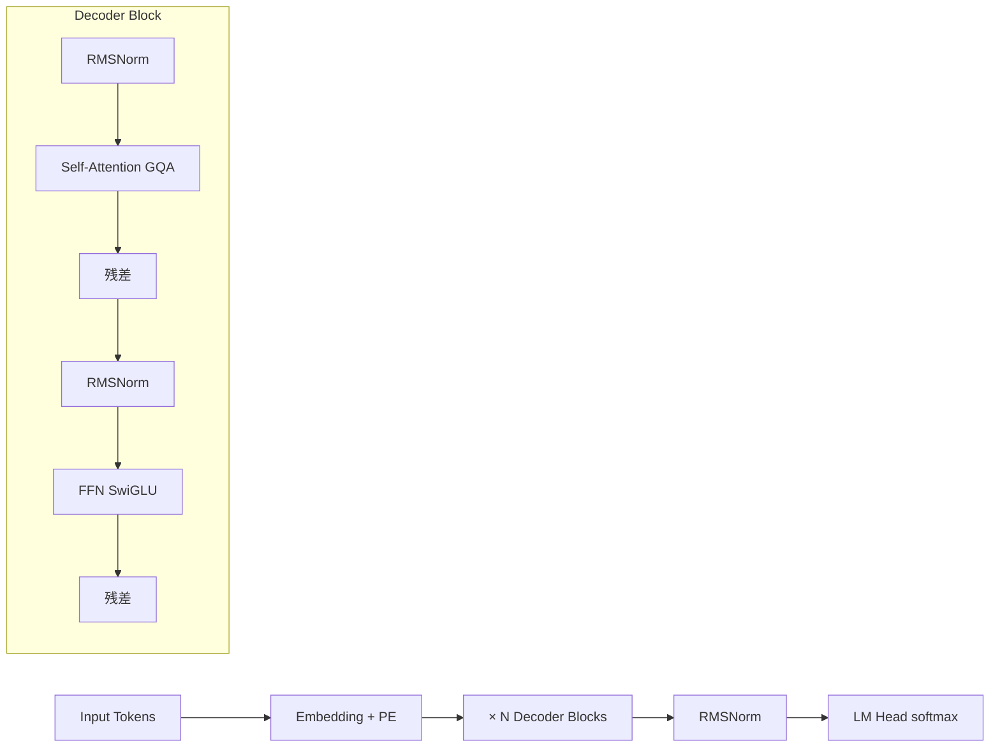
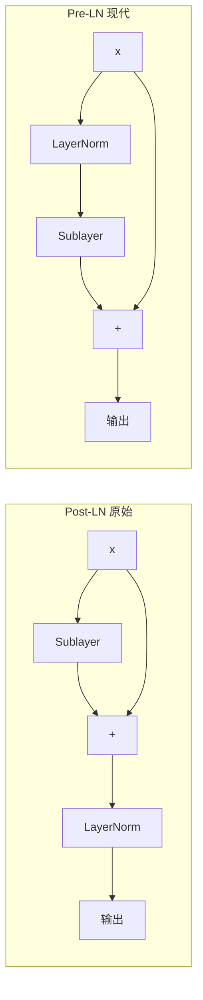
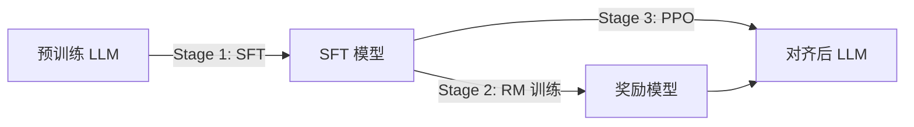
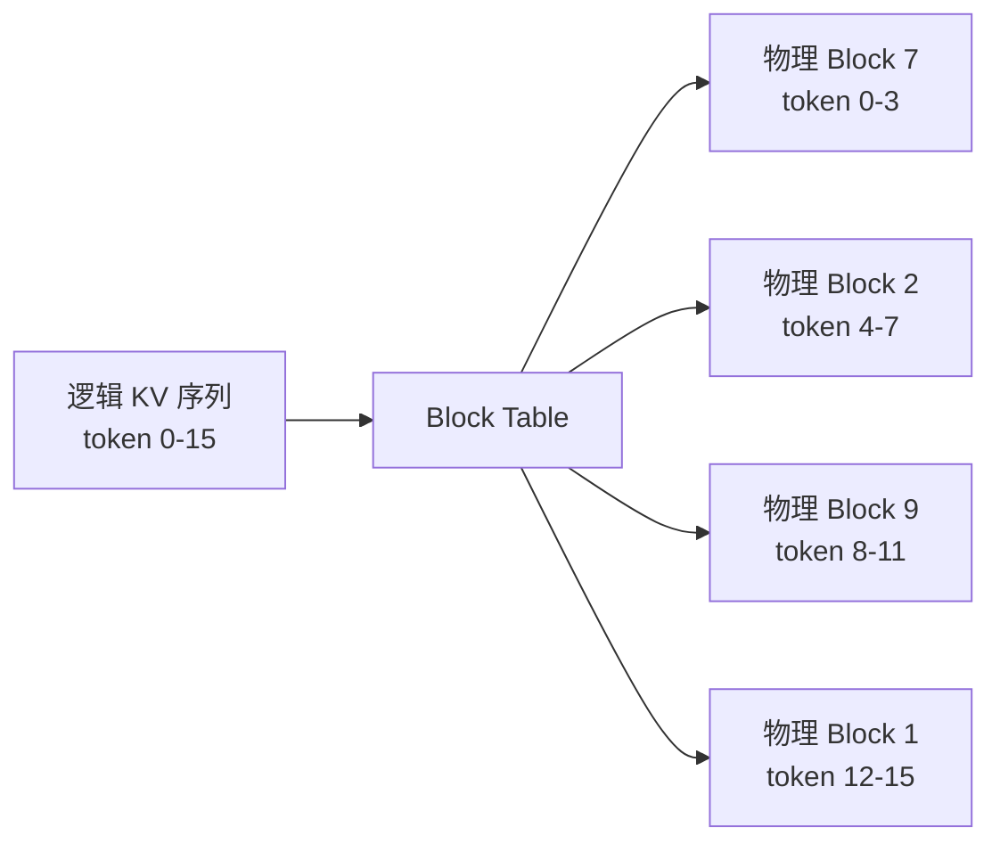
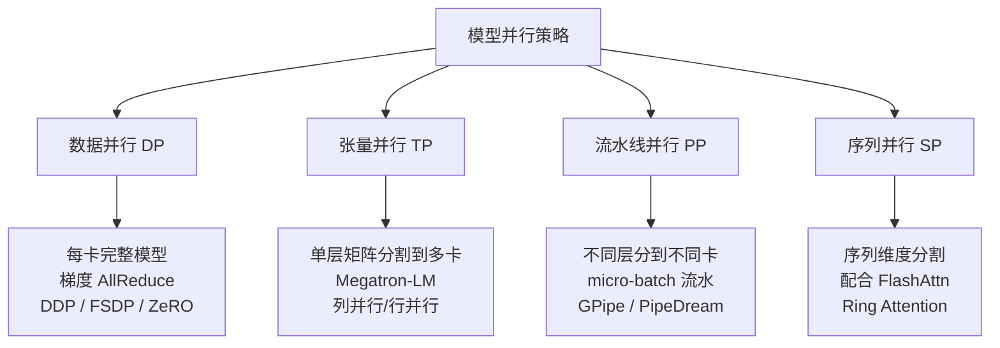
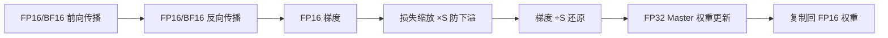
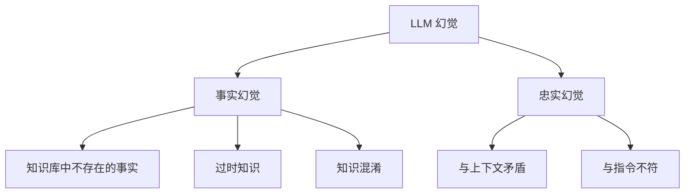
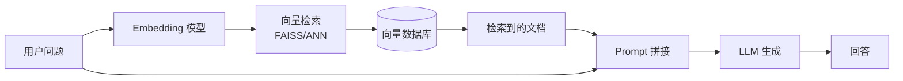
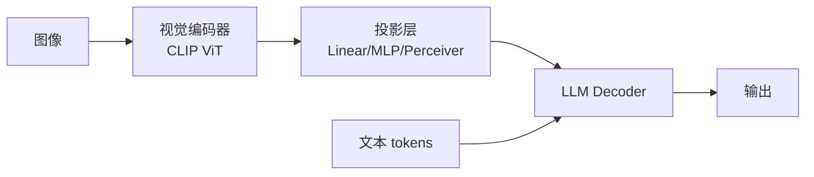

大模型方向面试必考知识点的精炼总结。每个考点给出**核心结论 + 关键公式 + 一句话答案**，适合面试前快速复习。

> 配套详细推导文章：[Policy Gradient](/2026/03/18/policy-gradient-theorem/)、[DPO](/2026/03/18/dpo-direct-preference-optimization/)、[PPO](/2026/03/19/ppo-proximal-policy-optimization/)、[GRPO](/2026/03/18/grpo-group-relative-policy-optimization/)、[RLHF](/2026/03/19/rlhf-complete-pipeline/)、[Transformer](/2026/03/19/transformer-architecture/)

---

## 目录

1. [Transformer 架构](#一-transformer-架构)
2. [注意力机制变体](#二-注意力机制变体)
3. [位置编码](#三-位置编码)
4. [归一化与激活函数](#四-归一化与激活函数)
5. [预训练](#五-预训练)
6. [高效微调 PEFT](#六-高效微调-peft)
7. [对齐：RLHF / DPO / GRPO](#七-对齐rlhf--dpo--grpo)
8. [推理加速](#八-推理加速)
9. [长上下文](#九-长上下文)
10. [训练工程](#十-训练工程)
11. [幻觉与评测](#十一-幻觉与评测)
12. [多模态](#十二-多模态)

---

## 一、Transformer 架构

### 1.1 整体结构



**现代 LLM（LLaMA/GPT 系列）标配**：

| 组件 | 原始 Transformer | 现代 LLM |
|------|-----------------|---------|
| 归一化 | Post-LN | Pre-LN |
| 归一化类型 | LayerNorm | RMSNorm |
| 激活函数 | ReLU | SwiGLU / GeGLU |
| 位置编码 | 正弦绝对编码 | RoPE |
| 注意力 | MHA | GQA / MQA |
| 偏置 | 有 | 无（大多数去掉） |

---

### 1.2 Scaled Dot-Product Attention

$$\text{Attention}(Q, K, V) = \text{softmax}\!\left(\frac{QK^T}{\sqrt{d_k}}\right)V$$

**为什么除以 $\sqrt{d_k}$？**

$Q, K$ 的每个分量 $\sim \mathcal{N}(0,1)$，则 $q \cdot k = \sum_{i=1}^{d_k} q_i k_i$ 的方差为 $d_k$，标准差为 $\sqrt{d_k}$。不除会导致点积值很大，softmax 梯度趋零（梯度消失）。

**计算复杂度**：时间 $O(n^2 d)$，空间 $O(n^2)$，$n$ 为序列长度。

---

### 1.3 Multi-Head Attention

$$\text{MHA}(X) = \text{Concat}(\text{head}_1, \ldots, \text{head}_h) W^O$$

$$\text{head}_i = \text{Attention}(X W_i^Q,\ X W_i^K,\ X W_i^V)$$

**参数量**：$4d^2$（$W^Q, W^K, W^V$ 各 $d \times d$，$W^O$ 为 $d \times d$）

**多头的意义**：不同头学习不同子空间的注意力模式（句法关系、语义相似度、局部依赖等）。

---

### 1.4 FFN 层

$$\text{FFN}(x) = \max(0, xW_1 + b_1)W_2 + b_2$$

**SwiGLU 版（LLaMA）**：

$$\text{FFN}_\text{SwiGLU}(x) = \left(\text{SiLU}(xW_1) \odot xW_3\right) W_2$$

其中 $\text{SiLU}(x) = x \cdot \sigma(x)$。SwiGLU 有三个矩阵，通常将中间维度从 $4d$ 缩小到 $\frac{8d}{3}$ 保持参数量不变。

FFN 参数量约占总参数的 **2/3**（远多于注意力层）。

---

## 二、注意力机制变体

### 2.1 MHA / MQA / GQA 对比

```mermaid
graph LR
    subgraph MHA n_heads=4
        Q1[Q1] --> A1[Attn]
        K1[K1] --> A1
        V1[V1] --> A1
        Q2[Q2] --> A2[Attn]
        K2[K2] --> A2
        V2[V2] --> A2
        Q3[Q3] --> A3[Attn]
        K3[K3] --> A3
        V3[V3] --> A3
        Q4[Q4] --> A4[Attn]
        K4[K4] --> A4
        V4[V4] --> A4
    end

    subgraph MQA 1 KV组
        QQ1[Q1] --> AA[Attn]
        QQ2[Q2] --> AA
        QQ3[Q3] --> AA
        QQ4[Q4] --> AA
        KK[K共享] --> AA
        VV[V共享] --> AA
    end

    subgraph GQA 2 KV组
        QQQ1[Q1] --> AA1[Attn]
        QQQ2[Q2] --> AA1
        KKK1[K组1] --> AA1
        VVV1[V组1] --> AA1
        QQQ3[Q3] --> AA2[Attn]
        QQQ4[Q4] --> AA2
        KKK2[K组2] --> AA2
        VVV2[V组2] --> AA2
    end
```

| 方法 | Q头数 | KV头数 | KV Cache 大小 | 质量 |
|------|-------|--------|--------------|------|
| MHA | $h$ | $h$ | $2 \times h \times d_k$ | 最好 |
| MQA | $h$ | $1$ | $2 \times d_k$ | 稍差 |
| GQA | $h$ | $g$（$1 < g < h$） | $2 \times g \times d_k$ | 接近 MHA |

**GQA 是主流**（LLaMA3、Qwen2 等）：每组 KV 被多个 Q 头共享，推理时 KV Cache 节省 $h/g$ 倍内存，质量损失极小。

---

### 2.2 Flash Attention

**问题**：标准 Attention 需要将 $n \times n$ 的注意力矩阵写到 HBM（显存），IO 成本极高。

**解法（Tiling）**：将 $Q, K, V$ 分块，在 SRAM 上逐块计算，用在线 Softmax（log-sum-exp trick）合并结果，永远不将完整 $n \times n$ 矩阵写到 HBM。

$$m_{\text{new}} = \max(m_{\text{old}},\ \text{rowmax}(S_{\text{block}}))$$

$$l_{\text{new}} = e^{m_{\text{old}} - m_{\text{new}}} l_{\text{old}} + \text{rowsum}(e^{S_{\text{block}} - m_{\text{new}}})$$

**结果**：
- IO 复杂度从 $O(n^2)$ 降到 $O(n^2 / M)$（$M$ 为 SRAM 大小）
- 训练速度提升 **2-4×**，支持更长序列
- 精确等价（非近似），反向传播通过重计算实现

**Flash Attention 2** 改进：减少非矩阵乘法操作，并行化序列维度，GPU 利用率从约 25% 提升到约 70%。

---

### 2.3 稀疏注意力

| 方法 | 思路 | 复杂度 |
|------|------|--------|
| Sliding Window | 每个 token 只关注前后 $w$ 个 | $O(nw)$ |
| Dilated Window | 带孔洞的滑动窗口 | $O(nw)$ |
| Global+Local | 少数 global token + 局部窗口 | $O(nw + ng)$ |
| Longformer | 滑动+全局 | $O(nw)$ |
| BigBird | 随机+局部+全局 | $O(n\sqrt{n})$ |

---

## 三、位置编码

### 3.1 绝对位置编码

**原始 Transformer 正弦编码**：

$$PE_{(pos, 2i)} = \sin\left(\frac{pos}{10000^{2i/d}}\right), \quad PE_{(pos, 2i+1)} = \cos\left(\frac{pos}{10000^{2i/d}}\right)$$

缺点：无法外推到训练时未见过的长度。

---

### 3.2 RoPE（旋转位置编码）

**核心思想**：通过旋转矩阵将位置信息编码到 Q、K 上，使得注意力分数只依赖**相对位置**。

对于二维复数形式：

$$f_q(x_m) = (W_q x_m) e^{im\theta}$$

$$f_k(x_n) = (W_k x_n) e^{in\theta}$$

内积自然出现相对位置 $m - n$：

$$\langle f_q(x_m),\ f_k(x_n) \rangle \propto \text{Re}\left[(W_q x_m)(W_k x_n)^* e^{i(m-n)\theta}\right]$$

在实际 $d$ 维实现中，将维度两两配对，每对以不同频率旋转：

$$\theta_i = 10000^{-2i/d}, \quad i = 0, 1, \ldots, d/2 - 1$$

**优点**：
- 相对位置感知，外推性好
- 无额外参数
- 可以方便地做长度扩展（YaRN、LongRoPE）

**YaRN 长度扩展**：对不同频率的旋转角按比例缩放，高频分量保持，低频分量插值，使 RoPE 支持更长序列。

---

### 3.3 ALiBi

不修改 Attention 计算，直接在 Attention 矩阵上加线性惩罚项：

$$\text{Attention}_{ij} = q_i k_j^T / \sqrt{d} - m \cdot |i - j|$$

其中 $m$ 是各头对应的斜率（等比数列）。天然支持外推但质量略低于 RoPE。

---

## 四、归一化与激活函数

### 4.1 LayerNorm vs RMSNorm

**LayerNorm**：

$$\text{LN}(x) = \frac{x - \mu}{\sqrt{\sigma^2 + \epsilon}} \cdot \gamma + \beta, \quad \mu = \frac{1}{d}\sum x_i, \quad \sigma^2 = \frac{1}{d}\sum(x_i - \mu)^2$$

**RMSNorm**（去掉均值中心化）：

$$\text{RMSNorm}(x) = \frac{x}{\text{RMS}(x)} \cdot \gamma, \quad \text{RMS}(x) = \sqrt{\frac{1}{d}\sum x_i^2}$$

**RMSNorm 优势**：省去均值计算，速度快约 10-15%，效果相当甚至更好（LLaMA、Qwen 系列标配）。

---

### 4.2 Pre-LN vs Post-LN



**Post-LN**（原始 Transformer）：梯度在残差路径直接流过，但每层后做 LN 可能导致训练不稳定，需要 Warmup。

**Pre-LN**（现代 LLM）：归一化在 sublayer 之前，梯度可沿残差路径无障碍反传，训练更稳定，可以用更大学习率，但表达能力稍弱。

---

### 4.3 激活函数对比

| 激活 | 公式 | 特点 |
|------|------|------|
| ReLU | $\max(0, x)$ | 简单，死亡神经元问题 |
| GELU | $x \cdot \Phi(x)$ | 平滑，BERT/GPT-2 |
| SiLU / Swish | $x \cdot \sigma(x)$ | 自门控，无界 |
| SwiGLU | $\text{SiLU}(xW_1) \odot xW_3$ | 门控线性，LLaMA 标配 |
| GeGLU | $\text{GELU}(xW_1) \odot xW_2$ | 类似 SwiGLU |

GLU 系列（SwiGLU/GeGLU）的优势在于乘法门控机制提供了更细粒度的信息过滤。

---

## 五、预训练

### 5.1 语言模型目标

**自回归（GPT 系列）**：

$$\mathcal{L} = -\sum_{t=1}^{T} \log P(x_t \mid x_1, \ldots, x_{t-1}; \theta)$$

使用因果掩码，只能看到过去 token。

**掩码语言模型（BERT 系列）**：

$$\mathcal{L} = -\sum_{t \in \mathcal{M}} \log P(x_t \mid x_{\backslash \mathcal{M}}; \theta)$$

随机掩盖 15% token，双向注意力。缺点：训练和推理不一致（train-test mismatch）。

---

### 5.2 Scaling Laws

**Chinchilla 定律**（DeepMind 2022）：

$$L(N, D) = \frac{A}{N^\alpha} + \frac{B}{D^\beta} + L_\infty$$

最优计算分配：**模型参数量 $N$ 与训练 token 数 $D$ 应满足 $D \approx 20N$**。

| 模型 | 参数量 $N$ | 最优 Token 数 |
|------|-----------|-------------|
| 1B | 10亿 | 200亿 |
| 7B | 70亿 | 1400亿 |
| 70B | 700亿 | 1.4万亿 |

实践中许多模型用远超最优的 token 数训练（如 LLaMA 3 用 15T tokens），因为**推理成本远大于训练成本**，训练充分的小模型推理更划算。

---

### 5.3 数据配比

不同数据源的质量和比例对模型影响极大。常见策略：

- **质量过滤**：去重（MinHash LSH）、语言检测、困惑度过滤（用小模型打分）
- **数据比例**：网页 > 代码 > 书籍 > 学术论文（LLaMA 3 约 90% 网页）
- **课程学习**：先低质量、后高质量；或先长文本、后短文本

**数据污染**：训练数据含测试集样本，导致指标虚高。检测方法：n-gram 重叠检测。

---

### 5.4 参数量计算

一个 LLM 的主要参数来源：

$$N \approx \underbrace{2 d^2 h}_{\text{Attention: }Q,K,V,O} + \underbrace{8d^2 / 3 \times 3}_{\text{FFN: }W_1,W_2,W_3} \approx 12 d^2 h$$

其中 $h$ 为层数，$d$ 为隐层维度。简化估算：

$$N \approx 12 \times d^2 \times h$$

**LLaMA2-7B 验证**：$d=4096, h=32 \Rightarrow 12 \times 4096^2 \times 32 \approx 6.4\text{B}$（加上 Embedding 约 7B）

---

## 六、高效微调 PEFT

### 6.1 LoRA

**核心思想**：冻结预训练权重 $W_0$，仅训练低秩分解的增量矩阵：

$$W = W_0 + \Delta W = W_0 + BA$$

其中 $B \in \mathbb{R}^{d \times r}$，$A \in \mathbb{R}^{r \times k}$，秩 $r \ll \min(d, k)$。

**前向传播**：

$$h = W_0 x + \frac{\alpha}{r} B A x$$

初始化：$A \sim \mathcal{N}(0, \sigma^2)$，$B = 0$（保证训练开始时增量为零）。

**参数节省**：原矩阵参数 $dk$，LoRA 参数 $(d+k)r$，节省比例 $\approx \frac{dk}{(d+k)r}$。

对于 $d=k=4096, r=8$：原 $16.7M$，LoRA $65.5K$，节省 **255倍**。

**部署时合并权重**：$W = W_0 + BA$，推理无额外开销。

---

### 6.2 LoRA 变体

| 方法 | 改进点 | 核心思路 |
|------|--------|---------|
| LoRA | 基础 | 低秩分解 $BA$ |
| AdaLoRA | 动态秩分配 | SVD 裁剪重要性低的奇异值 |
| QLoRA | 4bit 量化 + LoRA | NF4 量化 + 双重量化 + Paged Optimizer |
| LoRA+ | 差异学习率 | $B$ 用更大 lr，$A$ 用小 lr |
| DoRA | 权重分解 | 分量级、方向两部分分别调整 |
| LLaMA-Pro | 添加新层 | 冻结原层，只训练新插入层 |
| GaLore | 梯度低秩 | 对梯度做 SVD，节省优化器状态内存 |

---

### 6.3 Prompt Tuning / Prefix Tuning

**Prompt Tuning**：在输入端添加可学习的虚拟 token（soft prompt），只训练这些 token 的 embedding。

**Prefix Tuning**：在每层的 KV 序列前面拼接可训练的前缀向量，比 Prompt Tuning 表达力更强。

两者的共同问题：参数少，大模型效果接近全量微调，但小模型表现明显较差。

---

### 6.4 全参微调技巧

**灾难性遗忘**的缓解方法：

1. **小学习率** $\leq 10^{-5}$，配合 Warmup
2. **数据混合**：微调数据 + 部分预训练数据
3. **层间差异学习率**：底层学习率更小（底层更通用）
4. **正则化**：L2 惩罚或 EWC（Elastic Weight Consolidation）

---

## 七、对齐：RLHF / DPO / GRPO

### 7.1 RLHF 三阶段



**Stage 1 SFT**：在人工标注的高质量示例上做监督微调。

**Stage 2 奖励模型**：基于 Bradley-Terry 模型，对偏好对 $(y_w, y_l)$ 训练：

$$\mathcal{L}_\text{RM} = -\mathbb{E}_{(x, y_w, y_l)} \left[\log \sigma(r(x, y_w) - r(x, y_l))\right]$$

**Stage 3 PPO**：用 RL 最大化奖励，同时加 KL 惩罚防止偏离 SFT 模型：

$$\mathcal{L}_\text{PPO} = \mathbb{E}\left[r(x, y) - \beta \log \frac{\pi_\theta(y|x)}{\pi_\text{ref}(y|x)}\right]$$

---

### 7.2 DPO（直接偏好优化）

**核心推导**：RLHF 的最优策略有闭合解：

$$\pi^*(y|x) = \frac{\pi_\text{ref}(y|x) \exp(r(x,y)/\beta)}{Z(x)}$$

代入 Bradley-Terry，消去奖励模型 $r$，得到 DPO 损失：

$$\mathcal{L}_\text{DPO} = -\mathbb{E}_{(x, y_w, y_l)}\left[\log \sigma\!\left(\beta \log \frac{\pi_\theta(y_w|x)}{\pi_\text{ref}(y_w|x)} - \beta \log \frac{\pi_\theta(y_l|x)}{\pi_\text{ref}(y_l|x)}\right)\right]$$

**三句话总结 DPO**：
1. 把奖励模型隐含在策略比值里，不再单独训练 RM
2. 用偏好数据直接优化策略，省去 PPO 的 RL 循环
3. $\beta$ 控制偏离 ref 策略的程度，通常取 0.1～0.5

**DPO 的问题**：静态数据集，正例对应的概率也可能被压低（chosen 退化问题）；解决方案：SimPO（不依赖 ref）、Online DPO（动态生成）。

---

### 7.3 GRPO（组相对策略优化）

**核心思想**（DeepSeek-R1 使用）：对每个问题采样 $G$ 个回答，以组内相对排序代替 Critic：

$$\hat{A}_i = \frac{r_i - \text{mean}(\mathbf{r})}{\text{std}(\mathbf{r})}$$

损失（含裁剪 + KL 惩罚）：

$$\mathcal{L}_\text{GRPO} = -\mathbb{E}\left[\min\left(\rho_i \hat{A}_i,\ \text{clip}(\rho_i, 1-\epsilon, 1+\epsilon)\hat{A}_i\right)\right] + \beta \cdot \mathbb{D}_\text{KL}[\pi_\theta \| \pi_\text{ref}]$$

**优点**：省去 Critic 模型（节省 50% 显存），奖励估计更稳定。

**Dr. GRPO**（修正版）：原始 GRPO 的优势估计存在 token 级别 bias（短序列方差大），Dr. GRPO 对每个 token 独立归一化：

$$\hat{A}_i^t = \frac{r_i - \mu_G}{\sigma_G \sqrt{|o_i|}}$$

---

### 7.4 PPO 在 RLHF 中的特殊性

RLHF 的 PPO 是 **token 级 MDP**，而非 bandit 问题：

- **状态**：已生成的 token 序列
- **动作**：下一个 token
- **奖励**：只在 EOS 时获得（稀疏奖励），中间步骤奖励为 0 + KL 惩罚

四个模型：

| 模型 | 是否训练 | 作用 |
|------|---------|------|
| Actor $\pi_\theta$ | ✅ | 生成回答 |
| Critic $V_\phi$ | ✅ | 估计状态价值 |
| Reward Model | ❌（冻结） | 打分 |
| Ref Policy $\pi_\text{ref}$ | ❌（冻结） | KL 基准 |

---

### 7.5 奖励 Hacking 与 Goodhart's Law

> "When a measure becomes a target, it ceases to be a good measure."

RM 被过度优化时，模型学会欺骗 RM 而非真正有益。表现：
- 回答冗长（RM 倾向于长回答）
- 格式 hack（过多强调语气词）
- 对抗性输入

缓解方法：KL 惩罚、定期更新 RM、多 RM ensemble、使用规则奖励（代码可运行性、数学验证）。

---

## 八、推理加速

### 8.1 KV Cache

每个 token 的 $K, V$ 只需计算一次并缓存，后续 token 直接复用：

$$\text{KV Cache 大小} = 2 \times n_{\text{layers}} \times n_{\text{heads}} \times d_k \times L \times \text{dtype\_bytes}$$

以 LLaMA2-7B（32层，32头，$d_k=128$，dtype=float16）为例，序列长度 $L=4096$：

$$2 \times 32 \times 32 \times 128 \times 4096 \times 2 \approx 2\text{GB}$$

---

### 8.2 vLLM PagedAttention

**问题**：KV Cache 提前分配最大序列长度，导致大量内部碎片（平均利用率约 20-40%）。

**PagedAttention**：借鉴 OS 虚拟内存分页，KV Cache 按**固定大小的 block（页）** 分配，逻辑序列到物理 block 的映射由 block table 管理。



**效果**：内存利用率从 ~30% 提升到 ~90%，支持更大 batch size，吞吐量提升 24×（与 HF 原始实现对比）。

---

### 8.3 投机采样（Speculative Decoding）

**思路**：用小草稿模型（draft model）先快速生成 $k$ 个 token，大模型一次并行验证全部：

1. Draft model 生成 token $t_1, \ldots, t_k$
2. Target model **并行**计算这 $k$ 个位置的概率
3. 按接受率 $\min(1, p_\text{target}/p_\text{draft})$ 拒绝采样
4. 拒绝的位置从 target 分布重新采样

**加速原理**：大模型 $k+1$ 个 token 并行 prefill 比串行 decode $k+1$ 次快很多（prefill 更能利用并行度）。

**实际加速比**：取决于 draft 与 target 的分布接近程度，通常 **2-3×** 加速。

---

### 8.4 量化

| 精度 | 显存比 | 质量损失 | 应用场景 |
|------|--------|---------|---------|
| FP32 | 4× | 无 | 训练 |
| BF16 | 2× | 极小 | 训练/推理 |
| FP16 | 2× | 极小 | 推理 |
| INT8 | 1× | 小 | 推理（LLM.int8） |
| NF4/INT4 | 0.5× | 中 | 边缘推理（GPTQ/AWQ）|
| INT2/GGUF Q2 | 0.25× | 较大 | 极端压缩 |

**GPTQ**（训练后量化）：逐层最小化量化误差 $\|W x - \hat{W} x\|^2$，使用 Hessian 信息做 OBC（Optimal Brain Compression）。

**AWQ**（权重激活量化）：关键权重（激活值大的通道）用高精度保护，其余低精度。相比 GPTQ 无需校准数据。

**LLM.int8**：矩阵乘法中出现的极端异常值（outlier）用 FP16 处理，其余用 INT8，混合精度推理。

---

### 8.5 连续批处理（Continuous Batching）

**问题**：静态批处理（static batching）需要所有序列同时结束才能释放，导致 GPU 等待。

**解法**：**迭代级调度**——每次迭代后，完成的序列立即从 batch 中移出，新请求立即加入。

```mermaid
gantt
    title 连续批处理 vs 静态批处理
    dateFormat X
    axisFormat %s

    section 静态批处理
    Req1 长序列    :0, 10
    Req2 短序列    :0, 4
    等待 Req1     :4, 10

    section 连续批处理
    Req1 长序列    :0, 10
    Req2 短序列    :0, 4
    Req3 新请求    :4, 8
    Req4 新请求    :4, 7
```



结合 PagedAttention，vLLM 实现了高吞吐量的在线推理服务。

---

### 8.6 Prefill / Decode 分离

现代 LLM 推理有两个阶段：

| 阶段 | 特点 | 瓶颈 |
|------|------|------|
| Prefill（首 token） | 并行处理输入，计算密集 | Compute-bound |
| Decode（后续 token） | 逐 token 生成，访存密集 | Memory-bound |

两个阶段的资源需求不同，**分离部署**可以独立扩展：Prefill 实例用多卡并行，Decode 实例用高带宽内存卡（如 H100 HBM3）。

---

## 九、长上下文

### 9.1 长上下文挑战

1. **注意力计算**：$O(n^2)$ 显存和时间
2. **KV Cache**：线性增长，超出 GPU 显存
3. **位置泛化**：RoPE 在未见过的长度上退化
4. **中间迷失**（Lost in the Middle）：模型对序列中间部分的信息提取能力弱

---

### 9.2 位置编码外推方法

**线性插值（PI）**：将位置索引缩放到训练范围：$pos' = pos \times \frac{L_\text{train}}{L_\text{new}}$

**YaRN**：对不同频率的 RoPE 维度分别处理：
- 高频（短距离依赖）：不插值，保持原始
- 中频：插值
- 低频（长距离依赖）：缩放

**LongRoPE**：在 attention 权重上添加可学习的非均匀缩放因子。

---

### 9.3 注意力稀疏化

**Sliding Window Attention**（Mistral）：每个 token 只关注前 $W$ 个 token（$W=4096$），但通过多层叠加实现 $N \times W$ 的有效感受野。

**StreamingLLM**：保留 Attention Sink（开头几个 token 吸引大量注意力）+ 滑动窗口，实现无限长序列推理（但无法"记住"窗口外信息）。

**Hybrid（MLA）**：DeepSeek 的多头潜在注意力，将 KV 压缩到低维潜在空间：

$$\mathbf{c}_t^{KV} = W^{DKV} h_t \quad \text{（低维压缩，} d_c \ll d_h h\text{）}$$

推理时 KV Cache 只缓存低维向量，节省 $h/r$ 倍内存。

---

## 十、训练工程

### 10.1 并行策略



**3D 并行**：DP × TP × PP 组合使用，以 LLaMA 70B 为例：TP=8（单机内），PP=4（跨机），DP=根据总卡数。

---

### 10.2 ZeRO 优化器

| 阶段 | 分片内容 | 显存节省 | 通信开销 |
|------|---------|---------|---------|
| ZeRO-1 | 优化器状态 | 4× | 少量 |
| ZeRO-2 | + 梯度 | 8× | 中等 |
| ZeRO-3 | + 参数 | 64× | 较多 |

**AdamW 每个参数的显存**（FP16 训练）：
- 参数：2 bytes（FP16）
- 梯度：2 bytes（FP16）
- Master weights：4 bytes（FP32）
- Adam m, v：4 + 4 bytes（FP32）

共 **16 bytes/参数**，7B 模型约需 112GB，ZeRO-3 可分摊到多卡。

---

### 10.3 混合精度训练



**BF16 vs FP16**：
- BF16：指数位多（±3.4×10³⁸），精度少（3位小数），不需要 GradScaler，A100/H100 推荐
- FP16：精度高（3.3×10⁻⁴），范围小，容易溢出，需要 GradScaler

---

### 10.4 梯度检查点（Gradient Checkpointing）

**问题**：前向传播的中间激活值需保存用于反向传播，显存正比于层数 $\times$ batch。

**解法**：只保存部分检查点（如每 $\sqrt{n}$ 层保存一次），反向传播时从最近检查点**重新计算**中间激活。

**显存-计算权衡**：
- 无 checkpointing：显存 $O(n)$，计算 $1\times$
- 完全 checkpointing：显存 $O(\sqrt{n})$，计算约 $1.33\times$（多一次前向传播）

---

### 10.5 优化器选择

| 优化器 | 内存开销 | 特点 | 适用场景 |
|--------|---------|------|---------|
| SGD+Momentum | 1× param | 最省内存 | 视觉任务 |
| AdamW | 3× param | 自适应 lr，稳定 | LLM 标配 |
| Adafactor | ~1× param | 不存完整 m/v，分解存储 | 超大模型 |
| SOAP | 2× param | 利用 Shampoo 预条件 | 收敛快 |
| Muon | 1.5× param | Nesterov + 正交化 | 新兴，快速收敛 |

**AdamW 超参**：$\beta_1=0.9$，$\beta_2=0.95$（LLM 常用，比默认 0.999 更快适应），$\epsilon=10^{-8}$，weight decay $= 0.1$。

---

## 十一、幻觉与评测

### 11.1 幻觉的类型与成因



**成因**：
1. 预训练数据噪声、偏差
2. 自回归的曝光偏差（训练用真实 token，推理用生成 token）
3. 过度自信——softmax 温度效应
4. 知识截止与时效性问题

**缓解方法**：RAG（检索增强）、思维链验证、多次采样后自我一致性（Self-Consistency）、RLHF 引导诚实性。

---

### 11.2 RAG 架构



**关键组件**：
- **分块策略**：固定大小 vs 语义分块，chunk overlap
- **Embedding 模型**：BGE、E5、text-embedding-3
- **检索**：稠密检索（向量相似度）+ 稀疏检索（BM25）混合
- **重排序（Reranker）**：Cross-encoder 精排，提升 top-k 精度

---

### 11.3 主要评测基准

| 基准 | 类型 | 考察能力 |
|------|------|---------|
| MMLU | 多选 | 世界知识，57 学科 |
| HumanEval / MBPP | 代码 | Python 编程 |
| GSM8K | 数学 | 小学数学推理 |
| MATH | 数学 | 竞赛级数学 |
| GPQA | 科学 | 专家级科学问题 |
| MT-Bench | 对话 | 多轮指令跟随 |
| HELM | 综合 | 多任务综合评估 |
| LiveBench | 动态 | 防数据污染，月更 |
| SWE-Bench | 代码 | GitHub issue 修复 |

---

### 11.4 常用解码策略

**贪婪解码**：$\hat{y}_t = \arg\max P(y_t | y_{<t})$，确定但多样性差。

**Beam Search**：保留 $k$ 条最优路径，适合翻译/摘要，不适合开放生成（倾向于重复）。

**采样**：按概率分布随机采样，多样性好。

**Temperature**：$P(y_t) \propto \exp(\text{logits}_t / T)$，$T > 1$ 更随机，$T < 1$ 更集中。

**Top-k 采样**：只从概率最高的 $k$ 个 token 中采样。

**Top-p（Nucleus）采样**：累积概率达到 $p$ 后截断，动态调整候选集大小。

**Min-P**（新型）：相对于最高概率 token 设置最小概率阈值，比 top-p 更鲁棒。

**Typical Sampling**：基于信息量（entropy）而非概率大小进行采样，更符合人类写作特点。

---

## 十二、多模态

### 12.1 视觉语言模型（VLM）架构



**三种对齐方式**：

| 方法 | 投影层 | 代表模型 |
|------|--------|---------|
| Linear Projection | 单层线性 | LLaVA-1 |
| MLP Projection | 2层 MLP | LLaVA-1.5 |
| Cross-Attention | Q-Former / Perceiver | BLIP-2、Flamingo |
| 直接拼接 token | 无 | PaLI |

**训练阶段**：
1. **特征对齐**：冻结 ViT 和 LLM，只训练投影层（用图文对数据）
2. **指令微调**：解冻 LLM（或 LoRA），用视觉指令数据微调

---

### 12.2 视觉 Token 压缩

高分辨率图像产生大量 visual token（$224^2/14^2 = 256$），压缩方法：

- **Pooling**：平均池化，最简单
- **Q-Former**：固定数量的可学习 query token 从视觉特征中提取信息
- **Dynamic Resolution**：将图片按原始比例分 tile，动态调整 token 数（LLaVA-Next）

---

### 12.3 CLIP 训练

对比学习目标：拉近匹配的图文对，推远不匹配的：

$$\mathcal{L}_\text{CLIP} = -\frac{1}{N}\sum_{i=1}^N \left[\log \frac{e^{\text{sim}(z_i^I, z_i^T)/\tau}}{\sum_j e^{\text{sim}(z_i^I, z_j^T)/\tau}} + \log \frac{e^{\text{sim}(z_i^T, z_i^I)/\tau}}{\sum_j e^{\text{sim}(z_i^T, z_j^I)/\tau}}\right]$$

温度参数 $\tau$ 可学习，OpenAI CLIP 最终约为 0.07。

---

## 附录：面试常问一句话答案

**Q：为什么 Transformer 比 RNN 好？**
A：并行计算（RNN 串行依赖上一步），任意距离依赖均为 $O(1)$（RNN 为 $O(n)$），更容易训练超大规模模型。

**Q：Self-Attention 的时间复杂度是多少？为什么长序列慢？**
A：$O(n^2 d)$，每对 token 都要计算相似度，序列加倍则计算量变为 4 倍。

**Q：LayerNorm 放在哪里更好（Pre-LN vs Post-LN）？**
A：Pre-LN 训练更稳定，不需要仔细调 Warmup，现代 LLM 均采用 Pre-LN。

**Q：LoRA 为什么有效？**
A：预训练模型权重更新的本征秩很低（low intrinsic rank），LoRA 用 $r \ll d$ 的低秩矩阵近似全量更新。

**Q：DPO 和 PPO 最大的区别？**
A：DPO 无需奖励模型和强化学习循环，直接用偏好数据优化策略，更简单稳定；PPO 在线生成样本，探索更充分但工程复杂。

**Q：KV Cache 是什么，为什么能加速推理？**
A：缓存历史 token 的 Key 和 Value，避免每步都重新计算，decode 阶段从 $O(n^2)$ 降到 $O(n)$。

**Q：INT8 量化为什么不直接对所有权重做？**
A：LLM 激活值中存在少量极端异常值（outlier），这些维度若量化到 INT8 会损失大量信息，LLM.int8 对 outlier 维度保留 FP16。

**Q：投机采样（Speculative Decoding）的加速来自哪里？**
A：draft model 快速生成 $k$ 个 token，target model 并行验证，将 $k+1$ 次串行 decode 变为 1 次并行 prefill，利用了大模型 prefill 的高并行度。

**Q：RLHF 中奖励 Hacking 是什么？如何避免？**
A：模型优化到奖励模型的 proxy 而非真实目标（Goodhart's Law），通过 KL 惩罚限制偏离程度、使用多个 RM ensemble、定期更新 RM 缓解。

**Q：Flash Attention 为什么快但结果一样？**
A：通过 tiling 在 SRAM 上计算，避免读写 HBM 的 $n^2$ 注意力矩阵，用在线 softmax（log-sum-exp）合并分块结果，数学上完全等价。

**Q：为什么 BF16 比 FP16 更适合 LLM 训练？**
A：BF16 指数位更多，表示范围与 FP32 相同（不容易溢出），不需要 GradScaler；FP16 精度更高但范围小，梯度更新时容易下溢。

**Q：GQA 和 MQA 的区别？**
A：MQA 是所有 Query 头共享 1 组 KV；GQA 是每 $h/g$ 个 Query 头共享 1 组 KV，是 MHA 和 MQA 的插值，质量更接近 MHA。

**Q：Scaling Law 告诉了我们什么？**
A：给定计算预算，最优的做法是模型参数量和训练 token 数等比增长（Chinchilla 定律：最优 token 数约为参数量的 20 倍）。

**Q：为什么大模型用 AdamW 而不是 SGD？**
A：LLM 各层梯度尺度差异极大（embedding 梯度小，头部梯度大），AdamW 的自适应学习率自动平衡各参数的更新幅度，SGD 需要大量精细调参。
