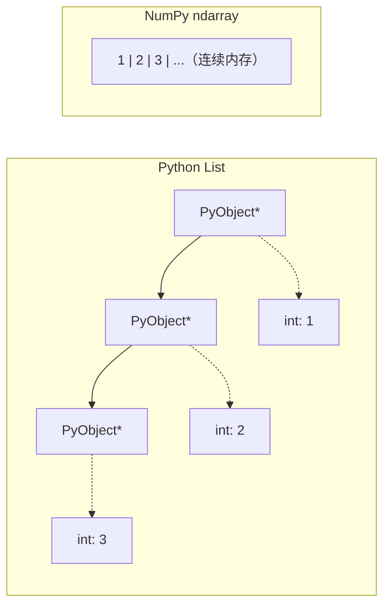
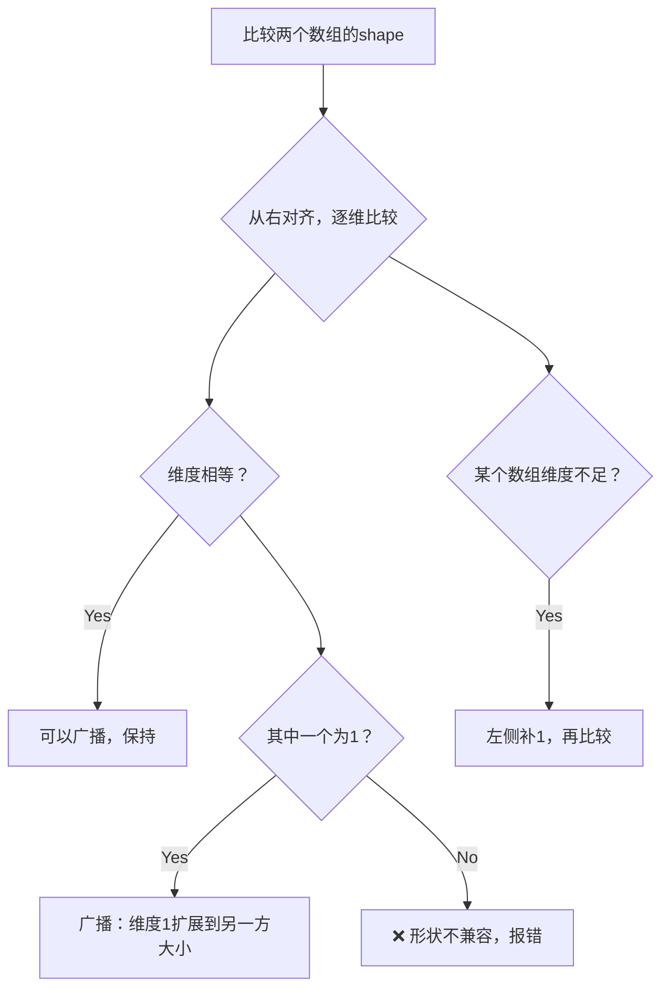
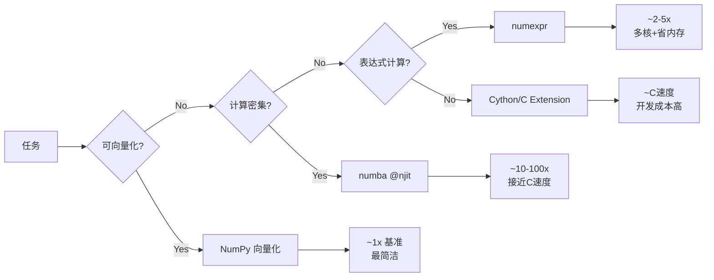
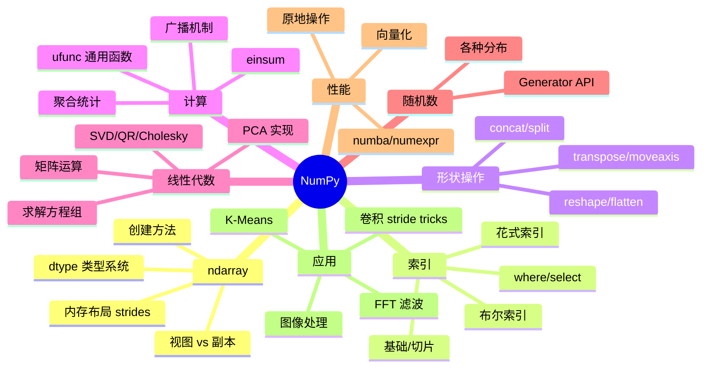

NumPy 是 Python 科学计算的基石，几乎所有数据科学、机器学习框架（PyTorch、TensorFlow、Pandas、SciPy）底层都依赖它。本文系统讲解 NumPy 的核心特性，从 ndarray 的内存布局到广播机制、线性代数、FFT，以及实战技巧。

---

## 目录

1. [NumPy 核心概念](#1-numpy-核心概念)
2. [ndarray 创建](#2-ndarray-创建)
3. [数组属性与内存布局](#3-数组属性与内存布局)
4. [索引与切片](#4-索引与切片)
5. [形状操作](#5-形状操作)
6. [通用函数 ufunc](#6-通用函数-ufunc)
7. [广播机制](#7-广播机制)
8. [聚合与统计](#8-聚合与统计)
9. [线性代数](#9-线性代数)
10. [随机数生成](#10-随机数生成)
11. [结构化数组与字符串操作](#11-结构化数组与字符串操作)
12. [文件 IO](#12-文件-io)
13. [性能优化](#13-性能优化)
14. [实战案例](#14-实战案例)

---

## 1. NumPy 核心概念

### 1.1 为什么 NumPy 快？

Python 原生 list 是对象数组，每个元素是独立的 Python 对象，有类型检查、引用计数等开销。NumPy ndarray 是**同质类型的连续内存块**，底层用 C 实现，可直接调用 BLAS/LAPACK 等优化库。



性能差异：

```python
import numpy as np
import time

n = 10_000_000

# Python list
lst = list(range(n))
t0 = time.time()
result = sum(x * 2 for x in lst)
print(f"Python list: {time.time() - t0:.3f}s")  # ~0.8s

# NumPy
arr = np.arange(n)
t0 = time.time()
result = (arr * 2).sum()
print(f"NumPy:       {time.time() - t0:.3f}s")  # ~0.02s
# 约快 40x
```

### 1.2 安装

```bash
pip install numpy

# 验证
python -c "import numpy as np; print(np.__version__); print(np.show_config())"
```

---

## 2. ndarray 创建

### 2.1 从数据创建

```python
import numpy as np

# ---- 从 Python 序列 ----
a = np.array([1, 2, 3])                    # 1D int64
a = np.array([1.0, 2.0, 3.0])             # 1D float64
a = np.array([[1, 2, 3], [4, 5, 6]])       # 2D, shape (2, 3)
a = np.array([[[1,2],[3,4]],[[5,6],[7,8]]]) # 3D, shape (2, 2, 2)

# 指定 dtype
a = np.array([1, 2, 3], dtype=np.float32)
a = np.array([1, 2, 3], dtype=np.int16)
a = np.array([True, False, True], dtype=bool)
a = np.array([1+2j, 3+4j], dtype=np.complex128)

# ---- 从嵌套列表自动推断 ----
matrix = np.array([[1, 2], [3, 4], [5, 6]])
print(matrix.shape)  # (3, 2)
print(matrix.dtype)  # int64
```

### 2.2 特殊数组

```python
# ---- 零、一、常数 ----
np.zeros((3, 4))                     # 全0, float64
np.ones((3, 4), dtype=np.int32)      # 全1, int32
np.full((3, 4), fill_value=7.0)      # 全7.0
np.empty((3, 4))                     # 未初始化（快速分配）

np.zeros_like(a)                     # 同shape/dtype，全0
np.ones_like(a)                      # 同shape/dtype，全1
np.full_like(a, fill_value=3)        # 同shape/dtype，全3
np.empty_like(a)                     # 同shape/dtype，未初始化

# ---- 单位矩阵与对角矩阵 ----
np.eye(4)                            # 4×4单位矩阵
np.eye(4, k=1)                       # 上对角线为1
np.identity(4)                       # 同 np.eye(4)
np.diag([1, 2, 3])                   # 以[1,2,3]为对角的矩阵
np.diag(matrix)                      # 提取矩阵对角线元素

# ---- 序列数组 ----
np.arange(10)                        # [0, 1, ..., 9]
np.arange(1, 10, 2)                  # [1, 3, 5, 7, 9]
np.arange(0, 1, 0.1)                 # [0.0, 0.1, ..., 0.9]

np.linspace(0, 1, 11)               # 0到1均匀分11个点（含端点）
np.linspace(0, 1, 10, endpoint=False)  # 不含端点
np.logspace(0, 3, 4)                # 10^0到10^3，4个点 → [1,10,100,1000]
np.geomspace(1, 1000, 4)            # 几何等比数列

# ---- 网格 ----
x = np.linspace(-2, 2, 5)
y = np.linspace(-2, 2, 5)

# 稠密网格
XX, YY = np.meshgrid(x, y)          # 各shape (5, 5)

# 稀疏网格（节省内存）
XX, YY = np.meshgrid(x, y, sparse=True)  # XX shape (1,5), YY shape (5,1)

# mgrid（切片语法）
XX, YY = np.mgrid[-2:2:5j, -2:2:5j]  # 5j表示5个点
```

### 2.3 数据类型（dtype）速查

| dtype | 别名 | 位数 | 范围 |
|-------|------|------|------|
| `np.int8` | `i1` | 8 | -128 ~ 127 |
| `np.int16` | `i2` | 16 | -32768 ~ 32767 |
| `np.int32` | `i4` | 32 | ±2.1×10⁹ |
| `np.int64` | `i8` | 64 | ±9.2×10¹⁸ |
| `np.uint8` | `u1` | 8 | 0 ~ 255 |
| `np.float16` | `f2` | 16 | ±65504, 精度 ~3位 |
| `np.float32` | `f4` | 32 | 精度 ~7位 |
| `np.float64` | `f8` | 64 | 精度 ~15位（默认）|
| `np.complex64` | `c8` | 64 | 2×float32 |
| `np.complex128` | `c16` | 128 | 2×float64 |
| `np.bool_` | `?` | 8 | True/False |

```python
# 类型转换
a = np.array([1.7, 2.9, 3.1])
b = a.astype(np.int32)       # [1, 2, 3]，截断
c = a.astype(np.float16)     # 降精度

# 类型检查
np.issubdtype(a.dtype, np.floating)   # True
np.issubdtype(a.dtype, np.integer)    # False

# dtype信息
info = np.finfo(np.float32)
print(info.max, info.min, info.eps)   # 最大值、最小值、机器精度
info = np.iinfo(np.int32)
print(info.max, info.min)
```

---

## 3. 数组属性与内存布局

### 3.1 基本属性

```python
a = np.array([[1, 2, 3], [4, 5, 6]], dtype=np.float64)

print(a.shape)       # (2, 3)           形状
print(a.ndim)        # 2                维度数
print(a.size)        # 6                元素总数
print(a.dtype)       # float64          数据类型
print(a.itemsize)    # 8                每个元素字节数
print(a.nbytes)      # 48               总字节数 = size * itemsize
print(a.strides)     # (24, 8)          步长（字节）
print(a.flags)       # 内存标志
print(a.data)        # 内存缓冲区
```

### 3.2 内存布局详解

`strides` 是理解 NumPy 底层的关键：步长告诉我们沿每个维度移动一个元素需要跳过多少字节。

对于 shape=(2,3)、dtype=float64（8字节）的数组：
- **C-contiguous（行优先）**：strides = (24, 8)，沿行移动8字节，沿列移动24字节
- **F-contiguous（列优先）**：strides = (8, 24)，沿行移动24字节，沿列移动8字节

```python
# C-order（默认，行优先）
a = np.array([[1,2,3],[4,5,6]], order='C')
print(a.strides)    # (24, 8)
print(a.flags['C_CONTIGUOUS'])  # True

# F-order（列优先，FORTRAN风格）
b = np.array([[1,2,3],[4,5,6]], order='F')
print(b.strides)    # (8, 16)
print(b.flags['F_CONTIGUOUS'])  # True

# 转置不复制数据，只改变strides
c = a.T
print(c.strides)    # (8, 24) ← 与a相反
print(np.shares_memory(a, c))  # True，共享内存

# 检查连续性
a.T.flags['C_CONTIGUOUS']  # False
np.ascontiguousarray(a.T)   # 强制转为C连续
```

内存布局决定了访问效率：沿 stride 小的方向遍历是**缓存友好**的。

```python
# 行访问（沿列方向，stride=8）→ 缓存友好
%timeit a[0, :]  # fast

# 列访问（沿行方向，stride=24）
%timeit a[:, 0]  # 对大数组相对慢

# 实际矩阵乘法性能影响
N = 2000
A = np.random.randn(N, N)
B = np.random.randn(N, N)

%timeit A @ B         # C连续，快
%timeit A @ B.T.copy() # 先copy让B连续，更快
```

### 3.3 视图 vs 副本

这是 NumPy 中最容易踩坑的地方：

```python
a = np.array([1, 2, 3, 4, 5])

# 视图（共享内存）
b = a[1:4]           # 切片返回视图
b[0] = 99
print(a)             # [1, 99, 3, 4, 5] ← a也变了！

# 副本（独立内存）
c = a[1:4].copy()
c[0] = 0
print(a)             # 不变

# 判断是否共享内存
np.shares_memory(a, b)   # True
np.shares_memory(a, c)   # False
b.base is a              # True（视图有base属性）
c.base is None           # True（副本无base）

# 哪些操作返回视图，哪些返回副本
# -------- 视图 --------
a[::2]           # 切片
a.reshape(5, 1)  # 连续内存时
a.T              # 转置
a.view(np.uint8) # 重新解释dtype

# -------- 副本 --------
a[np.array([0,2,4])]  # 花式索引
a[a > 2]              # 布尔索引
a.flatten()           # 总是副本（vs ravel可能是视图）
np.concatenate([a, a])
```

---

## 4. 索引与切片

### 4.1 基础索引

```python
a = np.arange(24).reshape(2, 3, 4)
# shape: (2, 3, 4)

# 整数索引
a[0]           # shape (3, 4)，第0个2D切片
a[0, 1]        # shape (4,)
a[0, 1, 2]     # 标量: 6

# 负索引
a[-1]          # 最后一个2D切片
a[0, -1, -1]   # 11

# 切片 [start:stop:step]
a[0:2]         # 两个2D切片
a[:, 1:3, :]   # 第1,2行
a[..., ::2]    # 每隔一列 (Ellipsis: ...)
a[:, :, 1]     # 最后一维第1个 → shape (2, 3)

# 混合：整数索引 vs 切片
# 整数索引降维，切片保持维度
a[0, :, :]     # shape (3, 4)
a[0:1, :, :]   # shape (1, 3, 4) ← 保持第0维
```

### 4.2 花式索引（Fancy Indexing）

```python
a = np.array([10, 20, 30, 40, 50])

# 整数数组索引（返回副本！）
idx = np.array([0, 2, 4])
a[idx]           # [10, 30, 50]

# 二维索引
matrix = np.arange(12).reshape(3, 4)
rows = np.array([0, 1, 2])
cols = np.array([0, 2, 3])
matrix[rows, cols]      # [0, 6, 11]（对角元素）

# 花式索引赋值
a[[0, 2, 4]] = 0        # 批量赋值
matrix[rows, cols] = -1

# ix_ 创建开放网格（外积组合）
r = np.array([0, 2])
c = np.array([1, 3])
matrix[np.ix_(r, c)]    # 选取行0,2 与列1,3的子矩阵
# 等价于 matrix[[0,2]][:, [1,3]]

# 用花式索引实现 gather/scatter（模拟PyTorch gather）
def gather(a, idx, axis=0):
    return np.take_along_axis(a, idx, axis=axis)

def scatter(a, idx, values, axis=0):
    np.put_along_axis(a, idx, values, axis=axis)
```

### 4.3 布尔索引

```python
a = np.array([1, -2, 3, -4, 5])

# 布尔掩码
mask = a > 0
print(mask)    # [True, False, True, False, True]
a[mask]        # [1, 3, 5]

# 直接条件索引
a[a > 0]                  # 正数
a[(a > 0) & (a < 4)]      # 1~4之间（注意用 & 而非 and）
a[(a < 0) | (a > 4)]      # 负数或大于4

# 赋值
a[a < 0] = 0              # 将负数置零
np.where(a > 0, a, 0)     # 等价（返回新数组）

# np.where：三元选择
result = np.where(a > 0, a * 2, -1)
# 正数乘2，其余设为-1

# nonzero / argwhere（找非零元素坐标）
idx = np.nonzero(a > 0)         # tuple of arrays
idx = np.argwhere(a > 0)        # 2D array of indices

# 二维布尔索引
matrix = np.arange(9).reshape(3, 3)
row_mask = matrix.sum(axis=1) > 6   # 行和>6
matrix[row_mask]                     # 选对应行
```

### 4.4 np.where 与 np.select

```python
x = np.array([-3, -1, 0, 1, 3])

# np.where：二路选择
np.where(x > 0, x, 0)           # [0, 0, 0, 1, 3]

# np.select：多路选择
conditions = [x < -1, x == 0, x > 1]
choices    = [x * 2, 100,    x ** 2]
np.select(conditions, choices, default=x)
# [-6, -1, 100, 1, 9]

# np.clip：裁剪
np.clip(x, a_min=-1, a_max=2)   # [-1, -1, 0, 1, 2]
```

---

## 5. 形状操作

### 5.1 Reshape 与 Flatten

```python
a = np.arange(12)

a.reshape(3, 4)        # (3, 4)
a.reshape(3, -1)       # -1自动推断 → (3, 4)
a.reshape(-1, 4)       # (3, 4)
a.reshape(2, 2, 3)     # (2, 2, 3)

# reshape vs ravel vs flatten
a2d = a.reshape(3, 4)
a2d.ravel()            # 展平，尽量返回视图（C-order）
a2d.ravel(order='F')   # Fortran-order展平
a2d.flatten()          # 展平，总是返回副本

# 增删维度
a = np.array([1, 2, 3])
a[np.newaxis, :]      # shape (1, 3)
a[:, np.newaxis]      # shape (3, 1)
a[None]               # shape (1, 3)，同 np.newaxis

np.expand_dims(a, axis=0)   # (1, 3)
np.expand_dims(a, axis=-1)  # (3, 1)

b = np.array([[[1, 2, 3]]])  # shape (1, 1, 3)
np.squeeze(b)                # shape (3,)，移除所有size=1维度
np.squeeze(b, axis=0)        # shape (1, 3)，只移除axis=0
```

### 5.2 拼接与分割

```python
a = np.array([[1, 2], [3, 4]])     # (2, 2)
b = np.array([[5, 6], [7, 8]])     # (2, 2)

# 拼接
np.concatenate([a, b], axis=0)    # (4, 2)，沿行拼接
np.concatenate([a, b], axis=1)    # (2, 4)，沿列拼接
np.vstack([a, b])                  # 竖向，等价 concatenate axis=0
np.hstack([a, b])                  # 横向，等价 concatenate axis=1
np.dstack([a, b])                  # 深度方向（第3维）→ (2, 2, 2)
np.stack([a, b], axis=0)           # 新增维度堆叠 → (2, 2, 2)
np.stack([a, b], axis=2)           # (2, 2, 2)

# 分割
np.split(a, 2, axis=0)             # 均等切成2份
np.split(a, [1, 3], axis=1)        # 按位置切割
np.vsplit(a, 2)                    # 垂直均等分割
np.hsplit(a, 2)                    # 水平均等分割

# array_split（允许不均等分割）
np.array_split(np.arange(7), 3)   # [0,1,2], [3,4], [5,6]
```

### 5.3 转置与轴操作

```python
a = np.arange(24).reshape(2, 3, 4)

a.T                        # 反转所有轴：(4, 3, 2)
a.transpose(2, 0, 1)       # 自定义轴顺序：(4, 2, 3)
np.swapaxes(a, 0, 2)       # 交换两个轴：(4, 3, 2)

# moveaxis（推荐用于深度学习）
np.moveaxis(a, 0, -1)      # 将axis0移到最后 → (3, 4, 2)
np.moveaxis(a, [0,1], [-1,-2])  # 多轴移动

# 实际例子：图像格式转换
# PyTorch 格式 (B, C, H, W) → Numpy 格式 (B, H, W, C)
images = np.random.randn(8, 3, 224, 224)
images_np = images.transpose(0, 2, 3, 1)   # (8, 224, 224, 3)
# 等价
images_np = np.moveaxis(images, 1, -1)
```

---

## 6. 通用函数 ufunc

ufunc（Universal Function）是 NumPy 逐元素操作的核心，支持广播、类型转换、输出缓冲，底层是 C 实现。

### 6.1 数学 ufunc

```python
a = np.array([1.0, 4.0, 9.0, 16.0])
b = np.array([2.0, 3.0, 4.0, 5.0])

# 基本运算
np.add(a, b)           # a + b
np.subtract(a, b)      # a - b
np.multiply(a, b)      # a * b
np.divide(a, b)        # a / b
np.floor_divide(a, b)  # a // b
np.mod(a, b)           # a % b
np.power(a, b)         # a ** b
np.negative(a)         # -a
np.reciprocal(a)       # 1/a

# 指数对数
np.exp(a)              # e^a
np.exp2(a)             # 2^a
np.expm1(a)            # e^a - 1（小值高精度）
np.log(a)              # ln(a)
np.log2(a)             # log₂(a)
np.log10(a)            # log₁₀(a)
np.log1p(a)            # ln(1+a)（小值高精度）

# 三角函数
np.sin(a); np.cos(a); np.tan(a)
np.arcsin(a); np.arccos(a); np.arctan(a)
np.arctan2(b, a)       # atan(b/a)，考虑象限
np.hypot(a, b)         # sqrt(a²+b²)

# 取整
np.floor(a)            # 向下取整
np.ceil(a)             # 向上取整
np.round(a, decimals=2)# 四舍五入
np.trunc(a)            # 截断小数部分
np.rint(a)             # 四舍五入到最近整数

# 绝对值/符号
np.abs(a)              # 绝对值（复数取模）
np.sign(a)             # 符号：-1, 0, 1
np.copysign(a, b)      # 将a的绝对值与b的符号组合

# 特殊函数
np.sqrt(a)             # 平方根
np.cbrt(a)             # 立方根
np.square(a)           # a²
np.fabs(a)             # float绝对值（比abs快）
```

### 6.2 ufunc 高级特性

```python
a = np.array([1.0, 2.0, 3.0, 4.0])

# out 参数（原地操作，避免分配新内存）
out = np.empty_like(a)
np.sqrt(a, out=out)    # 结果写入 out

# reduce（聚合）
np.add.reduce(a)       # 等价 sum: 10.0
np.multiply.reduce(a)  # 等价 prod: 24.0
np.maximum.reduce(a)   # 等价 max: 4.0

# accumulate（累积）
np.add.accumulate(a)       # [1, 3, 6, 10]
np.multiply.accumulate(a)  # [1, 2, 6, 24]

# outer（外积）
np.add.outer([1,2,3], [10,20])
# [[11, 21], [12, 22], [13, 23]]

np.multiply.outer([1,2,3], [1,2,3])
# 等价 np.outer([1,2,3], [1,2,3])

# at（无缓冲的原地聚合，允许重复索引）
a = np.zeros(4)
indices = np.array([0, 0, 1, 2])
values  = np.array([1.0, 1.0, 2.0, 3.0])
np.add.at(a, indices, values)
# a = [2.0, 2.0, 3.0, 0.0] ← 索引0累加了两次
# 注意：普通 a[indices] += values 会忽略重复
```

### 6.3 自定义 ufunc

```python
# 用 frompyfunc 将普通函数向量化
def my_func(x, y):
    return x ** 2 + y ** 2

ufunc_add = np.frompyfunc(my_func, 2, 1)  # 2输入，1输出
ufunc_add(np.array([1,2,3]), np.array([4,5,6]))

# vectorize（更高级，支持dtype声明）
@np.vectorize
def clamp(x, lo, hi):
    return max(lo, min(hi, x))

# 注意：frompyfunc/vectorize 本质是Python循环，不比C快
# 真正的高性能应用 numba 或 Cython
```

---

## 7. 广播机制

广播是 NumPy 最重要的概念之一，理解它可以写出高效的向量化代码。

### 7.1 广播规则



**规则总结**：
1. 若维度数不同，在**左侧**补 1
2. 若某一维度为 1，沿该维度复制（实际上是虚拟复制，不占内存）
3. 其余维度必须相等，否则报错

```python
# 案例1: (3, 4) + (4,) → (3, 4)
#   (3, 4)
#   (   4) → 左补1 → (1, 4) → 广播 → (3, 4)
a = np.ones((3, 4))
b = np.array([1, 2, 3, 4])
(a + b).shape  # (3, 4)

# 案例2: (3, 1) + (1, 4) → (3, 4)
row = np.array([[1], [2], [3]])    # (3, 1)
col = np.array([[10, 20, 30, 40]]) # (1, 4)
(row + col).shape  # (3, 4)

# 案例3: (2, 3, 4) + (3, 4) → (2, 3, 4)
a = np.ones((2, 3, 4))
b = np.ones((3, 4))
(a + b).shape  # (2, 3, 4)

# 案例4: (2, 3, 4) + (3, 1) → (2, 3, 4)
a = np.ones((2, 3, 4))
b = np.ones((3, 1))
(a + b).shape  # (2, 3, 4)

# 案例5: (3, 4) + (2, 4) → 报错！
a = np.ones((3, 4))
b = np.ones((2, 4))
# a + b → ValueError: operands could not be broadcast

# 广播不兼容时的调试
def broadcast_shapes(*shapes):
    return np.broadcast_shapes(*shapes)
np.broadcast_shapes((3, 4), (4,))    # (3, 4)
np.broadcast_shapes((2, 3, 4), (3, 1))  # (2, 3, 4)
```

### 7.2 广播实战

```python
# ---- 向量化距离计算 ----
# 计算N个点两两之间的欧式距离
points = np.random.randn(100, 2)  # 100个2D点

# 朴素写法 O(N²) Python循环 → 慢
# 广播写法
diff = points[:, np.newaxis, :] - points[np.newaxis, :, :]  # (100, 100, 2)
dist_matrix = np.sqrt((diff ** 2).sum(axis=-1))             # (100, 100)

# ---- 归一化 ----
# 每行除以该行的L2范数
norms = np.linalg.norm(points, axis=1, keepdims=True)  # (100, 1)
normalized = points / norms                             # (100, 2)

# ---- 标准化（Z-score）----
mean = points.mean(axis=0, keepdims=True)  # (1, 2)
std  = points.std(axis=0, keepdims=True)   # (1, 2)
standardized = (points - mean) / std       # (100, 2)

# ---- 批量计算 softmax ----
def softmax(x):
    # x: (batch, num_classes)
    e_x = np.exp(x - x.max(axis=-1, keepdims=True))  # 减最大值防溢出
    return e_x / e_x.sum(axis=-1, keepdims=True)

logits = np.random.randn(32, 10)
probs = softmax(logits)  # (32, 10)，每行和为1

# ---- 外积 ----
a = np.array([1, 2, 3])
b = np.array([4, 5, 6])
outer = a[:, np.newaxis] * b[np.newaxis, :]  # (3, 3)
# 等价 np.outer(a, b)

# ---- one-hot 编码 ----
labels = np.array([0, 2, 1, 3])
num_classes = 4
one_hot = (labels[:, np.newaxis] == np.arange(num_classes))
# [[T,F,F,F], [F,F,T,F], [F,T,F,F], [F,F,F,T]]
one_hot = one_hot.astype(np.float32)
```

---

## 8. 聚合与统计

### 8.1 基本统计函数

```python
a = np.array([[1, 2, 3],
              [4, 5, 6],
              [7, 8, 9]], dtype=float)

# 全局
np.sum(a)           # 45.0
np.mean(a)          # 5.0
np.std(a)           # 2.582  标准差
np.var(a)           # 6.667  方差
np.min(a)           # 1.0
np.max(a)           # 9.0
np.median(a)        # 5.0
np.prod(a)          # 362880.0（阶乘）

# 沿轴
np.sum(a, axis=0)           # 列和 [12, 15, 18]
np.sum(a, axis=1)           # 行和 [6, 15, 24]
np.sum(a, axis=1, keepdims=True)  # 保持维度 (3,1)

np.cumsum(a, axis=1)        # 沿行累积和
np.cumprod(a, axis=0)       # 沿列累积积
np.diff(a, axis=1)          # 沿行差分：[[1,1],[1,1],[1,1]]
np.gradient(a, axis=0)      # 梯度（中心差分）

# 极值位置
np.argmin(a)        # 全局最小值的扁平索引
np.argmax(a)        # 全局最大值的扁平索引
np.argmin(a, axis=0)  # 每列最小值的行索引
np.argmax(a, axis=1)  # 每行最大值的列索引

# 排序
np.sort(a, axis=1)          # 每行排序（返回副本）
a.sort(axis=1)              # 原地排序
np.argsort(a, axis=1)       # 返回排序索引
np.argsort(a, axis=0)[::-1] # 降序

# 分位数
np.percentile(a, 75)        # 第75百分位
np.quantile(a, 0.75)        # 等价
np.quantile(a, [0.25, 0.5, 0.75])  # 多分位数
np.nanquantile(a, 0.5)      # 忽略NaN的中位数
```

### 8.2 处理 NaN

```python
a = np.array([1.0, np.nan, 3.0, np.nan, 5.0])

np.isnan(a)              # [F, T, F, T, F]
np.isfinite(a)           # [T, F, T, F, T]
np.isinf(a)              # [F, F, F, F, F]

# NaN安全的统计函数
np.nansum(a)             # 9.0
np.nanmean(a)            # 3.0
np.nanstd(a)             # 1.632
np.nanmin(a)             # 1.0
np.nanmax(a)             # 5.0

# 删除/填充NaN
a[np.isnan(a)] = 0       # 填0
a = a[~np.isnan(a)]      # 删除NaN
np.nan_to_num(a, nan=0.0, posinf=1e10, neginf=-1e10)
```

### 8.3 直方图与频率统计

```python
data = np.random.randn(10000)

# 直方图
counts, bin_edges = np.histogram(data, bins=50)
counts, bin_edges = np.histogram(data, bins=50, range=(-4, 4), density=True)

# 二维直方图
x = np.random.randn(1000)
y = np.random.randn(1000)
H, xedges, yedges = np.histogram2d(x, y, bins=20)

# 唯一值统计
arr = np.array([1, 2, 2, 3, 3, 3, 4])
values, counts = np.unique(arr, return_counts=True)
# values=[1,2,3,4], counts=[1,2,3,1]

# 分箱
bins = np.array([0, 25, 50, 75, 100])
data = np.array([10, 30, 60, 80, 95])
np.digitize(data, bins)  # [1, 2, 3, 4, 4]
```

---

## 9. 线性代数

NumPy 的 `np.linalg` 模块封装了 LAPACK 的高性能实现。

### 9.1 矩阵运算

```python
A = np.array([[1, 2], [3, 4]], dtype=float)
B = np.array([[5, 6], [7, 8]], dtype=float)
v = np.array([1, 2], dtype=float)

# 矩阵乘法
A @ B                    # matmul，2D时同 np.dot(A, B)
np.dot(A, B)             # 通用点积
np.matmul(A, B)          # 明确矩阵乘法（不支持标量）
np.vdot(v, v)            # 向量点积（复数取共轭）

# 矩阵-向量
A @ v                    # (2,)
np.dot(A, v)

# 批量矩阵乘法
Bs = np.random.randn(10, 3, 4)  # 10个(3,4)矩阵
Cs = np.random.randn(10, 4, 5)  # 10个(4,5)矩阵
result = np.matmul(Bs, Cs)      # (10, 3, 5)

# Kronecker积、外积
np.kron(A, B)           # Kronecker积
np.outer(v, v)          # 外积 (2, 2)

# 迹、行列式
np.trace(A)             # 对角线之和 = 5
np.linalg.det(A)        # 行列式 = -2.0

# 矩阵范数
np.linalg.norm(A)               # Frobenius范数（默认）
np.linalg.norm(A, ord='fro')    # Frobenius
np.linalg.norm(A, ord=1)        # 最大列绝对和
np.linalg.norm(A, ord=np.inf)   # 最大行绝对和
np.linalg.norm(A, ord=2)        # 最大奇异值（谱范数）
np.linalg.norm(v, ord=2)        # L2范数
np.linalg.norm(v, ord=1)        # L1范数
```

### 9.2 矩阵分解

**LU 分解** $A = PLU$：

$$A = P \cdot L \cdot U$$

**QR 分解** $A = QR$：

$$A = Q R \quad Q^T Q = I,\ R \text{ 上三角}$$

**SVD** $A = U \Sigma V^T$：

$$A = U \Sigma V^T \quad U,V \text{ 正交矩阵},\ \Sigma \text{ 对角奇异值}$$

**特征分解** $A = V \Lambda V^{-1}$：

$$A v_i = \lambda_i v_i$$

```python
A = np.array([[4, 3], [6, 3]], dtype=float)

# ---- QR 分解 ----
Q, R = np.linalg.qr(A)
# A = Q @ R
print(np.allclose(A, Q @ R))  # True
print(np.allclose(Q.T @ Q, np.eye(2)))  # True（Q正交）

# ---- SVD ----
U, s, Vt = np.linalg.svd(A)
# A = U @ diag(s) @ Vt
S = np.diag(s)
print(np.allclose(A, U @ S @ Vt))  # True

# 截断SVD（低秩近似，主成分分析基础）
k = 1
A_approx = U[:, :k] @ np.diag(s[:k]) @ Vt[:k, :]

# ---- 特征分解 ----
# 一般矩阵
eigenvalues, eigenvectors = np.linalg.eig(A)
# Av = λv
for i in range(len(eigenvalues)):
    v = eigenvectors[:, i]
    lam = eigenvalues[i]
    assert np.allclose(A @ v, lam * v)

# 对称矩阵（保证实数特征值，推荐用eigh）
S = A.T @ A  # 对称正定矩阵
eigenvalues, eigenvectors = np.linalg.eigh(S)  # 特征值升序排列

# ---- Cholesky 分解（正定矩阵）----
L = np.linalg.cholesky(S)
# S = L @ L.T
print(np.allclose(S, L @ L.T))  # True
```

### 9.3 线性方程组与求逆

$$Ax = b$$

```python
A = np.array([[2, 1, -1],
              [-3, -1, 2],
              [-2, 1, 2]], dtype=float)
b = np.array([8, -11, -3], dtype=float)

# ---- 求解 Ax = b ----
x = np.linalg.solve(A, b)  # 最稳定，推荐
print(np.allclose(A @ x, b))  # True

# ---- 最小二乘（超定方程组）----
A_over = np.random.randn(10, 3)  # 方程数 > 未知数
b_over = np.random.randn(10)
x, residuals, rank, s = np.linalg.lstsq(A_over, b_over, rcond=None)

# ---- 矩阵求逆 ----
A_inv = np.linalg.inv(A)
print(np.allclose(A @ A_inv, np.eye(3)))  # True
# 注意：实际应用尽量用 solve 而非 inv（更快更稳定）

# ---- 伪逆（Moore-Penrose）----
A_pinv = np.linalg.pinv(A)  # 适用于奇异/非方阵

# ---- 矩阵秩与条件数 ----
rank = np.linalg.matrix_rank(A)       # 秩
cond = np.linalg.cond(A)              # 条件数（数值稳定性指标）
# 条件数越大，矩阵越病态
```

### 9.4 PCA 实现

主成分分析（PCA）是 SVD 的直接应用：

$$X = U \Sigma V^T \Rightarrow \text{主成分} = X V_k = U_k \Sigma_k$$

```python
def pca(X, n_components):
    """
    X: (n_samples, n_features)
    返回降维后的数据 (n_samples, n_components)
    """
    # 中心化
    mean = X.mean(axis=0)
    X_centered = X - mean

    # SVD（等价于对协方差矩阵做特征分解）
    U, s, Vt = np.linalg.svd(X_centered, full_matrices=False)

    # 主成分方向（V的前k行）
    components = Vt[:n_components]  # (n_components, n_features)

    # 投影到低维空间
    X_reduced = X_centered @ components.T  # (n_samples, n_components)

    # 解释方差比
    explained_variance_ratio = (s[:n_components]**2) / (s**2).sum()

    return X_reduced, components, explained_variance_ratio

# 使用
X = np.random.randn(1000, 50)
X_2d, comps, evr = pca(X, n_components=2)
print(f"Explained variance: {evr.sum():.2%}")
```

---

## 10. 随机数生成

### 10.1 新版 Generator（推荐）

```python
# NumPy 1.17+ 推荐使用 Generator（比 RandomState 更快、可重现）
rng = np.random.default_rng(seed=42)  # 创建独立生成器

# ---- 分布采样 ----
rng.random()                          # [0, 1) 均匀分布，标量
rng.random(size=(3, 4))               # [0, 1)，shape (3, 4)

rng.uniform(low=-1, high=1, size=100) # 均匀分布
rng.normal(loc=0, scale=1, size=100)  # 正态分布
rng.standard_normal((3, 4))           # 标准正态
rng.integers(0, 10, size=20)          # 整数 [0, 10)
rng.integers(0, 10, size=20, endpoint=True)  # [0, 10]

rng.binomial(n=10, p=0.5, size=100)   # 二项分布
rng.poisson(lam=5, size=100)          # 泊松分布
rng.exponential(scale=1.0, size=100)  # 指数分布
rng.beta(a=2, b=5, size=100)          # Beta分布
rng.gamma(shape=2, scale=1, size=100) # Gamma分布
rng.dirichlet(alpha=[1,2,3], size=10) # Dirichlet分布
rng.multivariate_normal(             # 多元正态
    mean=[0, 0],
    cov=[[1, 0.5], [0.5, 1]],
    size=100
)

# ---- 排列与采样 ----
arr = np.arange(10)
rng.shuffle(arr)                      # 原地打乱
rng.permutation(10)                   # 返回打乱的副本
rng.choice(arr, size=5, replace=False)         # 无放回采样
rng.choice(arr, size=5, replace=True)          # 有放回
rng.choice(arr, size=5, p=[0.1]*10)  # 带权重
```

### 10.2 旧版兼容接口

```python
# 设置全局种子（老代码常见）
np.random.seed(42)

np.random.rand(3, 4)         # [0, 1) 均匀
np.random.randn(3, 4)        # 标准正态
np.random.randint(0, 10, size=(3, 4))
np.random.choice(10, size=5, replace=False)
np.random.shuffle(arr)
np.random.permutation(arr)
```

---

## 11. 结构化数组与字符串操作

### 11.1 结构化数组

类似 C struct，可以在一个数组中存储多种类型：

```python
# 定义结构体dtype
dt = np.dtype([
    ('name',   'U20'),     # Unicode字符串，最长20
    ('age',    np.int32),
    ('weight', np.float64),
    ('active', bool),
])

# 创建结构化数组
people = np.array([
    ('Alice', 30, 65.5, True),
    ('Bob',   25, 80.0, False),
    ('Carol', 35, 58.2, True),
], dtype=dt)

# 按字段访问（返回视图）
print(people['name'])    # ['Alice' 'Bob' 'Carol']
print(people['age'])     # [30 25 35]

# 条件过滤
people[people['age'] > 28]   # Alice 和 Carol

# 按字段排序
people_sorted = people[np.argsort(people['age'])]

# 转换为普通数组
ages = people['age'].astype(np.float64)
```

### 11.2 numpy.char 字符串操作

```python
arr = np.array(['hello', 'world', 'numpy'])

np.char.upper(arr)              # ['HELLO', 'WORLD', 'NUMPY']
np.char.lower(arr)              # ['hello', 'world', 'numpy']
np.char.capitalize(arr)         # ['Hello', 'World', 'Numpy']

np.char.add(arr, '!')           # 拼接: ['hello!', 'world!', 'numpy!']
np.char.multiply(arr, 2)        # ['hellohello', ...]

np.char.find(arr, 'l')          # 找l的位置: [2, 3, -1]
np.char.startswith(arr, 'h')    # [True, False, False]
np.char.endswith(arr, 'py')     # [False, False, True]

np.char.replace(arr, 'l', 'L')  # ['heLLo', 'worLd', 'numpy']
np.char.split(arr, 'o')         # 按o分割

np.char.strip(np.array(['  hello  ', ' world ']))   # 去空格
np.char.center(arr, 10, '*')    # 居中填充
```

---

## 12. 文件 IO

### 12.1 NumPy 原生格式

```python
a = np.random.randn(100, 50)

# 单个数组
np.save('array.npy', a)            # 保存
b = np.load('array.npy')           # 加载

# 多个数组
np.savez('arrays.npz', x=a, y=a*2)     # 压缩存储（推荐）
np.savez_compressed('arrays.npz', x=a) # 额外压缩（更小，更慢）
data = np.load('arrays.npz')
x = data['x']
y = data['y']

# 内存映射（大文件，按需读取，不全部加载到内存）
fp = np.memmap('large.dat', dtype='float32', mode='w+', shape=(1000, 1000))
fp[0, :] = np.random.randn(1000)
del fp  # 刷新到磁盘

fp = np.memmap('large.dat', dtype='float32', mode='r', shape=(1000, 1000))
print(fp[0, :5])  # 只读取需要的部分
```

### 12.2 文本格式

```python
# ---- 保存/读取 CSV ----
data = np.array([[1.0, 2.0, 3.0], [4.0, 5.0, 6.0]])
np.savetxt('data.csv', data, delimiter=',', fmt='%.4f',
           header='col1,col2,col3', comments='')

# 读取 CSV
data = np.loadtxt('data.csv', delimiter=',', skiprows=1)

# genfromtxt（处理缺失值）
data = np.genfromtxt('data.csv', delimiter=',', names=True,
                      missing_values='NA', filling_values=0.0)

# ---- 字符串 IO ----
import io
csv_str = "1,2,3\n4,5,6\n7,8,9"
data = np.loadtxt(io.StringIO(csv_str), delimiter=',')
```

---

## 13. 性能优化

### 13.1 向量化原则

```python
# ❌ Python 循环（慢）
def slow_normalize(X):
    result = np.zeros_like(X)
    for i in range(X.shape[0]):
        norm = np.sqrt(np.sum(X[i] ** 2))
        result[i] = X[i] / norm
    return result

# ✅ 向量化（快）
def fast_normalize(X):
    norms = np.linalg.norm(X, axis=1, keepdims=True)
    return X / norms

X = np.random.randn(10000, 512)
# slow: ~100ms, fast: ~2ms
```

### 13.2 内存效率技巧

```python
# ---- 原地操作（避免中间数组）----
a = np.random.randn(1000, 1000)
b = np.random.randn(1000, 1000)

# 慢：分配新数组
c = a + b

# 快：原地
np.add(a, b, out=a)  # a += b（等价但显式避免分配）

# ---- 数据类型降精度 ----
# float64 → float32：内存减半，大多数任务精度足够
a = np.random.randn(1000, 1000).astype(np.float32)

# ---- 避免不必要的copy ----
# 转置是视图，不会复制
a.T  # 无内存分配
a[:, ::-1]  # 视图

# 但以下会触发复制
np.ascontiguousarray(a.T)  # 强制连续，触发复制

# ---- 使用 einsum ----
# einsum 可自动选择最优算法，避免中间数组
a = np.random.randn(100, 128)
b = np.random.randn(128, 64)

# 矩阵乘法
np.einsum('ij,jk->ik', a, b)      # 等价 a @ b

# 批量矩阵乘法
A = np.random.randn(32, 8, 64)
B = np.random.randn(32, 64, 16)
np.einsum('bij,bjk->bik', A, B)   # (32, 8, 16)

# 外积
v = np.random.randn(100)
np.einsum('i,j->ij', v, v)        # (100, 100)

# 迹
np.einsum('ii->', a[:128, :128])   # 等价 np.trace

# 指定优化策略（重要：复杂表达式必加）
np.einsum('bij,bjk->bik', A, B, optimize='optimal')
```

### 13.3 并行加速

```python
# ---- 配置 BLAS 线程数 ----
import os
os.environ['OMP_NUM_THREADS'] = '8'  # 在 import numpy 之前设置

# ---- numexpr（表达式级并行）----
import numexpr as ne
a, b, c = np.random.randn(3, 1000000)

# 自动多核，避免中间数组
result = ne.evaluate('a * b + c * 2 - np.sin(a)')

# ---- numba JIT 编译 ----
from numba import njit, prange

@njit(parallel=True)
def parallel_sum(a):
    total = 0.0
    for i in prange(len(a)):  # prange: 并行for
        total += a[i]
    return total

a = np.random.randn(10_000_000)
parallel_sum(a)  # 第一次调用会编译
```

### 13.4 性能对比速查



---

## 14. 实战案例

### 14.1 实现卷积（用 stride tricks）

```python
from numpy.lib.stride_tricks import as_strided

def conv2d_naive(image, kernel):
    """
    2D 卷积（不填充，步长1）
    image:  (H, W)
    kernel: (kH, kW)
    """
    H, W = image.shape
    kH, kW = kernel.shape
    out_H = H - kH + 1
    out_W = W - kW + 1

    # stride tricks：创建滑动窗口视图，无数据复制
    shape = (out_H, out_W, kH, kW)
    strides = (*image.strides, *image.strides)
    windows = as_strided(image, shape=shape, strides=strides)
    # windows[i,j]: image[i:i+kH, j:j+kW]

    # 逐窗口与kernel做Frobenius内积
    return np.einsum('ijkl,kl->ij', windows, kernel)

# 测试
image = np.random.randn(28, 28)
kernel = np.array([[1, 0, -1],
                   [2, 0, -2],
                   [1, 0, -1]])  # Sobel 垂直边缘检测
output = conv2d_naive(image, kernel)
print(output.shape)  # (26, 26)
```

### 14.2 实现 K-Means

```python
def kmeans(X, k, max_iter=100, tol=1e-4, seed=42):
    """
    X: (n_samples, n_features)
    k: 簇数
    """
    rng = np.random.default_rng(seed)
    n, d = X.shape

    # 随机初始化中心（从数据点中选）
    idx = rng.choice(n, size=k, replace=False)
    centers = X[idx].copy()  # (k, d)

    labels = np.zeros(n, dtype=int)

    for iteration in range(max_iter):
        # E-step: 分配最近中心
        # 计算每个点到每个中心的距离 (n, k)
        diff = X[:, np.newaxis, :] - centers[np.newaxis, :, :]  # (n, k, d)
        distances = (diff ** 2).sum(axis=2)                      # (n, k)
        new_labels = distances.argmin(axis=1)                    # (n,)

        # M-step: 更新中心
        new_centers = np.array([
            X[new_labels == j].mean(axis=0) if (new_labels == j).any()
            else centers[j]
            for j in range(k)
        ])

        # 收敛检测
        shift = np.linalg.norm(new_centers - centers)
        centers = new_centers
        labels = new_labels

        if shift < tol:
            print(f"Converged at iteration {iteration + 1}")
            break

    inertia = sum(
        ((X[labels == j] - centers[j]) ** 2).sum()
        for j in range(k)
        if (labels == j).any()
    )
    return labels, centers, inertia

# 测试
from sklearn.datasets import make_blobs
X, y_true = make_blobs(n_samples=500, centers=4, random_state=42)
labels, centers, inertia = kmeans(X, k=4)
print(f"Inertia: {inertia:.2f}")
```

### 14.3 实现 Softmax 与交叉熵（数值稳定版）

```python
def softmax(logits, axis=-1):
    """
    数值稳定的 softmax
    logits: (..., num_classes)
    """
    # 减去最大值防止 exp 溢出
    shifted = logits - logits.max(axis=axis, keepdims=True)
    exp_x = np.exp(shifted)
    return exp_x / exp_x.sum(axis=axis, keepdims=True)

def cross_entropy_loss(logits, labels):
    """
    多分类交叉熵
    logits: (N, C)，未经过softmax的原始分数
    labels: (N,) 整数标签

    L = -log(softmax(logits)[label])
      = -(logits[label] - log(sum(exp(logits))))
      = -logits[label] + logsumexp(logits)
    """
    N = logits.shape[0]

    # 数值稳定的 log-sum-exp
    max_logits = logits.max(axis=1, keepdims=True)
    logsumexp = np.log(np.exp(logits - max_logits).sum(axis=1)) + max_logits.squeeze()

    # 每个样本对应标签的 logit
    correct_logits = logits[np.arange(N), labels]

    loss = -correct_logits + logsumexp
    return loss.mean()

def softmax_cross_entropy_grad(logits, labels):
    """反向传播：d_loss/d_logits"""
    N = logits.shape[0]
    probs = softmax(logits)
    probs[np.arange(N), labels] -= 1  # 正确类减1
    return probs / N

# 测试
logits = np.random.randn(4, 10)
labels = np.array([3, 7, 1, 5])
loss = cross_entropy_loss(logits, labels)
print(f"Loss: {loss:.4f}")
```

### 14.4 图像处理

```python
from PIL import Image

# 加载图像（RGB）
img = np.array(Image.open('photo.jpg'))   # (H, W, 3), uint8

# 基本操作
gray = img.mean(axis=2).astype(np.uint8)  # 简单灰度化
gray = 0.2989 * img[:,:,0] + 0.5870 * img[:,:,1] + 0.1140 * img[:,:,2]

# 翻转
flipped_h = img[:, ::-1, :]    # 水平翻转
flipped_v = img[::-1, :, :]    # 垂直翻转

# 裁剪
cropped = img[50:200, 100:300, :]

# 归一化 [0, 255] → [0, 1]
img_norm = img.astype(np.float32) / 255.0

# 标准化（ImageNet均值/方差）
mean = np.array([0.485, 0.456, 0.406])
std  = np.array([0.229, 0.224, 0.225])
img_std = (img_norm - mean) / std

# 转换为 PyTorch 格式 (H, W, C) → (C, H, W)
img_chw = img_std.transpose(2, 0, 1)

# 高斯模糊（用FFT卷积）
def gaussian_kernel(size, sigma):
    k = size // 2
    x = np.arange(-k, k+1)
    kernel = np.exp(-x**2 / (2 * sigma**2))
    kernel /= kernel.sum()
    return kernel

k = gaussian_kernel(7, 1.5)
kernel_2d = np.outer(k, k)  # 可分离卷积

# 手动分离卷积（效率更高）
blurred = np.apply_along_axis(
    lambda row: np.convolve(row, k, mode='same'),
    axis=1, arr=gray.astype(float)
)
blurred = np.apply_along_axis(
    lambda col: np.convolve(col, k, mode='same'),
    axis=0, arr=blurred
)
```

### 14.5 FFT 快速傅里叶变换

$$X[k] = \sum_{n=0}^{N-1} x[n] e^{-j 2\pi kn / N}$$

```python
# ---- 1D FFT ----
t = np.linspace(0, 1, 1000, endpoint=False)   # 时间轴 0~1s
# 合成信号：50Hz + 120Hz
signal = np.sin(2 * np.pi * 50 * t) + 0.5 * np.sin(2 * np.pi * 120 * t)
signal += 0.1 * np.random.randn(len(t))  # 加噪声

# FFT
fft_vals = np.fft.fft(signal)
fft_freq = np.fft.fftfreq(len(t), d=t[1] - t[0])  # 频率轴

# 只取正频率部分
pos_mask = fft_freq > 0
freqs = fft_freq[pos_mask]
magnitudes = np.abs(fft_vals[pos_mask]) * 2 / len(t)

# 找主频
peak_freqs = freqs[np.argsort(magnitudes)[-3:]]
print(f"Top frequencies: {peak_freqs}")  # 约 [50, 120, ...]

# ---- 滤波 ----
# 低通滤波（只保留100Hz以下）
fft_filtered = fft_vals.copy()
fft_filtered[np.abs(fft_freq) > 100] = 0
signal_filtered = np.fft.ifft(fft_filtered).real

# ---- 2D FFT（图像频域分析）----
img_gray = np.random.randn(256, 256)  # 示例用随机图像
fft2d = np.fft.fft2(img_gray)
fft2d_shifted = np.fft.fftshift(fft2d)  # 将低频移到中心
magnitude_spectrum = np.log(1 + np.abs(fft2d_shifted))
```

---

## 附录：常用速查表

```python
# ====== 创建 ======
np.zeros(shape)          np.ones(shape)         np.eye(n)
np.arange(start,stop,step)   np.linspace(start,stop,n)
np.random.default_rng(seed)  rng.random(shape)  rng.integers(lo,hi,shape)

# ====== 形状 ======
a.shape    a.ndim    a.size    a.dtype    a.itemsize
a.reshape(shape)   a.flatten()   a.ravel()
a.T        a.transpose(axes)    np.moveaxis(a, src, dst)
np.expand_dims(a, axis)   np.squeeze(a)
np.concatenate([a,b], axis)   np.stack([a,b], axis)
np.split(a, n, axis)

# ====== 索引 ======
a[i,j]     a[start:stop:step]    a[..., 0]
a[np.array([0,2,4])]    a[a>0]   np.where(cond, x, y)
np.argmax(a, axis)   np.argsort(a, axis)
np.take_along_axis(a, idx, axis)

# ====== 数学 ======
np.add  np.subtract  np.multiply  np.divide  np.power
np.sqrt  np.exp  np.log  np.abs  np.sign
np.sin  np.cos  np.tan  np.arctan2

# ====== 聚合 ======
a.sum(axis, keepdims)   a.mean(axis)   a.std(axis)
a.min(axis)   a.max(axis)   a.cumsum(axis)
np.nansum  np.nanmean  np.nanstd

# ====== 线性代数 ======
A @ B    np.dot(A,B)    np.einsum('ij,jk->ik', A, B)
np.linalg.solve(A,b)   np.linalg.inv(A)
np.linalg.svd(A)   np.linalg.eig(A)   np.linalg.qr(A)
np.linalg.norm(A, ord)   np.linalg.det(A)

# ====== IO ======
np.save('f.npy', a)      np.load('f.npy')
np.savez('f.npz', x=a)   np.load('f.npz')['x']
np.savetxt('f.csv', a, delimiter=',')
np.loadtxt('f.csv', delimiter=',')
np.memmap('f.dat', dtype, mode, shape)
```

---

## 总结



NumPy 的核心学习路径：

1. **基础**：ndarray 创建 → dtype → 切片/索引 → 形状操作
2. **进阶**：广播机制（最重要！）→ ufunc → einsum → 线性代数
3. **性能**：向量化思维（消灭 Python 循环）→ 内存布局 → numba
4. **实战**：在机器学习/数据分析场景中灵活组合以上知识

掌握广播是 NumPy 效率的关键——绝大多数循环都可以用广播+ufunc 消除。
