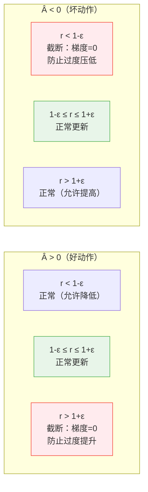
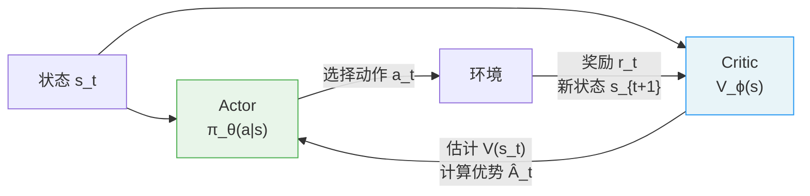
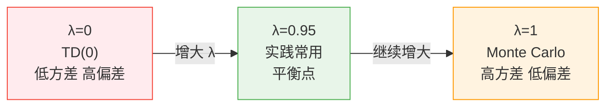
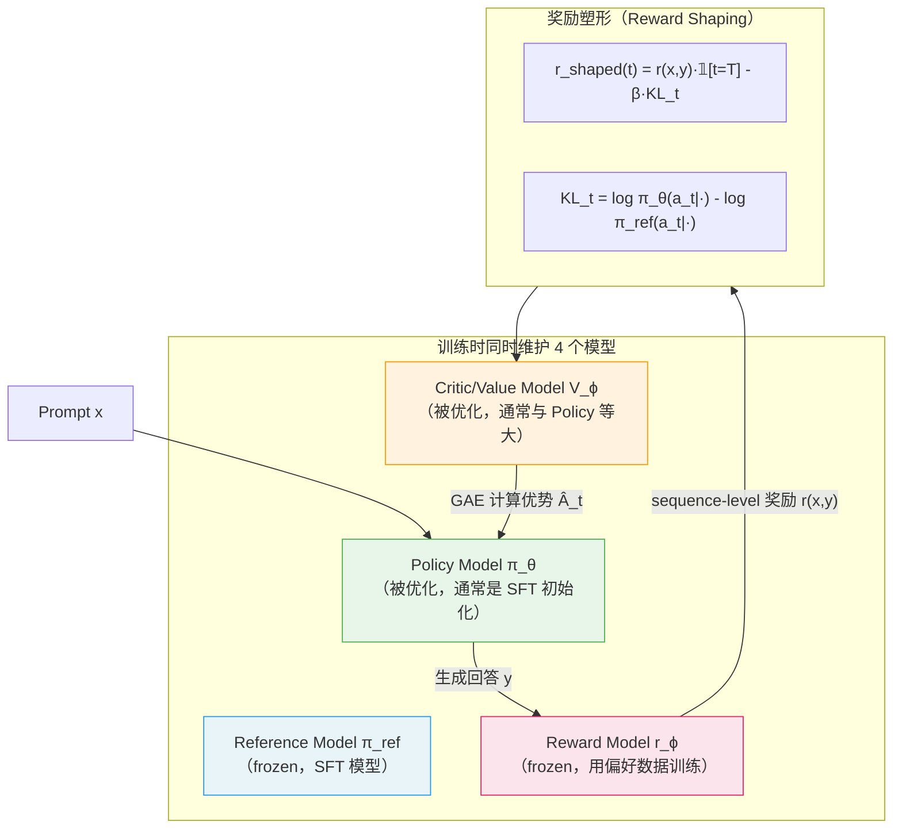
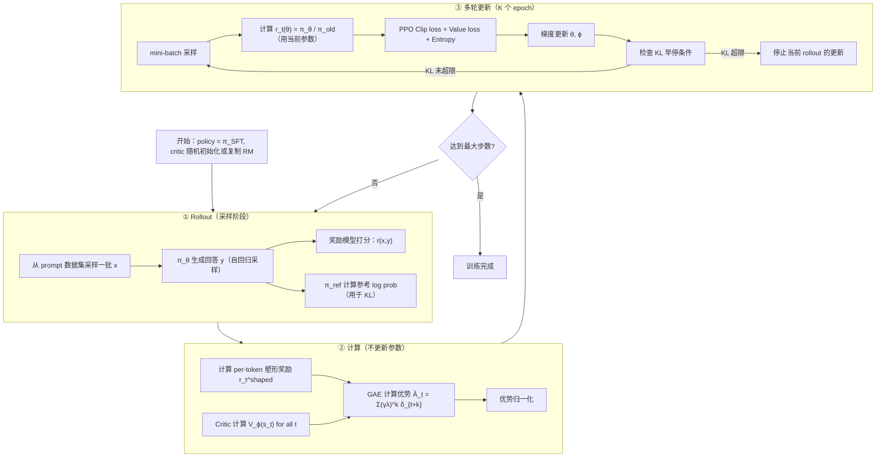
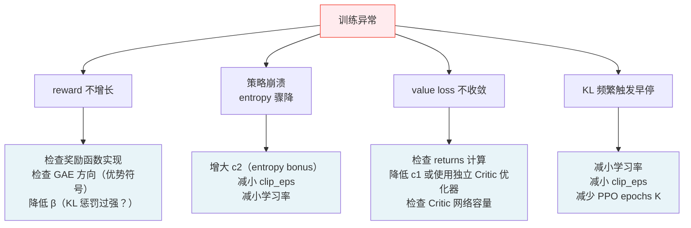
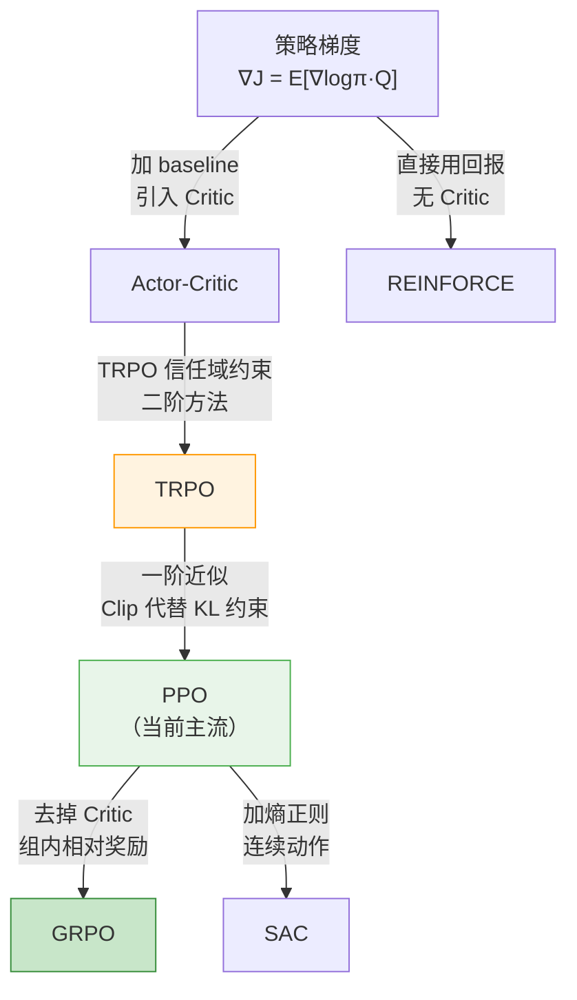

**PPO（Proximal Policy Optimization）** 由 Schulman 等人在 2017 年提出，是目前工业界最广泛使用的强化学习算法。ChatGPT、InstructGPT、Llama 系列的 RLHF 训练都以 PPO 为核心。

PPO 的设计目标是解决一个基本矛盾：**策略梯度方法需要大步更新才能快速收敛，但步子太大会破坏策略导致不可恢复的崩溃**。本文从 TRPO 的约束优化出发，一步步推导出 PPO 的 Clip 目标，并深入分析 GAE、Critic 训练等关键组件。

---

## 一、问题：普通策略梯度的不稳定性

### 1.1 梯度更新步长的困境

从策略梯度定理出发，参数更新为：

$$\theta \leftarrow \theta + \alpha \nabla_\theta J(\theta)$$

学习率 $\alpha$ 的选择面临两难：

```
α 太小  →  收敛极慢，样本浪费
α 太大  →  策略剧变，性能崩溃，且无法恢复（on-policy 数据已过时）
```

根本原因：策略空间中的一小步（参数空间），可能对应策略分布的巨大变化。参数空间的欧氏距离与策略分布的"距离"不对应。

### 1.2 重要性采样的引入

直接用当前策略 $\pi_\theta$ 采样计算梯度（on-policy），每次更新后数据即废弃，样本效率极低。

用旧策略 $\pi_{\theta_{\text{old}}}$ 采集的数据，通过**重要性采样**估计新策略的期望：

$$J(\theta) = \mathbb{E}_{s \sim d^{\pi_{\theta_{\text{old}}}},\, a \sim \pi_{\theta_{\text{old}}}} \left[ \frac{\pi_\theta(a \mid s)}{\pi_{\theta_{\text{old}}}(a \mid s)} A^{\pi_{\theta_{\text{old}}}}(s, a) \right]$$

令 $r_t(\theta) = \frac{\pi_\theta(a_t \mid s_t)}{\pi_{\theta_{\text{old}}}(a_t \mid s_t)}$（重要性比率），目标变为：

$$J(\theta) = \mathbb{E}_t \left[ r_t(\theta) \hat{A}_t \right]$$

**问题**：当 $\pi_\theta$ 与 $\pi_{\theta_{\text{old}}}$ 差异过大时，重要性采样比率 $r_t(\theta)$ 方差爆炸，估计失效。这要求我们约束新旧策略的距离。

---

## 二、TRPO：约束优化的理论基础

### 2.1 替代目标与单调改进保证

TRPO（Trust Region Policy Optimization，Schulman 2015）建立了策略更新的理论框架。

定义**替代目标**（surrogate objective）：

$$L^{\text{CPI}}(\theta) = \mathbb{E}_t \left[ \frac{\pi_\theta(a_t \mid s_t)}{\pi_{\theta_{\text{old}}}(a_t \mid s_t)} \hat{A}_t \right] = \mathbb{E}_t \left[ r_t(\theta) \hat{A}_t \right]$$

上标 CPI 代表"Conservative Policy Iteration"。

**关键定理**（Kakade & Langford 2002，Schulman et al. 2015）：真实目标 $J(\theta)$ 满足下界：

$$J(\theta) \geq L^{\text{CPI}}(\theta) - C \cdot \max_s \mathbb{D}_{\text{KL}}[\pi_{\theta_{\text{old}}}(\cdot \mid s) \| \pi_\theta(\cdot \mid s)]$$

其中 $C = \frac{4\epsilon\gamma}{(1-\gamma)^2}$，$\epsilon = \max_{s,a} |A^\pi(s,a)|$。

**含义**：只要 KL 散度受控，最大化替代目标就能保证真实性能单调不下降。

### 2.2 TRPO 的约束优化问题

TRPO 将上述下界转化为约束优化：

$$\max_\theta \; L^{\text{CPI}}(\theta) \quad \text{s.t.} \quad \mathbb{E}_t\left[\mathbb{D}_{\text{KL}}[\pi_{\theta_{\text{old}}}(\cdot \mid s_t) \| \pi_\theta(\cdot \mid s_t)]\right] \leq \delta$$

其中 $\delta$ 是信任域（trust region）半径，通常取 $0.01$。

**TRPO 的问题**：

- 需要计算 Fisher 信息矩阵的逆（二阶方法）
- 每步都要做共轭梯度 + 线搜索
- 代码复杂，计算代价高
- 不兼容参数共享（Actor 和 Critic 共享主干网络时无法直接应用）

PPO 的目标：**用一阶方法近似 TRPO 的效果**。

---

## 三、PPO 的两种形式

### 3.1 PPO-Penalty（KL 惩罚版）

将 TRPO 的约束转化为惩罚项，直接加入目标：

$$L^{\text{KL}}(\theta) = \mathbb{E}_t \left[ r_t(\theta) \hat{A}_t - \beta \, \mathbb{D}_{\text{KL}}[\pi_{\theta_{\text{old}}} \| \pi_\theta] \right]$$

$\beta$ 自适应调整：若 KL 超过目标值 $d_{\text{target}}$ 的 1.5 倍，$\beta \leftarrow 2\beta$；若 KL 低于 $d_{\text{target}}/1.5$，$\beta \leftarrow \beta/2$。

实践中效果不稳定，超参数敏感，工业界较少使用。

### 3.2 PPO-Clip（截断版）—— 主流

**PPO-Clip 直接截断重要性比率**，防止其偏离 1 太远：

$$\boxed{L^{\text{CLIP}}(\theta) = \mathbb{E}_t \left[ \min\!\left( r_t(\theta)\hat{A}_t,\; \text{clip}(r_t(\theta), 1-\varepsilon, 1+\varepsilon)\hat{A}_t \right) \right]}$$

其中 $\varepsilon$ 通常取 $0.1$ 或 $0.2$。

以下所有分析均针对 PPO-Clip。

---

## 四、PPO-Clip 的深度解析

### 4.1 逐情况分析

**情况一：$\hat{A}_t > 0$（好动作，应增大概率）**

$$L^{\text{CLIP}} = \min(r_t \hat{A}_t,\; \text{clip}(r_t, 1-\varepsilon, 1+\varepsilon) \hat{A}_t)$$

- 若 $r_t \leq 1+\varepsilon$：clip 无效，$L^{\text{CLIP}} = r_t \hat{A}_t$（正常更新）
- 若 $r_t > 1+\varepsilon$：clip 截断，$L^{\text{CLIP}} = (1+\varepsilon)\hat{A}_t$（梯度为零，停止进一步提升）

梯度：

$$\frac{\partial L^{\text{CLIP}}}{\partial r_t} = \begin{cases} \hat{A}_t & r_t < 1+\varepsilon \\ 0 & r_t \geq 1+\varepsilon \end{cases}$$

**情况二：$\hat{A}_t < 0$（坏动作，应减小概率）**

- 若 $r_t \geq 1-\varepsilon$：clip 无效，$L^{\text{CLIP}} = r_t \hat{A}_t$（正常更新）
- 若 $r_t < 1-\varepsilon$：clip 截断，$L^{\text{CLIP}} = (1-\varepsilon)\hat{A}_t$（梯度为零，停止进一步压低）



### 4.2 为什么是悲观下界

$\min$ 操作的关键性质：$L^{\text{CLIP}}$ 是对 $L^{\text{CPI}}$ 的**悲观下界（pessimistic lower bound）**——

- 当 $r_t \in [1-\varepsilon, 1+\varepsilon]$：两项相等，$L^{\text{CLIP}} = L^{\text{CPI}}$
- 当 $r_t$ 超出范围且 $\hat{A}_t > 0$：$L^{\text{CLIP}} < L^{\text{CPI}}$（截断使目标变小）
- 当 $r_t$ 超出范围且 $\hat{A}_t < 0$：$L^{\text{CLIP}} < L^{\text{CPI}}$（截断使目标变大，即惩罚减弱）

最大化这个悲观下界，等价于在信任域内做尽可能好的更新。

### 4.3 PPO-Clip 与 TRPO 的关系

PPO-Clip 并没有严格的 TRPO 单调改进保证，但在实践中效果相当，且计算代价更低。

从一阶泰勒展开角度：在 $\theta = \theta_{\text{old}}$ 处，$r_t(\theta) = 1$，两者的梯度方向一致：

$$\left.\nabla_\theta L^{\text{CLIP}}\right|_{\theta=\theta_{\text{old}}} = \left.\nabla_\theta L^{\text{CPI}}\right|_{\theta=\theta_{\text{old}}} = \mathbb{E}_t\left[\nabla_\theta \log\pi_\theta(a_t|s_t) \hat{A}_t\right]$$

差异只在远离 $\theta_{\text{old}}$ 时（$r_t$ 偏离 1 较大）才出现：PPO-Clip 会停止更新，TRPO 则通过二阶约束限制步长。

---

## 五、广义优势估计（GAE）

### 5.1 Critic 的角色

PPO 是 **Actor-Critic** 结构：



Critic 网络 $V_\phi(s)$ 估计状态价值函数，用于计算优势。

### 5.2 n-step TD 与 Monte Carlo 的权衡

**TD(0)（一步 TD）**：

$$\hat{A}_t^{(1)} = r_t + \gamma V(s_{t+1}) - V(s_t) = \delta_t$$

- 低方差（只用一步奖励）
- 高偏差（$V(s_{t+1})$ 本身有误差，偏差会积累）

**Monte Carlo**：

$$\hat{A}_t^{(\infty)} = \sum_{k=0}^{T-t-1} \gamma^k r_{t+k} - V(s_t)$$

- 低偏差（使用真实回报）
- 高方差（对 $T-t$ 步奖励求和，噪声累积）

**GAE（Generalized Advantage Estimation）** 用参数 $\lambda \in [0,1]$ 在两者之间插值：

### 5.3 GAE 的推导

定义 TD 残差：

$$\delta_t = r_t + \gamma V(s_{t+1}) - V(s_t)$$

$n$ 步优势估计：

$$\hat{A}_t^{(n)} = \sum_{k=0}^{n-1} \gamma^k \delta_{t+k}$$

GAE 对所有 $n$ 步估计做指数加权平均，权重为 $\lambda^{n-1}$（归一化后）：

$$\hat{A}_t^{\text{GAE}(\gamma,\lambda)} = (1-\lambda) \sum_{n=1}^{\infty} \lambda^{n-1} \hat{A}_t^{(n)}$$

展开并化简（等比数列求和）：

$$= (1-\lambda) \left[ \hat{A}_t^{(1)} + \lambda \hat{A}_t^{(2)} + \lambda^2 \hat{A}_t^{(3)} + \cdots \right]$$

$$= (1-\lambda) \left[ \delta_t + \lambda(\delta_t + \gamma\delta_{t+1}) + \lambda^2(\delta_t + \gamma\delta_{t+1} + \gamma^2\delta_{t+2}) + \cdots \right]$$

重新整理各 $\delta_{t+k}$ 的系数：

$$= (1-\lambda)\left[\delta_t(1 + \lambda + \lambda^2 + \cdots) + \gamma\delta_{t+1}(\lambda + \lambda^2 + \cdots) + \cdots\right]$$

$$= (1-\lambda)\left[\frac{\delta_t}{1-\lambda} + \frac{\gamma\lambda\delta_{t+1}}{1-\lambda} + \cdots\right]$$

$$\boxed{\hat{A}_t^{\text{GAE}(\gamma,\lambda)} = \sum_{k=0}^{\infty} (\gamma\lambda)^k \delta_{t+k}}$$

这是 GAE 最常用的递推形式，可以从轨迹末端向前扫描高效计算：

$$\hat{A}_t^{\text{GAE}} = \delta_t + \gamma\lambda \hat{A}_{t+1}^{\text{GAE}}$$

### 5.4 $\lambda$ 的作用

$$\lambda = 0 \implies \hat{A}_t = \delta_t \quad \text{（一步 TD，低方差，高偏差）}$$

$$\lambda = 1 \implies \hat{A}_t = \sum_{k=0}^{\infty}\gamma^k\delta_{t+k} = G_t - V(s_t) \quad \text{（Monte Carlo，高方差，低偏差）}$$

实践中 $\lambda = 0.95$，$\gamma = 0.99$ 是常用组合。



---

## 六、Critic 的训练

### 6.1 Critic 的损失函数

Critic 的目标是最小化价值估计的 MSE：

$$L^{\text{VF}}(\phi) = \mathbb{E}_t \left[ \left( V_\phi(s_t) - V_t^{\text{target}} \right)^2 \right]$$

其中 $V_t^{\text{target}}$ 的常见选择：

**方案一：Monte Carlo 回报**

$$V_t^{\text{target}} = \sum_{k=0}^{T-t-1}\gamma^k r_{t+k}$$

方差大，但无偏。

**方案二：TD(λ) 目标（最常用）**

$$V_t^{\text{target}} = \hat{A}_t^{\text{GAE}} + V_\phi(s_t) = \sum_{k=0}^{\infty}(\gamma\lambda)^k\delta_{t+k} + V_\phi(s_t)$$

即用 GAE 优势加上旧 Critic 估计值作为 target。

**方案三：Clipped Value Loss**

防止 Critic 更新过大，对价值估计也做 clip：

$$L^{\text{VF}}_{\text{clip}}(\phi) = \mathbb{E}_t \left[ \max\!\left( (V_\phi(s_t) - V_t^{\text{tgt}})^2,\; (\text{clip}(V_\phi(s_t), V_{\phi_{\text{old}}}(s_t) \pm \varepsilon_V) - V_t^{\text{tgt}})^2 \right) \right]$$

### 6.2 优势归一化

在更新前对 batch 内的优势做归一化（标准化），降低不同 episode 之间奖励尺度差异的影响：

$$\hat{A}_t \leftarrow \frac{\hat{A}_t - \text{mean}(\hat{A})}{\text{std}(\hat{A}) + \epsilon}$$

这不改变梯度方向（每个样本的相对排名不变），但稳定训练。

---

## 七、熵正则化

在目标中加入策略熵，鼓励探索，防止策略过早收敛到次优的确定性策略：

$$L^{\text{ENT}}(\theta) = \mathbb{E}_t \left[ \mathcal{H}[\pi_\theta(\cdot \mid s_t)] \right] = -\mathbb{E}_t \left[ \sum_a \pi_\theta(a \mid s_t) \log \pi_\theta(a \mid s_t) \right]$$

---

## 八、PPO 的完整目标函数

合并 Policy loss、Value loss、Entropy bonus：

$$\boxed{L^{\text{PPO}}(\theta, \phi) = \mathbb{E}_t \left[ L^{\text{CLIP}}_t(\theta) - c_1 L^{\text{VF}}_t(\phi) + c_2 L^{\text{ENT}}_t(\theta) \right]}$$

其中：
- $c_1 \in [0.5, 1.0]$：Critic loss 系数（当 Actor/Critic 共享网络时使用）
- $c_2 \in [0.001, 0.01]$：熵奖励系数

**各项作用**：

| 项 | 作用 |
|----|------|
| $L^{\text{CLIP}}$ | 最大化期望回报，clip 防止策略剧变 |
| $-c_1 L^{\text{VF}}$ | 训练 Critic，提升优势估计质量 |
| $c_2 L^{\text{ENT}}$ | 鼓励探索，防止早熟收敛 |

---

## 九、PPO 在 LLM RLHF 中的应用

### 9.1 RLHF 的四模型结构



### 9.2 RLHF 中的奖励塑形

LLM 对齐中奖励是 sequence-level 的（整条回复一个分数），直接用于 GAE 会导致只有末端 token 有奖励信号。

**奖励塑形**将 KL 惩罚折入 per-token 奖励：

$$r_t^{\text{shaped}} = \begin{cases} r(x, y) - \beta \log \frac{\pi_\theta(a_t \mid s_t)}{\pi_{\text{ref}}(a_t \mid s_t)} & t = T \\ -\beta \log \frac{\pi_\theta(a_t \mid s_t)}{\pi_{\text{ref}}(a_t \mid s_t)} & t < T \end{cases}$$

其中：
- $r(x, y)$：奖励模型对整条回复的打分（只在最后一步）
- $-\beta \log \frac{\pi_\theta}{\pi_{\text{ref}}}$：per-token KL 惩罚（每步都有）
- $\beta$：KL 惩罚系数（通常取 $0.01 \sim 0.1$）

**KL 惩罚的作用**：

$$-\beta \log \frac{\pi_\theta(a \mid s)}{\pi_{\text{ref}}(a \mid s)} = \beta \log \frac{\pi_{\text{ref}}(a \mid s)}{\pi_\theta(a \mid s)}$$

当 $\pi_\theta$ 偏离 $\pi_{\text{ref}}$ 时，这一项变为负奖励，将策略拉回参考点附近。

### 9.3 LLM RLHF 的完整训练流程



### 9.4 KL 早停

在每个 rollout 的 K 个更新 epoch 中，每次 mini-batch 更新后检查当前策略与旧策略的 KL 散度：

$$\bar{d} = \mathbb{E}_t \left[ \mathbb{D}_{\text{KL}}[\pi_{\theta_{\text{old}}}(\cdot \mid s_t) \| \pi_\theta(\cdot \mid s_t)] \right]$$

若 $\bar{d} > d_{\text{target}} \times 1.5$（KL 超过目标的 1.5 倍），立即停止当前 rollout 的所有后续更新。

这是在 Clip 机制之外的额外保障，防止极端情况下策略崩溃。

---

## 十、PPO 完整算法

**PPO 算法（Actor-Critic 版本）**：

```
初始化：policy π_θ，critic V_ϕ
for 每个迭代 iter = 1, 2, ...:
    ① Rollout：
       用 π_θ 与环境交互，收集 T 个时间步的数据：
           (s_t, a_t, r_t, s_{t+1}) for t = 0, ..., T-1
       记录 π_θ_old(a_t | s_t)（用于后续重要性采样）

    ② 计算优势：
       δ_t = r_t + γ V_ϕ(s_{t+1}) - V_ϕ(s_t)
       Â_t = Σ_{k=0}^{T-t-1} (γλ)^k δ_{t+k}    ← GAE
       V_t^target = Â_t + V_ϕ(s_t)               ← Critic 目标

    ③ 归一化优势：
       Â_t ← (Â_t - mean(Â)) / (std(Â) + ε)

    ④ K 轮 mini-batch 更新：
       for epoch = 1, ..., K:
           for 每个 mini-batch B ⊂ {0, ..., T-1}:
               r_t(θ) = π_θ(a_t|s_t) / π_θ_old(a_t|s_t)

               L^CLIP = mean_B[min(r_t·Â_t, clip(r_t,1-ε,1+ε)·Â_t)]
               L^VF   = mean_B[(V_ϕ(s_t) - V_t^target)²]
               L^ENT  = mean_B[-Σ_a π_θ(a|s_t)·log π_θ(a|s_t)]

               L = L^CLIP - c₁·L^VF + c₂·L^ENT

               θ, ϕ ← 梯度上升（Adam）

               检查 KL 早停条件
```

---

## 十一、PyTorch 完整实现

### 11.1 GAE 计算

```python
import torch
import torch.nn.functional as F
from dataclasses import dataclass


def compute_gae(
    rewards: torch.Tensor,     # (T,) 每步奖励
    values: torch.Tensor,      # (T+1,) Critic 估计，含末端状态
    dones: torch.Tensor,       # (T,) episode 结束标志
    gamma: float = 0.99,
    lam: float = 0.95,
) -> tuple[torch.Tensor, torch.Tensor]:
    """
    计算 GAE 优势和 Critic 目标。

    GAE: Â_t = Σ (γλ)^k δ_{t+k}
    δ_t = r_t + γ·V(s_{t+1})·(1-done_t) - V(s_t)

    Returns:
        advantages: (T,)
        returns: (T,)，Critic 的训练目标 = advantages + values[:-1]
    """
    T = len(rewards)
    advantages = torch.zeros(T, dtype=rewards.dtype)

    gae = 0.0
    for t in reversed(range(T)):
        # done=1 表示 episode 结束，下一状态不存在
        next_non_terminal = 1.0 - dones[t]
        # TD 残差 δ_t
        delta = rewards[t] + gamma * values[t + 1] * next_non_terminal - values[t]
        # GAE 递推：Â_t = δ_t + γλ·Â_{t+1}
        gae = delta + gamma * lam * next_non_terminal * gae
        advantages[t] = gae

    returns = advantages + values[:-1]
    return advantages, returns
```

### 11.2 PPO Loss

```python
@dataclass
class PPOOutput:
    loss: torch.Tensor
    pg_loss: torch.Tensor
    value_loss: torch.Tensor
    entropy: torch.Tensor
    clip_fraction: torch.Tensor
    approx_kl: torch.Tensor


def ppo_loss(
    log_probs: torch.Tensor,       # (B,)，当前策略的 log π_θ(a|s)
    log_probs_old: torch.Tensor,   # (B,)，旧策略的 log π_old(a|s)
    advantages: torch.Tensor,      # (B,)，GAE 优势（已归一化）
    values: torch.Tensor,          # (B,)，当前 Critic 估计
    values_old: torch.Tensor,      # (B,)，旧 Critic 估计（用于 clip value loss）
    returns: torch.Tensor,         # (B,)，Critic 的训练目标
    entropy: torch.Tensor,         # (B,)，策略熵
    clip_eps: float = 0.2,
    value_clip_eps: float = 0.2,
    c1: float = 0.5,               # value loss 系数
    c2: float = 0.01,              # entropy bonus 系数
) -> PPOOutput:
    # ── Policy loss（Clipped Surrogate）───────────────────────────
    # 重要性比率 r_t = π_θ / π_old（在 log 空间计算，数值稳定）
    log_ratio = log_probs - log_probs_old
    ratio = log_ratio.exp()

    # PPO Clip 目标（悲观下界）
    pg_loss_unclipped = ratio * advantages
    pg_loss_clipped   = ratio.clamp(1 - clip_eps, 1 + clip_eps) * advantages
    pg_loss = -torch.min(pg_loss_unclipped, pg_loss_clipped).mean()

    # 监控：被 clip 的 token 比例
    clip_fraction = ((ratio < 1 - clip_eps) | (ratio > 1 + clip_eps)).float().mean()

    # 近似 KL 散度（用于早停判断）
    # E[log(π_old/π_θ)] = -E[log_ratio]
    approx_kl = (-log_ratio).mean()

    # ── Value loss（带 clip）──────────────────────────────────────
    # 方案：clipped value loss，防止 Critic 更新过大
    value_pred_clipped = values_old + (values - values_old).clamp(
        -value_clip_eps, value_clip_eps
    )
    value_loss_unclipped = (values - returns) ** 2
    value_loss_clipped   = (value_pred_clipped - returns) ** 2
    value_loss = 0.5 * torch.max(value_loss_unclipped, value_loss_clipped).mean()

    # ── Entropy bonus ─────────────────────────────────────────────
    entropy_bonus = entropy.mean()

    # ── 合并 ─────────────────────────────────────────────────────
    loss = pg_loss + c1 * value_loss - c2 * entropy_bonus

    return PPOOutput(
        loss=loss,
        pg_loss=pg_loss,
        value_loss=value_loss,
        entropy=entropy_bonus,
        clip_fraction=clip_fraction,
        approx_kl=approx_kl,
    )
```

### 11.3 LLM RLHF 场景的奖励塑形

```python
def compute_shaped_rewards(
    token_log_probs_policy: torch.Tensor,    # (B, T)，策略 log prob
    token_log_probs_reference: torch.Tensor, # (B, T)，参考策略 log prob
    sequence_rewards: torch.Tensor,          # (B,)，奖励模型打分
    response_mask: torch.Tensor,             # (B, T)，response 部分为 1
    beta: float = 0.05,
) -> torch.Tensor:
    """
    RLHF 奖励塑形：将 sequence-level 奖励 + per-token KL 惩罚合并为 token-level 奖励。

    r_t^shaped = r(x,y)·𝟙[t=T_response] - β·(log π_θ - log π_ref)
    """
    B, T = token_log_probs_policy.shape

    # per-token KL 惩罚（估计量：log π_θ - log π_ref）
    per_token_kl = token_log_probs_policy - token_log_probs_reference  # (B, T)

    # 初始化塑形奖励全为 per-token KL 惩罚
    shaped_rewards = -beta * per_token_kl  # (B, T)

    # 找到每条序列 response 的最后一个有效 token，加入 sequence-level 奖励
    # response_mask: (B, T)，response 部分为 1
    # 最后一个有效 token 的位置
    last_token_idx = response_mask.sum(dim=1).long() - 1  # (B,)

    for b in range(B):
        idx = last_token_idx[b]
        shaped_rewards[b, idx] += sequence_rewards[b]

    # mask 掉 prompt 部分
    shaped_rewards = shaped_rewards * response_mask

    return shaped_rewards  # (B, T)
```

### 11.4 训练步骤

```python
def rlhf_ppo_step(
    batch,
    policy_model,
    critic_model,
    reference_model,
    reward_model,
    policy_optimizer,
    critic_optimizer,
    tokenizer,
    ppo_epochs: int = 4,
    mini_batch_size: int = 8,
    gamma: float = 1.0,     # LLM 中通常不折扣，γ=1
    lam: float = 0.95,
    beta: float = 0.05,
    clip_eps: float = 0.2,
    target_kl: float = 0.01,
) -> dict:

    prompts = batch["input_ids"]
    B = len(prompts)

    # ── ① Rollout ─────────────────────────────────────────────────
    policy_model.eval()
    with torch.no_grad():
        # 生成回答（自回归采样）
        outputs = policy_model.generate(
            prompts,
            max_new_tokens=512,
            do_sample=True,
            temperature=1.0,
        )
        responses = outputs[:, prompts.shape[1]:]  # 只取 response 部分

        # 奖励模型打分
        sequence_rewards = reward_model(prompts, responses)  # (B,)

        # 参考策略 log prob
        ref_log_probs = get_token_log_probs(reference_model, outputs)  # (B, T)

        # 旧策略 log prob（用于重要性采样）
        old_log_probs = get_token_log_probs(policy_model, outputs)     # (B, T)

        # Critic 估计 V(s_t) for all t
        old_values = critic_model(outputs)  # (B, T)

    # ── ② 奖励塑形 + GAE ─────────────────────────────────────────
    response_mask = (responses != tokenizer.pad_token_id)  # (B, T)

    shaped_rewards = compute_shaped_rewards(
        old_log_probs[:, prompts.shape[1]:],
        ref_log_probs[:, prompts.shape[1]:],
        sequence_rewards,
        response_mask,
        beta=beta,
    )

    # GAE（逐条序列计算）
    all_advantages = []
    all_returns = []
    for b in range(B):
        T_b = response_mask[b].sum().item()
        r_b = shaped_rewards[b, :T_b]
        v_b = old_values[b, :T_b + 1]  # 含末端状态
        done_b = torch.zeros(T_b); done_b[-1] = 1.0  # 末端标记
        adv_b, ret_b = compute_gae(r_b, v_b, done_b, gamma=gamma, lam=lam)
        all_advantages.append(adv_b)
        all_returns.append(ret_b)

    advantages = torch.cat(all_advantages)
    returns = torch.cat(all_returns)

    # 优势归一化
    advantages = (advantages - advantages.mean()) / (advantages.std() + 1e-8)

    # ── ③ K 轮 mini-batch 更新 ────────────────────────────────────
    policy_model.train()
    critic_model.train()

    metrics = {"pg_loss": [], "value_loss": [], "entropy": [], "kl": [], "clip_frac": []}
    early_stop = False

    for epoch in range(ppo_epochs):
        if early_stop:
            break

        # mini-batch 随机采样
        idx = torch.randperm(len(advantages))
        for start in range(0, len(advantages), mini_batch_size):
            mb_idx = idx[start: start + mini_batch_size]

            # 当前策略的 log prob 和熵（需要梯度）
            curr_log_probs, curr_entropy = policy_model.log_prob_and_entropy(
                outputs[mb_idx // response_mask.shape[1]],
                # ...（具体索引逻辑依实现而定）
            )

            curr_values = critic_model(outputs[mb_idx // response_mask.shape[1]])

            output = ppo_loss(
                log_probs=curr_log_probs,
                log_probs_old=old_log_probs.view(-1)[mb_idx],
                advantages=advantages[mb_idx],
                values=curr_values.view(-1)[mb_idx],
                values_old=old_values.view(-1)[mb_idx],
                returns=returns[mb_idx],
                entropy=curr_entropy,
                clip_eps=clip_eps,
            )

            policy_optimizer.zero_grad()
            critic_optimizer.zero_grad()
            output.loss.backward()
            torch.nn.utils.clip_grad_norm_(policy_model.parameters(), 0.5)
            torch.nn.utils.clip_grad_norm_(critic_model.parameters(), 0.5)
            policy_optimizer.step()
            critic_optimizer.step()

            metrics["kl"].append(output.approx_kl.item())

            # KL 早停
            if output.approx_kl.item() > 1.5 * target_kl:
                early_stop = True
                break

    return {k: sum(v) / len(v) for k, v in metrics.items() if v}
```

---

## 十二、关键超参数与调试指南

### 12.1 超参数一览

| 超参数 | 典型值 | 作用 |
|--------|--------|------|
| $\varepsilon$（clip） | 0.1 ~ 0.2 | 信任域大小，越小越保守 |
| $\gamma$ | 0.99（RL），1.0（LLM） | 折扣因子 |
| $\lambda$（GAE） | 0.95 | 方差-偏差权衡 |
| $K$（PPO epochs） | 4 ~ 10 | 每批数据重复更新次数 |
| $c_1$（value loss） | 0.5 | Critic loss 权重 |
| $c_2$（entropy） | 0.001 ~ 0.01 | 探索鼓励强度 |
| $\beta$（KL，RLHF） | 0.01 ~ 0.1 | 偏离参考策略的惩罚强度 |
| target KL | 0.01 ~ 0.02 | 早停阈值 |

### 12.2 训练时的监控指标

健康训练的信号：

```
clip_fraction   ∈ [0.05, 0.30]  太低说明步子太小；太高说明策略变化剧烈
approx_kl       < target_kl × 1.5  超过则触发早停
entropy         应缓慢下降（逐渐收敛），骤降说明策略过早坍缩
value_loss      应随时间下降并趋于稳定
mean_reward     核心指标，应持续上升
```

### 12.3 常见问题



---

## 十三、PPO 在 RL 算法族中的位置



---

## 十四、完整推导总结

PPO 的设计逻辑是一条清晰的约束放松链：

$$\underbrace{\max_\theta \mathbb{E}[r_t \hat{A}_t]}_{\text{朴素策略梯度}} \xrightarrow{\text{数据复用}} \underbrace{\max_\theta \mathbb{E}\left[\frac{\pi_\theta}{\pi_{\text{old}}}\hat{A}_t\right]}_{\text{重要性采样目标}}$$

$$\xrightarrow{\text{约束新旧策略距离（TRPO）}} \underbrace{\max_\theta \mathbb{E}[r_t\hat{A}_t] \;\text{s.t.}\; \mathbb{E}[\text{KL}] \leq \delta}_{\text{约束优化，二阶方法}}$$

$$\xrightarrow{\text{一阶近似，Clip 代替 KL}} \underbrace{\max_\theta \mathbb{E}[\min(r_t\hat{A}_t,\, \text{clip}(r_t)\hat{A}_t)]}_{\text{PPO-Clip，一阶方法}}$$

$$\xrightarrow{\text{加入 Critic 和熵}} \underbrace{L^{\text{PPO}} = L^{\text{CLIP}} - c_1 L^{\text{VF}} + c_2 L^{\text{ENT}}}_{\text{PPO 完整目标}}$$

每一步都有明确的动机：复用数据 → 控制偏差 → 降低计算代价 → 稳定训练。

---

*参考：*
- *Schulman et al., Proximal Policy Optimization Algorithms, arXiv 2017*
- *Schulman et al., Trust Region Policy Optimization, ICML 2015*
- *Schulman et al., High-Dimensional Continuous Control Using Generalized Advantage Estimation, ICLR 2016*
- *Ouyang et al., Training language models to follow instructions with human feedback (InstructGPT), NeurIPS 2022*
- *Ziegler et al., Fine-Tuning Language Models from Human Preferences, 2019*
