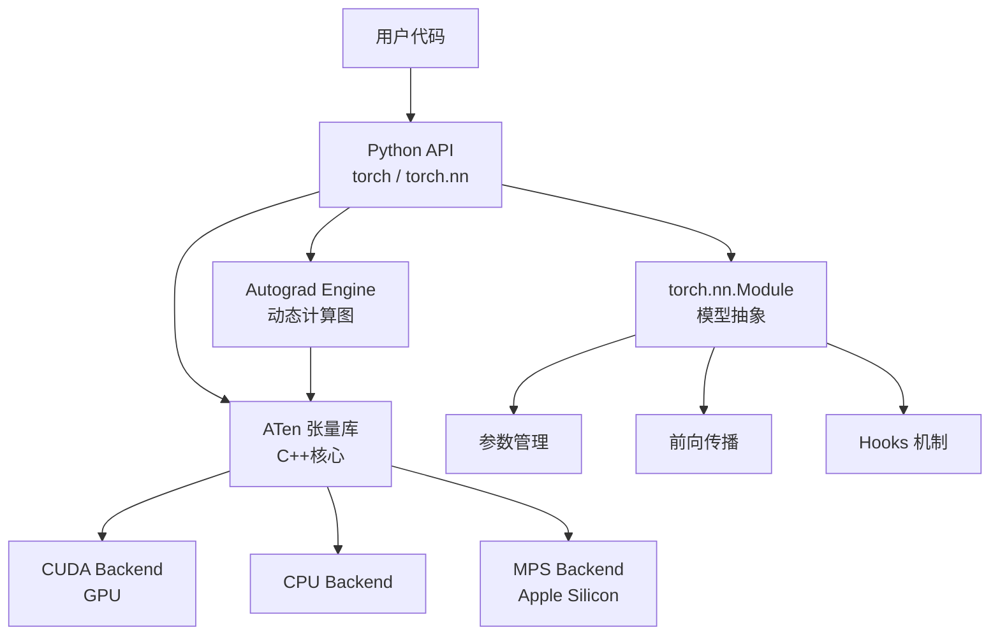
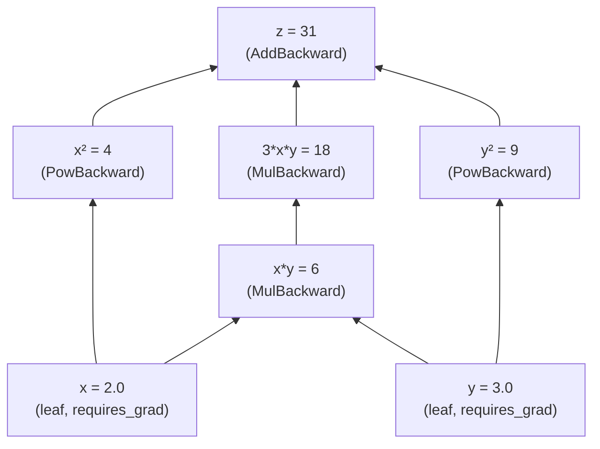
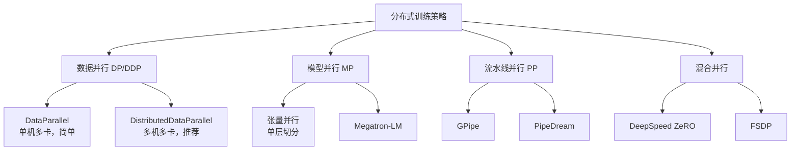
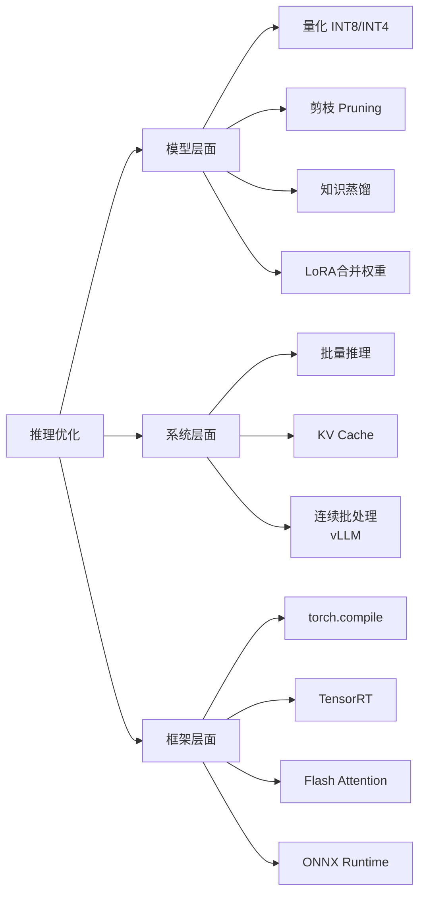
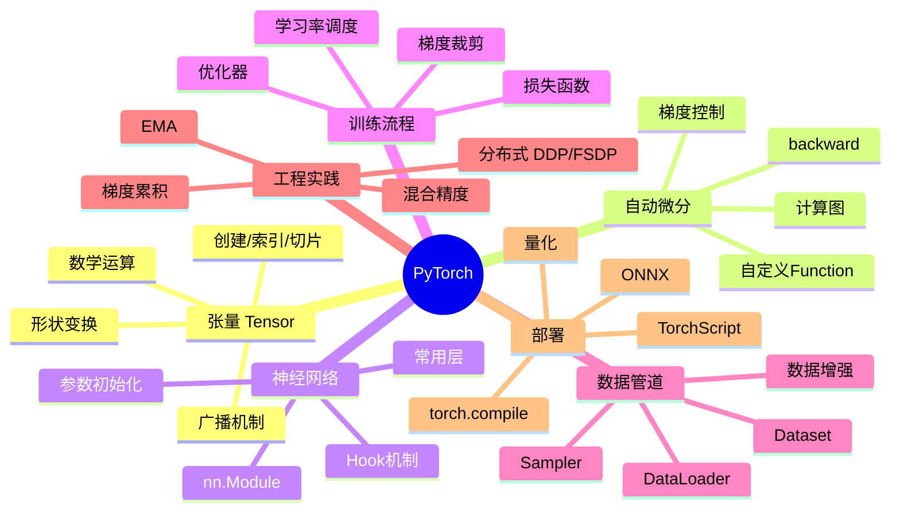

本文是 PyTorch 的系统性教程，从最基础的张量操作出发，覆盖自动微分、模型构建、训练优化、常见架构实现，直到分布式训练与生产部署。每个概念均配有可运行代码。

---

## 目录

1. [PyTorch 核心概念](#1-pytorch-核心概念)
2. [张量 Tensor](#2-张量-tensor)
3. [自动微分 Autograd](#3-自动微分-autograd)
4. [构建神经网络](#4-构建神经网络)
5. [损失函数与优化器](#5-损失函数与优化器)
6. [完整训练流程](#6-完整训练流程)
7. [数据加载 DataLoader](#7-数据加载-dataloader)
8. [常见网络架构实现](#8-常见网络架构实现)
9. [训练技巧与调试](#9-训练技巧与调试)
10. [模型保存与加载](#10-模型保存与加载)
11. [GPU 加速与混合精度](#11-gpu-加速与混合精度)
12. [分布式训练](#12-分布式训练)
13. [自定义 CUDA 算子](#13-自定义-cuda-算子)
14. [生产部署](#14-生产部署)

---

## 1. PyTorch 核心概念

### 1.1 整体架构



PyTorch 与 TensorFlow 最大的区别是**动态计算图（Define-by-Run）**：计算图在每次前向传播时实时构建，天然支持 Python 控制流（if/for/while），调试极为直观。

### 1.2 安装

```bash
# CUDA 12.1
pip install torch torchvision torchaudio --index-url https://download.pytorch.org/whl/cu121

# CPU only
pip install torch torchvision torchaudio

# 验证
python -c "import torch; print(torch.__version__); print(torch.cuda.is_available())"
```

---

## 2. 张量 Tensor

张量是 PyTorch 的核心数据结构，可以看作多维数组，但支持 GPU 加速和自动微分。

### 2.1 创建张量

```python
import torch
import numpy as np

# ---- 从数据创建 ----
x = torch.tensor([1.0, 2.0, 3.0])          # float32
x = torch.tensor([[1, 2], [3, 4]])           # int64
x = torch.tensor([1.0], dtype=torch.float16) # 指定dtype

# ---- 特殊张量 ----
zeros = torch.zeros(3, 4)         # 全0, shape (3, 4)
ones  = torch.ones(3, 4)          # 全1
eye   = torch.eye(3)              # 单位矩阵
rand  = torch.rand(3, 4)          # [0, 1) 均匀分布
randn = torch.randn(3, 4)         # 标准正态分布
full  = torch.full((3, 4), 7.0)   # 全7

# ---- 序列 ----
arange = torch.arange(0, 10, 2)   # [0, 2, 4, 6, 8]
linspace = torch.linspace(0, 1, 5) # [0, 0.25, 0.5, 0.75, 1]

# ---- 从 numpy ----
arr = np.array([1.0, 2.0, 3.0])
x = torch.from_numpy(arr)          # 共享内存！
x = torch.tensor(arr)              # 复制

# ---- 形如另一个张量 ----
y = torch.zeros_like(x)            # 同shape, 全0
y = torch.ones_like(x)             # 同shape, 全1
y = torch.rand_like(x.float())     # 同shape, 随机
```

### 2.2 张量属性

```python
x = torch.randn(3, 4, dtype=torch.float32, device='cuda')

print(x.shape)    # torch.Size([3, 4])
print(x.size())   # torch.Size([3, 4])
print(x.ndim)     # 2
print(x.dtype)    # torch.float32
print(x.device)   # cuda:0
print(x.requires_grad)  # False
print(x.is_contiguous()) # True
print(x.numel())  # 12 (元素总数)
```

### 2.3 索引与切片

```python
x = torch.randn(5, 4, 3)

# 基础索引
x[0]          # 第0行, shape (4, 3)
x[0, 1]       # shape (3,)
x[0, 1, 2]    # 标量

# 切片
x[1:3]        # 第1,2行, shape (2, 4, 3)
x[:, ::2]     # 所有行，每隔2列, shape (5, 2, 3)
x[..., 0]     # 最后一维第0个, shape (5, 4)

# 花式索引
idx = torch.tensor([0, 2, 4])
x[idx]        # 第0,2,4行, shape (3, 4, 3)

# 布尔索引
mask = x > 0
x[mask]       # 所有正数组成的1D张量

# gather (按索引收集)
# 常用于分类任务取对应类别概率
logits = torch.randn(4, 10)  # batch=4, classes=10
labels = torch.tensor([3, 7, 1, 5])
probs = logits.gather(1, labels.unsqueeze(1))  # shape (4, 1)
```

### 2.4 形状变换

```python
x = torch.randn(2, 3, 4)

# reshape / view
y = x.view(6, 4)       # 需要连续内存
y = x.reshape(6, 4)    # 自动处理非连续
y = x.flatten()        # 展平为1D
y = x.flatten(1)       # 从第1维开始展平 → (2, 12)

# 增删维度
y = x.unsqueeze(0)     # (1, 2, 3, 4)
y = x.unsqueeze(-1)    # (2, 3, 4, 1)
y = y.squeeze(0)       # 去掉size=1的维度

# 转置
y = x.transpose(0, 1)  # 交换dim0和dim1 → (3, 2, 4)
y = x.permute(2, 0, 1) # 重排维度顺序 → (4, 2, 3)
y = x.T                 # 2D转置

# 拼接
a, b = torch.randn(2, 3), torch.randn(2, 3)
torch.cat([a, b], dim=0)   # 沿dim0拼接 → (4, 3)
torch.cat([a, b], dim=1)   # 沿dim1拼接 → (2, 6)
torch.stack([a, b], dim=0) # 新增维度堆叠 → (2, 2, 3)

# 分割
chunks = torch.chunk(a, 2, dim=0)    # 均等分割
pieces = torch.split(a, [1, 1], dim=0)  # 指定大小分割
```

### 2.5 数学运算

```python
a = torch.tensor([[1.0, 2.0], [3.0, 4.0]])
b = torch.tensor([[5.0, 6.0], [7.0, 8.0]])

# 逐元素运算
a + b         # 加法
a * b         # 逐元素乘法 (Hadamard)
a ** 2        # 幂
torch.exp(a)  # 指数
torch.log(a)  # 对数
torch.sqrt(a) # 开方
torch.abs(a)  # 绝对值
torch.clamp(a, min=0, max=1)  # 裁剪

# 矩阵运算
a @ b          # 矩阵乘法
torch.mm(a, b) # 矩阵乘法 (2D only)
torch.bmm(A, B) # 批量矩阵乘法 (3D)
torch.matmul(a, b) # 通用矩阵乘法

# 规约运算
a.sum()            # 所有元素之和
a.sum(dim=0)       # 按列求和 → (2,)
a.mean()           # 均值
a.std()            # 标准差
a.max()            # 最大值
a.max(dim=1)       # 按行最大值，返回(values, indices)
a.argmax(dim=1)    # 最大值索引

# 广播机制 (Broadcasting)
# shape (3, 4) + shape (4,) → 自动广播
x = torch.randn(3, 4)
bias = torch.randn(4)
result = x + bias   # (3, 4) + (4,) → (3, 4)

# 广播规则：从右对齐，维度为1或缺失时可广播
# (3, 1, 4) + (2, 4) → (3, 2, 4)
```

---

## 3. 自动微分 Autograd

### 3.1 计算图与梯度

PyTorch 的核心魔法：每次前向计算都构建一个有向无环图（DAG），反向传播时沿图自动计算梯度。

$$\frac{\partial L}{\partial x} = \frac{\partial L}{\partial y} \cdot \frac{\partial y}{\partial x}$$

```python
import torch

# requires_grad=True 开启梯度追踪
x = torch.tensor(2.0, requires_grad=True)
y = torch.tensor(3.0, requires_grad=True)

# 前向计算（构建计算图）
z = x ** 2 + 3 * x * y + y ** 2
# z = 4 + 18 + 9 = 31

# 反向传播
z.backward()

# 查看梯度
# dz/dx = 2x + 3y = 4 + 9 = 13
# dz/dy = 3x + 2y = 6 + 6 = 12
print(x.grad)  # tensor(13.)
print(y.grad)  # tensor(12.)
```

### 3.2 计算图可视化



### 3.3 梯度控制

```python
# ---- 方式1: no_grad 上下文 ----
with torch.no_grad():
    # 推理时不需要梯度，节省内存和计算
    output = model(input)

# ---- 方式2: detach ----
# 从计算图中分离，返回新张量（共享数据，无梯度）
x = torch.randn(3, requires_grad=True)
y = x * 2
z = y.detach()  # z不参与梯度计算
z.requires_grad  # False

# ---- 方式3: requires_grad_ ----
x = torch.randn(3)
x.requires_grad_(True)   # in-place开启
x.requires_grad_(False)  # in-place关闭

# ---- 梯度清零 ----
# 梯度默认累加，每次更新前必须清零
x.grad = None   # 或
x.grad.zero_()  # in-place清零

# ---- 多次backward ----
# 默认计算图使用后释放，retain_graph=True保留
loss.backward(retain_graph=True)  # 第一次
loss.backward()                    # 第二次

# ---- 向量梯度 ----
x = torch.randn(3, requires_grad=True)
y = x * 2  # 向量输出
# backward需要传入gradient (jacobian-vector product)
y.backward(torch.ones(3))  # 相当于 sum(y).backward()
```

### 3.4 自定义梯度函数

```python
class SigmoidFunction(torch.autograd.Function):
    """手动实现Sigmoid的前向和反向传播"""

    @staticmethod
    def forward(ctx, x):
        # ctx用于保存前向信息供反向使用
        output = 1 / (1 + torch.exp(-x))
        ctx.save_for_backward(output)
        return output

    @staticmethod
    def backward(ctx, grad_output):
        # grad_output: 上游梯度
        output, = ctx.saved_tensors
        # sigmoid导数: σ(x) * (1 - σ(x))
        return grad_output * output * (1 - output)

# 使用
sigmoid = SigmoidFunction.apply
x = torch.randn(5, requires_grad=True)
y = sigmoid(x)
y.sum().backward()
print(x.grad)

# 梯度检验 (验证自定义实现是否正确)
torch.autograd.gradcheck(sigmoid, (torch.randn(5, requires_grad=True, dtype=torch.float64),))
```

### 3.5 高阶导数

```python
x = torch.tensor(2.0, requires_grad=True)
y = x ** 3  # y = x³

# 一阶导数
dy_dx = torch.autograd.grad(y, x, create_graph=True)[0]
# dy/dx = 3x² = 12

# 二阶导数
d2y_dx2 = torch.autograd.grad(dy_dx, x)[0]
# d²y/dx² = 6x = 12
print(d2y_dx2)  # tensor(12.)

# Jacobian 矩阵
def f(x):
    return torch.stack([x[0]**2, x[1]**3, x[0]*x[1]])

x = torch.randn(2, requires_grad=True)
jac = torch.autograd.functional.jacobian(f, x)
# shape: (3, 2)
```

---

## 4. 构建神经网络

### 4.1 nn.Module 基础

```python
import torch
import torch.nn as nn
import torch.nn.functional as F

class SimpleNet(nn.Module):
    def __init__(self, input_dim, hidden_dim, output_dim):
        super().__init__()
        # 声明层（自动注册为参数）
        self.fc1 = nn.Linear(input_dim, hidden_dim)
        self.fc2 = nn.Linear(hidden_dim, hidden_dim)
        self.fc3 = nn.Linear(hidden_dim, output_dim)
        self.bn1 = nn.BatchNorm1d(hidden_dim)
        self.dropout = nn.Dropout(p=0.3)

    def forward(self, x):
        # 前向传播
        x = F.relu(self.bn1(self.fc1(x)))
        x = self.dropout(x)
        x = F.relu(self.fc2(x))
        x = self.fc3(x)  # 最后一层不加激活（由损失函数处理）
        return x

model = SimpleNet(784, 256, 10)

# 查看模型结构
print(model)
# SimpleNet(
#   (fc1): Linear(in_features=784, out_features=256, bias=True)
#   ...
# )

# 统计参数量
total = sum(p.numel() for p in model.parameters())
trainable = sum(p.numel() for p in model.parameters() if p.requires_grad)
print(f"Total: {total:,} | Trainable: {trainable:,}")

# 遍历参数
for name, param in model.named_parameters():
    print(f"{name}: {param.shape}")
```

### 4.2 常用层

```python
# ---- 线性层 ----
nn.Linear(in_features=128, out_features=64, bias=True)

# ---- 卷积层 ----
nn.Conv1d(in_channels=16, out_channels=32, kernel_size=3, padding=1)
nn.Conv2d(in_channels=3, out_channels=64, kernel_size=3, stride=1, padding=1)
nn.Conv3d(...)

# ---- 归一化层 ----
nn.BatchNorm1d(num_features=64)    # 批归一化
nn.BatchNorm2d(num_features=64)
nn.LayerNorm(normalized_shape=64)  # 层归一化（LLM常用）
nn.GroupNorm(num_groups=8, num_channels=64)
nn.RMSNorm(normalized_shape=64)    # PyTorch 2.4+

# ---- Dropout ----
nn.Dropout(p=0.5)           # 1D
nn.Dropout2d(p=0.5)         # 2D (按channel drop)

# ---- 池化 ----
nn.MaxPool2d(kernel_size=2, stride=2)
nn.AvgPool2d(kernel_size=2)
nn.AdaptiveAvgPool2d(output_size=(1, 1))  # 任意输入→固定输出

# ---- 激活函数 ----
nn.ReLU()
nn.GELU()
nn.SiLU()        # Swish
nn.Tanh()
nn.Sigmoid()
nn.Softmax(dim=-1)
nn.LeakyReLU(negative_slope=0.01)
nn.ELU()

# ---- Embedding ----
nn.Embedding(num_embeddings=10000, embedding_dim=256)
nn.Embedding(num_embeddings=10000, embedding_dim=256, padding_idx=0)

# ---- Transformer 组件 ----
nn.MultiheadAttention(embed_dim=256, num_heads=8, dropout=0.1, batch_first=True)
nn.TransformerEncoderLayer(d_model=256, nhead=8, dim_feedforward=1024)
nn.TransformerEncoder(encoder_layer, num_layers=6)

# ---- 容器 ----
nn.Sequential(
    nn.Linear(128, 64),
    nn.ReLU(),
    nn.Linear(64, 10)
)
nn.ModuleList([nn.Linear(128, 64) for _ in range(4)])
nn.ModuleDict({'fc': nn.Linear(128, 64), 'bn': nn.BatchNorm1d(64)})
```

### 4.3 参数初始化

```python
def init_weights(m):
    if isinstance(m, nn.Linear):
        nn.init.kaiming_normal_(m.weight, mode='fan_out', nonlinearity='relu')
        if m.bias is not None:
            nn.init.zeros_(m.bias)
    elif isinstance(m, nn.Conv2d):
        nn.init.kaiming_normal_(m.weight, mode='fan_out', nonlinearity='relu')
    elif isinstance(m, (nn.BatchNorm2d, nn.LayerNorm)):
        nn.init.ones_(m.weight)
        nn.init.zeros_(m.bias)
    elif isinstance(m, nn.Embedding):
        nn.init.normal_(m.weight, mean=0, std=0.02)

model.apply(init_weights)

# 初始化方法一览
nn.init.zeros_(tensor)          # 全0
nn.init.ones_(tensor)           # 全1
nn.init.constant_(tensor, val)  # 常数
nn.init.uniform_(tensor, a, b)  # 均匀分布
nn.init.normal_(tensor, mean, std)   # 正态分布
nn.init.xavier_uniform_(tensor)      # Xavier均匀
nn.init.xavier_normal_(tensor)       # Xavier正态
nn.init.kaiming_uniform_(tensor)     # Kaiming均匀 (ReLU网络推荐)
nn.init.kaiming_normal_(tensor)      # Kaiming正态
nn.init.orthogonal_(tensor)          # 正交初始化
nn.init.eye_(tensor)                 # 单位矩阵
```

**初始化原理**：Xavier 初始化保证各层输出方差一致 $\text{Var}(y) = \text{Var}(x)$，适合 sigmoid/tanh；Kaiming 初始化考虑 ReLU 的方差减半效应：

$$\text{std} = \sqrt{\frac{2}{n_{in}}}$$

### 4.4 Hook 机制

Hook 是 PyTorch 中强大的调试工具，可以在前向/反向传播时插入自定义逻辑。

```python
# ---- 前向 Hook ----
activation = {}

def save_activation(name):
    def hook(module, input, output):
        activation[name] = output.detach()
    return hook

# 注册hook
handle = model.fc1.register_forward_hook(save_activation('fc1'))

# 执行前向传播
output = model(x)

# 查看中间激活值
print(activation['fc1'].shape)

# 务必移除hook，否则内存泄漏
handle.remove()

# ---- 反向 Hook ----
gradients = {}

def save_gradient(name):
    def hook(module, grad_input, grad_output):
        gradients[name] = grad_output[0].detach()
    return hook

handle = model.fc1.register_backward_hook(save_gradient('fc1'))
loss.backward()
handle.remove()

# ---- 前向预Hook ----
# 在forward之前执行，可修改输入
def pre_hook(module, args):
    x = args[0]
    return (x * 2,)  # 修改输入

handle = model.fc1.register_forward_pre_hook(pre_hook)
```

---

## 5. 损失函数与优化器

### 5.1 常用损失函数

```python
import torch.nn as nn

# ---- 分类任务 ----

# CrossEntropyLoss = Softmax + NLLLoss（输入logits，不需要手动softmax）
criterion = nn.CrossEntropyLoss(
    weight=None,       # 类别权重，处理不平衡数据集
    ignore_index=-100, # 忽略某标签
    reduction='mean',  # 'none'|'mean'|'sum'
    label_smoothing=0.1  # 标签平滑
)
# logits: (N, C) or (N, C, H, W)
# target: (N,) 整数标签
loss = criterion(logits, target)

# BCEWithLogitsLoss（二分类，输入logits）
criterion = nn.BCEWithLogitsLoss(
    pos_weight=torch.tensor([2.0])  # 正类权重
)
# output: (N,) or (N, *)
# target: 0/1 float张量

# ---- 回归任务 ----
nn.MSELoss()    # L2 loss
nn.L1Loss()     # L1 loss (MAE)
nn.HuberLoss(delta=1.0)  # 鲁棒loss：小误差用L2，大误差用L1
nn.SmoothL1Loss(beta=1.0)  # 同上

# ---- 序列任务 ----
nn.CTCLoss()    # 序列到序列（语音识别）
nn.NLLLoss()    # 负对数似然

# ---- 对比学习 ----
nn.CosineEmbeddingLoss()
nn.TripletMarginLoss(margin=1.0)
```

### 5.2 自定义损失函数

```python
class FocalLoss(nn.Module):
    """Focal Loss：解决类别不平衡问题"""
    def __init__(self, alpha=0.25, gamma=2.0):
        super().__init__()
        self.alpha = alpha
        self.gamma = gamma

    def forward(self, logits, targets):
        # logits: (N, C), targets: (N,)
        ce_loss = F.cross_entropy(logits, targets, reduction='none')
        pt = torch.exp(-ce_loss)  # 预测概率
        focal_loss = self.alpha * (1 - pt) ** self.gamma * ce_loss
        return focal_loss.mean()


class DPOLoss(nn.Module):
    """Direct Preference Optimization Loss"""
    def __init__(self, beta=0.1):
        super().__init__()
        self.beta = beta

    def forward(self, policy_chosen_logps, policy_rejected_logps,
                ref_chosen_logps, ref_rejected_logps):
        chosen_rewards = self.beta * (policy_chosen_logps - ref_chosen_logps)
        rejected_rewards = self.beta * (policy_rejected_logps - ref_rejected_logps)
        loss = -F.logsigmoid(chosen_rewards - rejected_rewards)
        return loss.mean()
```

### 5.3 优化器

```python
import torch.optim as optim

# ---- 常用优化器 ----
optimizer = optim.SGD(
    model.parameters(),
    lr=0.01,
    momentum=0.9,
    weight_decay=1e-4,
    nesterov=True
)

optimizer = optim.Adam(
    model.parameters(),
    lr=1e-3,
    betas=(0.9, 0.999),  # 一阶/二阶动量
    eps=1e-8,
    weight_decay=0        # Adam + weight_decay = AdamW
)

optimizer = optim.AdamW(
    model.parameters(),
    lr=1e-3,
    betas=(0.9, 0.999),
    weight_decay=0.01  # L2正则化（在权重上直接衰减，不在梯度上）
)

# LLM常用：分组学习率（不同层不同lr）
optimizer = optim.AdamW([
    {'params': model.embedding.parameters(), 'lr': 1e-4},
    {'params': model.encoder.parameters(), 'lr': 3e-4},
    {'params': model.head.parameters(), 'lr': 1e-3},
], weight_decay=0.01)

# ---- 学习率调度 ----
# 余弦退火（LLM标配）
scheduler = optim.lr_scheduler.CosineAnnealingLR(
    optimizer, T_max=100, eta_min=1e-6
)

# 线性预热 + 余弦退火
from torch.optim.lr_scheduler import LinearLR, CosineAnnealingLR, SequentialLR
warmup = LinearLR(optimizer, start_factor=0.1, total_iters=100)
cosine = CosineAnnealingLR(optimizer, T_max=900, eta_min=1e-6)
scheduler = SequentialLR(optimizer, schedulers=[warmup, cosine], milestones=[100])

# OneCycleLR（超级收敛）
scheduler = optim.lr_scheduler.OneCycleLR(
    optimizer, max_lr=0.01, steps_per_epoch=len(train_loader), epochs=10
)

# ReduceLROnPlateau（验证集不改善时降lr）
scheduler = optim.lr_scheduler.ReduceLROnPlateau(
    optimizer, mode='min', factor=0.5, patience=5, min_lr=1e-6
)
```

### 5.4 梯度裁剪

防止梯度爆炸，尤其在 RNN 和 Transformer 训练中必不可少：

$$\tilde{g} = \begin{cases} g & \|g\| \leq \tau \\ \tau \cdot \frac{g}{\|g\|} & \|g\| > \tau \end{cases}$$

```python
# 在 backward 之后，optimizer.step 之前
loss.backward()

# 按L2范数裁剪全部参数梯度
torch.nn.utils.clip_grad_norm_(model.parameters(), max_norm=1.0)

# 按值裁剪（每个梯度元素）
torch.nn.utils.clip_grad_value_(model.parameters(), clip_value=0.5)

# 查看梯度范数（调试用）
total_norm = torch.nn.utils.get_total_norm(
    [p.grad for p in model.parameters() if p.grad is not None]
)
```

---

## 6. 完整训练流程

### 6.1 标准训练循环

```python
import torch
import torch.nn as nn
from torch.utils.data import DataLoader

def train_epoch(model, loader, optimizer, criterion, device, scaler=None):
    model.train()  # 开启训练模式（BatchNorm/Dropout生效）
    total_loss = 0.0
    correct = 0
    total = 0

    for batch_idx, (inputs, targets) in enumerate(loader):
        inputs, targets = inputs.to(device), targets.to(device)

        # 前向传播
        if scaler is not None:
            # 混合精度训练
            with torch.autocast(device_type='cuda', dtype=torch.float16):
                outputs = model(inputs)
                loss = criterion(outputs, targets)
        else:
            outputs = model(inputs)
            loss = criterion(outputs, targets)

        # 反向传播
        optimizer.zero_grad()  # 清零梯度

        if scaler is not None:
            scaler.scale(loss).backward()         # 缩放loss防止下溢
            scaler.unscale_(optimizer)            # 反缩放梯度
            torch.nn.utils.clip_grad_norm_(model.parameters(), 1.0)
            scaler.step(optimizer)                # 更新参数
            scaler.update()                       # 更新缩放因子
        else:
            loss.backward()
            torch.nn.utils.clip_grad_norm_(model.parameters(), 1.0)
            optimizer.step()

        # 统计
        total_loss += loss.item()
        _, predicted = outputs.max(1)
        correct += predicted.eq(targets).sum().item()
        total += targets.size(0)

        if batch_idx % 100 == 0:
            print(f"  [{batch_idx}/{len(loader)}] "
                  f"Loss: {loss.item():.4f} "
                  f"Acc: {100.*correct/total:.2f}%")

    return total_loss / len(loader), 100. * correct / total


@torch.no_grad()
def evaluate(model, loader, criterion, device):
    model.eval()  # 关闭训练模式（BatchNorm/Dropout关闭）
    total_loss = 0.0
    correct = 0
    total = 0

    for inputs, targets in loader:
        inputs, targets = inputs.to(device), targets.to(device)
        outputs = model(inputs)
        loss = criterion(outputs, targets)

        total_loss += loss.item()
        _, predicted = outputs.max(1)
        correct += predicted.eq(targets).sum().item()
        total += targets.size(0)

    return total_loss / len(loader), 100. * correct / total


def train(model, train_loader, val_loader, epochs=100, lr=1e-3, device='cuda'):
    model = model.to(device)
    criterion = nn.CrossEntropyLoss()
    optimizer = torch.optim.AdamW(model.parameters(), lr=lr, weight_decay=0.01)
    scheduler = torch.optim.lr_scheduler.CosineAnnealingLR(
        optimizer, T_max=epochs, eta_min=lr/100
    )
    scaler = torch.cuda.amp.GradScaler()  # 混合精度

    best_val_acc = 0.0
    history = {'train_loss': [], 'train_acc': [], 'val_loss': [], 'val_acc': []}

    for epoch in range(1, epochs + 1):
        print(f"\nEpoch {epoch}/{epochs} | LR: {scheduler.get_last_lr()[0]:.2e}")

        train_loss, train_acc = train_epoch(
            model, train_loader, optimizer, criterion, device, scaler
        )
        val_loss, val_acc = evaluate(model, val_loader, criterion, device)
        scheduler.step()

        history['train_loss'].append(train_loss)
        history['train_acc'].append(train_acc)
        history['val_loss'].append(val_loss)
        history['val_acc'].append(val_acc)

        print(f"Train Loss: {train_loss:.4f} | Train Acc: {train_acc:.2f}%")
        print(f"Val   Loss: {val_loss:.4f} | Val   Acc: {val_acc:.2f}%")

        # 保存最优模型
        if val_acc > best_val_acc:
            best_val_acc = val_acc
            torch.save({
                'epoch': epoch,
                'model_state_dict': model.state_dict(),
                'optimizer_state_dict': optimizer.state_dict(),
                'val_acc': val_acc,
            }, 'best_model.pth')
            print(f"  *** Saved best model (Val Acc: {val_acc:.2f}%) ***")

    return history
```

---

## 7. 数据加载 DataLoader

### 7.1 自定义 Dataset

```python
from torch.utils.data import Dataset, DataLoader
from torchvision import transforms
from PIL import Image
import os

class ImageDataset(Dataset):
    def __init__(self, root_dir, split='train', transform=None):
        self.root = root_dir
        self.transform = transform
        self.samples = []  # [(image_path, label), ...]

        for class_idx, class_name in enumerate(sorted(os.listdir(root_dir))):
            class_dir = os.path.join(root_dir, class_name)
            for img_name in os.listdir(class_dir):
                self.samples.append((
                    os.path.join(class_dir, img_name),
                    class_idx
                ))

    def __len__(self):
        # DataLoader通过此方法知道数据集大小
        return len(self.samples)

    def __getitem__(self, idx):
        # DataLoader每次调用此方法获取一个样本
        img_path, label = self.samples[idx]
        image = Image.open(img_path).convert('RGB')

        if self.transform:
            image = self.transform(image)

        return image, label


# 数据增强
train_transform = transforms.Compose([
    transforms.RandomResizedCrop(224, scale=(0.8, 1.0)),
    transforms.RandomHorizontalFlip(p=0.5),
    transforms.ColorJitter(brightness=0.4, contrast=0.4, saturation=0.4),
    transforms.RandomGrayscale(p=0.1),
    transforms.ToTensor(),
    transforms.Normalize(mean=[0.485, 0.456, 0.406],
                         std=[0.229, 0.224, 0.225])
])

val_transform = transforms.Compose([
    transforms.Resize(256),
    transforms.CenterCrop(224),
    transforms.ToTensor(),
    transforms.Normalize(mean=[0.485, 0.456, 0.406],
                         std=[0.229, 0.224, 0.225])
])

# 创建 DataLoader
train_dataset = ImageDataset('data/train', transform=train_transform)
val_dataset = ImageDataset('data/val', transform=val_transform)

train_loader = DataLoader(
    train_dataset,
    batch_size=64,
    shuffle=True,           # 训练集打乱
    num_workers=8,          # 并行加载进程数
    pin_memory=True,        # 锁页内存（GPU传输更快）
    drop_last=True,         # 丢弃最后不完整的batch
    prefetch_factor=2,      # 每个worker预取的batch数
    persistent_workers=True # epoch间保持worker存活
)

val_loader = DataLoader(
    val_dataset,
    batch_size=128,
    shuffle=False,
    num_workers=4,
    pin_memory=True
)
```

### 7.2 Sampler 采样策略

```python
from torch.utils.data import WeightedRandomSampler, SubsetRandomSampler

# 加权采样（处理类别不平衡）
class_counts = [1000, 200, 50]  # 每类样本数
class_weights = 1.0 / torch.tensor(class_counts, dtype=torch.float)
sample_weights = class_weights[labels]  # 每个样本的权重

sampler = WeightedRandomSampler(
    weights=sample_weights,
    num_samples=len(sample_weights),
    replacement=True  # 有放回采样
)

loader = DataLoader(dataset, batch_size=32, sampler=sampler)
# 注意：sampler和shuffle互斥

# 子集采样（K-fold cross validation）
indices = list(range(len(dataset)))
split = int(0.8 * len(indices))
train_sampler = SubsetRandomSampler(indices[:split])
val_sampler = SubsetRandomSampler(indices[split:])
```

### 7.3 NLP 任务的 Collate Function

```python
def collate_fn(batch):
    """处理变长序列，自动padding"""
    texts, labels = zip(*batch)

    # 找最长序列
    max_len = max(len(t) for t in texts)

    # padding
    padded = torch.zeros(len(texts), max_len, dtype=torch.long)
    attention_mask = torch.zeros(len(texts), max_len, dtype=torch.bool)

    for i, text in enumerate(texts):
        length = len(text)
        padded[i, :length] = torch.tensor(text)
        attention_mask[i, :length] = True

    return padded, attention_mask, torch.tensor(labels)

loader = DataLoader(dataset, batch_size=32, collate_fn=collate_fn)
```

---

## 8. 常见网络架构实现

### 8.1 ResNet Block

```python
class ResBlock(nn.Module):
    """ResNet残差块"""
    expansion = 1

    def __init__(self, in_channels, out_channels, stride=1):
        super().__init__()
        self.conv1 = nn.Conv2d(in_channels, out_channels, 3,
                                stride=stride, padding=1, bias=False)
        self.bn1 = nn.BatchNorm2d(out_channels)
        self.conv2 = nn.Conv2d(out_channels, out_channels, 3,
                                padding=1, bias=False)
        self.bn2 = nn.BatchNorm2d(out_channels)
        self.relu = nn.ReLU(inplace=True)

        # 下采样：当stride!=1 或 通道数变化时
        self.shortcut = nn.Identity()
        if stride != 1 or in_channels != out_channels:
            self.shortcut = nn.Sequential(
                nn.Conv2d(in_channels, out_channels, 1, stride=stride, bias=False),
                nn.BatchNorm2d(out_channels)
            )

    def forward(self, x):
        # F(x) + x  ← 残差连接
        out = self.relu(self.bn1(self.conv1(x)))
        out = self.bn2(self.conv2(out))
        out += self.shortcut(x)
        return self.relu(out)
```

### 8.2 Multi-Head Self-Attention

```python
import math

class MultiHeadSelfAttention(nn.Module):
    def __init__(self, d_model, n_heads, dropout=0.0):
        super().__init__()
        assert d_model % n_heads == 0

        self.d_model = d_model
        self.n_heads = n_heads
        self.d_k = d_model // n_heads

        self.W_q = nn.Linear(d_model, d_model, bias=False)
        self.W_k = nn.Linear(d_model, d_model, bias=False)
        self.W_v = nn.Linear(d_model, d_model, bias=False)
        self.W_o = nn.Linear(d_model, d_model, bias=False)
        self.dropout = nn.Dropout(dropout)

    def forward(self, x, mask=None):
        # x: (B, T, d_model)
        B, T, _ = x.shape

        # 线性投影
        Q = self.W_q(x)  # (B, T, d_model)
        K = self.W_k(x)
        V = self.W_v(x)

        # 分头: (B, T, d_model) → (B, n_heads, T, d_k)
        Q = Q.view(B, T, self.n_heads, self.d_k).transpose(1, 2)
        K = K.view(B, T, self.n_heads, self.d_k).transpose(1, 2)
        V = V.view(B, T, self.n_heads, self.d_k).transpose(1, 2)

        # Scaled Dot-Product Attention
        # scores: (B, n_heads, T, T)
        scores = torch.matmul(Q, K.transpose(-2, -1)) / math.sqrt(self.d_k)

        if mask is not None:
            # mask: (B, 1, T, T) or (1, 1, T, T)
            scores = scores.masked_fill(mask == 0, float('-inf'))

        attn_weights = F.softmax(scores, dim=-1)
        attn_weights = self.dropout(attn_weights)

        # 加权聚合
        context = torch.matmul(attn_weights, V)  # (B, n_heads, T, d_k)

        # 合并多头: (B, n_heads, T, d_k) → (B, T, d_model)
        context = context.transpose(1, 2).contiguous().view(B, T, self.d_model)

        return self.W_o(context), attn_weights


# 使用 PyTorch 内置（推荐，有 Flash Attention 加速）
attn = nn.MultiheadAttention(
    embed_dim=512,
    num_heads=8,
    dropout=0.1,
    batch_first=True
)
output, weights = attn(query, key, value, attn_mask=causal_mask)
```

### 8.3 Transformer Decoder Block

```python
class TransformerDecoderBlock(nn.Module):
    """GPT-style Decoder Block (Pre-LN)"""

    def __init__(self, d_model, n_heads, d_ff, dropout=0.1):
        super().__init__()
        self.ln1 = nn.LayerNorm(d_model)
        self.ln2 = nn.LayerNorm(d_model)
        self.attn = nn.MultiheadAttention(d_model, n_heads,
                                           dropout=dropout, batch_first=True)
        self.ffn = nn.Sequential(
            nn.Linear(d_model, d_ff),
            nn.GELU(),
            nn.Dropout(dropout),
            nn.Linear(d_ff, d_model),
            nn.Dropout(dropout),
        )

    def forward(self, x, mask=None):
        # Pre-LN: 先LayerNorm再注意力
        normed = self.ln1(x)
        attn_out, _ = self.attn(normed, normed, normed, attn_mask=mask)
        x = x + attn_out  # 残差

        x = x + self.ffn(self.ln2(x))  # FFN + 残差
        return x


class GPT(nn.Module):
    def __init__(self, vocab_size, d_model=768, n_heads=12,
                 n_layers=12, max_seq_len=2048, dropout=0.1):
        super().__init__()
        self.token_emb = nn.Embedding(vocab_size, d_model)
        self.pos_emb = nn.Embedding(max_seq_len, d_model)
        self.drop = nn.Dropout(dropout)
        self.blocks = nn.ModuleList([
            TransformerDecoderBlock(d_model, n_heads, 4*d_model, dropout)
            for _ in range(n_layers)
        ])
        self.ln_f = nn.LayerNorm(d_model)
        self.lm_head = nn.Linear(d_model, vocab_size, bias=False)

        # 权重共享（token embedding <-> lm_head）
        self.lm_head.weight = self.token_emb.weight

        # 因果掩码（下三角矩阵）
        self.register_buffer(
            'causal_mask',
            torch.triu(torch.ones(max_seq_len, max_seq_len), diagonal=1).bool()
        )

    def forward(self, input_ids):
        B, T = input_ids.shape
        pos = torch.arange(T, device=input_ids.device)

        x = self.drop(self.token_emb(input_ids) + self.pos_emb(pos))

        # 因果掩码：防止看到未来token
        mask = self.causal_mask[:T, :T]

        for block in self.blocks:
            x = block(x, mask)

        x = self.ln_f(x)
        logits = self.lm_head(x)  # (B, T, vocab_size)
        return logits
```

### 8.4 LSTM 实现

```python
class LSTMClassifier(nn.Module):
    def __init__(self, vocab_size, embed_dim, hidden_dim,
                 num_layers, num_classes, dropout=0.3):
        super().__init__()
        self.embedding = nn.Embedding(vocab_size, embed_dim, padding_idx=0)
        self.lstm = nn.LSTM(
            embed_dim, hidden_dim,
            num_layers=num_layers,
            batch_first=True,
            bidirectional=True,
            dropout=dropout if num_layers > 1 else 0
        )
        self.dropout = nn.Dropout(dropout)
        self.classifier = nn.Linear(hidden_dim * 2, num_classes)

    def forward(self, input_ids, lengths=None):
        # input_ids: (B, T)
        x = self.dropout(self.embedding(input_ids))

        if lengths is not None:
            # 打包变长序列（跳过padding计算）
            x = nn.utils.rnn.pack_padded_sequence(
                x, lengths.cpu(), batch_first=True, enforce_sorted=False
            )

        output, (h_n, c_n) = self.lstm(x)

        if lengths is not None:
            output, _ = nn.utils.rnn.pad_packed_sequence(output, batch_first=True)

        # 取最后一个有效位置的隐状态
        # h_n: (num_layers * 2, B, hidden_dim) for bidirectional
        # 取最后一层的正向和反向隐状态拼接
        h_n = torch.cat([h_n[-2], h_n[-1]], dim=1)  # (B, hidden_dim*2)

        return self.classifier(self.dropout(h_n))
```

---

## 9. 训练技巧与调试

### 9.1 学习率 Warmup 实现

```python
import math

def get_cosine_schedule_with_warmup(optimizer, num_warmup_steps, num_training_steps):
    def lr_lambda(current_step):
        if current_step < num_warmup_steps:
            return float(current_step) / float(max(1, num_warmup_steps))
        progress = float(current_step - num_warmup_steps) / \
                   float(max(1, num_training_steps - num_warmup_steps))
        return max(0.0, 0.5 * (1.0 + math.cos(math.pi * progress)))

    return torch.optim.lr_scheduler.LambdaLR(optimizer, lr_lambda)

# 用法：总步数的3-5%作为warmup
total_steps = len(train_loader) * num_epochs
warmup_steps = int(0.03 * total_steps)
scheduler = get_cosine_schedule_with_warmup(optimizer, warmup_steps, total_steps)
```

### 9.2 梯度累积（模拟大 batch）

```python
accumulation_steps = 4  # 等效 batch_size = real_batch * 4

optimizer.zero_grad()
for i, (inputs, targets) in enumerate(train_loader):
    outputs = model(inputs)
    loss = criterion(outputs, targets)

    # 缩放loss，使梯度等效于大batch
    loss = loss / accumulation_steps
    loss.backward()

    if (i + 1) % accumulation_steps == 0:
        torch.nn.utils.clip_grad_norm_(model.parameters(), 1.0)
        optimizer.step()
        optimizer.zero_grad()
        scheduler.step()
```

### 9.3 指数移动平均 EMA

```python
class EMA:
    """对模型参数做指数移动平均，提升稳定性"""
    def __init__(self, model, decay=0.999):
        self.model = model
        self.decay = decay
        # 保存shadow参数（EMA后的参数）
        self.shadow = {
            name: param.data.clone()
            for name, param in model.named_parameters()
            if param.requires_grad
        }

    def update(self):
        for name, param in self.model.named_parameters():
            if param.requires_grad:
                self.shadow[name] = (
                    self.decay * self.shadow[name] +
                    (1 - self.decay) * param.data
                )

    def apply_shadow(self):
        """推理时使用EMA参数"""
        self.backup = {}
        for name, param in self.model.named_parameters():
            if param.requires_grad:
                self.backup[name] = param.data
                param.data = self.shadow[name]

    def restore(self):
        """恢复训练参数"""
        for name, param in self.model.named_parameters():
            if param.requires_grad:
                param.data = self.backup[name]

# 使用
ema = EMA(model, decay=0.9999)
for batch in train_loader:
    # ... 训练 ...
    ema.update()

# 验证时
ema.apply_shadow()
val_loss = evaluate(model, val_loader)
ema.restore()
```

### 9.4 调试技巧

```python
# ---- 1. 梯度检查 ----
# 检查是否有梯度消失/爆炸
for name, param in model.named_parameters():
    if param.grad is not None:
        grad_norm = param.grad.norm().item()
        if grad_norm < 1e-7:
            print(f"⚠️  Vanishing gradient: {name} = {grad_norm:.2e}")
        elif grad_norm > 100:
            print(f"⚠️  Exploding gradient: {name} = {grad_norm:.2e}")

# ---- 2. 激活值统计 ----
def check_activations(model, x):
    handles = []
    stats = {}

    def hook(name):
        def fn(module, inp, out):
            with torch.no_grad():
                stats[name] = {
                    'mean': out.mean().item(),
                    'std': out.std().item(),
                    'min': out.min().item(),
                    'max': out.max().item(),
                    'zeros': (out == 0).float().mean().item(),  # ReLU死亡神经元
                }
        return fn

    for name, module in model.named_modules():
        if isinstance(module, (nn.ReLU, nn.GELU, nn.Linear)):
            handles.append(module.register_forward_hook(hook(name)))

    model(x)
    for h in handles:
        h.remove()
    return stats

# ---- 3. 过拟合测试 ----
# 在小数据集上快速验证模型能力（能否记住训练数据）
def sanity_check(model, criterion, device, num_samples=32):
    x = torch.randn(num_samples, *input_shape).to(device)
    y = torch.randint(0, num_classes, (num_samples,)).to(device)
    optimizer = torch.optim.Adam(model.parameters(), lr=1e-3)

    for step in range(200):
        optimizer.zero_grad()
        loss = criterion(model(x), y)
        loss.backward()
        optimizer.step()
        if step % 50 == 0:
            print(f"Step {step}: loss={loss.item():.4f}")

    # 如果loss能降到接近0，说明模型有足够容量
    assert loss.item() < 0.01, "模型容量不足或存在bug"

# ---- 4. 数值稳定性 ----
# 检查是否有NaN/Inf
def check_nan(name, tensor):
    if torch.isnan(tensor).any():
        raise ValueError(f"NaN detected in {name}")
    if torch.isinf(tensor).any():
        raise ValueError(f"Inf detected in {name}")

# 注册hook检测前向传播中的NaN
for name, module in model.named_modules():
    module.register_forward_hook(
        lambda m, inp, out, name=name: check_nan(name, out)
    )
```

### 9.5 性能 Profiling

```python
# ---- torch.profiler ----
from torch.profiler import profile, record_function, ProfilerActivity

with profile(
    activities=[ProfilerActivity.CPU, ProfilerActivity.CUDA],
    record_shapes=True,
    with_stack=True,
) as prof:
    with record_function("model_inference"):
        output = model(input_data)

print(prof.key_averages().table(
    sort_by="cuda_time_total", row_limit=10
))

# 导出为 Chrome Trace（在浏览器中可视化）
prof.export_chrome_trace("trace.json")

# ---- 简单计时 ----
import time

starter = torch.cuda.Event(enable_timing=True)
ender = torch.cuda.Event(enable_timing=True)

starter.record()
output = model(input_data)
ender.record()
torch.cuda.synchronize()

elapsed_ms = starter.elapsed_time(ender)
print(f"Inference time: {elapsed_ms:.2f} ms")
```

---

## 10. 模型保存与加载

### 10.1 保存策略

```python
# ---- 方式1: 只保存参数（推荐）----
# 保存
torch.save(model.state_dict(), 'model_weights.pth')

# 加载（需要先定义模型结构）
model = MyModel(...)
model.load_state_dict(torch.load('model_weights.pth', map_location='cpu'))
model.eval()

# ---- 方式2: 保存完整模型（不推荐，依赖代码结构）----
torch.save(model, 'model_full.pth')
model = torch.load('model_full.pth')

# ---- 方式3: 保存训练状态（断点续训）----
def save_checkpoint(model, optimizer, scheduler, epoch, val_acc, path):
    torch.save({
        'epoch': epoch,
        'model_state_dict': model.state_dict(),
        'optimizer_state_dict': optimizer.state_dict(),
        'scheduler_state_dict': scheduler.state_dict() if scheduler else None,
        'val_acc': val_acc,
        'config': model_config,  # 保存模型超参数
    }, path)

def load_checkpoint(path, model, optimizer=None, scheduler=None):
    ckpt = torch.load(path, map_location='cpu')
    model.load_state_dict(ckpt['model_state_dict'])
    if optimizer:
        optimizer.load_state_dict(ckpt['optimizer_state_dict'])
    if scheduler and ckpt['scheduler_state_dict']:
        scheduler.load_state_dict(ckpt['scheduler_state_dict'])
    return ckpt['epoch'], ckpt['val_acc']

# ---- 部分加载（微调时常用）----
pretrained = torch.load('pretrained.pth')
model_dict = model.state_dict()

# 只加载匹配的参数
pretrained_dict = {
    k: v for k, v in pretrained.items()
    if k in model_dict and model_dict[k].shape == v.shape
}
model_dict.update(pretrained_dict)
model.load_state_dict(model_dict)
print(f"Loaded {len(pretrained_dict)}/{len(model_dict)} layers")
```

---

## 11. GPU 加速与混合精度

### 11.1 设备管理

```python
# 自动选择设备
device = (
    'cuda' if torch.cuda.is_available()
    else 'mps' if torch.backends.mps.is_available()
    else 'cpu'
)
print(f"Using device: {device}")

# GPU 信息
if torch.cuda.is_available():
    print(f"GPU: {torch.cuda.get_device_name(0)}")
    print(f"VRAM: {torch.cuda.get_device_properties(0).total_memory / 1e9:.1f} GB")
    print(f"GPU count: {torch.cuda.device_count()}")

# 内存管理
torch.cuda.empty_cache()  # 清空未使用的缓存
torch.cuda.reset_peak_memory_stats()  # 重置峰值统计

# 内存使用量
allocated = torch.cuda.memory_allocated() / 1e9
reserved = torch.cuda.memory_reserved() / 1e9
print(f"Allocated: {allocated:.2f}GB | Reserved: {reserved:.2f}GB")
```

### 11.2 混合精度训练

FP16（半精度）可以将显存占用减少约 50%，训练速度提升 2-3x：

```python
from torch.cuda.amp import autocast, GradScaler

scaler = GradScaler()

for inputs, targets in train_loader:
    optimizer.zero_grad()

    # autocast 上下文：自动将部分操作转为 float16
    with autocast(device_type='cuda', dtype=torch.float16):
        outputs = model(inputs)
        loss = criterion(outputs, targets)

    # 梯度缩放防止 float16 下溢
    scaler.scale(loss).backward()

    # 反缩放后做梯度裁剪
    scaler.unscale_(optimizer)
    torch.nn.utils.clip_grad_norm_(model.parameters(), 1.0)

    # 更新参数（自动检测是否有NaN，有则跳过此步）
    scaler.step(optimizer)
    scaler.update()

# BF16（推荐在支持的硬件上使用，数值范围更大，无需GradScaler）
with autocast(device_type='cuda', dtype=torch.bfloat16):
    outputs = model(inputs)
    loss = criterion(outputs, targets)
loss.backward()
optimizer.step()
```

### 11.3 torch.compile（PyTorch 2.0+）

```python
# 一行代码提速30-200%
model = torch.compile(model)

# 可选编译模式
model = torch.compile(model, mode='default')    # 默认
model = torch.compile(model, mode='reduce-overhead')  # 减少框架开销
model = torch.compile(model, mode='max-autotune')     # 最大优化（编译慢）

# 关闭动态shape（固定输入shape时更快）
model = torch.compile(model, dynamic=False)

# 后端选择
model = torch.compile(model, backend='inductor')  # 默认，Triton GPU kernel
model = torch.compile(model, backend='eager')     # 调试用，相当于不编译
```

---

## 12. 分布式训练

### 12.1 分布式训练策略



### 12.2 DDP 标准用法

```python
# train.py
import os
import torch
import torch.distributed as dist
from torch.nn.parallel import DistributedDataParallel as DDP
from torch.utils.data.distributed import DistributedSampler

def setup(rank, world_size):
    os.environ['MASTER_ADDR'] = 'localhost'
    os.environ['MASTER_PORT'] = '12355'
    dist.init_process_group('nccl', rank=rank, world_size=world_size)
    torch.cuda.set_device(rank)

def cleanup():
    dist.destroy_process_group()

def train_worker(rank, world_size, dataset):
    setup(rank, world_size)

    # 每个进程独立创建模型，移到对应 GPU
    model = MyModel().to(rank)

    # 包装为DDP（自动同步梯度）
    model = DDP(model, device_ids=[rank], find_unused_parameters=False)

    # 分布式采样器（确保每个进程数据不重叠）
    sampler = DistributedSampler(dataset, num_replicas=world_size, rank=rank)
    loader = DataLoader(dataset, batch_size=32, sampler=sampler, num_workers=4)

    optimizer = torch.optim.AdamW(model.parameters(), lr=1e-3)

    for epoch in range(num_epochs):
        # 每个epoch设置sampler的epoch，保证不同epoch的shuffle
        sampler.set_epoch(epoch)

        for inputs, targets in loader:
            inputs, targets = inputs.to(rank), targets.to(rank)
            optimizer.zero_grad()
            loss = criterion(model(inputs), targets)
            loss.backward()  # DDP自动all-reduce梯度
            optimizer.step()

        # 只在rank=0保存模型
        if rank == 0:
            torch.save(model.module.state_dict(), f'checkpoint_epoch{epoch}.pth')

    cleanup()

# 启动
import torch.multiprocessing as mp
world_size = torch.cuda.device_count()
mp.spawn(train_worker, args=(world_size, dataset), nprocs=world_size)
```

```bash
# torchrun 启动（推荐）
torchrun --nproc_per_node=4 train.py

# 多机多卡
torchrun --nnodes=2 --nproc_per_node=8 \
         --rdzv_backend=c10d --rdzv_endpoint=master:29500 train.py
```

### 12.3 FSDP（Fully Sharded Data Parallel）

```python
from torch.distributed.fsdp import FullyShardedDataParallel as FSDP
from torch.distributed.fsdp import MixedPrecision, BackwardPrefetch
from torch.distributed.fsdp.wrap import transformer_auto_wrap_policy

# FSDP: 参数/梯度/优化器状态都分片，显存占用大幅降低
bf16_policy = MixedPrecision(
    param_dtype=torch.bfloat16,
    reduce_dtype=torch.bfloat16,
    buffer_dtype=torch.bfloat16,
)

# 自动包装策略（按Transformer层分片）
auto_wrap_policy = transformer_auto_wrap_policy(
    transformer_layer_cls={TransformerDecoderBlock}
)

model = FSDP(
    model,
    auto_wrap_policy=auto_wrap_policy,
    mixed_precision=bf16_policy,
    backward_prefetch=BackwardPrefetch.BACKWARD_PRE,
    device_id=torch.cuda.current_device(),
)

# 保存（需要全量收集）
from torch.distributed.fsdp import FullStateDictConfig, StateDictType
with FSDP.state_dict_type(model, StateDictType.FULL_STATE_DICT,
                           FullStateDictConfig(offload_to_cpu=True, rank0_only=True)):
    state_dict = model.state_dict()
    if dist.get_rank() == 0:
        torch.save(state_dict, 'model.pth')
```

---

## 13. 自定义 CUDA 算子

### 13.1 Triton 内核（推荐）

```python
import triton
import triton.language as tl

@triton.jit
def fused_softmax_kernel(
    input_ptr, output_ptr,
    n_cols,
    BLOCK_SIZE: tl.constexpr
):
    # 每个程序处理一行
    row_idx = tl.program_id(0)
    row_start = row_idx * n_cols

    # 加载数据
    col_offsets = tl.arange(0, BLOCK_SIZE)
    mask = col_offsets < n_cols
    row = tl.load(input_ptr + row_start + col_offsets, mask=mask, other=-float('inf'))

    # 数值稳定的softmax
    row_max = tl.max(row, axis=0)
    row = row - row_max
    row_exp = tl.exp(row)
    row_sum = tl.sum(row_exp, axis=0)
    output = row_exp / row_sum

    # 写出
    tl.store(output_ptr + row_start + col_offsets, output, mask=mask)

def fused_softmax(x: torch.Tensor) -> torch.Tensor:
    n_rows, n_cols = x.shape
    BLOCK_SIZE = triton.next_power_of_2(n_cols)
    output = torch.empty_like(x)

    fused_softmax_kernel[(n_rows,)](
        x, output, n_cols, BLOCK_SIZE=BLOCK_SIZE
    )
    return output
```

### 13.2 C++ Extension

```cpp
// csrc/my_op.cpp
#include <torch/extension.h>

torch::Tensor my_relu(torch::Tensor x) {
    // 在 CUDA 上执行
    return torch::relu(x);  // 简化版
}

PYBIND11_MODULE(TORCH_EXTENSION_NAME, m) {
    m.def("relu", &my_relu, "Custom ReLU");
}
```

```python
# setup.py
from setuptools import setup
from torch.utils.cpp_extension import CppExtension, BuildExtension

setup(
    name='my_ops',
    ext_modules=[CppExtension('my_ops', ['csrc/my_op.cpp'])],
    cmdclass={'build_ext': BuildExtension}
)

# 编译安装
# pip install -e .

# 使用
import my_ops
output = my_ops.relu(input)
```

---

## 14. 生产部署

### 14.1 TorchScript

```python
# 方式1: torch.jit.script（支持控制流）
@torch.jit.script
def my_function(x: torch.Tensor, threshold: float) -> torch.Tensor:
    if x.sum() > threshold:
        return x * 2
    return x

# 方式2: torch.jit.trace（追踪，不支持动态控制流）
example_input = torch.randn(1, 3, 224, 224)
traced = torch.jit.trace(model, example_input)

# 保存和加载
torch.jit.save(traced, 'model.pt')
loaded = torch.jit.load('model.pt')

# 在 C++ 中加载
# auto module = torch::jit::load("model.pt");
```

### 14.2 ONNX 导出

```python
import torch.onnx

torch.onnx.export(
    model,
    dummy_input,
    "model.onnx",
    opset_version=17,
    input_names=['input'],
    output_names=['output'],
    dynamic_axes={
        'input': {0: 'batch_size', 1: 'sequence_length'},
        'output': {0: 'batch_size'}
    },
    do_constant_folding=True,
)

# 验证
import onnx, onnxruntime
onnx.checker.check_model('model.onnx')

ort_session = onnxruntime.InferenceSession('model.onnx')
ort_outputs = ort_session.run(None, {'input': input_numpy})
```

### 14.3 量化

```python
# ---- 动态量化（对线性层/LSTM，推理时量化）----
quantized_model = torch.quantization.quantize_dynamic(
    model,
    qconfig_spec={nn.Linear, nn.LSTM},
    dtype=torch.qint8
)

# ---- 静态量化（需要校准数据）----
model.qconfig = torch.quantization.get_default_qconfig('fbgemm')
torch.quantization.prepare(model, inplace=True)

# 校准（用少量数据跑一遍）
with torch.no_grad():
    for inputs, _ in calibration_loader:
        model(inputs)

torch.quantization.convert(model, inplace=True)

# ---- QAT（量化感知训练）----
model.train()
model.qconfig = torch.quantization.get_default_qat_qconfig('fbgemm')
torch.quantization.prepare_qat(model, inplace=True)

# 继续训练（模拟量化效果）
train(model, train_loader, ...)

model.eval()
quantized = torch.quantization.convert(model)
```

### 14.4 推理优化 Checklist



```python
# 推理最佳实践
model.eval()
model = torch.compile(model, mode='max-autotune')

@torch.inference_mode()  # 比 no_grad 更激进，禁止原地操作
def inference(model, inputs, device):
    inputs = inputs.to(device, non_blocking=True)
    with torch.autocast(device_type='cuda', dtype=torch.bfloat16):
        outputs = model(inputs)
    return outputs
```

---

## 附录：常用代码片段速查

```python
# ====== 张量操作 ======
x.item()                      # 标量张量→Python数
x.tolist()                    # 张量→Python list
x.numpy()                     # 张量→numpy（CPU only，共享内存）
x.cpu().detach().numpy()      # GPU张量→numpy
torch.from_numpy(arr)         # numpy→张量

# ====== 设备 ======
x.to(device)                  # 迁移到设备
x.cuda()                      # 迁移到GPU
x.cpu()                       # 迁移到CPU
x.to(another_tensor)          # 同设备/dtype

# ====== 类型转换 ======
x.float()                     # →float32
x.half()                      # →float16
x.bfloat16()                  # →bfloat16
x.long()                      # →int64
x.int()                       # →int32
x.bool()                      # →bool
x.to(dtype=torch.float32)     # 指定dtype

# ====== 常用操作 ======
torch.where(cond, x, y)       # 条件选择
torch.topk(x, k, dim=-1)      # 取前k个值
torch.sort(x, dim=-1)         # 排序
torch.unique(x)               # 去重
torch.bincount(x)             # 计数
torch.einsum('bij,bjk->bik', A, B)  # Einstein求和

# ====== 模型工具 ======
model.train()                 # 训练模式
model.eval()                  # 评估模式
model.parameters()            # 参数迭代器
model.named_parameters()      # 带名称的参数
model.state_dict()            # 所有参数dict
model.zero_grad()             # 清零梯度
model.to(device)              # 迁移到设备
model.half()                  # 参数转float16
```

---

## 总结



本教程覆盖了 PyTorch 从入门到生产的核心知识。建议学习路径：

1. **基础阶段**：张量操作 → Autograd → nn.Module → 训练循环
2. **进阶阶段**：DataLoader → 常见架构 → 训练技巧 → 模型保存
3. **生产阶段**：混合精度 → 分布式训练 → 量化 → 部署

每个模块都是独立的，可以按需深入。遇到问题优先查阅 [PyTorch 官方文档](https://pytorch.org/docs)。
