2022 年 11 月，ChatGPT 发布，震惊世界。它背后的核心技术——**RLHF（Reinforcement Learning from Human Feedback，基于人类反馈的强化学习）**——并非新概念，但 OpenAI 在 InstructGPT（2022）中第一次将其系统化地应用于大语言模型对齐，奠定了此后所有对话模型的技术基础。

本文完整覆盖 RLHF 的三个阶段，深入到每个阶段的数学原理和工程细节。

---

## 一、为什么需要 RLHF

### 1.1 预训练模型的能力与局限

大语言模型通过在海量文本上做自回归预测来学习：

$$\mathcal{L}_{\text{PT}} = -\sum_t \log p_\theta(x_t \mid x_{<t})$$

这个目标让模型学会了语言、知识、推理——但它优化的是"拟合训练数据的分布"，而不是"对用户有帮助"。

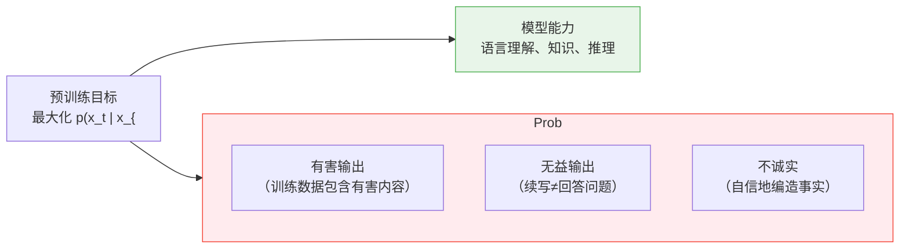

**对齐问题（Alignment Problem）**：如何让模型不只是"会说话"，而是"说有用的话、说真实的话、不说有害的话"——即 OpenAI 提出的 **3H 原则**：

- **Helpful**：帮助用户完成任务
- **Honest**：不编造、不欺骗
- **Harmless**：不产生有害内容

### 1.2 纯 SFT 的局限

最直接的做法是直接用高质量的（prompt, response）对做监督微调：

$$\mathcal{L}_{\text{SFT}} = -\sum_t \log \pi_\theta(y_t \mid x, y_{<t})$$

SFT 有效，但存在根本局限：

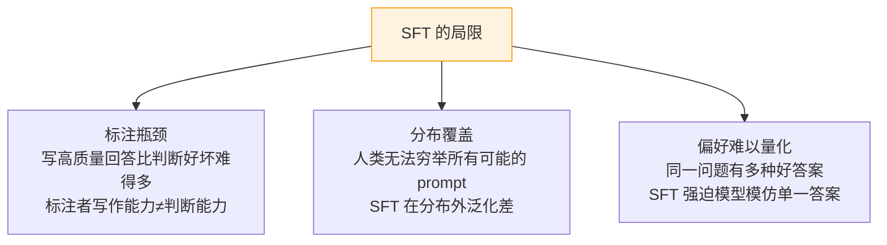

关键洞察：**让人类判断哪个回答更好，远比让人类写出最好的回答容易**。RLHF 正是基于这个洞察——用偏好判断而非示范来训练模型。

---

## 二、RLHF 的三阶段总览

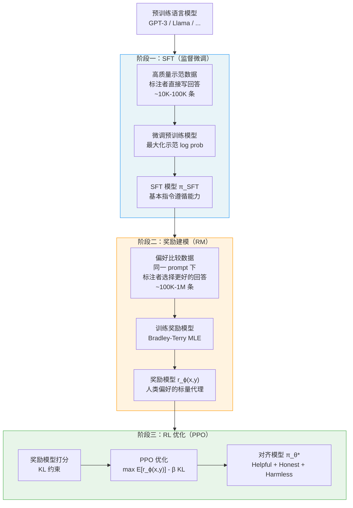

三个阶段各有分工：

| 阶段 | 数据 | 目标 | 产物 |
|------|------|------|------|
| SFT | 示范数据（直接写回答） | 教会模型基本指令遵循 | $\pi_{\text{SFT}}$ |
| 奖励建模 | 偏好数据（比较两个回答） | 学习人类偏好的标量代理 | $r_\phi(x, y)$ |
| RL 优化 | 奖励模型 + KL 约束 | 最大化奖励，保持合理性 | $\pi_\theta^*$ |

---

## 三、阶段一：监督微调（SFT）

### 3.1 数据构建

SFT 数据是 (prompt, response) 对，质量比数量更重要：

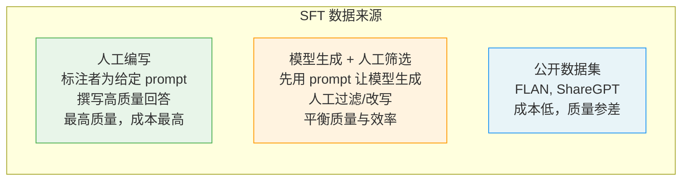

**Prompt 多样性**是关键——要覆盖尽量多的任务类型：

```
问答、摘要、翻译、代码生成、创意写作、
数学推理、对话、指令遵循、分类、...
```

### 3.2 训练目标

标准的语言模型 SFT，只在 response 部分计算 loss（prompt 部分 label 设为 -100）：

$$\mathcal{L}_{\text{SFT}}(\theta) = -\mathbb{E}_{(x,y) \sim \mathcal{D}_{\text{SFT}}} \left[ \sum_{t=1}^{|y|} \log \pi_\theta(y_t \mid x, y_{<t}) \right]$$

**为什么只在 response 上算 loss？**

若在 prompt 上也算 loss，模型会把优化目标分散到 prompt 的分布上，而 prompt 分布不是我们想要优化的——我们只想让模型学会给定 prompt 之后如何回答。

### 3.3 SFT 的作用

SFT 做了两件事：

1. **格式对齐**：让模型学会"对话回答"的格式，而非"文本续写"
2. **分布锚定**：为后续 RL 阶段提供一个合理的初始策略，防止 RL 从随机策略开始探索（效率极低）

SFT 之后，$\pi_{\text{SFT}}$ 同时成为 RL 阶段的**初始策略**（被进一步优化）和**参考策略**（被冻结，用于 KL 约束）。

---

## 四、阶段二：奖励建模

### 4.1 为什么需要奖励模型

RLHF 需要一个可以对任意 (prompt, response) 对打分的函数，作为 RL 的奖励信号。

直接让人类在 RL 训练过程中实时打分是不现实的——RL 需要对数百万个 (x, y) 对评分，人类根本来不及。

**解决方案**：先收集人类偏好数据，训练一个神经网络奖励模型来模拟人类判断，再用奖励模型自动打分。

### 4.2 偏好数据的收集

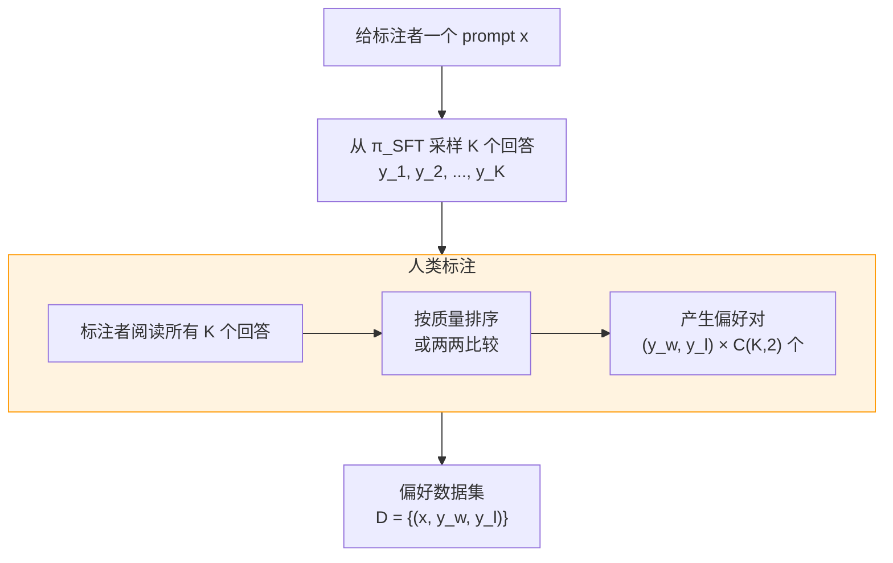

**标注维度**：InstructGPT 中标注者评估多个维度后给出综合偏好：
- 整体质量（Overall quality）
- 是否遵循指令（Following instructions）
- 信息准确性（Factual accuracy）
- 安全性（Safety）

### 4.3 Bradley-Terry 偏好模型

假设存在一个潜在的真实奖励函数 $r^*(x, y)$，人类偏好 $y_w$ 优于 $y_l$ 的概率由 **Bradley-Terry 模型**给出：

$$p^*(y_w \succ y_l \mid x) = \frac{e^{r^*(x, y_w)}}{e^{r^*(x, y_w)} + e^{r^*(x, y_l)}} = \sigma\!\left(r^*(x, y_w) - r^*(x, y_l)\right)$$

其中 $\sigma(\cdot)$ 是 sigmoid 函数。

**这个模型的假设**：

- 偏好可以由单一标量奖励完全解释（单维度偏好）
- 偏好是传递的（若 $A \succ B$ 且 $B \succ C$，则 $A \succ C$）
- 偏好有噪声（随机性来自标注者的不确定性）

### 4.4 奖励模型的训练目标

用最大似然估计，最小化负对数似然：

$$\mathcal{L}_{\text{RM}}(\phi) = -\mathbb{E}_{(x, y_w, y_l) \sim \mathcal{D}} \left[ \log \sigma\!\left( r_\phi(x, y_w) - r_\phi(x, y_l) \right) \right]$$

**奖励模型的结构**：通常在 LM backbone（与 policy 同架构，或更小）后加一个线性投影层，将最后一个 token 的隐状态映射为标量：

```
输入：[prompt x] + [response y]
→ Transformer backbone
→ 取最后一个 token 的隐状态 h
→ 线性层 w^T h
→ 标量奖励 r(x, y)
```

### 4.5 奖励模型的训练细节

**初始化**：从 SFT 模型初始化，去掉语言模型头，加标量头。

**奖励归一化**：训练后对奖励输出做归一化，确保均值为 0、方差为 1（或固定范围）：

$$r_{\text{norm}}(x, y) = \frac{r_\phi(x, y) - \mu_r}{\sigma_r}$$

其中 $\mu_r, \sigma_r$ 在验证集上估计。这防止奖励值的尺度影响后续 RL 训练的超参数。

**过拟合风险**：奖励模型容易过拟合到偏好数据中人类标注者的偏见（如喜欢更长的回答、更流畅的文字），而非真正的质量。这是 reward hacking 的根源之一。

### 4.6 排序损失 vs 成对损失

除了 Bradley-Terry 的成对损失，也可以用**排序损失（Ranking Loss）**直接对 K 个回答的排名建模：

$$\mathcal{L}_{\text{rank}} = -\mathbb{E} \left[ \log \frac{e^{r(x, y_{(1)})}}{\sum_{j=1}^{K} e^{r(x, y_{(j)})}} \right]$$

其中 $y_{(1)}$ 是标注者排序第一的回答。

这相当于用一个多类 softmax 分类，每次从 K 个候选中"选出"最好的那个，信息利用率更高。

---

## 五、阶段三：RL 优化

### 5.1 RLHF 的优化目标

有了奖励模型，RLHF 的目标是：

$$\max_{\pi_\theta} \; \mathbb{E}_{x \sim \mathcal{D},\, y \sim \pi_\theta(\cdot \mid x)} \left[ r_\phi(x, y) \right] - \beta \, \mathbb{D}_{\text{KL}} \left[ \pi_\theta(\cdot \mid x) \,\|\, \pi_{\text{ref}}(\cdot \mid x) \right]$$

**两项的含义**：

- $\mathbb{E}[r_\phi(x,y)]$：最大化奖励模型打分（靠近人类偏好）
- $-\beta \mathbb{D}_{\text{KL}}[\pi_\theta \| \pi_{\text{ref}}]$：约束与参考策略的距离（防止 reward hacking）

**KL 约束的必要性**：

如果没有 KL 约束，模型会找到奖励模型的盲点——产生奖励模型打分极高但人类实际觉得很差的输出。这称为**Reward Hacking**。

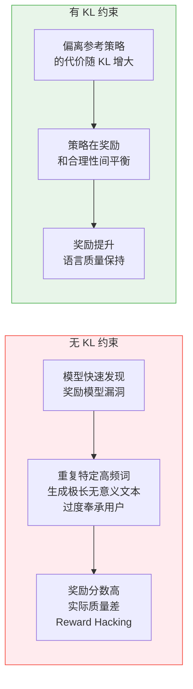

### 5.2 最优策略的解析形式

第五节的目标函数存在闭合解（参见 DPO 篇的推导）：

$$\pi^*(y \mid x) = \frac{1}{Z(x)} \pi_{\text{ref}}(y \mid x) \exp\!\left(\frac{r_\phi(x, y)}{\beta}\right)$$

这个解揭示了几点重要信息：

1. 最优策略是以 $\pi_{\text{ref}}$ 为基础，用奖励重新加权的 Gibbs 分布
2. $\beta \to 0$：策略退化为 argmax 奖励（无 KL 约束）
3. $\beta \to \infty$：策略退化为参考策略（完全不优化奖励）
4. $Z(x)$ 的存在使得直接采样困难，只能通过 RL 近似求解（或用 DPO 绕过 $Z(x)$）

### 5.3 PPO 求解

用 PPO 近似求解上述目标。核心是将 KL 约束折入逐步奖励信号（**奖励塑形**）：

**per-token 塑形奖励**：

$$r_t^{\text{shaped}} = \begin{cases} r_\phi(x, y) - \beta \log \dfrac{\pi_\theta(y_t \mid x, y_{<t})}{\pi_{\text{ref}}(y_t \mid x, y_{<t})} & t = |y| \\ -\beta \log \dfrac{\pi_\theta(y_t \mid x, y_{<t})}{\pi_{\text{ref}}(y_t \mid x, y_{<t})} & t < |y| \end{cases}$$

其中：
- 末端 token 处加入奖励模型的 sequence-level 分数
- 每个 token 处减去 KL 惩罚，将 KL 约束分散到每一步

用 Critic 网络估计价值函数，GAE 计算优势，PPO-Clip 更新策略。完整 PPO 实现参见前一篇文章。

### 5.4 训练的四模型结构

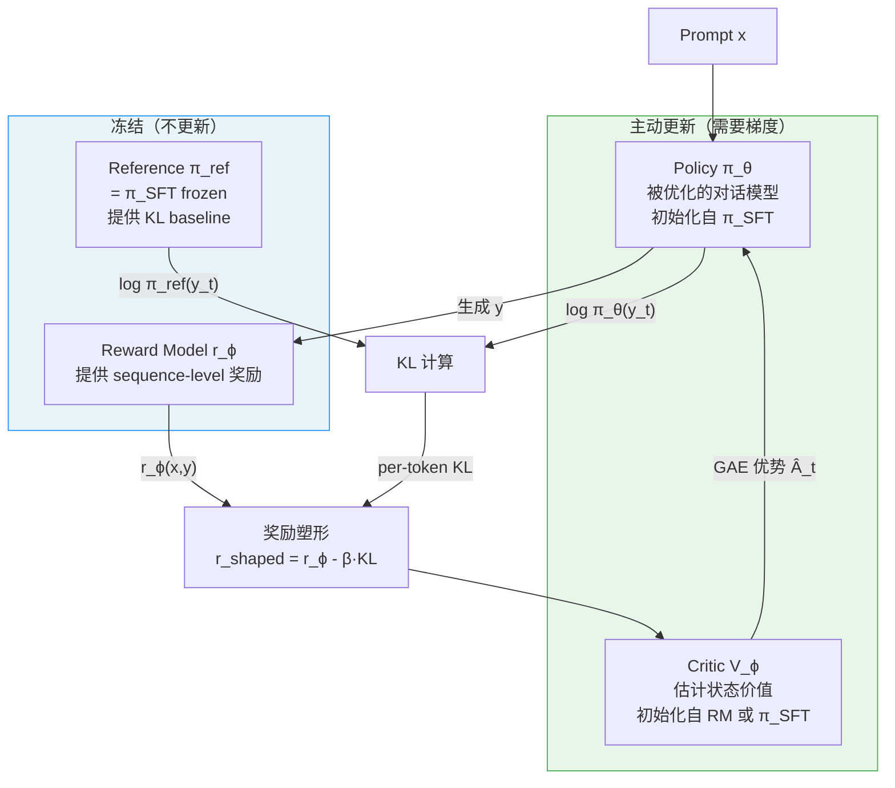

**内存占用估算**（以 7B 模型为例）：

| 模型 | 参数量 | 优化器状态 | 显存（bf16+Adam）|
|------|--------|-----------|-----------------|
| Policy | 7B | 一/二阶矩 | ~56GB |
| Reference | 7B | 无 | ~14GB |
| Critic | 7B | 一/二阶矩 | ~56GB |
| Reward Model | 7B | 无 | ~14GB |
| **合计** | **28B** | | **~140GB** |

这正是 GRPO 去掉 Critic 能节省约 50GB 显存的原因。

---

## 六、数据飞轮与迭代 RLHF

### 6.1 单次 RLHF 的局限

一次 RLHF 流程用固定的偏好数据集训练奖励模型，用固定的奖励模型做 RL。

问题：随着策略 $\pi_\theta$ 提升，它开始生成偏好数据收集时 $\pi_{\text{SFT}}$ 从未生成过的输出，奖励模型在这些分布外输出上的预测不可靠。

### 6.2 迭代 RLHF（Iterative RLHF）

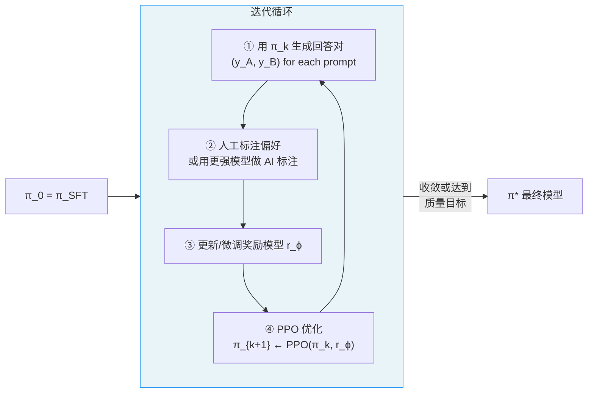

每次迭代：
- 用最新策略 $\pi_k$ 采样新数据（分布更贴近当前策略）
- 用新数据更新奖励模型（减少分布偏移）
- 用更新后的奖励模型继续 RL

这形成一个**数据飞轮**，随着迭代进行，系统整体质量螺旋上升。

### 6.3 AI 辅助标注（Constitutional AI / RLAIF）

人工标注成本极高。Anthropic 的 Constitutional AI（CAI）和 Google 的 RLAIF 使用更强的 AI 模型（如 GPT-4、Claude 3）代替人类进行偏好标注：

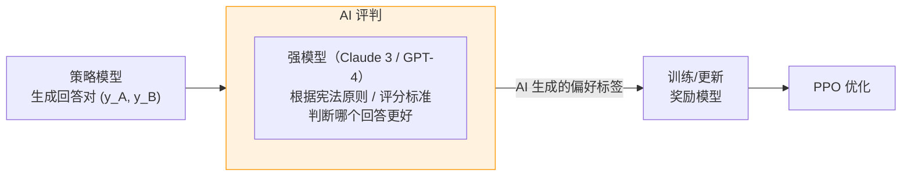

优势：规模可以扩展，成本低，标注一致性好。
风险：AI 标注者的偏见被放大，可能强化模型的系统性错误。

---

## 七、奖励模型的校准与评估

### 7.1 评估指标

奖励模型训练完后，用保留的测试集评估：

**成对准确率（Pairwise Accuracy）**：

$$\text{Acc} = \mathbb{E}_{(x,y_w,y_l) \sim \mathcal{D}_{\text{test}}} \left[ \mathbf{1}\!\left[ r_\phi(x, y_w) > r_\phi(x, y_l) \right] \right]$$

通常好的奖励模型在测试集上达到 70%~85% 的准确率（100% 说明过拟合）。

**校准性（Calibration）**：

奖励模型预测的偏好概率 $\sigma(r_w - r_l)$ 应该与实际的人类一致率对齐。可以用 ECE（Expected Calibration Error）评估。

### 7.2 奖励模型的常见失败模式

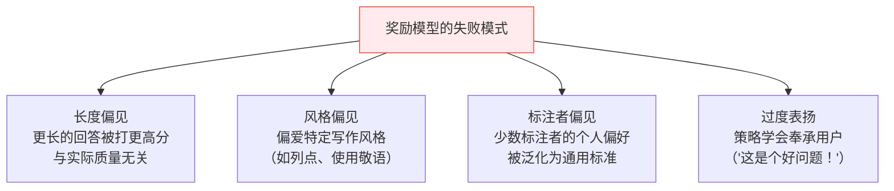

**Reward Hacking 的典型表现**：

| 策略行为 | 奖励模型的盲点 |
|---------|-------------|
| 生成极长回答 | 长度偏见 |
| 大量使用 markdown 格式 | 格式偏见 |
| 开头总是表扬用户 | 奉承偏见 |
| 在结尾加免责声明 | 安全性模式偷懒 |

---

## 八、RLHF 的完整训练流水线

### 8.1 端到端流水线

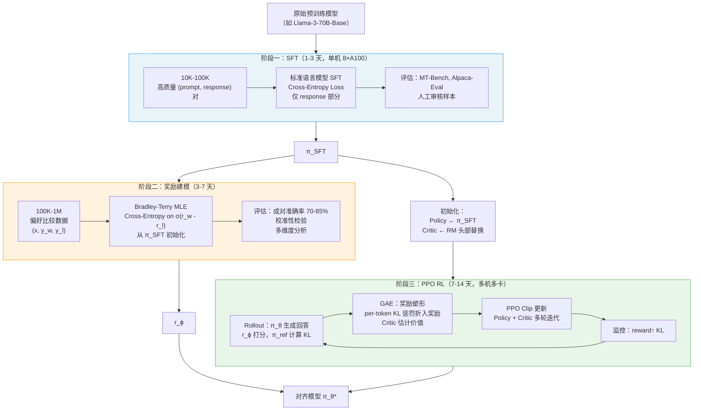

### 8.2 各阶段的关键超参数

**SFT 阶段**：

| 超参数 | 典型值 | 说明 |
|--------|--------|------|
| 学习率 | 1e-5 ~ 5e-5 | 比预训练小 10-100x |
| Batch size | 64 ~ 512 | |
| Epochs | 1 ~ 3 | 数据量少时可多训几轮 |
| 序列长度 | 1024 ~ 4096 | |
| LR scheduler | Cosine with warmup | |

**奖励建模阶段**：

| 超参数 | 典型值 | 说明 |
|--------|--------|------|
| 学习率 | 5e-6 ~ 2e-5 | |
| 批次大小 | 64 ~ 256 | 每个 batch 含多个偏好对 |
| Epochs | 1 ~ 3 | 小心过拟合 |
| 奖励归一化 | 是 | 均值 0，方差 1 |

**PPO 阶段**：

| 超参数 | 典型值 | 说明 |
|--------|--------|------|
| PPO clip ε | 0.1 ~ 0.2 | |
| KL 系数 β | 0.01 ~ 0.1 | 越大越保守 |
| PPO epochs K | 2 ~ 4 | LLM 中通常比 RL 游戏少 |
| GAE λ | 0.95 | |
| 折扣因子 γ | 1.0 | 序列不折扣 |
| Rollout batch | 512 ~ 2048 条 prompt | |
| Mini-batch | 32 ~ 128 | |

---

## 九、RLHF 的已知问题

### 9.1 奖励模型过优化（Over-optimization）

随着 RL 训练持续，策略对奖励模型的优化越来越"充分"——但真实性能可能已经开始下降。

**Goodhart 定律**：当一个度量指标成为优化目标时，它就不再是好的度量指标。

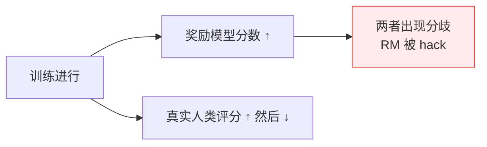

数学上，Gao et al.（2022）发现策略的"黄金奖励"（真实人类偏好）$J^*$ 与代理奖励 $r_\phi$ 之间的关系近似：

$$J^*(d) \approx J^*(0) + \alpha \sqrt{d} - \gamma d$$

其中 $d = \mathbb{D}_{\text{KL}}[\pi_\theta \| \pi_{\text{ref}}]$，$\alpha > 0$，$\gamma > 0$。

存在最优的 KL 散度值 $d^* = \frac{\alpha^2}{4\gamma^2}$，超过这个点后真实性能开始下降。

### 9.2 分布偏移

奖励模型是在 $\pi_{\text{SFT}}$ 的输出分布上训练的。随着 RL 训练，$\pi_\theta$ 生成越来越"超出分布"的输出，奖励模型预测失准。

**缓解手段**：
- 保守的 KL 约束（减慢策略漂移）
- 定期收集当前策略的新偏好数据并更新 RM（迭代 RLHF）
- 同时优化 RM 和 Policy（在线学习）

### 9.3 标注者偏见与多样性

不同标注者对"好"的回答有不同理解。偏好数据是标注者群体偏好的有噪声采样：

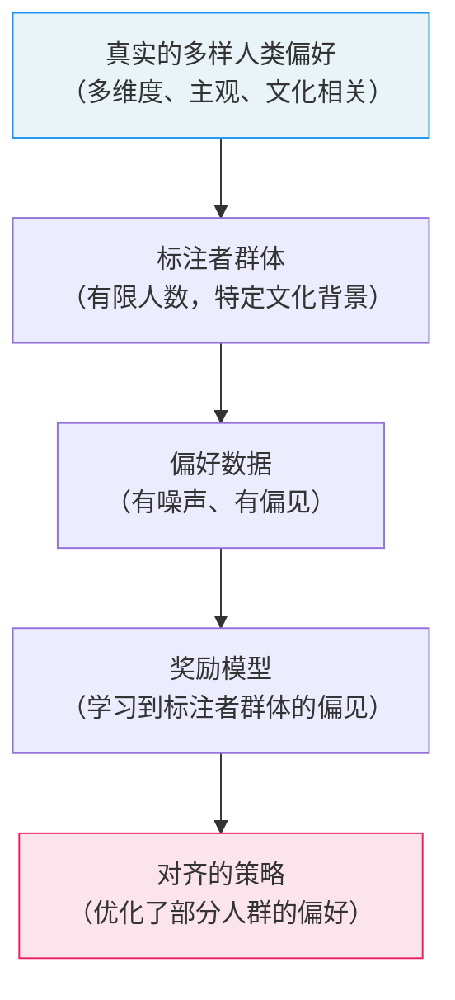

**根本性张力**：RLHF 试图将"人类偏好"压缩为单一标量奖励，但人类偏好本质上是多维度、主观的、因人而异的。这是 RLHF 框架的理论局限，无法完全解决。

### 9.4 安全性的脆弱

RLHF 的安全训练（对有害输出给低奖励）效果有限：

- **越狱（Jailbreak）**：精心构造的 prompt 可以绕过安全训练
- **对抗性输入**：可以找到让奖励模型高分但人类觉得有害的输入
- **过度拒绝**：模型可能因为安全训练而过度拒绝无害请求（alignment tax）

---

## 十、RLHF 的变体与替代方案

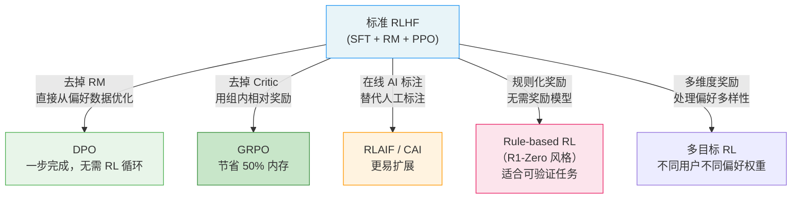

**各方案适用场景**：

| 方法 | 适用场景 | 核心权衡 |
|------|---------|---------|
| RLHF + PPO | 通用对话对齐，资源充足 | 效果最好，工程最复杂 |
| DPO | 通用对齐，资源有限 | 简单高效，有分布偏移问题 |
| GRPO | 有可验证奖励（数学/代码）| 节省内存，依赖奖励质量 |
| RLAIF | 大规模偏好数据收集 | 可扩展，AI 偏见风险 |
| Rule-based RL | 推理任务，有 ground truth | 无法 hack，但适用范围窄 |

---

## 十一、InstructGPT 的实践总结

OpenAI 在 InstructGPT 论文（2022）中的关键工程发现：

**数据规模**：
- SFT：13K 条示范数据（相对少，但质量高）
- RM：33K 条比较数据（每个 prompt 生成 4-9 个回答，标注者两两比较）
- RL：31K 条 prompt（无标注，只用奖励模型打分）

**关键发现**：
- 1.3B RLHF 模型在人类评估上优于 175B 纯 SFT 模型（参数量相差 100x）
- RLHF 训练对代码、摘要等任务有一定性能下降（alignment tax）
- 奖励模型在 RL 训练超过一定步数后准确率下降（over-optimization）

**"对齐税"（Alignment Tax）**：
RLHF 可能轻微损害模型在某些 NLP benchmark（如 code, summarization）上的性能，因为优化了"有帮助"的方向，与原始的语言建模目标产生冲突。

---

## 十二、完整数学框架回顾

三个阶段的优化目标汇总：

$$\underbrace{\mathcal{L}_{\text{SFT}} = -\mathbb{E}\left[\sum_t \log\pi_\theta(y_t|x,y_{<t})\right]}_{\text{阶段一：极大似然模仿示范}}$$

$$\underbrace{\mathcal{L}_{\text{RM}} = -\mathbb{E}\left[\log\sigma\left(r_\phi(x,y_w) - r_\phi(x,y_l)\right)\right]}_{\text{阶段二：Bradley-Terry 偏好模型}}$$

$$\underbrace{\max_{\pi_\theta}\;\mathbb{E}[r_\phi(x,y)] - \beta\,\mathbb{D}_{\text{KL}}[\pi_\theta\|\pi_{\text{ref}}]}_{\text{阶段三：KL 约束的奖励最大化}}$$

三个目标各自解决一个问题：
- SFT：赋予模型基本的指令遵循格式
- RM：将人类的比较判断压缩为连续奖励信号
- RL：在奖励模型引导下探索，同时保持语言合理性

三者合在一起，构成了迄今为止最成功的大语言模型对齐方案。

---

*参考：*
- *Ouyang et al., Training language models to follow instructions with human feedback (InstructGPT), NeurIPS 2022*
- *Ziegler et al., Fine-Tuning Language Models from Human Preferences, 2019*
- *Stiennon et al., Learning to summarize with human feedback, NeurIPS 2020*
- *Bai et al., Training a Helpful and Harmless Assistant with Reinforcement Learning from Human Feedback, Anthropic 2022*
- *Gao et al., Scaling Laws for Reward Model Overoptimization, ICML 2023*
- *Bai et al., Constitutional AI: Harmlessness from AI Feedback, Anthropic 2022*
- *Rafailov et al., Direct Preference Optimization, NeurIPS 2023*
