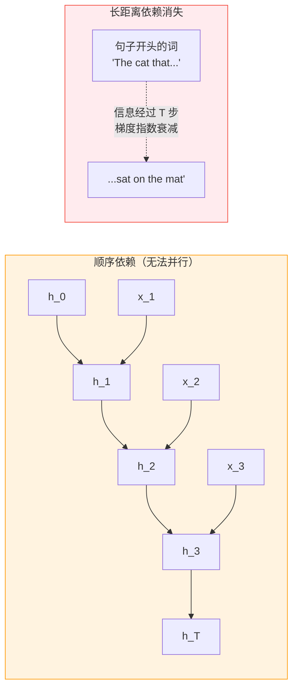
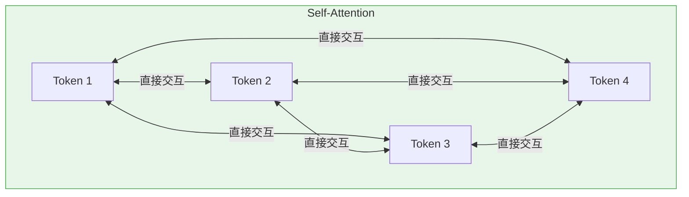
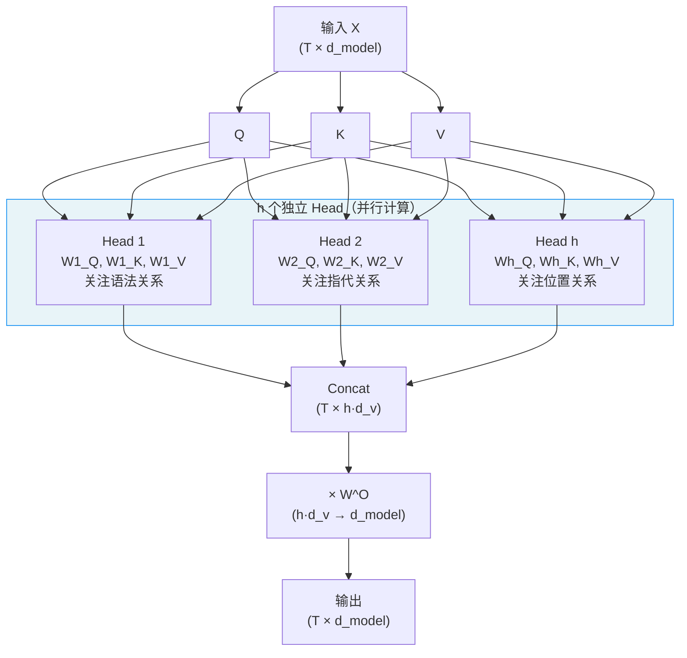
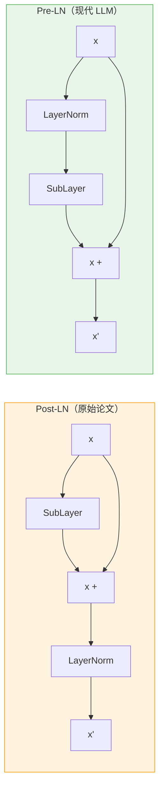
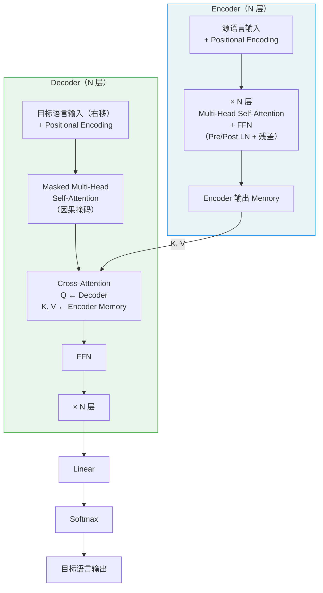
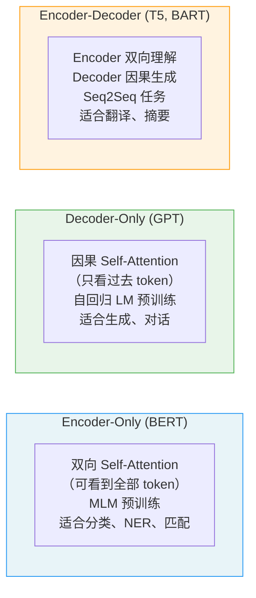
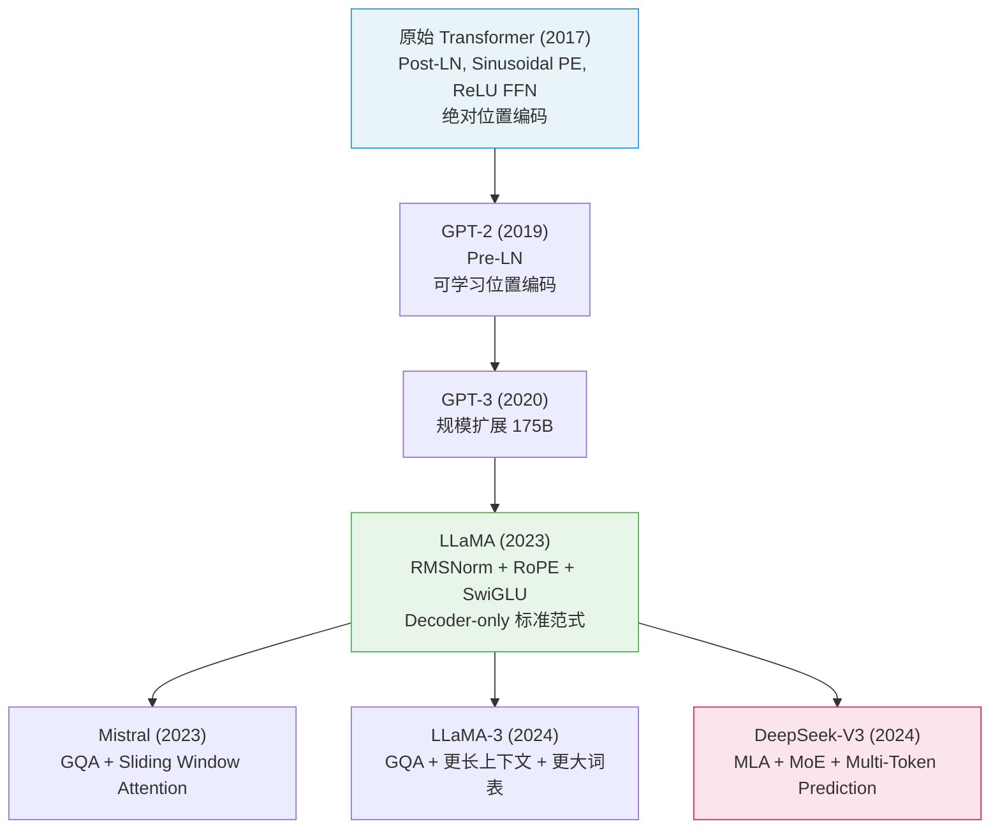
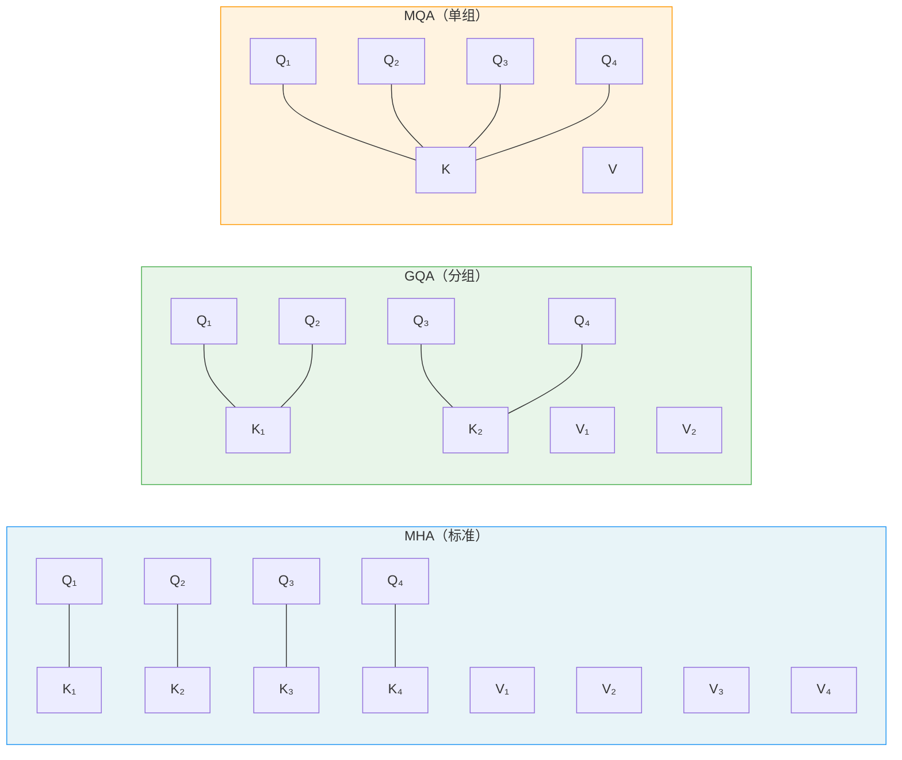
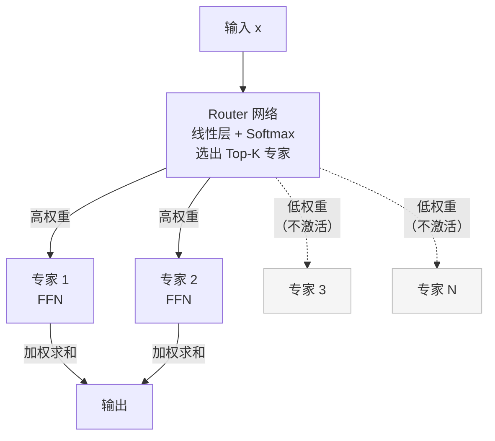
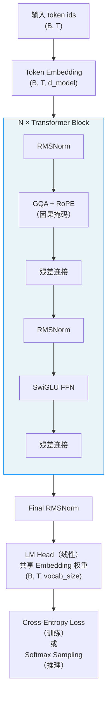

2017 年，Google 发表论文 *Attention Is All You Need*，提出 Transformer 架构，彻底改变了 NLP 乃至整个 AI 领域。GPT、BERT、LLaMA、Gemini——所有现代大语言模型都以 Transformer 为骨架。

本文从第一性原理出发，完整推导 Transformer 的每个组件，并分析从原始论文到现代 LLM（LLaMA、Mistral、DeepSeek）的架构演进。

---

## 一、为什么需要 Attention

### 1.1 RNN 的根本问题

在 Transformer 之前，序列建模的主流是 RNN/LSTM。RNN 的状态更新是严格顺序的：

$$h_t = f(h_{t-1}, x_t)$$

这引发两个根本问题：



**问题一：无法并行**。$h_t$ 依赖 $h_{t-1}$，计算必须串行，GPU 大量算力空置，训练极慢。

**问题二：长程依赖退化**。信息通过"瓶颈"向量 $h_t$ 传递，距离越远信号越弱。即使是 LSTM，对超长序列也力不从心。

### 1.2 Attention 的核心直觉

Attention 的想法很简单：**让序列中每个位置直接访问所有其他位置，不经过任何中间瓶颈**。



任意两个位置之间的路径长度从 $O(T)$（RNN）降为 $O(1)$（Attention），长程依赖问题从根本上解决。

---

## 二、Scaled Dot-Product Attention

### 2.1 Query、Key、Value 的直觉

Attention 用**信息检索**的方式来理解：

- **Query（Q）**：当前位置要"查找什么"的描述
- **Key（K）**：每个位置"我有什么"的索引标签
- **Value（V）**：每个位置"实际存储的内容"

类比数据库：Query 是搜索词，Key 是索引，Value 是返回的实际内容。

### 2.2 完整推导

设输入序列 $X \in \mathbb{R}^{T \times d_{\text{model}}}$，通过三个线性投影得到 Q、K、V：

$$Q = X W^Q, \quad K = X W^K, \quad V = X W^V$$

其中 $W^Q, W^K \in \mathbb{R}^{d_{\text{model}} \times d_k}$，$W^V \in \mathbb{R}^{d_{\text{model}} \times d_v}$。

**第一步：计算相似度**

用点积衡量 Query 和 Key 的相关性：

$$\text{score}(Q_i, K_j) = Q_i \cdot K_j = \sum_{k=1}^{d_k} Q_{ik} K_{jk}$$

矩阵形式：$QK^\top \in \mathbb{R}^{T \times T}$，$(i,j)$ 位置表示第 $i$ 个 Query 与第 $j$ 个 Key 的相似度。

**第二步：缩放（Scaling）**

直接用点积有问题——当 $d_k$ 很大时，点积的方差与 $d_k$ 成正比，导致 softmax 梯度接近零（softmax 饱和区）。

**证明**：设 $Q_i, K_j$ 的各分量独立同分布，均值为 0，方差为 1，则：

$$\text{Var}(Q_i \cdot K_j) = \text{Var}\!\left(\sum_{k=1}^{d_k} Q_{ik} K_{jk}\right) = \sum_{k=1}^{d_k} \text{Var}(Q_{ik})\text{Var}(K_{jk}) = d_k$$

即标准差为 $\sqrt{d_k}$。除以 $\sqrt{d_k}$ 将方差归一化为 1，softmax 工作在合理区间。

**第三步：Softmax**

对每行（每个 Query）做 softmax，得到注意力权重（概率分布）：

$$\alpha_{ij} = \text{softmax}\!\left(\frac{QK^\top}{\sqrt{d_k}}\right)_{ij} = \frac{\exp(Q_i K_j^\top / \sqrt{d_k})}{\sum_{j'} \exp(Q_i K_{j'}^\top / \sqrt{d_k})}$$

**第四步：加权求和**

用注意力权重对 Value 做加权聚合：

$$\text{Attention}(Q, K, V) = \text{softmax}\!\left(\frac{QK^\top}{\sqrt{d_k}}\right) V$$

**完整公式**：

$$\boxed{\text{Attention}(Q, K, V) = \text{softmax}\!\left(\frac{QK^\top}{\sqrt{d_k}}\right) V}$$

输出形状：$\mathbb{R}^{T \times d_v}$。

### 2.3 因果掩码（Causal Mask）

语言模型是自回归的——生成第 $t$ 个 token 时只能看到前 $t-1$ 个 token，不能"偷看"未来。

用上三角掩码实现：在计算 softmax 之前，将 $QK^\top$ 的上三角部分（$j > i$ 的位置）设为 $-\infty$，softmax 后这些位置权重为 0：

$$M_{ij} = \begin{cases} 0 & j \leq i \\ -\infty & j > i \end{cases}$$

$$\text{Attention}(Q, K, V) = \text{softmax}\!\left(\frac{QK^\top}{\sqrt{d_k}} + M\right) V$$

```
注意力矩阵（位置 i 只能看到位置 ≤ i）：

        K1    K2    K3    K4
Q1  [ α11    0     0     0  ]
Q2  [ α21   α22    0     0  ]
Q3  [ α31   α32   α33    0  ]
Q4  [ α41   α42   α43   α44 ]
```

---

## 三、Multi-Head Attention

### 3.1 动机

单个 Attention head 学习一种"关注模式"。但语言中存在多种不同的依赖关系：
- 语法依赖（主谓关系）
- 指代关系（代词 → 名词）
- 位置关系（相邻词）
- 语义关联（近义词）

**Multi-Head Attention** 用 $h$ 个独立的 Attention head 并行捕捉不同类型的依赖：

$$\text{head}_i = \text{Attention}(QW_i^Q, KW_i^K, VW_i^V)$$

$$\text{MultiHead}(Q, K, V) = \text{Concat}(\text{head}_1, \ldots, \text{head}_h) W^O$$

其中：
- $W_i^Q, W_i^K \in \mathbb{R}^{d_{\text{model}} \times d_k}$，$W_i^V \in \mathbb{R}^{d_{\text{model}} \times d_v}$
- $d_k = d_v = d_{\text{model}} / h$（通常），保持总参数量不变
- $W^O \in \mathbb{R}^{h d_v \times d_{\text{model}}}$：输出投影，将各 head 的输出合并



### 3.2 计算复杂度

Self-Attention 的计算复杂度：

| 操作 | 复杂度 | 主要瓶颈 |
|------|--------|---------|
| $QK^\top$ 计算 | $O(T^2 d)$ | 对长序列是平方关系 |
| softmax | $O(T^2)$ | |
| 与 $V$ 相乘 | $O(T^2 d)$ | |
| 总计 | $O(T^2 d)$ | 序列长度 $T$ 是瓶颈 |

这是 Transformer 的核心限制：**计算和内存均与序列长度的平方成正比**，导致处理超长序列（$T > 10^4$）代价高昂。Flash Attention 等工程优化正是针对此问题。

---

## 四、位置编码

### 4.1 为什么需要位置信息

Attention 本身是**排列不变**的（permutation-invariant）——对输入序列打乱顺序，每个 token 的输出不变（因为 Attention 只看 Q·K 的相似度，不看位置）。

但语言是有序的，"猫吃鱼"和"鱼吃猫"完全不同。必须注入位置信息。

### 4.2 原始 Sinusoidal 位置编码

原始论文使用固定的正弦/余弦函数：

$$\text{PE}(pos, 2i) = \sin\!\left(\frac{pos}{10000^{2i/d_{\text{model}}}}\right)$$

$$\text{PE}(pos, 2i+1) = \cos\!\left(\frac{pos}{10000^{2i/d_{\text{model}}}}\right)$$

其中 $pos$ 是位置索引，$i$ 是维度索引。

**直觉**：不同频率的正弦波叠加，类似傅里叶变换——低频分量捕捉大尺度位置关系，高频分量捕捉细粒度位置关系。

**关键性质**：

$$\text{PE}(pos + k) = f(\text{PE}(pos), k)$$

即相对位置可以由绝对位置线性变换得到，模型可以学到相对位置关系。

位置编码加到词嵌入上：$X' = X_{\text{emb}} + \text{PE}$

### 4.3 可学习位置编码（Learned PE）

将位置编码作为可训练参数：

$$X' = X_{\text{emb}} + E_{\text{pos}}[pos]$$

其中 $E_{\text{pos}} \in \mathbb{R}^{T_{\max} \times d_{\text{model}}}$ 是可学习的位置嵌入矩阵。

GPT 系列、BERT 都使用可学习位置编码，实践中效果与 Sinusoidal 相当，但泛化到训练长度之外的序列时较差。

### 4.4 RoPE（Rotary Position Embedding）

RoPE 是现代 LLM（LLaMA、Mistral、Qwen、DeepSeek）的标配位置编码，由 Su et al.（2021）提出。

**核心思想**：不是把位置编码加到输入上，而是在计算 Attention 时，通过**旋转 Q 和 K 的向量**来注入相对位置信息。

对于位置 $m$ 的向量 $\mathbf{q}$，RoPE 将其旋转：

$$f(\mathbf{q}, m) = \begin{pmatrix} q_1 \\ q_2 \\ q_3 \\ q_4 \\ \vdots \end{pmatrix} \to \begin{pmatrix} q_1 \cos m\theta_1 - q_2 \sin m\theta_1 \\ q_1 \sin m\theta_1 + q_2 \cos m\theta_1 \\ q_3 \cos m\theta_2 - q_4 \sin m\theta_2 \\ q_3 \sin m\theta_2 + q_4 \cos m\theta_2 \\ \vdots \end{pmatrix}$$

其中 $\theta_i = 10000^{-2(i-1)/d}$ 是每对维度的旋转频率（与原始 PE 的基频一致）。

**关键性质**：位置 $m$ 的 Query 与位置 $n$ 的 Key 的点积只依赖于**相对位置** $m - n$：

$$\langle f(\mathbf{q}, m),\, f(\mathbf{k}, n) \rangle = g(\mathbf{q}, \mathbf{k}, m-n)$$

**证明**（2维情形）：

$$f(\mathbf{q}, m) = \begin{pmatrix} q_1 \cos m\theta - q_2 \sin m\theta \\ q_1 \sin m\theta + q_2 \cos m\theta \end{pmatrix}$$

$$\langle f(\mathbf{q}, m), f(\mathbf{k}, n) \rangle = (q_1 k_1 + q_2 k_2)\cos(m-n)\theta + (q_1 k_2 - q_2 k_1)\sin(m-n)\theta$$

结果只含 $(m-n)$，验证了 RoPE 编码的是相对位置。

**RoPE 的优势**：
- 相对位置编码，外推性更好
- 可以通过修改旋转频率（NTK-aware scaling、YaRN）扩展上下文长度
- 无需在输入上额外加位置向量，实现简洁

---

## 五、前馈网络（FFN）

### 5.1 结构

每个 Transformer 层包含 Multi-Head Attention 和一个位置-wise 前馈网络：

$$\text{FFN}(x) = \text{GELU}(xW_1 + b_1)W_2 + b_2$$

其中 $W_1 \in \mathbb{R}^{d_{\text{model}} \times d_{\text{ff}}}$，$W_2 \in \mathbb{R}^{d_{\text{ff}} \times d_{\text{model}}}$，$d_{\text{ff}} = 4 d_{\text{model}}$（通常）。

FFN 是**位置-wise** 的，即对序列中每个位置独立施加同样的变换，不同位置之间无交互。

**Attention 和 FFN 的分工**：
- **Attention**：跨位置信息混合（token 之间交互）
- **FFN**：在每个位置内做非线性变换（知识存储、特征提取）

### 5.2 为什么 FFN 是知识存储器

研究表明（Geva et al., 2021），FFN 的参数可以被视为**键值记忆（Key-Value Memories）**：

$$\text{FFN}(x) = \sum_{i=1}^{d_{\text{ff}}} \text{act}(x \cdot W_1^{(i)}) \cdot W_2^{(i)}$$

$W_1^{(i)}$（第 $i$ 个神经元的输入权重）是 key，$W_2^{(i)}$（对应的输出权重）是 value。输入 $x$ 激活部分 key，加权聚合对应的 value。

大量事实性知识（"巴黎是法国首都"）被存储在 FFN 的权重中。

### 5.3 SwiGLU：现代 LLM 的 FFN

原始 FFN 使用 ReLU。现代 LLM 普遍使用 **SwiGLU**（Shazeer 2020）：

$$\text{SwiGLU}(x) = \left(\text{Swish}(xW_1) \odot xW_3\right) W_2$$

其中 $\text{Swish}(x) = x \cdot \sigma(x)$，$\odot$ 是逐元素相乘，$W_3$ 是额外的门控投影。

SwiGLU 相比 GELU/ReLU 在实践中效果更好，被 LLaMA、PaLM、Mistral 等广泛采用。

代价：参数量略多（3 个矩阵而非 2 个）。通常将 $d_{\text{ff}}$ 从 $4d$ 调整为 $\frac{8}{3}d$ 保持参数量不变。

---

## 六、Layer Normalization 与残差连接

### 6.1 残差连接

Transformer 的每个子层（Attention 和 FFN）都加了残差连接：

$$x' = x + \text{SubLayer}(x)$$

**作用**：
- 梯度可以"跳过"子层直接反向传播，解决深层网络梯度消失
- 使网络可以学习"残差"（增量），而非从头学习变换

### 6.2 Post-Norm vs Pre-Norm

**原始论文（Post-LN）**：

$$x' = \text{LayerNorm}(x + \text{SubLayer}(x))$$

**现代 LLM（Pre-LN）**：

$$x' = x + \text{SubLayer}(\text{LayerNorm}(x))$$



**Pre-LN 的优势**：
- 训练更稳定，无需 warmup
- 梯度流更稳定（LN 在残差路径外）
- 支持更大的学习率

**Pre-LN 的问题**：最后一层输出没有经过 LN，一些实现会在最终输出后额外加一层 LN（final LN）。

### 6.3 RMSNorm

现代 LLM（LLaMA、Mistral、Qwen）用 **RMSNorm** 替代 LayerNorm：

$$\text{RMSNorm}(x) = \frac{x}{\text{RMS}(x)} \cdot \gamma, \quad \text{RMS}(x) = \sqrt{\frac{1}{d}\sum_{i=1}^{d} x_i^2}$$

**RMSNorm vs LayerNorm**：

LayerNorm 同时做中心化（减均值）和缩放（除方差），而 RMSNorm **去掉了中心化**，只做缩放：

$$\text{LayerNorm}(x) = \frac{x - \mu}{\sigma} \cdot \gamma + \beta, \quad \mu = \frac{1}{d}\sum x_i, \quad \sigma = \sqrt{\frac{1}{d}\sum(x_i - \mu)^2}$$

RMSNorm 的两个优势：
1. 计算更快（不需要计算均值和均值修正的方差，少一次全量扫描）
2. 实践效果与 LayerNorm 相当甚至更好

---

## 七、原始 Transformer 的完整架构

### 7.1 Encoder-Decoder 结构

原始论文用于机器翻译，包含 Encoder 和 Decoder：



**Cross-Attention**（仅 Decoder 有）：Q 来自 Decoder 当前状态，K 和 V 来自 Encoder 的输出，实现源语言和目标语言之间的对齐。

### 7.2 单层 Transformer Block 的数据流

以 Decoder-only（GPT 风格）为例，一层的完整计算：

```
输入: x ∈ ℝ^{T × d_model}

① Pre-LN:        x_norm = RMSNorm(x)
② Self-Attention: attn_out = MultiHead(x_norm, x_norm, x_norm)   [因果掩码]
③ 残差:           x = x + attn_out

④ Pre-LN:        x_norm = RMSNorm(x)
⑤ FFN:           ffn_out = SwiGLU(x_norm)
⑥ 残差:           x = x + ffn_out

输出: x ∈ ℝ^{T × d_model}
```

---

## 八、Decoder-only 与 GPT 范式

### 8.1 三种 Transformer 变体



现代大语言模型（GPT-4、LLaMA、Mistral、Qwen、DeepSeek）全部使用 **Decoder-only** 架构，原因：

1. **统一性**：生成、理解、推理用同一架构，无需区分任务
2. **扩展性**：自回归预训练目标（预测下一个 token）简单有效，易于扩展
3. **In-context learning**：Few-shot 学习自然地嵌入在生成过程中

---

## 九、现代 LLM 的架构改进

从原始 Transformer 到 LLaMA-3、Mistral、DeepSeek，有若干关键改进：

### 9.1 架构演进总览



### 9.2 GQA（Grouped Query Attention）

**标准 MHA（Multi-Head Attention）**：$h$ 个 head，每个 head 有独立的 Q、K、V。

**MQA（Multi-Query Attention）**：所有 head 共享同一组 K 和 V，各 head 只有独立的 Q。

**GQA（Grouped Query Attention）**：介于 MHA 和 MQA 之间，$h$ 个 Q head 分为 $g$ 组，每组共享一对 K、V head（$g < h$）。



**GQA 的动机**：推理时，KV Cache（缓存已计算的 K、V）是显存瓶颈。MHA 每个 head 都有独立的 K、V Cache，显存占用正比于 $h$；GQA 将 K、V head 数从 $h$ 减少到 $g$，缓存大小减少 $h/g$ 倍。

LLaMA-3-70B 使用 $h=64$，$g=8$（GQA），KV Cache 缩小 8 倍。

### 9.3 KV Cache 的原理

自回归生成时，每生成一个新 token，都要对整个序列（包括之前的 token）重新计算 Attention。

**KV Cache** 将历史 token 的 K、V 缓存下来，每步只计算新 token 的 K、V，将生成复杂度从 $O(T^2)$ 降为 $O(T)$：

```
生成第 t 个 token 时：
- 只计算 x_t 的 Q_t, K_t, V_t
- 从缓存中取出 K_{1:t-1}, V_{1:t-1}
- 拼接：K = [K_{1:t-1}; K_t]，V = [V_{1:t-1}; V_t]
- Attention(Q_t, K, V)
```

KV Cache 的显存占用：$2 \times \text{num\_layers} \times \text{num\_kv\_heads} \times d_k \times T \times \text{dtype\_bytes}$

对 LLaMA-3-70B，序列长度 8192，KV Cache ≈ 32GB（fp16），GQA 将其降至 4GB。

### 9.4 MoE（Mixture of Experts）

DeepSeek-V3、Mixtral 使用 **MoE** 将 FFN 替换为稀疏激活的专家网络：

$$\text{MoE}(x) = \sum_{i \in \text{Top-K}} G_i(x) \cdot E_i(x)$$

其中 $E_i$ 是第 $i$ 个专家（独立的 FFN），$G_i(x) = \text{softmax}(\text{Router}(x))_i$ 是门控权重，只有 Top-K 个专家被激活。



MoE 的优势：用少量计算（只激活 K 个专家）获得大模型的参数量（N 个专家的总参数）。

DeepSeek-V3：256 个专家，每 token 激活 8 个，总参数 671B，但每 token 的实际计算量约等于 37B 的密集模型。

---

## 十、Flash Attention

标准 Attention 的内存瓶颈在于 $T \times T$ 的注意力矩阵，对长序列会 OOM。

**Flash Attention**（Dao et al., 2022）通过算法重组，完全避免将全量注意力矩阵写入 HBM（显存），在 SRAM（片上缓存）内分块完成计算：

```
标准 Attention：
  1. 计算 S = QK^T / √d     → 写入 HBM（T² × 4 bytes）
  2. P = softmax(S)          → 写入 HBM（T² × 4 bytes）
  3. O = PV                  → 写入 HBM（T × d × 4 bytes）
  HBM 读写：O(T² d)

Flash Attention：
  分块计算，每个块在 SRAM 中完成 softmax + 累加
  1. 分 B_r 个行块，B_c 个列块
  2. 利用 online softmax 算法（log-sum-exp 技巧）分块计算
  3. 只将最终输出 O 写入 HBM
  HBM 读写：O(T d)    ← 关键改进
```

Flash Attention 不改变计算结果（数学等价），只改变计算顺序（IO 感知算法），速度提升 2-4x，内存从 $O(T^2)$ 降至 $O(T)$。

---

## 十一、完整 PyTorch 实现

### 11.1 Scaled Dot-Product Attention

```python
import torch
import torch.nn as nn
import torch.nn.functional as F
import math
from typing import Optional


def scaled_dot_product_attention(
    q: torch.Tensor,              # (B, H, T, d_k)
    k: torch.Tensor,              # (B, H_kv, T, d_k)
    v: torch.Tensor,              # (B, H_kv, T, d_v)
    mask: Optional[torch.Tensor] = None,  # (T, T) 或 (B, 1, T, T)
    dropout: float = 0.0,
) -> torch.Tensor:
    """
    Attention(Q, K, V) = softmax(QK^T / √d_k) V
    """
    d_k = q.size(-1)
    scale = math.sqrt(d_k)

    # QK^T: (B, H, T_q, T_k)
    scores = torch.matmul(q, k.transpose(-2, -1)) / scale

    # 加掩码（因果掩码或 padding 掩码）
    if mask is not None:
        scores = scores.masked_fill(mask == 0, float('-inf'))

    # Softmax
    attn_weights = F.softmax(scores, dim=-1)

    if dropout > 0.0 and torch.is_grad_enabled():
        attn_weights = F.dropout(attn_weights, p=dropout)

    # 加权聚合 V: (B, H, T_q, d_v)
    return torch.matmul(attn_weights, v)
```

### 11.2 RoPE 实现

```python
def precompute_freqs_cis(
    dim: int,
    max_seq_len: int,
    theta: float = 10000.0,
    device: torch.device = torch.device('cpu'),
) -> torch.Tensor:
    """
    预计算 RoPE 的复数旋转因子 e^{iθ_j·pos}。

    返回形状：(max_seq_len, dim//2)，复数张量
    """
    # θ_j = 1 / 10000^{2j/dim}，j = 0, 1, ..., dim/2-1
    freqs = 1.0 / (theta ** (torch.arange(0, dim, 2, dtype=torch.float32) / dim))
    freqs = freqs.to(device)

    # 位置索引
    t = torch.arange(max_seq_len, device=device)

    # 外积：freqs[pos, j] = pos × θ_j
    freqs = torch.outer(t, freqs)   # (max_seq_len, dim//2)

    # 转为复数 e^{iθ} = cos θ + i sin θ
    freqs_cis = torch.polar(torch.ones_like(freqs), freqs)

    return freqs_cis


def apply_rotary_emb(
    xq: torch.Tensor,      # (B, T, H, d_k)
    xk: torch.Tensor,      # (B, T, H_kv, d_k)
    freqs_cis: torch.Tensor,  # (T, d_k//2) 复数
) -> tuple[torch.Tensor, torch.Tensor]:
    """将 RoPE 旋转应用到 Q 和 K。"""
    # 将实数向量转为复数（每两个相邻维度配对）
    xq_c = torch.view_as_complex(xq.float().reshape(*xq.shape[:-1], -1, 2))  # (B, T, H, d_k//2)
    xk_c = torch.view_as_complex(xk.float().reshape(*xk.shape[:-1], -1, 2))  # (B, T, H_kv, d_k//2)

    # 广播旋转因子：(1, T, 1, d_k//2)
    freqs_cis = freqs_cis[None, :xq.shape[1], None, :]

    # 复数乘法实现旋转：x * e^{imθ}
    xq_out = torch.view_as_real(xq_c * freqs_cis).flatten(3)   # (B, T, H, d_k)
    xk_out = torch.view_as_real(xk_c * freqs_cis).flatten(3)   # (B, T, H_kv, d_k)

    return xq_out.type_as(xq), xk_out.type_as(xk)
```

### 11.3 GQA + RoPE Attention

```python
class GroupedQueryAttention(nn.Module):
    """
    支持 GQA 的 Self-Attention（兼容 MHA 和 MQA）。
    """

    def __init__(
        self,
        d_model: int,
        n_heads: int,           # Q head 数
        n_kv_heads: int,        # KV head 数（GQA: n_kv_heads < n_heads）
        dropout: float = 0.0,
    ):
        super().__init__()
        assert n_heads % n_kv_heads == 0, "n_heads 必须是 n_kv_heads 的整数倍"

        self.n_heads = n_heads
        self.n_kv_heads = n_kv_heads
        self.n_rep = n_heads // n_kv_heads   # 每个 KV head 被多少 Q head 共享
        self.d_k = d_model // n_heads
        self.dropout = dropout

        self.wq = nn.Linear(d_model, n_heads * self.d_k, bias=False)
        self.wk = nn.Linear(d_model, n_kv_heads * self.d_k, bias=False)
        self.wv = nn.Linear(d_model, n_kv_heads * self.d_k, bias=False)
        self.wo = nn.Linear(n_heads * self.d_k, d_model, bias=False)

    def forward(
        self,
        x: torch.Tensor,              # (B, T, d_model)
        freqs_cis: torch.Tensor,      # (T, d_k//2) 复数，RoPE 旋转因子
        mask: Optional[torch.Tensor] = None,
        kv_cache: Optional[tuple] = None,
    ) -> tuple[torch.Tensor, Optional[tuple]]:
        B, T, _ = x.shape

        # 线性投影
        q = self.wq(x).view(B, T, self.n_heads, self.d_k)       # (B, T, H, d_k)
        k = self.wk(x).view(B, T, self.n_kv_heads, self.d_k)    # (B, T, H_kv, d_k)
        v = self.wv(x).view(B, T, self.n_kv_heads, self.d_k)    # (B, T, H_kv, d_k)

        # 应用 RoPE
        q, k = apply_rotary_emb(q, k, freqs_cis)

        # KV Cache（推理时使用）
        if kv_cache is not None:
            k_cache, v_cache = kv_cache
            k = torch.cat([k_cache, k], dim=1)   # (B, T_cached+T, H_kv, d_k)
            v = torch.cat([v_cache, v], dim=1)

        new_cache = (k, v)

        # GQA：将 KV head 重复 n_rep 次以匹配 Q head 数
        # (B, T, H_kv, d_k) → (B, T, H, d_k)
        if self.n_rep > 1:
            k = k[:, :, :, None, :].expand(B, -1, self.n_kv_heads, self.n_rep, self.d_k)
            k = k.reshape(B, -1, self.n_heads, self.d_k)
            v = v[:, :, :, None, :].expand(B, -1, self.n_kv_heads, self.n_rep, self.d_k)
            v = v.reshape(B, -1, self.n_heads, self.d_k)

        # 转置为 (B, H, T, d_k) 以便矩阵乘法
        q = q.transpose(1, 2)
        k = k.transpose(1, 2)
        v = v.transpose(1, 2)

        # Attention（可替换为 Flash Attention）
        out = scaled_dot_product_attention(q, k, v, mask=mask, dropout=self.dropout)

        # (B, H, T, d_k) → (B, T, H*d_k) → (B, T, d_model)
        out = out.transpose(1, 2).contiguous().view(B, T, -1)
        return self.wo(out), new_cache
```

### 11.4 SwiGLU FFN

```python
class SwiGLUFFN(nn.Module):
    """
    SwiGLU 前馈网络：(Swish(xW₁) ⊙ xW₃) W₂
    d_ff = 8/3 * d_model（保持与 4*d_model 的 ReLU FFN 参数量相当）
    """

    def __init__(self, d_model: int, d_ff: Optional[int] = None):
        super().__init__()
        if d_ff is None:
            # 8/3 d_model，取 256 的整数倍（对齐内存）
            d_ff = int(8 * d_model / 3)
            d_ff = 256 * ((d_ff + 255) // 256)

        self.w1 = nn.Linear(d_model, d_ff, bias=False)   # 门控分支
        self.w3 = nn.Linear(d_model, d_ff, bias=False)   # 主干分支
        self.w2 = nn.Linear(d_ff, d_model, bias=False)   # 输出投影

    def forward(self, x: torch.Tensor) -> torch.Tensor:
        # SwiGLU = (Swish(xW₁) ⊙ xW₃) W₂
        # Swish(x) = x * sigmoid(x) = F.silu(x)
        return self.w2(F.silu(self.w1(x)) * self.w3(x))
```

### 11.5 完整 Transformer Block

```python
class TransformerBlock(nn.Module):
    """
    现代 LLM 风格的 Transformer Block：
    Pre-RMSNorm + GQA + RoPE + Pre-RMSNorm + SwiGLU
    """

    def __init__(
        self,
        d_model: int,
        n_heads: int,
        n_kv_heads: int,
        d_ff: Optional[int] = None,
        dropout: float = 0.0,
        norm_eps: float = 1e-5,
    ):
        super().__init__()
        self.attn_norm = nn.RMSNorm(d_model, eps=norm_eps)
        self.attn = GroupedQueryAttention(d_model, n_heads, n_kv_heads, dropout)
        self.ffn_norm = nn.RMSNorm(d_model, eps=norm_eps)
        self.ffn = SwiGLUFFN(d_model, d_ff)

    def forward(
        self,
        x: torch.Tensor,              # (B, T, d_model)
        freqs_cis: torch.Tensor,      # RoPE 旋转因子
        mask: Optional[torch.Tensor] = None,
        kv_cache: Optional[tuple] = None,
    ) -> tuple[torch.Tensor, Optional[tuple]]:
        # Attention sublayer with Pre-RMSNorm + 残差
        attn_out, new_cache = self.attn(self.attn_norm(x), freqs_cis, mask, kv_cache)
        x = x + attn_out

        # FFN sublayer with Pre-RMSNorm + 残差
        x = x + self.ffn(self.ffn_norm(x))

        return x, new_cache
```

### 11.6 完整 Decoder-only 语言模型

```python
class TransformerLM(nn.Module):
    """
    完整的 Decoder-only 语言模型（LLaMA/Mistral 风格）
    """

    def __init__(
        self,
        vocab_size: int,
        d_model: int,
        n_layers: int,
        n_heads: int,
        n_kv_heads: int,
        max_seq_len: int = 4096,
        d_ff: Optional[int] = None,
        dropout: float = 0.0,
        norm_eps: float = 1e-5,
        rope_theta: float = 10000.0,
    ):
        super().__init__()
        self.d_model = d_model
        self.n_layers = n_layers

        # Token embedding
        self.tok_emb = nn.Embedding(vocab_size, d_model)

        # Transformer blocks
        self.layers = nn.ModuleList([
            TransformerBlock(d_model, n_heads, n_kv_heads, d_ff, dropout, norm_eps)
            for _ in range(n_layers)
        ])

        # Final LN（Pre-LN 模型需要在最后加一个 LN）
        self.norm = nn.RMSNorm(d_model, eps=norm_eps)

        # 语言模型头（与 embedding 权重共享）
        self.lm_head = nn.Linear(d_model, vocab_size, bias=False)
        self.lm_head.weight = self.tok_emb.weight   # weight tying

        # 预计算 RoPE 旋转因子
        self.register_buffer(
            "freqs_cis",
            precompute_freqs_cis(d_model // n_heads, max_seq_len * 2, rope_theta),
        )

        # 初始化
        self._init_weights()

    def _init_weights(self):
        for module in self.modules():
            if isinstance(module, nn.Linear):
                nn.init.normal_(module.weight, std=0.02)
            elif isinstance(module, nn.Embedding):
                nn.init.normal_(module.weight, std=0.02)

    def forward(
        self,
        tokens: torch.Tensor,    # (B, T) 整数 token ids
        kv_caches: Optional[list] = None,  # 推理时的 KV Cache
    ) -> tuple[torch.Tensor, Optional[list]]:
        B, T = tokens.shape

        # Token embedding
        x = self.tok_emb(tokens)   # (B, T, d_model)

        # RoPE 旋转因子（取当前序列长度的部分）
        start_pos = 0
        if kv_caches is not None and kv_caches[0] is not None:
            start_pos = kv_caches[0][0].shape[1]  # 已缓存的 token 数

        freqs_cis = self.freqs_cis[start_pos: start_pos + T]

        # 因果掩码（训练时需要，推理时可省略因 KV Cache 已确保因果性）
        mask = None
        if T > 1:
            mask = torch.tril(torch.ones(T, T, device=tokens.device))

        # 逐层计算
        new_caches = []
        for i, layer in enumerate(self.layers):
            cache = kv_caches[i] if kv_caches else None
            x, new_cache = layer(x, freqs_cis, mask, cache)
            new_caches.append(new_cache)

        # Final LN + LM Head
        x = self.norm(x)
        logits = self.lm_head(x)  # (B, T, vocab_size)

        return logits, new_caches

    def compute_loss(
        self,
        tokens: torch.Tensor,   # (B, T)
        labels: torch.Tensor,   # (B, T)，-100 表示忽略
    ) -> torch.Tensor:
        logits, _ = self(tokens)   # (B, T, vocab_size)

        # 移位：用 tokens[t] 预测 tokens[t+1]
        shift_logits = logits[:, :-1, :].contiguous()   # (B, T-1, V)
        shift_labels = labels[:, 1:].contiguous()         # (B, T-1)

        return F.cross_entropy(
            shift_logits.view(-1, shift_logits.size(-1)),
            shift_labels.view(-1),
            ignore_index=-100,
        )
```

---

## 十二、各组件汇总对比

| 组件 | 原始 Transformer (2017) | 现代 LLM（LLaMA-3 风格）|
|------|------------------------|------------------------|
| 归一化 | Post-LayerNorm | Pre-RMSNorm |
| 位置编码 | Sinusoidal（绝对）| RoPE（相对，旋转式）|
| FFN 激活 | ReLU | SwiGLU |
| Attention 变体 | MHA | GQA |
| 推理加速 | 无 | KV Cache + Flash Attention |
| 参数共享 | 无 | Embedding 与 LM Head 共享权重 |
| 偏置项 | 有 | 无（Linear bias=False）|
| 超长上下文 | 无 | RoPE 扩展（NTK、YaRN）|

---

## 十三、完整数据流总结



Transformer 的设计哲学：**用注意力机制替代归纳偏置（inductive bias）**。RNN 硬编码了"序列局部性"，CNN 硬编码了"空间局部性"；Transformer 什么都不假设，完全靠注意力权重从数据中学习任意的依赖关系——代价是更多的参数和计算，收益是极强的表达能力和可扩展性。

---

*参考：*
- *Vaswani et al., Attention Is All You Need, NeurIPS 2017*
- *Su et al., RoFormer: Enhanced Transformer with Rotary Position Embedding, 2021*
- *Shazeer, GLU Variants Improve Transformer, 2020*
- *Ainslie et al., GQA: Training Generalized Multi-Query Transformer Models from Multi-Head Checkpoints, 2023*
- *Dao et al., FlashAttention: Fast and Memory-Efficient Exact Attention with IO-Awareness, NeurIPS 2022*
- *Zhang & Sennrich, Root Mean Square Layer Normalization, NeurIPS 2019*
- *Touvron et al., LLaMA 2: Open Foundation and Fine-Tuned Chat Models, 2023*
- *Geva et al., Transformer Feed-Forward Layers Are Key-Value Memories, EMNLP 2021*
