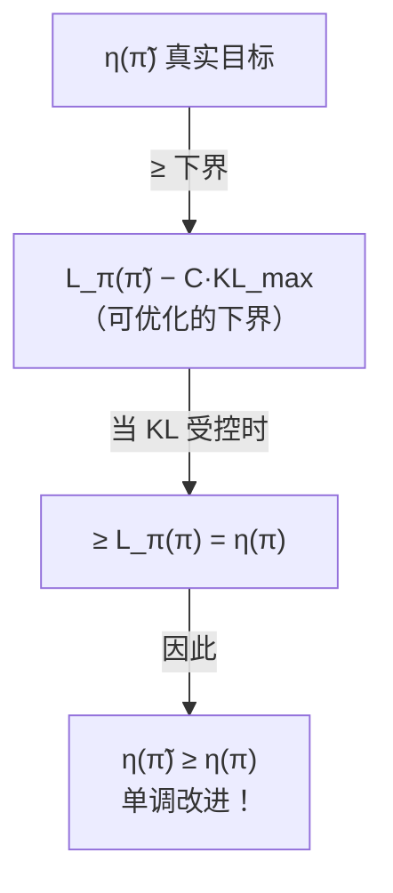
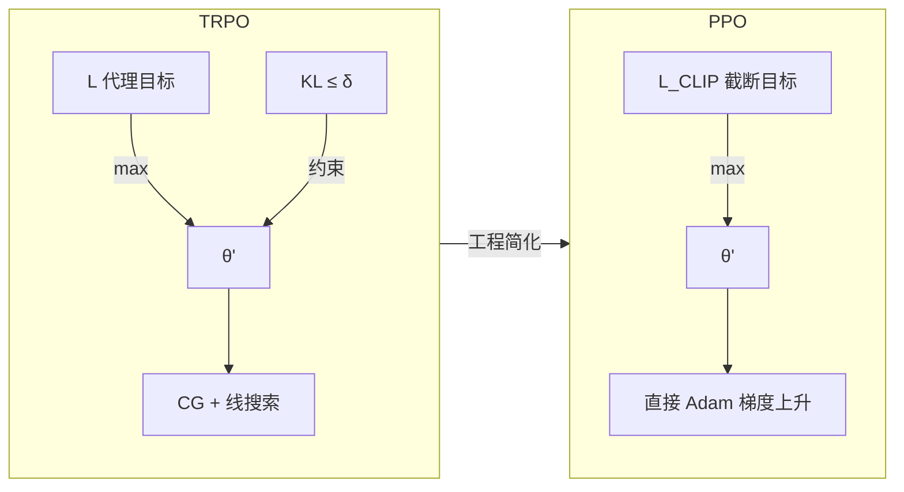
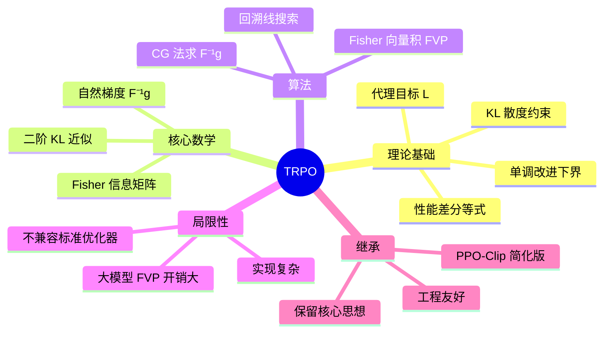

TRPO（Trust Region Policy Optimization）是 PPO 的理论前身，由 Schulman et al. 于 2015 年提出。它从严格的理论出发，推导出**单调不下降的策略更新保证**，并用 KL 散度约束将不可信的目标函数替换为可优化的代理目标。理解 TRPO 是理解 PPO 为何有效的关键。

---

## 目录

1. [问题设置](#1-问题设置)
2. [策略改进的理论界](#2-策略改进的理论界)
3. [代理目标函数](#3-代理目标函数)
4. [单调改进保证](#4-单调改进保证)
5. [信任域约束](#5-信任域约束)
6. [自然策略梯度](#6-自然策略梯度)
7. [TRPO 算法实现](#7-trpo-算法实现)
8. [共轭梯度法求解](#8-共轭梯度法求解)
9. [线搜索与回溯](#9-线搜索与回溯)
10. [TRPO 到 PPO 的简化](#10-trpo-到-ppo-的简化)
11. [PyTorch 实现](#11-pytorch-实现)

---

## 1. 问题设置

### 1.1 MDP 记号

考虑无限时域折扣 MDP：$(\mathcal{S}, \mathcal{A}, P, r, \rho_0, \gamma)$

- $\mathcal{S}$：状态空间，$\mathcal{A}$：动作空间
- $P(s'|s,a)$：转移概率
- $r(s,a)$：即时奖励，$\gamma \in (0,1)$：折扣因子
- $\rho_0$：初始状态分布

策略 $\pi$ 的**期望折扣回报**（目标）：

$$\eta(\pi) = \mathbb{E}_{s_0, a_0, \ldots}\!\left[\sum_{t=0}^\infty \gamma^t r(s_t, a_t)\right]$$

其中轨迹由 $s_0 \sim \rho_0$，$a_t \sim \pi(\cdot|s_t)$，$s_{t+1} \sim P(\cdot|s_t, a_t)$ 生成。

### 1.2 价值函数

$$V^\pi(s) = \mathbb{E}_\pi\!\left[\sum_{t=0}^\infty \gamma^t r(s_t, a_t) \,\Big|\, s_0 = s\right]$$

$$Q^\pi(s, a) = \mathbb{E}_\pi\!\left[\sum_{t=0}^\infty \gamma^t r(s_t, a_t) \,\Big|\, s_0 = s, a_0 = a\right]$$

$$A^\pi(s, a) = Q^\pi(s, a) - V^\pi(s) \quad \text{（优势函数）}$$

### 1.3 状态访问频率

策略 $\pi$ 的**折扣状态访问频率**：

$$\rho^\pi(s) = (1-\gamma)\sum_{t=0}^\infty \gamma^t P(s_t = s \mid \pi)$$

等价地，$\eta(\pi)$ 可写为：

$$\eta(\pi) = \frac{1}{1-\gamma}\mathbb{E}_{s \sim \rho^\pi,\, a \sim \pi(\cdot|s)}\!\left[r(s,a)\right]$$

---

## 2. 策略改进的理论界

### 2.1 性能差分等式

**引理**（Kakade & Langford 2002）：对任意两个策略 $\pi$ 和 $\tilde{\pi}$，有精确的性能差分关系：

$$\eta(\tilde{\pi}) = \eta(\pi) + \mathbb{E}_{s \sim \rho^{\tilde{\pi}},\, a \sim \tilde{\pi}(\cdot|s)}\!\left[A^\pi(s, a)\right]$$

**推导**：

从恒等式出发：

$$V^{\tilde\pi}(s) - V^\pi(s) = \mathbb{E}_{a \sim \tilde\pi}\!\left[Q^\pi(s,a)\right] - V^\pi(s) = \mathbb{E}_{a \sim \tilde\pi}\!\left[A^\pi(s,a)\right]$$

对两端乘以 $\rho^{\tilde\pi}(s)$ 后对 $s$ 积分：

$$\sum_s \rho^{\tilde\pi}(s)\!\left[V^{\tilde\pi}(s) - V^\pi(s)\right] = \mathbb{E}_{s \sim \rho^{\tilde\pi}}\!\left[\mathbb{E}_{a \sim \tilde\pi}\!\left[A^\pi(s,a)\right]\right]$$

注意左端等于 $\frac{1}{1-\gamma}[\eta(\tilde\pi) - \eta(\pi)]$（利用 $V^\pi$ 和 $V^{\tilde\pi}$ 的定义递推），整理得：

$$\eta(\tilde\pi) - \eta(\pi) = \frac{1}{1-\gamma}\mathbb{E}_{s \sim \rho^{\tilde\pi},\, a \sim \tilde\pi}\!\left[A^\pi(s,a)\right]$$

等价地（忽略 $\frac{1}{1-\gamma}$ 常数），将期望展开为：

$$\boxed{\eta(\tilde{\pi}) = \eta(\pi) + \mathbb{E}_{\tau \sim \tilde{\pi}}\!\left[\sum_{t=0}^\infty \gamma^t A^\pi(s_t, a_t)\right]}$$

**这个等式是 TRPO 的出发点**：若能找到 $\tilde\pi$ 使优势期望为正，则 $\eta(\tilde\pi) > \eta(\pi)$，策略单调改进。

---

## 3. 代理目标函数

### 3.1 困难：状态分布依赖 $\tilde\pi$

等式中的期望是在**新策略** $\tilde\pi$ 的状态分布 $\rho^{\tilde\pi}$ 下计算的，但我们目前只有旧策略 $\pi$ 采集的数据（$\rho^\pi$）——这是 off-policy 问题的核心困难。

**做法**：用旧策略分布 $\rho^\pi$ 代替 $\rho^{\tilde\pi}$，同时用重要性采样修正动作分布，定义**代理目标（Surrogate Objective）**：

$$L_\pi(\tilde\pi) = \eta(\pi) + \sum_s \rho^\pi(s) \sum_a \tilde\pi(a|s) A^\pi(s,a)$$

用重要性权重展开：

$$L_\pi(\tilde\pi) = \eta(\pi) + \mathbb{E}_{s \sim \rho^\pi,\, a \sim \pi}\!\left[\frac{\tilde\pi(a|s)}{\pi(a|s)} A^\pi(s,a)\right]$$

### 3.2 一阶近似的等价性

$L_\pi(\tilde\pi)$ 是 $\eta(\tilde\pi)$ 的一阶近似：

$$L_\pi(\pi) = \eta(\pi), \qquad \nabla_{\tilde\pi} L_\pi(\tilde\pi)\big|_{\tilde\pi=\pi} = \nabla_{\tilde\pi} \eta(\tilde\pi)\big|_{\tilde\pi=\pi}$$

**证明**：当 $\tilde\pi = \pi$ 时，$\rho^{\tilde\pi} = \rho^\pi$，所以 $L_\pi(\pi) = \eta(\pi)$。

对策略参数 $\theta$ 求导时（$\tilde\pi = \pi_\theta$），在 $\theta_\text{old}$ 处：

$$\nabla_\theta L_{\pi_\text{old}}(\pi_\theta)\big|_{\theta=\theta_\text{old}} = \nabla_\theta \eta(\pi_\theta)\big|_{\theta=\theta_\text{old}}$$

这说明在当前策略 $\pi$ 处，$L$ 与 $\eta$ 有**相同的一阶信息**，因此对 $L$ 做梯度上升在局部等价于对 $\eta$ 做梯度上升。

---

## 4. 单调改进保证

### 4.1 改进界（Schulman et al. 2015 Theorem 1）

**定理**：设 $\epsilon = \max_s |A^\pi(s, a)|$ 的上确界，则：

$$\eta(\tilde\pi) \geq L_\pi(\tilde\pi) - C \cdot D_{KL}^{\max}(\pi, \tilde\pi)$$

其中：

$$C = \frac{4\epsilon\gamma}{(1-\gamma)^2}, \qquad D_{KL}^{\max}(\pi, \tilde\pi) = \max_s D_{KL}\!\left(\pi(\cdot|s)\,\|\,\tilde\pi(\cdot|s)\right)$$

**推论**：若最大化下界 $L_\pi(\tilde\pi) - C \cdot D_{KL}^{\max}(\pi, \tilde\pi)$，则 $\eta$ 单调不下降：

$$\eta(\tilde\pi) \geq \eta(\pi) \quad \Leftarrow \quad L_\pi(\tilde\pi) - C \cdot D_{KL}^{\max} \geq L_\pi(\pi)$$

因为 $L_\pi(\pi) = \eta(\pi)$，上述条件成立时即保证 $\eta(\tilde\pi) \geq \eta(\pi)$。

### 4.2 证明思路

$$\eta(\tilde\pi) - L_\pi(\tilde\pi) = \sum_s [\rho^{\tilde\pi}(s) - \rho^\pi(s)] \mathbb{E}_{a \sim \tilde\pi}[A^\pi(s,a)]$$

利用状态访问频率差的上界：

$$|\rho^{\tilde\pi}(s) - \rho^\pi(s)| \leq \frac{2\gamma}{(1-\gamma)^2} D_{TV}^{\max}(\pi, \tilde\pi)$$

以及 TV 距离与 KL 散度的 Pinsker 不等式：

$$D_{TV}(p\|q) \leq \sqrt{\frac{1}{2}D_{KL}(p\|q)}$$

代入整理，即得上述下界。



---

## 5. 信任域约束

### 5.1 从惩罚到约束

理论上的更新规则是：

$$\tilde\pi = \arg\max_{\tilde\pi} \left[L_\pi(\tilde\pi) - C \cdot D_{KL}^{\max}(\pi, \tilde\pi)\right]$$

但 $C = \frac{4\epsilon\gamma}{(1-\gamma)^2}$ 通常极大，导致步长极小、训练极慢。

实践中改用**约束形式（信任域）**：

$$\boxed{\max_{\theta} \; L_{\theta_\text{old}}(\theta) \quad \text{s.t.} \quad D_{KL}^{\max}(\pi_{\theta_\text{old}}, \pi_\theta) \leq \delta}$$

这里用**最大 KL 散度**约束（最坏状态下的 KL）。实现中通常用**平均 KL** 代替（更容易估计）：

$$\bar{D}_{KL}(\theta_\text{old}, \theta) = \mathbb{E}_{s \sim \rho^{\pi_\text{old}}}\!\left[D_{KL}\!\left(\pi_{\theta_\text{old}}(\cdot|s)\,\|\,\pi_\theta(\cdot|s)\right)\right]$$

### 5.2 代理目标的采样估计

用旧策略 $\pi_{\theta_\text{old}}$ 采集的轨迹数据 $\{(s_t, a_t)\}$，对目标和约束做 Monte Carlo 估计：

$$L(\theta) \approx \frac{1}{N}\sum_{t=1}^N \frac{\pi_\theta(a_t|s_t)}{\pi_{\theta_\text{old}}(a_t|s_t)} \hat{A}_t$$

$$\bar{D}_{KL}(\theta_\text{old}, \theta) \approx \frac{1}{N}\sum_{t=1}^N D_{KL}\!\left(\pi_{\theta_\text{old}}(\cdot|s_t)\,\|\,\pi_\theta(\cdot|s_t)\right)$$

其中 $\hat{A}_t$ 是优势函数的估计（如 GAE）。

---

## 6. 自然策略梯度

### 6.1 为什么普通梯度不够

普通梯度上升：$\theta \leftarrow \theta + \alpha \nabla_\theta L(\theta)$

问题：梯度的大小依赖于参数空间的**参数化方式**，而非策略空间的实际差异。比如：

- 对 softmax 参数 $\theta$，一个大的参数更新 $\Delta\theta$ 可能只引起策略的微小变化
- 对另一种参数化，同样大小的 $\Delta\theta$ 可能引起巨大策略变化

**信息几何**告诉我们应该在**策略分布空间**而非参数空间做梯度上升。

### 6.2 Fisher 信息矩阵

策略 $\pi_\theta$ 的**Fisher 信息矩阵**：

$$F(\theta) = \mathbb{E}_{s \sim \rho^\pi,\, a \sim \pi_\theta}\!\left[\nabla_\theta \log\pi_\theta(a|s)\, \nabla_\theta \log\pi_\theta(a|s)^T\right]$$

Fisher 矩阵刻画了参数扰动 $\Delta\theta$ 对分布的影响，是 KL 散度的**局部二阶近似**：

$$D_{KL}\!\left(\pi_\theta\,\|\,\pi_{\theta+\Delta\theta}\right) \approx \frac{1}{2}\Delta\theta^T F(\theta)\Delta\theta$$

### 6.3 自然梯度方向

**自然梯度**将普通梯度投影到策略空间的正确度量下：

$$\tilde\nabla_\theta L = F(\theta)^{-1} \nabla_\theta L(\theta)$$

这等价于求解：

$$\min_{\Delta\theta} \;\; -\nabla_\theta L \cdot \Delta\theta \quad \text{s.t.} \quad \frac{1}{2}\Delta\theta^T F \Delta\theta \leq \delta$$

Lagrange 条件给出：

$$\Delta\theta^* = \sqrt{\frac{2\delta}{\nabla L^T F^{-1} \nabla L}} \cdot F^{-1}\nabla L$$

这正是 TRPO 的更新步骤：**自然策略梯度步 + 步长缩放保证 KL 约束满足**。

---

## 7. TRPO 算法实现

### 7.1 约束优化问题

$$\max_\theta \; L(\theta) = \mathbb{E}_t\!\left[\frac{\pi_\theta(a_t|s_t)}{\pi_{\theta_\text{old}}(a_t|s_t)} \hat{A}_t\right]$$

$$\text{s.t.} \quad \bar{D}_{KL}(\theta_\text{old}, \theta) \leq \delta$$

将目标函数在 $\theta_\text{old}$ 处做一阶近似，KL 约束做二阶近似：

$$\max_\Delta \;\; g^T \Delta\theta \quad \text{s.t.} \quad \frac{1}{2}\Delta\theta^T F \Delta\theta \leq \delta$$

其中 $g = \nabla_\theta L\big|_{\theta=\theta_\text{old}}$，$F$ 为 Fisher 矩阵。

Lagrange 乘子法求解（KKT 条件）：

$$\Delta\theta^* = \sqrt{\frac{2\delta}{g^T F^{-1} g}} \cdot F^{-1} g$$

### 7.2 完整算法流程

```mermaid
graph TD
    A[收集轨迹数据<br/>π_old 与环境交互] --> B[计算优势估计 Â_t<br/>GAE/TD]
    B --> C[计算目标梯度 g = ∇L]
    C --> D[用共轭梯度法求<br/>x = F⁻¹g]
    D --> E[计算最大步长<br/>β = √2δ / x^T F x]
    E --> F[候选更新<br/>θ' = θ + β·x]
    F --> G{KL(θ_old, θ') ≤ δ<br/>且 L(θ') > L(θ)?}
    G -->|Yes| H[接受更新<br/>θ_old ← θ']
    G -->|No| I[回溯线搜索<br/>β ← α·β]
    I --> F
    H --> A
```

---

## 8. 共轭梯度法求解

### 8.1 问题

直接计算 $F^{-1}g$ 需要存储并求逆 $|\theta|^2$ 大小的 Fisher 矩阵，对大模型不可行（参数百万量级时约 $10^{12}$ 个元素）。

**解法**：用**共轭梯度（CG）法**，只需要计算 Fisher 向量积（FVP）$Fv$，不需要显式存储 $F$。

### 8.2 Fisher 向量积的计算

利用 $F$ 是期望的 Hessian 这一性质，FVP 可以通过两次自动微分高效计算：

$$Fv = \nabla_\theta \left[\left(\nabla_\theta \bar{D}_{KL}\right)^T v\right]$$

```python
def fisher_vector_product(policy, states, v, damping=0.1):
    """
    计算 (F + λI)v
    damping: 正则化项，保证数值稳定性
    """
    # 计算平均KL散度
    kl = mean_kl_divergence(policy, states)

    # 一阶梯度
    kl_grad = torch.autograd.grad(kl, policy.parameters(), create_graph=True)
    kl_grad = flat_params(kl_grad)

    # kl_grad · v（标量）
    kl_grad_v = (kl_grad * v).sum()

    # 二阶：∇(kl_grad · v)
    kl_grad_grad = torch.autograd.grad(kl_grad_v, policy.parameters())
    fvp = flat_params(kl_grad_grad)

    return fvp + damping * v  # 加阻尼项
```

### 8.3 共轭梯度迭代

```python
def conjugate_gradient(fvp_fn, b, n_steps=10, residual_tol=1e-10):
    """
    用 CG 法求解 Fx = b
    fvp_fn: 计算 F @ v 的函数
    b:      右端项（目标梯度 g）
    """
    x = torch.zeros_like(b)
    r = b.clone()          # 残差 r = b - Fx = b（初始 x=0）
    p = r.clone()          # 搜索方向
    rTr = torch.dot(r, r)

    for i in range(n_steps):
        Fp = fvp_fn(p)           # F @ p
        alpha = rTr / torch.dot(p, Fp)   # 步长

        x = x + alpha * p
        r = r - alpha * Fp

        new_rTr = torch.dot(r, r)
        if new_rTr < residual_tol:
            break

        beta = new_rTr / rTr
        p = r + beta * p
        rTr = new_rTr

    return x  # ≈ F⁻¹b
```

CG 法在 $k$ 步内（$k \ll |\theta|$）给出良好近似，每步只需一次 FVP。

---

## 9. 线搜索与回溯

CG 给出的步长 $\Delta\theta^* = \beta \cdot x$（$x = F^{-1}g$）是在二次近似下的最优步，但实际策略是非线性的，需要**回溯线搜索**：

$$\beta_k = \alpha^k \cdot \beta_0, \quad \alpha \in (0,1)$$

接受条件（回溯停止）：

$$L(\theta_\text{old} + \beta_k \Delta\theta) - L(\theta_\text{old}) > 0$$

$$\bar{D}_{KL}(\theta_\text{old},\ \theta_\text{old} + \beta_k \Delta\theta) \leq \delta$$

两个条件都满足时接受，否则缩小步长。

```python
def backtracking_line_search(policy, full_step, expected_improvement,
                              states, actions, advantages,
                              max_backtracks=10, accept_ratio=0.1, delta=0.01):
    old_params = flat_params(policy.parameters())
    old_loss = compute_loss(policy, states, actions, advantages)

    for step_frac in [0.5**i for i in range(max_backtracks)]:
        new_params = old_params + step_frac * full_step
        assign_params(policy, new_params)

        new_loss = compute_loss(policy, states, actions, advantages)
        kl = mean_kl_divergence(policy, states)

        improvement = new_loss - old_loss
        if improvement > accept_ratio * step_frac * expected_improvement and kl <= delta:
            return True  # 接受

    # 回退到旧参数
    assign_params(policy, old_params)
    return False
```

---

## 10. TRPO 到 PPO 的简化

### 10.1 TRPO 的工程问题

TRPO 理论严格，但工程实现复杂：

| 问题 | 描述 |
|------|------|
| 共轭梯度 | 需迭代求 $F^{-1}g$，代码复杂 |
| Fisher 向量积 | 需二阶自动微分，内存开销大 |
| 不兼容二阶优化库 | PyTorch/TF 的标准优化器无法直接使用 |
| 超参数多 | CG 步数、阻尼系数、线搜索参数 |

### 10.2 PPO-Clip 的直觉

PPO 用**截断重要性比（clip）** 直接限制策略更新幅度，无需求解约束优化：

$$\mathcal{L}^{\text{CLIP}}(\theta) = \mathbb{E}_t\!\left[\min\!\left(\rho_t \hat{A}_t,\; \text{clip}(\rho_t, 1-\epsilon, 1+\epsilon)\hat{A}_t\right)\right]$$

其中 $\rho_t = \frac{\pi_\theta(a_t|s_t)}{\pi_{\theta_\text{old}}(a_t|s_t)}$。

**等价理解**：
- 当 $\hat{A}_t > 0$：增加该动作概率，但不超过 $1+\epsilon$（防止过度利用）
- 当 $\hat{A}_t < 0$：减少该动作概率，但不低于 $1-\epsilon$（防止过度惩罚）



### 10.3 理论对比

| 维度 | TRPO | PPO |
|------|------|-----|
| 理论基础 | 严格单调改进保证 | 启发式约束近似 |
| 优化方法 | 二阶（自然梯度）| 一阶（Adam）|
| KL 控制 | 硬约束 $\leq \delta$ | 软约束（clip 隐式控制）|
| 实现难度 | 高（CG、FVP）| 低（标准梯度下降）|
| 实际效果 | 两者接近 | 通常稍好或相当 |
| 工程兼容性 | 差 | 极好 |

---

## 11. PyTorch 实现

```python
import torch
import torch.nn as nn
import numpy as np
from torch.distributions import Categorical

# ---- 策略网络 ----
class PolicyNetwork(nn.Module):
    def __init__(self, state_dim, action_dim, hidden_dim=64):
        super().__init__()
        self.net = nn.Sequential(
            nn.Linear(state_dim, hidden_dim), nn.Tanh(),
            nn.Linear(hidden_dim, hidden_dim), nn.Tanh(),
            nn.Linear(hidden_dim, action_dim),
        )

    def forward(self, x):
        return self.net(x)

    def get_action(self, state):
        logits = self.forward(state)
        dist = Categorical(logits=logits)
        action = dist.sample()
        return action, dist.log_prob(action)

    def log_prob(self, states, actions):
        logits = self.forward(states)
        dist = Categorical(logits=logits)
        return dist.log_prob(actions)

    def entropy(self, states):
        logits = self.forward(states)
        dist = Categorical(logits=logits)
        return dist.entropy()


# ---- 工具函数 ----
def flat_params(params):
    return torch.cat([p.data.view(-1) for p in params])

def assign_params(policy, flat_params):
    prev = 0
    for p in policy.parameters():
        size = p.data.numel()
        p.data.copy_(flat_params[prev:prev+size].view(p.data.shape))
        prev += size

def flat_grad(loss, params, **kwargs):
    grads = torch.autograd.grad(loss, params, **kwargs)
    return torch.cat([g.view(-1) for g in grads])


# ---- 平均 KL 散度 ----
def mean_kl_divergence(policy, old_policy, states):
    """D_KL(π_old || π_θ) 的期望"""
    with torch.no_grad():
        old_logits = old_policy(states)
    new_logits = policy(states)

    old_log_probs = torch.log_softmax(old_logits, dim=-1)
    new_log_probs = torch.log_softmax(new_logits, dim=-1)

    old_probs = old_log_probs.exp()
    kl = (old_probs * (old_log_probs - new_log_probs)).sum(dim=-1)
    return kl.mean()


# ---- TRPO 代理目标 ----
def compute_surrogate(policy, old_log_probs, states, actions, advantages):
    new_log_probs = policy.log_prob(states, actions)
    ratio = torch.exp(new_log_probs - old_log_probs.detach())
    return (ratio * advantages).mean()


# ---- Fisher 向量积 ----
def fisher_vector_product(policy, old_policy, states, v, damping=0.1):
    kl = mean_kl_divergence(policy, old_policy, states)
    kl_grad = flat_grad(kl, policy.parameters(), create_graph=True)
    kl_grad_v = (kl_grad * v).sum()
    fvp = flat_grad(kl_grad_v, policy.parameters(), retain_graph=False)
    return fvp + damping * v


# ---- 共轭梯度 ----
def conjugate_gradient(fvp_fn, b, n_steps=10, tol=1e-10):
    x = torch.zeros_like(b)
    r, p = b.clone(), b.clone()
    rTr = r.dot(r)

    for _ in range(n_steps):
        Fp = fvp_fn(p)
        alpha = rTr / p.dot(Fp)
        x += alpha * p
        r -= alpha * Fp
        new_rTr = r.dot(r)
        if new_rTr < tol:
            break
        p = r + (new_rTr / rTr) * p
        rTr = new_rTr
    return x


# ---- TRPO 更新 ----
def trpo_update(policy, old_policy, states, actions, advantages,
                old_log_probs, delta=0.01, cg_steps=10, damping=0.1,
                backtrack_steps=10, backtrack_coef=0.5):

    # 1. 计算目标梯度 g
    surr = compute_surrogate(policy, old_log_probs, states, actions, advantages)
    g = flat_grad(surr, policy.parameters(), retain_graph=True)

    # 2. 用 CG 求 x = F⁻¹g
    fvp_fn = lambda v: fisher_vector_product(policy, old_policy, states, v, damping)
    x = conjugate_gradient(fvp_fn, g.detach(), n_steps=cg_steps)

    # 3. 计算最大步长
    xFx = x.dot(fvp_fn(x))
    full_step = torch.sqrt(2 * delta / (xFx + 1e-8)) * x
    expected_improve = g.dot(full_step).item()

    # 4. 回溯线搜索
    old_flat_params = flat_params(policy.parameters()).clone()
    old_surr = surr.item()

    for step_frac in [backtrack_coef**i for i in range(backtrack_steps)]:
        new_params = old_flat_params + step_frac * full_step
        assign_params(policy, new_params)

        new_surr = compute_surrogate(policy, old_log_probs, states, actions, advantages)
        kl = mean_kl_divergence(policy, old_policy, states)

        if kl.item() <= delta and new_surr.item() > old_surr:
            print(f"  Accepted: step_frac={step_frac:.4f}, "
                  f"ΔL={new_surr.item()-old_surr:.6f}, KL={kl.item():.6f}")
            return True

    # 全部失败，回退
    assign_params(policy, old_flat_params)
    print("  Line search failed. Keeping old parameters.")
    return False


# ---- GAE 优势估计 ----
def compute_gae(rewards, values, dones, gamma=0.99, lam=0.95):
    """
    Generalized Advantage Estimation
    values: (T+1,)，最后一个是 bootstrap value
    """
    T = len(rewards)
    advantages = torch.zeros(T)
    gae = 0.0

    for t in reversed(range(T)):
        delta = rewards[t] + gamma * values[t+1] * (1 - dones[t]) - values[t]
        gae = delta + gamma * lam * (1 - dones[t]) * gae
        advantages[t] = gae

    returns = advantages + values[:-1]
    # 归一化
    advantages = (advantages - advantages.mean()) / (advantages.std() + 1e-8)
    return advantages, returns


# ---- 完整训练循环 ----
class TRPOAgent:
    def __init__(self, state_dim, action_dim, hidden_dim=64,
                 gamma=0.99, lam=0.95, delta=0.01):
        self.policy = PolicyNetwork(state_dim, action_dim, hidden_dim)
        self.old_policy = PolicyNetwork(state_dim, action_dim, hidden_dim)
        self.old_policy.load_state_dict(self.policy.state_dict())

        self.value_fn = nn.Sequential(
            nn.Linear(state_dim, hidden_dim), nn.Tanh(),
            nn.Linear(hidden_dim, hidden_dim), nn.Tanh(),
            nn.Linear(hidden_dim, 1)
        )
        self.value_optimizer = torch.optim.Adam(self.value_fn.parameters(), lr=1e-3)

        self.gamma = gamma
        self.lam = lam
        self.delta = delta

    def update(self, trajectories):
        states   = torch.FloatTensor(trajectories['states'])
        actions  = torch.LongTensor(trajectories['actions'])
        rewards  = torch.FloatTensor(trajectories['rewards'])
        dones    = torch.FloatTensor(trajectories['dones'])
        values   = self.value_fn(states).squeeze(-1).detach()
        next_val = torch.zeros(1)  # terminal bootstrap
        values_with_next = torch.cat([values, next_val])

        advantages, returns = compute_gae(
            rewards, values_with_next, dones, self.gamma, self.lam
        )

        # 记录旧策略的 log_prob
        with torch.no_grad():
            old_log_probs = self.policy.log_prob(states, actions)

        # 同步旧策略
        self.old_policy.load_state_dict(self.policy.state_dict())

        # TRPO 更新策略
        trpo_update(
            self.policy, self.old_policy,
            states, actions, advantages, old_log_probs,
            delta=self.delta
        )

        # 多次更新 Value Function（普通梯度下降）
        for _ in range(5):
            v_pred = self.value_fn(states).squeeze(-1)
            value_loss = (v_pred - returns).pow(2).mean()
            self.value_optimizer.zero_grad()
            value_loss.backward()
            self.value_optimizer.step()

        return {
            'value_loss': value_loss.item(),
            'mean_advantage': advantages.mean().item()
        }
```

---

## 总结



**TRPO 的三条核心洞见**（PPO 继承了全部）：

1. **代理目标**：用重要性采样将 off-policy 数据转化为 on-policy 目标，一阶近似等价
2. **信任域**：限制每次更新的 KL 散度，保证策略不退化
3. **自然梯度**：在信息几何意义下的正确更新方向，比普通梯度更高效

TRPO 的工程复杂性最终被 PPO 的 clip 技巧取代，但其理论框架——**策略改进下界 + KL 约束**——是现代 RLHF 对齐算法（DPO、GRPO）的共同根基。
