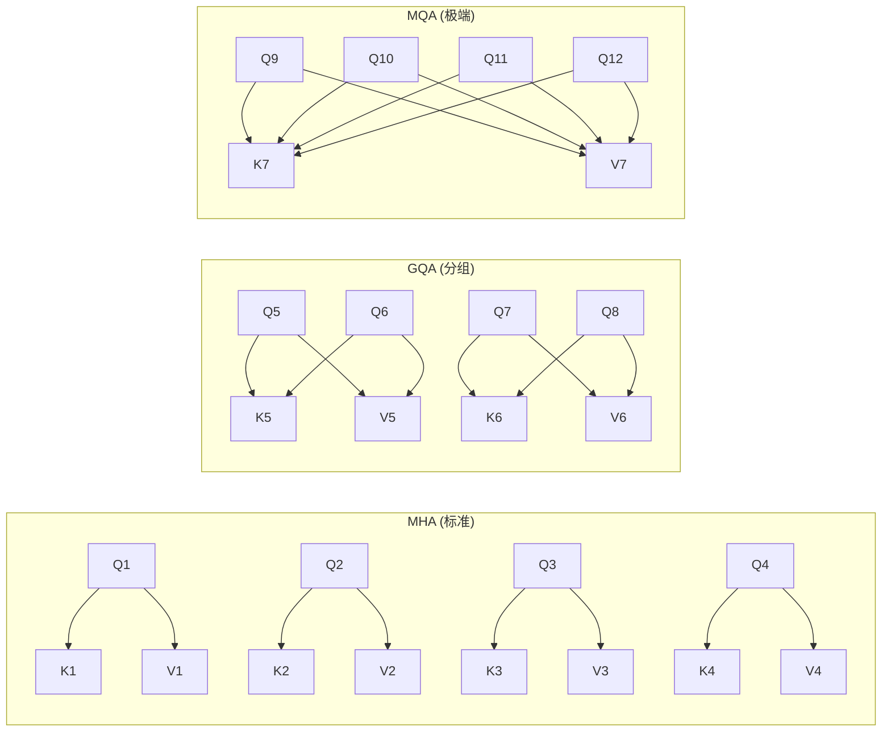
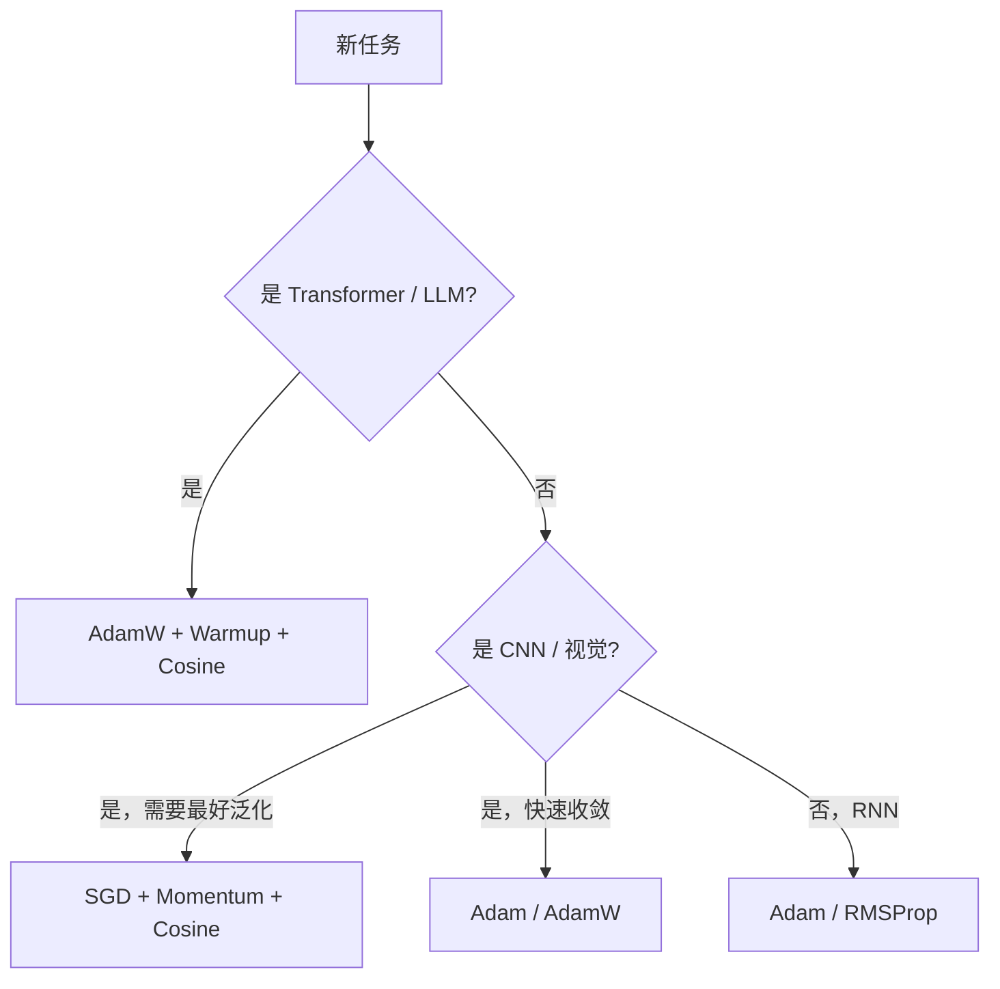
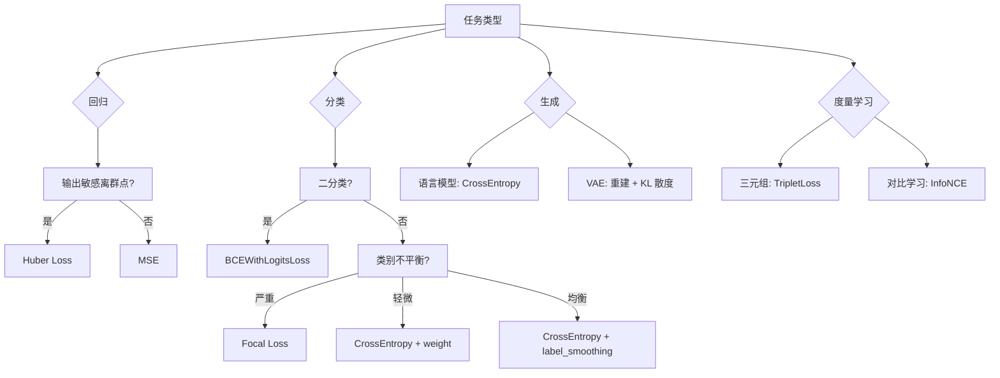
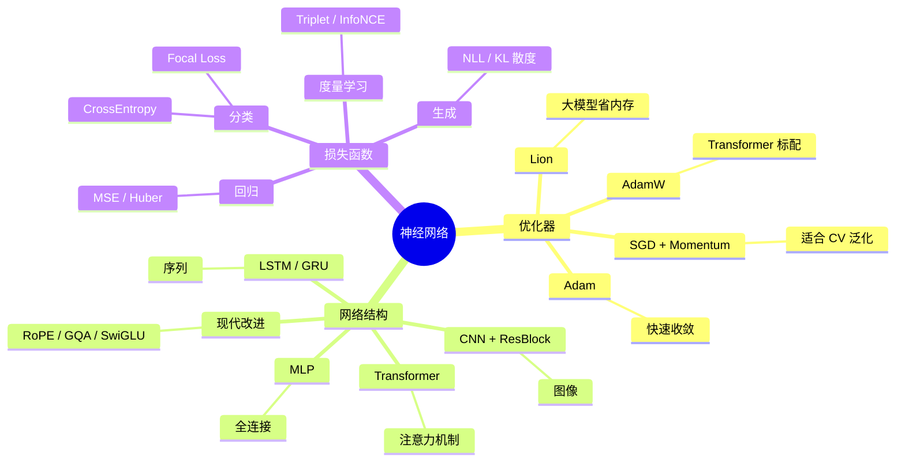

> 面试被问到"Adam 和 SGD 的区别"，回答不出来很尴尬。这篇文章把神经网络的三大核心——优化器、网络结构、损失函数——全面梳理一遍，每个知识点都带公式和 PyTorch 代码。

---

## 一、优化器

优化器解决的问题：给定损失函数 $L(\theta)$，如何更新参数 $\theta$ 让 $L$ 尽快下降。

### 1.1 SGD（随机梯度下降）

最基础的优化器，参数更新规则：

$$\theta_{t+1} = \theta_t - \eta \nabla_\theta L(\theta_t)$$

其中 $\eta$ 是学习率。

**问题**：纯 SGD 在平坦区域更新慢，在峡谷区域震荡严重。

**带动量的 SGD（Momentum SGD）**：

$$v_{t+1} = \mu v_t + \nabla_\theta L(\theta_t)$$

$$\theta_{t+1} = \theta_t - \eta v_{t+1}$$

动量项 $\mu v_t$（通常 $\mu = 0.9$）让更新方向带有惯性，减少震荡、加速收敛。

**Nesterov Momentum**：

先按动量方向走一步，再计算梯度（"向前看"的动量）：

$$v_{t+1} = \mu v_t + \nabla_\theta L(\theta_t - \mu \eta v_t)$$

$$\theta_{t+1} = \theta_t - \eta v_{t+1}$$

```python
import torch
import torch.nn as nn

# SGD
optimizer = torch.optim.SGD(model.parameters(), lr=0.01)

# Momentum SGD
optimizer = torch.optim.SGD(model.parameters(), lr=0.01, momentum=0.9)

# Nesterov
optimizer = torch.optim.SGD(model.parameters(), lr=0.01, momentum=0.9, nesterov=True)
```

---

### 1.2 AdaGrad

为每个参数维护历史梯度平方和，自适应调整学习率：

$$G_{t} = G_{t-1} + g_t^2$$

$$\theta_{t+1} = \theta_t - \frac{\eta}{\sqrt{G_t + \epsilon}} g_t$$

**优点**：稀疏特征（如 NLP embedding）更新频率低，AdaGrad 给它更大的有效学习率。
**缺点**：$G_t$ 单调递增，学习率会持续衰减，训练后期更新几乎为零。

---

### 1.3 RMSProp

解决 AdaGrad 学习率单调衰减的问题，用指数移动平均代替累加：

$$E[g^2]_t = \rho E[g^2]_{t-1} + (1-\rho) g_t^2$$

$$\theta_{t+1} = \theta_t - \frac{\eta}{\sqrt{E[g^2]_t + \epsilon}} g_t$$

$\rho$ 通常取 0.9，相当于只看近期梯度，忘掉远古历史。

```python
optimizer = torch.optim.RMSprop(model.parameters(), lr=0.001, alpha=0.9)
```

---

### 1.4 Adam（最常用）

Adam = Momentum + RMSProp，同时维护一阶矩（动量）和二阶矩（梯度平方的指数平均）：

**一阶矩（梯度均值）**：
$$m_t = \beta_1 m_{t-1} + (1 - \beta_1) g_t$$

**二阶矩（梯度方差）**：
$$v_t = \beta_2 v_{t-1} + (1 - \beta_2) g_t^2$$

**偏差修正**（初始 $m_0 = v_0 = 0$ 导致估计偏小）：
$$\hat{m}_t = \frac{m_t}{1 - \beta_1^t}, \quad \hat{v}_t = \frac{v_t}{1 - \beta_2^t}$$

**参数更新**：
$$\theta_{t+1} = \theta_t - \frac{\eta}{\sqrt{\hat{v}_t} + \epsilon} \hat{m}_t$$

默认超参：$\beta_1 = 0.9, \beta_2 = 0.999, \epsilon = 10^{-8}$。

```python
optimizer = torch.optim.Adam(model.parameters(), lr=1e-3, betas=(0.9, 0.999), eps=1e-8)
```

---

### 1.5 AdamW（Adam + Weight Decay 修复）

原始 Adam 里 L2 正则化和 weight decay 不等价（因为自适应学习率缩放了正则项）。AdamW 把 weight decay 从梯度里剥离出来，直接作用在参数上：

$$\theta_{t+1} = \theta_t - \frac{\eta}{\sqrt{\hat{v}_t} + \epsilon} \hat{m}_t - \eta \lambda \theta_t$$

最后一项 $\eta \lambda \theta_t$ 是 weight decay，不受自适应学习率影响。

**训练 Transformer / LLM 的标配**。

```python
optimizer = torch.optim.AdamW(model.parameters(), lr=1e-4, weight_decay=0.01)
```

---

### 1.6 Lion

Google 2023 年提出，只用符号更新，内存比 Adam 省 1/3：

$$m_t = \beta_1 m_{t-1} + (1 - \beta_1) g_t$$

$$\theta_{t+1} = \theta_t - \eta \cdot \text{sign}(\beta_2 m_{t-1} + (1-\beta_2) g_t) - \eta \lambda \theta_t$$

更新量只有 $\pm\eta$，梯度大小不影响步长，天然有正则效果。

```python
# pip install lion-pytorch
from lion_pytorch import Lion
optimizer = Lion(model.parameters(), lr=1e-4, weight_decay=1e-2)
```

---

### 1.7 学习率调度器

优化器配合学习率调度是标配：

```python
# Cosine Annealing（LLM 训练最常用）
scheduler = torch.optim.lr_scheduler.CosineAnnealingLR(optimizer, T_max=num_epochs)

# Warmup + Cosine（完整版）
from torch.optim.lr_scheduler import LinearLR, CosineAnnealingLR, SequentialLR

warmup = LinearLR(optimizer, start_factor=0.01, end_factor=1.0, total_iters=warmup_steps)
cosine = CosineAnnealingLR(optimizer, T_max=total_steps - warmup_steps)
scheduler = SequentialLR(optimizer, schedulers=[warmup, cosine], milestones=[warmup_steps])

# OneCycleLR（超收敛）
scheduler = torch.optim.lr_scheduler.OneCycleLR(
    optimizer, max_lr=1e-3, steps_per_epoch=len(train_loader), epochs=num_epochs
)

# 训练循环
for batch in dataloader:
    loss = model(batch)
    optimizer.zero_grad()
    loss.backward()
    optimizer.step()
    scheduler.step()
```

---

### 优化器横向对比

| 优化器 | 自适应 LR | 动量 | 适用场景 | 缺点 |
|--------|----------|------|---------|------|
| SGD | 否 | 可选 | CV 微调、需要泛化的任务 | 调参难，收敛慢 |
| Adam | 是 | 是 | 快速原型、NLP | 泛化有时不如 SGD |
| AdamW | 是 | 是 | Transformer / LLM 训练 | 内存是 SGD 3 倍 |
| RMSProp | 是 | 否 | RNN 训练 | 无动量 |
| Lion | 是（符号） | 是 | 大模型训练 | 需要更小的 LR |

---

## 二、网络结构

### 2.1 全连接网络（MLP）

最基础的结构，每层神经元和下一层全部相连：

$$h^{(l)} = \sigma(W^{(l)} h^{(l-1)} + b^{(l)})$$

```python
import torch.nn as nn

class MLP(nn.Module):
    def __init__(self, input_dim, hidden_dims, output_dim, dropout=0.1):
        super().__init__()
        dims = [input_dim] + hidden_dims + [output_dim]
        layers = []
        for i in range(len(dims) - 1):
            layers.append(nn.Linear(dims[i], dims[i+1]))
            if i < len(dims) - 2:
                layers.append(nn.GELU())
                layers.append(nn.Dropout(dropout))
        self.net = nn.Sequential(*layers)

    def forward(self, x):
        return self.net(x)

model = MLP(784, [512, 256, 128], 10)
```

---

### 2.2 卷积神经网络（CNN）

利用图像的局部性和平移不变性，共享卷积核参数：

**卷积操作**：

$$\text{out}[i,j] = \sum_{m,n} \text{input}[i+m, j+n] \cdot \text{kernel}[m,n]$$

输出尺寸：$\lfloor \frac{H - K + 2P}{S} \rfloor + 1$，$K$ 是 kernel size，$P$ 是 padding，$S$ 是 stride。

**经典 ResNet Block**：

```python
class ResBlock(nn.Module):
    def __init__(self, channels):
        super().__init__()
        self.conv1 = nn.Conv2d(channels, channels, 3, padding=1, bias=False)
        self.bn1 = nn.BatchNorm2d(channels)
        self.conv2 = nn.Conv2d(channels, channels, 3, padding=1, bias=False)
        self.bn2 = nn.BatchNorm2d(channels)
        self.relu = nn.ReLU(inplace=True)

    def forward(self, x):
        residual = x
        out = self.relu(self.bn1(self.conv1(x)))
        out = self.bn2(self.conv2(out))
        out += residual   # 残差连接：解决梯度消失，让网络可以堆很深
        return self.relu(out)
```

**残差连接的意义**：梯度可以直接绕过卷积层反传，缓解深层网络的梯度消失。

---

### 2.3 循环神经网络（RNN / LSTM / GRU）

处理序列数据，隐藏状态在时间步间传递。

**Vanilla RNN**（梯度爆炸/消失严重，基本不用了）：

$$h_t = \tanh(W_h h_{t-1} + W_x x_t + b)$$

**LSTM**：门控机制解决长程依赖：

$$f_t = \sigma(W_f [h_{t-1}, x_t] + b_f) \quad \text{(遗忘门)}$$

$$i_t = \sigma(W_i [h_{t-1}, x_t] + b_i) \quad \text{(输入门)}$$

$$\tilde{c}_t = \tanh(W_c [h_{t-1}, x_t] + b_c) \quad \text{(候选记忆)}$$

$$c_t = f_t \odot c_{t-1} + i_t \odot \tilde{c}_t \quad \text{(细胞状态)}$$

$$o_t = \sigma(W_o [h_{t-1}, x_t] + b_o), \quad h_t = o_t \odot \tanh(c_t)$$

**GRU**（LSTM 的简化版，参数更少，性能接近）：

$$z_t = \sigma(W_z [h_{t-1}, x_t]) \quad \text{(更新门)}$$

$$r_t = \sigma(W_r [h_{t-1}, x_t]) \quad \text{(重置门)}$$

$$\tilde{h}_t = \tanh(W [r_t \odot h_{t-1}, x_t])$$

$$h_t = (1 - z_t) \odot h_{t-1} + z_t \odot \tilde{h}_t$$

```python
# LSTM
lstm = nn.LSTM(input_size=128, hidden_size=256, num_layers=2,
               batch_first=True, dropout=0.1, bidirectional=True)

# GRU
gru = nn.GRU(input_size=128, hidden_size=256, num_layers=2,
             batch_first=True, bidirectional=True)

# 用法
x = torch.randn(batch_size, seq_len, 128)
out, (h_n, c_n) = lstm(x)   # out: (batch, seq, 512)
out, h_n = gru(x)
```

---

### 2.4 Attention & Transformer

**Scaled Dot-Product Attention**：

$$\text{Attention}(Q, K, V) = \text{softmax}\left(\frac{QK^T}{\sqrt{d_k}}\right) V$$

$\sqrt{d_k}$ 缩放防止点积过大导致 softmax 梯度消失。

**Multi-Head Attention**：

$$\text{MultiHead}(Q,K,V) = \text{Concat}(\text{head}_1, ..., \text{head}_h) W^O$$

$$\text{head}_i = \text{Attention}(Q W_i^Q, K W_i^K, V W_i^V)$$

多头允许模型在不同子空间里关注不同的信息。

```python
class MultiHeadAttention(nn.Module):
    def __init__(self, d_model, n_heads):
        super().__init__()
        assert d_model % n_heads == 0
        self.d_k = d_model // n_heads
        self.n_heads = n_heads
        self.W_q = nn.Linear(d_model, d_model)
        self.W_k = nn.Linear(d_model, d_model)
        self.W_v = nn.Linear(d_model, d_model)
        self.W_o = nn.Linear(d_model, d_model)

    def forward(self, q, k, v, mask=None):
        B, L, D = q.shape
        # 线性投影 + 分头
        Q = self.W_q(q).view(B, L, self.n_heads, self.d_k).transpose(1, 2)
        K = self.W_k(k).view(B, -1, self.n_heads, self.d_k).transpose(1, 2)
        V = self.W_v(v).view(B, -1, self.n_heads, self.d_k).transpose(1, 2)

        # Attention
        scores = (Q @ K.transpose(-2, -1)) / (self.d_k ** 0.5)
        if mask is not None:
            scores = scores.masked_fill(mask == 0, float('-inf'))
        attn = torch.softmax(scores, dim=-1)

        # 合并多头
        out = (attn @ V).transpose(1, 2).contiguous().view(B, L, D)
        return self.W_o(out)
```

**Transformer Block**（Pre-Norm 变体，现代 LLM 常用）：

```python
class TransformerBlock(nn.Module):
    def __init__(self, d_model, n_heads, d_ff, dropout=0.1):
        super().__init__()
        self.attn = MultiHeadAttention(d_model, n_heads)
        self.ff = nn.Sequential(
            nn.Linear(d_model, d_ff),
            nn.GELU(),
            nn.Linear(d_ff, d_model),
        )
        self.norm1 = nn.LayerNorm(d_model)
        self.norm2 = nn.LayerNorm(d_model)
        self.drop = nn.Dropout(dropout)

    def forward(self, x, mask=None):
        # Pre-Norm: 先 LayerNorm，再残差
        x = x + self.drop(self.attn(self.norm1(x), self.norm1(x), self.norm1(x), mask))
        x = x + self.drop(self.ff(self.norm2(x)))
        return x
```

---

### 2.5 现代 LLM 中的结构改进

**RoPE（旋转位置编码）**：把位置信息编码为旋转矩阵，外推性更好：

```python
def apply_rope(x, cos, sin):
    # x: (B, H, L, D)
    x1 = x[..., :x.shape[-1]//2]
    x2 = x[..., x.shape[-1]//2:]
    rotated = torch.cat([-x2, x1], dim=-1)
    return x * cos + rotated * sin
```

**GQA（Grouped Query Attention）**：多个 Query head 共享一组 KV head，大幅减少 KV cache：



**SwiGLU FFN**（Llama 等模型使用）：

$$\text{FFN}(x) = (\text{SiLU}(xW_1) \odot xW_2) W_3$$

比标准 FFN + ReLU 效果更好。

---

### 2.6 归一化层对比

```python
# Batch Normalization（CNN 常用，依赖 batch 统计）
nn.BatchNorm2d(num_features)   # 对 (N, C, H, W) 的 N*H*W 维度归一化

# Layer Normalization（Transformer 标配，不依赖 batch size）
nn.LayerNorm(normalized_shape)  # 对最后几维归一化

# RMSNorm（LLM 更常用，去掉了均值中心化，更快）
class RMSNorm(nn.Module):
    def __init__(self, dim, eps=1e-6):
        super().__init__()
        self.weight = nn.Parameter(torch.ones(dim))
        self.eps = eps

    def forward(self, x):
        rms = x.pow(2).mean(-1, keepdim=True).add(self.eps).sqrt()
        return x / rms * self.weight

# Group Normalization（小 batch 时比 BN 更稳定）
nn.GroupNorm(num_groups=32, num_channels=256)
```

| 归一化 | 统计维度 | 适用场景 |
|--------|---------|---------|
| BatchNorm | batch + spatial | CNN，batch size 大 |
| LayerNorm | feature | Transformer，NLP |
| RMSNorm | feature（无均值） | LLM，计算更快 |
| GroupNorm | group + spatial | 小 batch CNN，检测 |
| InstanceNorm | spatial | 风格迁移 |

---

## 三、激活函数

### 3.1 常用激活函数

**ReLU**：$f(x) = \max(0, x)$
简单高效，但存在"死亡 ReLU"（负区间梯度为 0）

**Leaky ReLU**：$f(x) = \max(\alpha x, x)$，$\alpha$ 通常 0.01
缓解死亡 ReLU

**GELU**：$f(x) = x \cdot \Phi(x)$，$\Phi$ 是标准正态 CDF
Transformer / BERT 标配，光滑可微

**SiLU / Swish**：$f(x) = x \cdot \sigma(x)$
LLM FFN 常用，自门控特性

**Mish**：$f(x) = x \cdot \tanh(\text{softplus}(x))$
目标检测（YOLOv4+）常用

```python
# PyTorch 内置
nn.ReLU()
nn.LeakyReLU(0.01)
nn.GELU()
nn.SiLU()        # Swish

# 手动实现 Mish
class Mish(nn.Module):
    def forward(self, x):
        return x * torch.tanh(torch.nn.functional.softplus(x))
```

---

## 四、损失函数

### 4.1 回归损失

**MSE（均方误差）**：$L = \frac{1}{N} \sum (y_i - \hat{y}_i)^2$

对大误差惩罚重，容易被离群点影响。

**MAE（平均绝对误差）**：$L = \frac{1}{N} \sum |y_i - \hat{y}_i|$

对离群点鲁棒，但 0 处不可导。

**Huber Loss**（结合两者的优点）：

$$L_\delta(y, \hat{y}) = \begin{cases} \frac{1}{2}(y - \hat{y})^2 & |y - \hat{y}| \leq \delta \\ \delta |y - \hat{y}| - \frac{1}{2}\delta^2 & \text{otherwise} \end{cases}$$

误差小时用 MSE（光滑），误差大时用 MAE（鲁棒）。

```python
nn.MSELoss()
nn.L1Loss()      # MAE
nn.HuberLoss(delta=1.0)

# 实际使用
criterion = nn.HuberLoss()
loss = criterion(predictions, targets)
```

---

### 4.2 分类损失

**交叉熵（Cross-Entropy）**：

$$L = -\sum_i y_i \log \hat{y}_i = -\log \hat{y}_c \quad \text{（$c$ 是真实类别）}$$

多分类的标准损失函数。PyTorch 的 `CrossEntropyLoss` 内置了 softmax，不要在模型里再加 softmax。

```python
criterion = nn.CrossEntropyLoss()
# logits: (B, C)，targets: (B,) 整数类别
loss = criterion(logits, targets)

# 带权重（处理类别不平衡）
weights = torch.tensor([1.0, 2.0, 3.0])  # 少数类给大权重
criterion = nn.CrossEntropyLoss(weight=weights)
```

**Label Smoothing**：防止模型过度自信，把 one-hot 软化：

$$y_{\text{smooth}} = (1 - \epsilon) y_{\text{onehot}} + \frac{\epsilon}{C}$$

```python
criterion = nn.CrossEntropyLoss(label_smoothing=0.1)
```

**Focal Loss**（目标检测里处理类别极度不平衡）：

$$L_{\text{focal}} = -\alpha_t (1 - p_t)^\gamma \log(p_t)$$

$(1-p_t)^\gamma$ 降低"容易样本"的权重，让模型专注难样本。

```python
class FocalLoss(nn.Module):
    def __init__(self, gamma=2.0, alpha=0.25):
        super().__init__()
        self.gamma = gamma
        self.alpha = alpha

    def forward(self, logits, targets):
        ce = nn.functional.cross_entropy(logits, targets, reduction='none')
        pt = torch.exp(-ce)
        focal_loss = self.alpha * (1 - pt) ** self.gamma * ce
        return focal_loss.mean()
```

---

### 4.3 二分类损失

**Binary Cross-Entropy**：

$$L = -\frac{1}{N} \sum [y_i \log \hat{y}_i + (1-y_i) \log(1-\hat{y}_i)]$$

```python
# BCELoss 要求输入已经过 sigmoid
criterion = nn.BCELoss()
loss = criterion(torch.sigmoid(logits), targets.float())

# BCEWithLogitsLoss 内置 sigmoid，数值更稳定（推荐）
criterion = nn.BCEWithLogitsLoss()
loss = criterion(logits, targets.float())

# 处理正负样本不平衡
criterion = nn.BCEWithLogitsLoss(pos_weight=torch.tensor([5.0]))  # 正样本权重 x5
```

---

### 4.4 序列/生成损失

**NLL Loss（Negative Log Likelihood）**：LLM 训练的核心损失

$$L = -\frac{1}{T} \sum_{t=1}^{T} \log P(x_t | x_{<t})$$

```python
# 语言模型训练
criterion = nn.CrossEntropyLoss(ignore_index=-100)  # ignore_index 用于 padding

# 假设 logits: (B, T, vocab_size)，labels: (B, T)
shift_logits = logits[:, :-1, :].contiguous()
shift_labels = labels[:, 1:].contiguous()
loss = criterion(shift_logits.view(-1, vocab_size), shift_labels.view(-1))
```

**KL 散度**（知识蒸馏、VAE、RLHF 的 KL 惩罚）：

$$L_{\text{KL}} = \sum_i P(i) \log \frac{P(i)}{Q(i)}$$

```python
# PyTorch KL Divergence（注意：输入要是 log 概率）
criterion = nn.KLDivLoss(reduction='batchmean')
loss = criterion(torch.log_softmax(student_logits, dim=-1),
                 torch.softmax(teacher_logits, dim=-1))
```

---

### 4.5 度量学习损失

用于学习 embedding 空间（人脸识别、图文匹配等）。

**Contrastive Loss**：正对距离近，负对距离远：

$$L = y \cdot d^2 + (1-y) \cdot \max(0, m - d)^2$$

**Triplet Loss**：anchor 比 negative 离 positive 更近：

$$L = \max(0, d(a, p) - d(a, n) + m)$$

```python
triplet_loss = nn.TripletMarginLoss(margin=0.3)
loss = triplet_loss(anchor, positive, negative)
```

**InfoNCE / NT-Xent**（对比学习 SimCLR、CLIP 使用）：

$$L = -\log \frac{\exp(\text{sim}(z_i, z_j)/\tau)}{\sum_{k \neq i} \exp(\text{sim}(z_i, z_k)/\tau)}$$

```python
def info_nce_loss(z1, z2, temperature=0.07):
    """z1, z2: (B, D) 两个视角的 embedding"""
    B = z1.shape[0]
    # L2 归一化
    z1 = nn.functional.normalize(z1, dim=-1)
    z2 = nn.functional.normalize(z2, dim=-1)

    # 相似度矩阵 (2B, 2B)
    z = torch.cat([z1, z2], dim=0)
    sim = (z @ z.T) / temperature

    # 对角线是正样本对
    labels = torch.arange(B, device=z1.device)
    labels = torch.cat([labels + B, labels])

    # 屏蔽自身
    mask = torch.eye(2*B, dtype=torch.bool, device=z1.device)
    sim.masked_fill_(mask, float('-inf'))

    return nn.functional.cross_entropy(sim, labels)
```

---

### 4.6 正则化损失

防止过拟合，通常直接加在 optimizer 的 weight_decay 里，也可以手动加：

```python
# L2 正则（手动方式，一般用 weight_decay 代替）
l2_reg = sum(p.pow(2).sum() for p in model.parameters())
loss = task_loss + 1e-4 * l2_reg

# L1 正则（促进稀疏）
l1_reg = sum(p.abs().sum() for p in model.parameters())
loss = task_loss + 1e-5 * l1_reg
```

---

## 五、实用技巧汇总

### 5.1 梯度裁剪（防止梯度爆炸）

```python
# 训练 RNN / Transformer 必备
torch.nn.utils.clip_grad_norm_(model.parameters(), max_norm=1.0)

# 放在 backward() 之后，optimizer.step() 之前
loss.backward()
torch.nn.utils.clip_grad_norm_(model.parameters(), 1.0)
optimizer.step()
```

### 5.2 混合精度训练

```python
from torch.cuda.amp import autocast, GradScaler

scaler = GradScaler()

for batch in dataloader:
    optimizer.zero_grad()
    with autocast():          # 前向用 fp16
        loss = model(batch)
    scaler.scale(loss).backward()
    scaler.unscale_(optimizer)
    torch.nn.utils.clip_grad_norm_(model.parameters(), 1.0)
    scaler.step(optimizer)
    scaler.update()
```

### 5.3 如何选优化器



### 5.4 如何选损失函数



---

## 六、完整训练模板

把上面所有东西组合起来：

```python
import torch
import torch.nn as nn
from torch.cuda.amp import autocast, GradScaler


def train(model, train_loader, val_loader, epochs=10):
    device = torch.device("cuda" if torch.cuda.is_available() else "cpu")
    model = model.to(device)

    # 优化器：AdamW + weight decay
    optimizer = torch.optim.AdamW(
        model.parameters(), lr=1e-4, weight_decay=0.01, betas=(0.9, 0.999)
    )

    # 学习率：warmup + cosine
    total_steps = len(train_loader) * epochs
    warmup_steps = total_steps // 10
    warmup_sched = torch.optim.lr_scheduler.LinearLR(
        optimizer, start_factor=0.01, total_iters=warmup_steps
    )
    cosine_sched = torch.optim.lr_scheduler.CosineAnnealingLR(
        optimizer, T_max=total_steps - warmup_steps
    )
    scheduler = torch.optim.lr_scheduler.SequentialLR(
        optimizer, [warmup_sched, cosine_sched], milestones=[warmup_steps]
    )

    # 损失函数：交叉熵 + label smoothing
    criterion = nn.CrossEntropyLoss(label_smoothing=0.1)

    # 混合精度
    scaler = GradScaler()

    best_val_acc = 0
    for epoch in range(epochs):
        # 训练
        model.train()
        for batch_x, batch_y in train_loader:
            batch_x, batch_y = batch_x.to(device), batch_y.to(device)

            optimizer.zero_grad()
            with autocast():
                logits = model(batch_x)
                loss = criterion(logits, batch_y)

            scaler.scale(loss).backward()
            scaler.unscale_(optimizer)
            torch.nn.utils.clip_grad_norm_(model.parameters(), 1.0)
            scaler.step(optimizer)
            scaler.update()
            scheduler.step()

        # 验证
        model.eval()
        correct, total = 0, 0
        with torch.no_grad():
            for batch_x, batch_y in val_loader:
                batch_x, batch_y = batch_x.to(device), batch_y.to(device)
                logits = model(batch_x)
                correct += (logits.argmax(1) == batch_y).sum().item()
                total += len(batch_y)

        val_acc = correct / total
        print(f"Epoch {epoch+1}/{epochs} | Val Acc: {val_acc:.4f} | LR: {scheduler.get_last_lr()[0]:.2e}")

        # 保存最优
        if val_acc > best_val_acc:
            best_val_acc = val_acc
            torch.save(model.state_dict(), "best_model.pt")

    print(f"Best Val Acc: {best_val_acc:.4f}")
```

---

## 总结

三大核心，一张图：



选对这三样，训练成功率提升不止一倍。

---

*如有问题欢迎留言讨论。*
